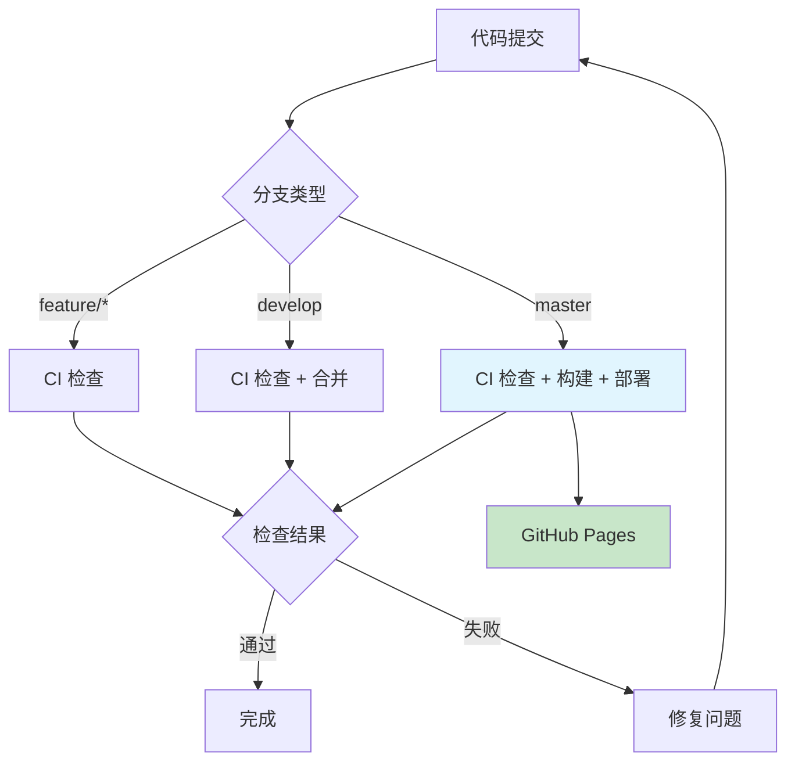

# CI/CD 配置指南

> 基于 GitHub Actions 的自动化 CI/CD 流水线配置与使用指南

## 🎯 概览

### 技术栈

| 组件 | 技术选型 | 版本 |
|------|---------|------|
| CI/CD 平台 | GitHub Actions | Latest |
| 构建工具 | pnpm | 8.x |
| 运行时 | Node.js | 18.x / 20.x |
| 部署目标 | GitHub Pages | - |
| 代码检查 | TypeScript + Oxlint | Latest |

### 架构流程



## 🔧 工作流

### 🚀 部署工作流 (deploy.yml)

**触发条件**: 推送到 `master` 分支
**运行环境**: Ubuntu Latest + Node.js 20.x + pnpm
**部署地址**: <https://owl23007.github.io/simple-my-blog>

**执行步骤**:

1. ⬇️ 检出代码
2. 🔧 配置 Node.js 环境
3. 📦 安装依赖 (`pnpm install --frozen-lockfile`)
4. 🏗️ 构建项目 (`pnpm build`)
5. 🚀 部署到 GitHub Pages

### 🔍 质量检查工作流 (ci.yml)

**触发条件**: 推送到 `develop`、`feature/*`、`hotfix/*`、`release/*` 或创建 PR
**测试环境**: Node.js 18.x & 20.x (矩阵构建)

**检查清单**:

- ✅ TypeScript 类型检查
- ✅ Oxlint 代码规范
- ✅ Markdown 格式验证
- ✅ 构建成功性测试
- ✅ 依赖安全扫描
- ✅ CodeQL 安全分析### 📦 版本发布工作流 (release.yml)

**触发条件**: 推送版本标签 (`v*`)
**自动功能**: 生成变更日志 + 创建 GitHub Release + 上传构建产物

## 🌿 分支策略

### 分支模型

```text
master (生产环境)     🔒 自动部署到 GitHub Pages
  ↑
develop (开发环境)    🔒 集成测试分支
  ↑
feature/* (功能开发)   新功能开发
hotfix/* (紧急修复)    生产环境热修复
release/* (发布准备)   版本发布准备
```

### 分支权限矩阵

| 分支类型 | CI 检查 | 自动部署 | 版本发布 |
|---------|--------|---------|----------|
| `master` | ✅ | ✅ | - |
| `develop` | ✅ | - | - |
| `feature/*` | ✅ | - | - |
| `hotfix/*` | ✅ | - | - |
| `release/*` | ✅ | - | - |
| `v*` (标签) | - | - | ✅ |

## ⚙️ 环境配置

### GitHub 仓库设置

**必需配置**:

1. **GitHub Pages 设置**
   - 路径: `Settings` → `Pages`
   - Source: `GitHub Actions`

2. **Actions 权限设置**
   - 路径: `Settings` → `Actions` → `General`
   - Workflow permissions: `Read and write permissions`
   - 启用: `Allow GitHub Actions to create and approve pull requests`

### 本地开发环境

**系统要求**:

- Node.js: 18.0.0+ 或 20.x
- 包管理器: pnpm 8.0.0+

**安装步骤**:

```bash
# 安装 pnpm
npm install -g pnpm

# 安装项目依赖
pnpm install

# 本地开发
pnpm dev

# 构建检查
pnpm build
```

## 🧭 使用指南

### 🔄 日常开发流程

**功能开发**:

1. **创建功能分支**

   ```bash
   git checkout develop
   git pull origin develop
   git checkout -b feature/your-feature-name
   ```

2. **开发 & 测试**

   ```bash
   # 本地开发
   pnpm dev

   # 代码检查
   pnpm lint
   pnpm type-check

   # 构建测试
   pnpm build
   ```

3. **提交代码**

   ```bash
   git add .
   git commit -m "feat: 添加新功能描述"
   git push origin feature/your-feature-name
   ```

4. **创建 Pull Request**
   - 目标分支: `develop`
   - 等待 CI 检查 ✅
   - 代码审查通过后合并

### 🚀 发布流程

**生产部署** (自动):

```bash
# 合并到 master 分支
git checkout master
git merge develop
git push origin master
# → 自动触发部署到 GitHub Pages
```

**版本发布** (可选):

```bash
# 创建版本标签
git tag v1.0.0
git push origin v1.0.0
# → 自动创建 GitHub Release
```

### 🚨 紧急修复流程

**热修复步骤**:

```bash
# 1. 从 master 创建热修复分支
git checkout master
git checkout -b hotfix/fix-critical-issue

# 2. 修复问题并测试
# ... 进行修复 ...

# 3. 提交修复
git add .
git commit -m "hotfix: 修复关键问题描述"
git push origin hotfix/fix-critical-issue

# 4. 创建 PR 到 master
# → 审查通过后自动部署
```

## 📊 故障排查

- **📊 任务状态**: [GitHub Actions](https://github.com/Owl23007/SimpleMyInfo/actions)
- **🌐 部署地址**:
  - <https://owl23007.github.io/simple-my-blog>
  - <https://www.woyioii.cn>
- **📝 构建日志**:
  - 点击 Actions 页面查看详细错误信息
  - 使用 `pnpm build --debug` 获取详细构建日志

### 🚨 常见问题

#### 构建失败

**排查步骤**:

1. **本地验证**

   ```bash
   pnpm install
   pnpm build
   ```

2. **检查日志**: 查看 Actions 页面的错误详情
3. **依赖问题**: 检查 `package.json` 和 `pnpm-lock.yaml`
4. **版本兼容**: 确认 Node.js 版本兼容性

#### 代码检查失败

**修复命令**:

```bash
# 代码规范检查
pnpm lint

# TypeScript 类型检查
pnpm type-check

# 构建验证
pnpm build
```

#### 部署失败

**检查清单**:

- ✅ GitHub Pages 权限设置
- ✅ Actions 写入权限启用
- ✅ `dist` 目录正确生成
- ✅ 静态资源路径配置

---

> **文档更新**: 2025年11月4日
> **相关文档**: [分支策略](./分支策略.md) | [网站结构重构](./网站结构重构%20I.md)
