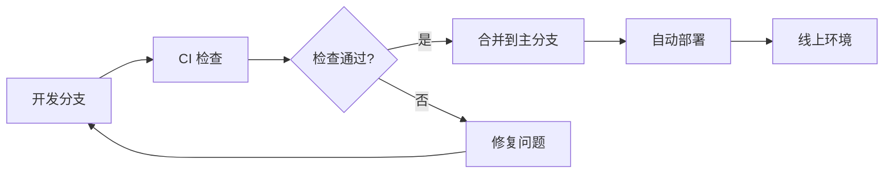

# CI/CD 配置文档

本文档详细介绍了项目的 CI/CD 配置，包括 GitHub Actions 工作流、分支策略以及使用方法。

## 📋 目录

- [概览](#-概览)
- [工作流配置](#️-工作流配置)
- [分支策略](#-分支策略)
- [环境设置](#️-环境设置)
- [使用指南](#-使用指南)
- [监控与维护](#-监控与维护)

## 🎯 概览

### - 技术栈

- **CI/CD 平台**: GitHub Actions
- **构建工具**: pnpm + Node.js
- **部署目标**: GitHub Pages
- **代码质量**: TypeScript + Oxlint + ESLint

### - 工作流架构



## ⚙️ 工作流配置

### 1. 🚀 生产部署工作流 (`deploy.yml`)

**目标**: 自动构建并部署到生产环境

| 配置项 | 值 |
|-------|-----|
| 触发条件 | 推送到 `master` 分支 |
| 运行环境 | Ubuntu Latest |
| Node.js 版本 | 20.x |
| 包管理器 | pnpm |
| 部署目标 | GitHub Pages |

**流程步骤**:

1. 检出代码
2. 设置 Node.js 环境
3. 安装依赖 (`pnpm install --frozen-lockfile`)
4. 构建项目 (`pnpm build`)
5. 部署到 GitHub Pages

**访问地址**: <https://owl23007.github.io/simple-my-blog>

### 2. 🔍 代码质量检查工作流 (`ci.yml`)

**目标**: 确保代码质量和项目稳定性

| 配置项 | 值 |
|-------|-----|
| 触发条件 | 推送到开发分支或 PR |
| 支持分支 | `develop`, `feature/*`, `hotfix/*`, `release/*` |
| Node.js 版本 | 18.x, 20.x (矩阵构建) |
| 缓存策略 | pnpm store 缓存 |

**检查项目**:

- ✅ TypeScript 类型检查
- ✅ Oxlint 代码规范检查
- ✅ Markdown 格式验证
- ✅ 构建成功性验证
- ✅ 依赖安全扫描 (npm audit)
- ✅ 代码安全分析 (CodeQL)

### 3. 📦 版本发布工作流 (`release.yml`)

**目标**: 自动化版本发布和变更日志生成

| 配置项 | 值 |
|-------|-----|
| 触发条件 | 推送标签 (`v*` 格式) |
| 发布内容 | 变更日志 + 构建产物 |
| 发布平台 | GitHub Releases |

**自动化功能**:

- 📝 生成变更日志
- 🏷️ 创建 GitHub Release
- 📎 上传构建产物
- 🔗 提供下载链接

## 🌿 分支策略

### 分支模型

```text
master (生产)     ← 部署到线上
  ↑
develop (开发)    ← 集成测试
  ↑
feature/* (功能)  ← 功能开发
hotfix/* (热修复)  ← 紧急修复
release/* (发布)  ← 发布准备
```

### 工作流映射

| 分支类型 | CI 检查 | 自动部署 | 发布版本 |
|---------|--------|---------|----------|
| `master` | ✅ | ✅ | - |
| `develop` | ✅ | - | - |
| `feature/*` | ✅ | - | - |
| `hotfix/*` | ✅ | - | - |
| `release/*` | ✅ | - | - |
| `v*` (标签) | - | - | ✅ |

## 🛠️ 环境设置

### 仓库权限配置

确保以下设置已启用：

```yaml
Settings → Pages:
  Source: GitHub Actions

Settings → Actions → General:
  Workflow permissions: Read and write permissions
  Allow GitHub Actions to create and approve pull requests: ✅
```

### 可选的 Secrets 配置

如需扩展功能，可配置以下 Secrets：

```bash
# 第三方部署服务
NETLIFY_AUTH_TOKEN=your_netlify_token
NETLIFY_SITE_ID=your_site_id

# 通知服务
SLACK_WEBHOOK=your_slack_webhook
DISCORD_WEBHOOK=your_discord_webhook
```

### 本地开发环境

```bash
# 要求
Node.js: >= 18.0.0
pnpm: >= 8.0.0

# 安装
npm install -g pnpm
pnpm install
```

## 📚 使用指南

### 日常开发流程

```bash
# 1. 创建功能分支
git checkout -b feature/article-optimization

# 2. 开发代码
# ... 编写代码 ...

# 3. 提交并推送
git add .
git commit -m "feat: 优化文章结构"
git push origin feature/article-optimization
# → 自动触发 CI 检查

# 4. 创建 Pull Request
# → 在 GitHub 上创建 PR 到 develop 分支
```

### 发布流程

```bash
# 方式1: 合并到主分支 (自动部署)
git checkout master
git merge develop
git push origin master
# → 自动触发生产部署

# 方式2: 创建发布版本
git tag -a v1.2.0 -m "Release v1.2.0: 新增文章管理功能"
git push origin v1.2.0
# → 自动触发版本发布
```

### 紧急修复流程

```bash
# 1. 从 master 创建热修复分支
git checkout master
git checkout -b hotfix/critical-bug-fix

# 2. 修复问题
# ... 修复代码 ...

# 3. 推送并创建 PR
git push origin hotfix/critical-bug-fix
# → 创建 PR 到 master，通过后自动部署
```

## 📊 监控与维护

### 构建状态监控

- **实时状态**: [GitHub Actions 页面](https://github.com/Owl23007/SimpleMyInfo/actions)
- **PR 检查**: Pull Request 会显示所有检查结果
- **邮件通知**: 构建失败时自动发送通知

### 常见问题排查

#### 🚨 构建失败

1. **检查日志**: 查看 Actions 页面的详细错误信息
2. **本地验证**: 运行 `pnpm build` 确认本地构建正常
3. **依赖问题**: 检查 `package.json` 和 `pnpm-lock.yaml`
4. **版本兼容**: 确认 Node.js 版本兼容性

#### 🚨 部署失败

1. **权限检查**: 确认 GitHub Pages 和 Actions 权限
2. **构建产物**: 验证 `dist` 目录是否正确生成
3. **路径配置**: 检查静态资源路径配置

#### 🚨 代码检查失败

```bash
# 本地运行检查命令
pnpm lint           # 代码规范检查
pnpm type-check     # 类型检查
pnpm build          # 构建验证
```

### 性能优化建议

1. **缓存策略**:
   - ✅ 已配置 pnpm store 缓存
   - 🔄 可考虑添加构建产物缓存

2. **并行优化**:
   - ✅ 多版本 Node.js 并行测试
   - 🔄 可并行运行 lint 和类型检查

3. **条件触发**:
   - 🔄 根据文件变更智能触发相关检查
   - 🔄 跳过无关分支的重复检查

4. **监控扩展**:
   - 🔄 集成构建时间监控
   - 🔄 添加部署性能指标
   - 🔄 集成 Slack/Discord 通知
