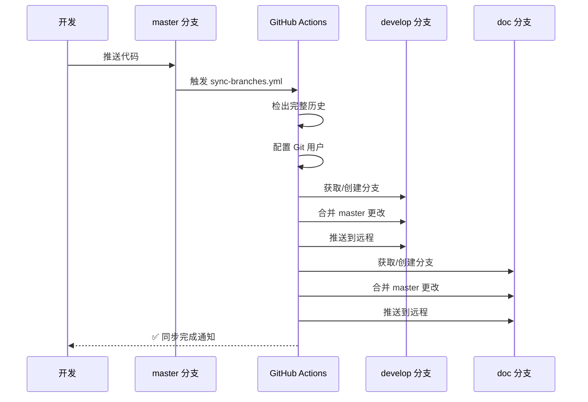

# 网站开发日志 II - CI/CD 工作流增强

> 记录分支自动同步功能的实现过程

在我对网站的分支确定后，已经准备大展文笔，畅所欲言后，理所当然的，我切换到 doc 分支，并开始编写文档。但在我运行预览时才发现，我刚才在 develop 上面写的代码虽然提交到了 master 上面，但是并没有同步到 doc 分支。

要获取最新的代码，我还得手动 merge 一下 master 分支的代码到 doc 分支，实在是太麻烦了！

于是我又写一个 GitHub Actions 工作流，实现在有提交或者pr推送到 master 分支时自动同步到 develop 和 doc 分支的功能。

## 🎯 开发目标

实现 `master` 分支自动同步到 `develop` 和 `doc` 分支的功能,提升团队协作效率,减少手动合并操作。

## 📋 需求分析

### 背景

在之前的开发流程中,当 `master` 分支更新后,需要手动将更改同步到 `develop` 和 `doc` 分支:

```bash
# 手动同步流程(繁琐)
git checkout develop
git merge master
git push origin develop

git checkout doc
git merge master
git push origin doc
```

这个过程:

- ❌ 耗时且重复
- ❌ 容易遗忘
- ❌ 可能导致分支不同步
- ❌ 影响团队协作效率

### 目标

- ✅ **自动化同步**: master 更新后自动同步
- ✅ **智能创建**: 目标分支不存在时自动创建
- ✅ **冲突处理**: 优先采用 master 的更改
- ✅ **透明执行**: 通过 GitHub Actions 可视化

## 🛠️ 技术实现

### 1. 创建工作流文件

**文件路径**: `.github/workflows/sync-branches.yml`

### 2. 关键技术点

#### 2.1 触发条件

```yaml
on:
  push:
    branches:
      - master
```

- 仅在 `master` 分支有新提交时触发
- 避免其他分支触发导致的混乱

#### 2.2 权限配置

```yaml
permissions:
  contents: write
```

- 必须授予写权限才能推送到其他分支
- 使用 `GITHUB_TOKEN` 自动认证

#### 2.3 完整历史

```yaml
fetch-depth: 0
```

- 获取完整的 Git 历史记录
- 确保合并操作能够正确执行

#### 2.4 分支创建逻辑

```bash
git fetch origin develop:develop || git branch develop
```

- 尝试获取远程分支
- 如果不存在则本地创建新分支
- 使用 `||` 操作符处理失败情况

#### 2.5 合并策略

```bash
git merge origin/master --no-edit --strategy-option=theirs
```

- `--no-edit`: 不需要编辑提交信息
- `--strategy-option=theirs`: 冲突时优先采用 master 的更改
- 确保 master 的内容始终为准

## 📊 工作流程图



## 🔧 配置要求

### GitHub 仓库设置

1. **Actions 权限**
   - 路径: `Settings` → `Actions` → `General`
   - 设置: `Read and write permissions` ✅
   - 必须启用写权限才能推送到其他分支

2. **分支保护规则**(可选)
   - 可以为 `master` 设置保护规则
   - 但要确保 GitHub Actions 有权限推送到 `develop` 和 `doc`

## 🎉 实现效果

### 自动化流程

```text
推送到 master
    ↓
触发 GitHub Actions
    ↓
├─→ 部署到 GitHub Pages (deploy.yml)
├─→ 同步到 develop 分支 (sync-branches.yml)
└─→ 同步到 doc 分支 (sync-branches.yml)
    ↓
✅ 所有分支保持同步
```

### 使用体验

**之前**:

```bash
# 需要执行 6+ 条命令
git checkout develop
git merge master
git push origin develop
git checkout doc
git merge master
git push origin doc
git checkout master
```

**现在**:

```bash
# 只需推送到 master
git push origin master
# 🎉 自动完成同步!
```

## 📚 文档更新

同步更新了以下文档:

1. **[CICD配置.md](./CICD配置.md)**
   - 新增分支同步工作流章节
   - 更新架构流程图
   - 更新分支权限矩阵
   - 添加故障排查指南

2. **[分支策略.md](./分支策略.md)**
   - 更新分支模型图
   - 说明自动同步机制

## 💡 经验总结

### 成功经验

1. **权限配置很关键**: 必须确保 `contents: write` 权限
2. **完整历史必要**: `fetch-depth: 0` 确保合并正确
3. **错误处理重要**: 明确的错误信息便于排查
4. **测试要充分**: 多场景测试保证稳定性

## 📝 更新日志

- **2025-11-04**: 初始版本,实现基础的分支自动同步功能
- 添加 sync-branches.yml 工作流
- 更新 CICD 配置文档
- 创建本开发日志

---
> **相关文档**: [CICD配置](./CICD配置.md) | [分支策略](./分支策略.md)
