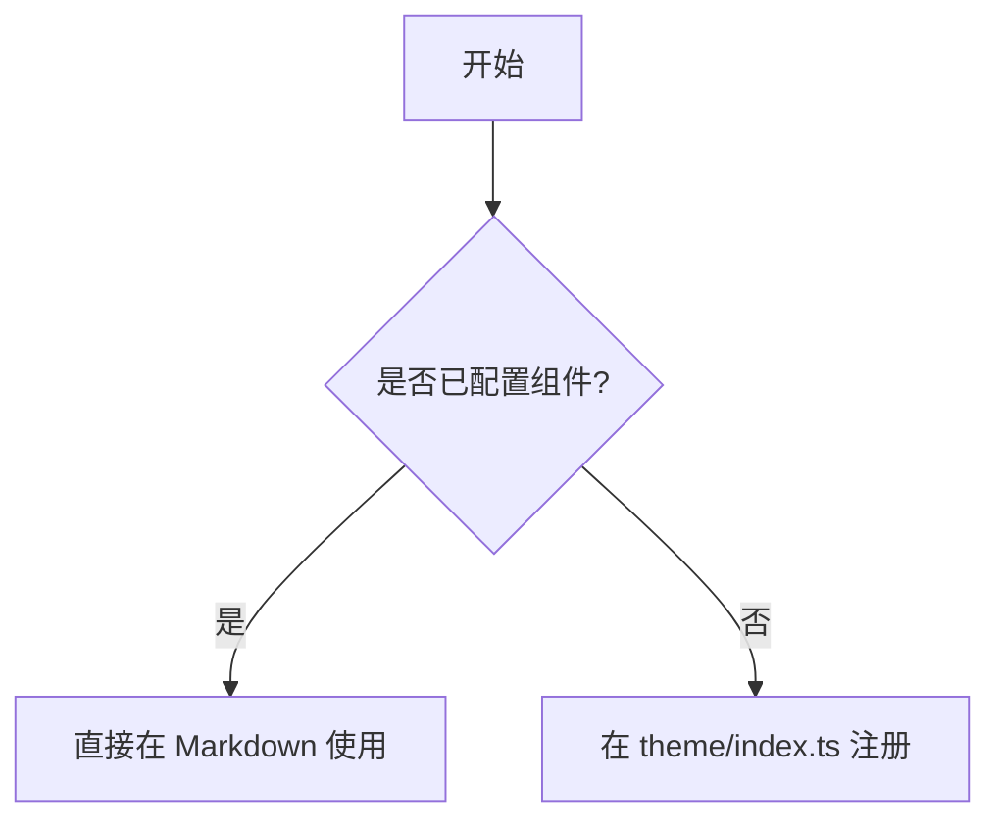

---
title: VitePress 组件文档
description: 当前站点自定义组件与扩展语法的展示和使用说明
---

# VitePress 组件文档

本文档展示当前站点在 `docs/.vitepress/theme/index.ts` 中注册的全局组件，以及常用扩展语法的使用方式。

## 快速开始

在任意 Markdown 页面中，直接写组件标签即可使用。

```md
<PostsList />
```

## 1. SeriesList

用于展示 `series/*/index.md` 自动聚合后的系列卡片列表。

### 用法

```md
<SeriesList />
```

### 展示

<SeriesList />

## 2. PostsList

用于展示全站文章时间线（排除各目录下的 `index.md`）。

### 用法

```md
<PostsList />
```

### 展示

<PostsList />

## 3. FolderTimeline

用于展示 `building` 目录的建站日志时间线。

### 用法

```md
<FolderTimeline />
```

### 展示

<FolderTimeline />

## 4. Timeline

通用时间线组件，支持传入自定义 `items`。

### Props

- `items: TimelineItem[]` 必填

`TimelineItem` 字段：

- `title: string` 必填
- `date?: string | Date`
- `description?: string`
- `link?: string`
- `icon?: string`
- `color?: string`
- `tags?: string[]`
- `category?: string`

### 用法

```vue
<script setup lang="ts">
const demoItems = [
  {
    title: "站点初始化",
    date: "2026-04-20",
    description: "完成 VitePress 基础配置",
    link: "/building/",
    tags: ["vitepress", "init"],
    color: "var(--vp-c-brand)",
    category: "里程碑",
  },
  {
    title: "新增组件文档",
    date: "2026-04-24",
    description: "补充组件使用说明和示例",
    tags: ["docs"],
  },
];
</script>

<Timeline :items="demoItems" />
```

### 展示

<script setup lang="ts">
const demoItems = [
  {
    title: '站点初始化',
    date: '2026-04-20',
    description: '完成 VitePress 基础配置',
    link: '/building/',
    tags: ['vitepress', 'init'],
    color: 'var(--vp-c-brand)',
    category: '里程碑'
  },
  {
    title: '新增组件文档',
    date: '2026-04-24',
    description: '补充组件使用说明和示例',
    tags: ['docs']
  }
]

const articleDemo = {
  title: 'VitePress 组件实践',
  date: '2026-04-24',
  description: '演示 ArticleCard 的基本展示效果和字段结构。',
  link: '/pages/components',
  tags: ['vitepress', 'component', 'demo']
}
</script>

<Timeline :items="demoItems" />

## 5. ArticleCard

通用文章卡片组件，适合做推荐位、列表卡片区块。

### Props

- `article` 必填

`article` 字段：

- `title: string` 必填
- `date?: string | Date`
- `description?: string`
- `link?: string`
- `tags?: string[]`

### 用法

```vue
<script setup lang="ts">
const article = {
  title: "VitePress 组件实践",
  date: "2026-04-24",
  description: "演示 ArticleCard 的基本展示效果和字段结构。",
  link: "/pages/components",
  tags: ["vitepress", "component", "demo"],
};
</script>

<ArticleCard :article="article" />
```

### 展示

<div class="component-demo-card">
  <ArticleCard :article="articleDemo" />
</div>

## 6. 扩展语法

本项目在 `config.mts` 里额外启用了以下能力：

- `markdown-it-task-lists`：任务列表
- `mermaid`：流程图/时序图等
- `vitepress-plugin-group-icons`：代码组图标

### 任务列表

```md
- [x] 已完成事项
- [ ] 待办事项
```

- [x] 已完成事项
- [ ] 待办事项

### Mermaid

````md

````


### 代码组图标

````md
::: code-group

```bash [pnpm]
pnpm run docs:dev
```

```bash [npm]
npm run docs:dev
```

:::
````

::: code-group

```bash [pnpm]
pnpm run docs:dev
```

```bash [npm]
npm run docs:dev
```

:::

## 7. 新增组件的接入步骤

1. 在 `docs/.vitepress/theme/components/` 新建组件。
2. 在 `docs/.vitepress/theme/index.ts` 中 `import` 并 `app.component(...)` 注册。
3. 在 Markdown 页面中直接使用组件标签。

<style scoped>
.component-demo-card {
  max-width: 420px;
}
</style>
