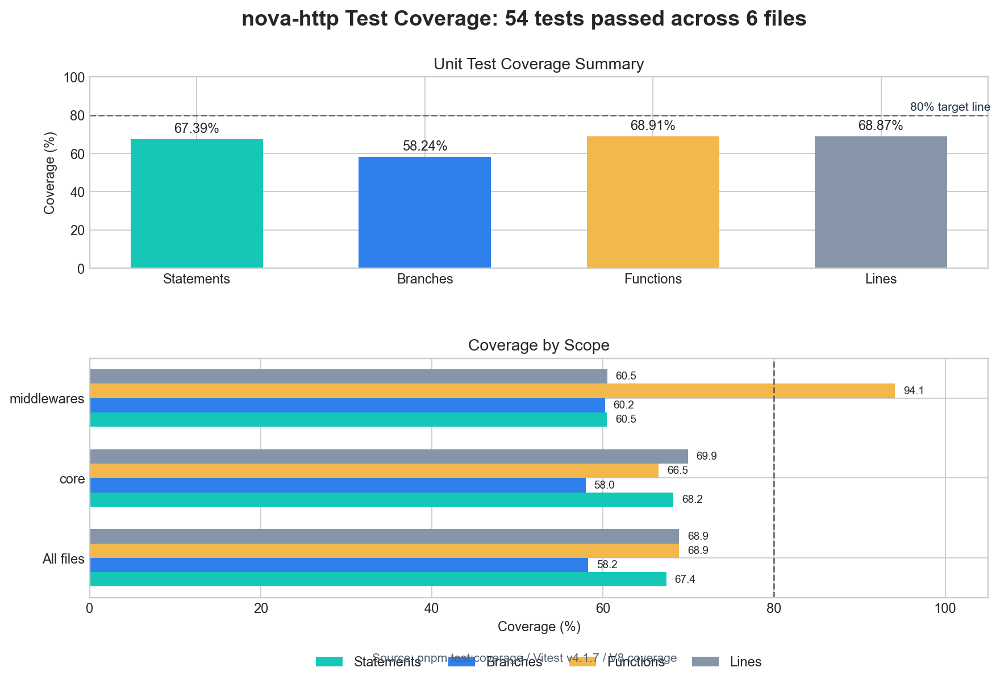
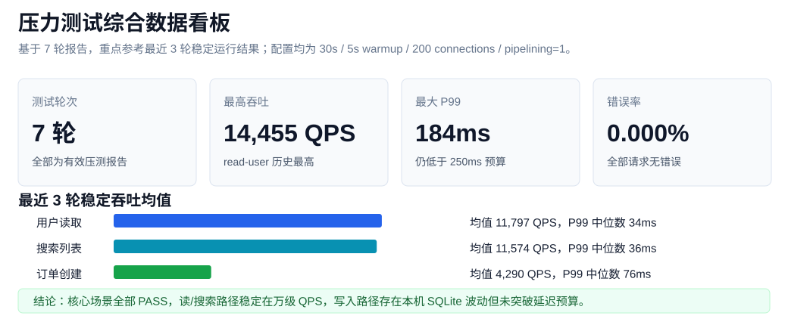
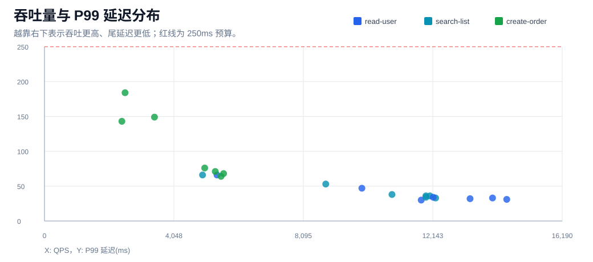
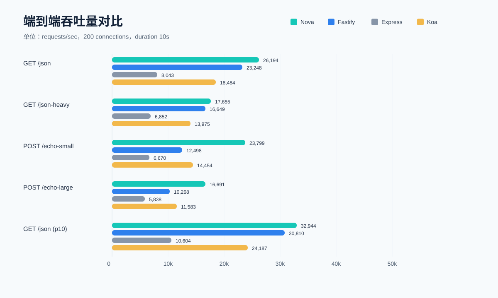
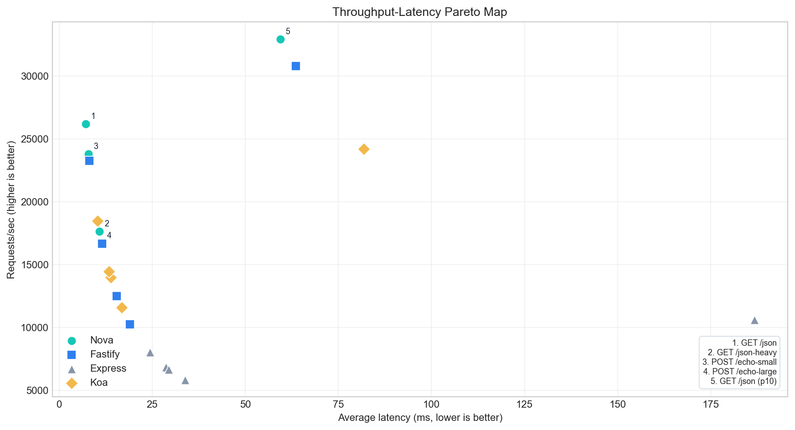
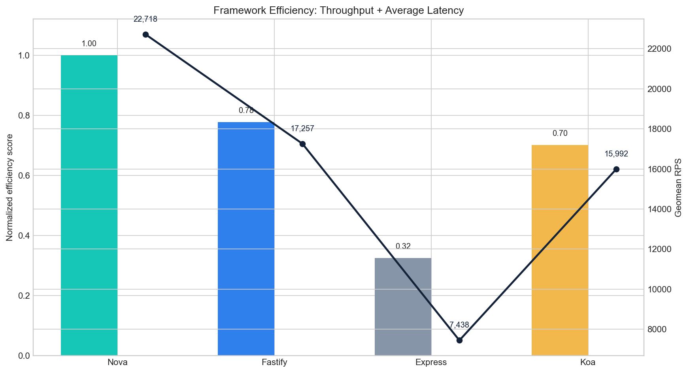
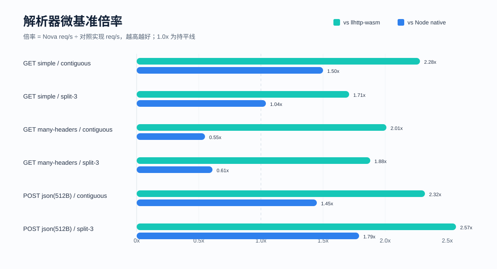

# Nova HTTP框架的设计、开发与测试


基于 Node.js 的轻量级 Web 框架的设计、实现与测试。

> Human beings are either making wheels or on the way to make wheels.
> 人不是在造轮子，就是在造轮子的路上。

在接触到各种 HTTP 框架后，借着课程项目的机会，我尝试自己造了一个轮子：Nova HTTP。

Nova 是一个基于 Node.js `net` 模块实现的轻量级 HTTP Web 框架。
我没有直接使用 Node.js 内置 `http` 模块，而是在 TCP 流基础上完成 HTTP/1.1 请求解析、路由分发、中间件执行、响应封装、静态文件发送和 CLI 项目模板生成。

项目地址: <https://www.github.com/Owl23007/nova-http>

## 1. 为什么要做 Nova

Nova 的目标不是替代成熟框架，而是通过一个真实可运行的项目，把 Web 框架内部机制拆开理解一遍。

它重点关注几个问题：

1. TCP 数据如何被解析成 HTTP 请求。
2. 路由、中间件和响应对象如何协同工作。
3. 框架如何处理异常输入、边界条件和安全风险。
4. 性能测试结果如何反过来暴露设计上的优点和短板。

对这类基础设施软件来说，正确性、稳定性、边界输入处理和性能都很重要。只写几个正常请求能跑通并不够，真正麻烦的部分通常藏在半包、长连接、异常 Header、重复响应、路径穿越和慢速连接里。

## 2. 核心设计

Nova 对外提供接近 Express 的使用体验：

```ts
const app = createApp()

app
  .use(bodyParser())
  .get('/users', getUsers)
  .post('/users', createUser)
```

内部结构主要分成几块：

| 模块 | 职责 | 核心设计 |
| --- | --- | --- |
| ConnectionHandler | 管理 TCP 连接、超时和 Keep-Alive | 持有 BufferReader 解析流式数据；控制连接生命周期和异常关闭 |
| HttpParser | 解析请求行、Header、Body 和 Chunked Body | 基于状态机解析 HTTP/1.1；处理分包和粘包问题 |
| Router | 处理静态路由、参数路由和通配符路由 | 基于 Trie 树匹配路径；支持参数提取和通配符兜底 |
| MiddlewareChain | 控制中间件顺序、异常传递和提前响应 | 支持同步/异步中间件；提供错误处理机制 |
| NovaRequest / NovaResponse | 封装请求信息和响应发送能力 | 提供统一请求响应接口；支持中间件间数据传递 |

### 2.1 ConnectionHandler：把 TCP 流变成请求入口

`ConnectionHandler` 负责处理单个 socket 的完整生命周期。
它不会假设一次 `data` 事件就等于一次完整 HTTP 请求，因为 TCP 只保证字节流顺序，不保证应用层报文边界。因此它内部持有 `BufferReader`，每次收到数据后先追加到缓冲区，再交给 `HttpParser` 尝试解析。

这个设计的重点是把“连接管理”和“协议解析”分开：`ConnectionHandler` 只关心 socket 读写、超时、Keep-Alive、异常关闭和解析结果回调；真正的 HTTP 语义由 `HttpParser` 负责。这样半包、粘包、长连接连续请求都能在同一条数据链路上处理。

### 2.2 HttpParser：用状态机处理协议边界

`HttpParser` 的核心是状态机。解析 HTTP 请求时，请求行、Header、Body、Chunked Body 各自处在不同阶段，不能简单按字符串拆分一次完成。状态机让解析器可以在数据不足时暂停，在后续数据到达后继续解析。

这样设计主要是为了应对真实 TCP 输入：请求行可能被拆成两段，Header 可能跨多个数据包，Body 也可能只到了一部分。解析器需要知道自己当前读到了哪里，还差什么内容，以及什么时候应该返回完整请求或解析错误。

### 2.3 Router：用 Trie 树保证匹配稳定性

`Router` 使用按路径分段的 Trie 树组织路由，而不是简单维护一个线性数组。注册 `/users/list`、`/users/:id`、`/static/*` 这类路由时，每个路径段都会成为树上的节点。

匹配时采用“静态 > 参数 > 通配符”的优先级。这样 `/users/list` 会优先命中静态节点，而不会被 `/users/:id` 抢先匹配。这个设计的价值不只是性能，更重要的是结果稳定：路由数量增加后，匹配逻辑仍然清晰可预测。

### 2.4 MiddlewareChain：统一控制正常流程和错误流程

`MiddlewareChain` 负责把多个中间件串成一个可控流程。它需要同时支持同步函数、异步函数、提前响应和异常传递，所以不能只做简单的 `for` 循环。

Nova 的做法是通过 `next()` 推进链条，并在执行过程中检查响应是否已经发送。如果中间件提前调用 `res.send()`，后续逻辑就不应该继续写响应；如果中间件抛出异常或返回 rejected promise，流程会转入错误处理中间件。这样业务代码只需要表达“继续”或“终止”，请求生命周期由框架统一收束。

### 2.5 NovaRequest / NovaResponse：隔离底层 socket 细节

`NovaRequest` 和 `NovaResponse` 是框架暴露给开发者的主要接口。
`NovaRequest` 把 method、path、headers、query、params、cookies 等信息整理成稳定结构；`NovaResponse` 则封装状态码、响应头、正文发送、JSON 响应、重定向和文件发送。

它们的设计目的，是让业务 handler 不需要直接面对原始 socket 和 HTTP 报文格式。中间件也可以通过请求对象传递上下文数据，通过响应对象统一结束请求。这样框架底层即使调整连接处理或解析逻辑，对上层 API 的影响也会比较小。

请求进入框架后，并不会直接执行业务 handler，而是先经过解析器、中间件链和路由匹配。只有全局中间件没有提前结束响应、路径和方法都匹配成功、路由级中间件也继续放行时，最终 handler 才会执行。

这个顺序看起来很普通，但它决定了 401、404、405、500 等场景能否有清晰边界，也能避免重复响应和异常丢失。

路由匹配采用“静态 > 参数 > 通配符”的优先级。例如 `/users/list` 和 `/users/:id` 同时存在时，Nova 会优先命中静态节点，避免把 `list` 当成参数。

## 3. 测试重点

Nova 的测试主要覆盖三类风险：

1. 协议解析风险：请求行、Header、固定长度 Body、Chunked Body、分包输入、重复 Content-Length 和 CL/TE 冲突。
2. 框架流程风险：中间件顺序、重复 `next()`、提前响应、同步/异步异常和错误处理中间件。
3. Web 安全风险：请求体大小限制、路径穿越、隐藏文件策略、Slowloris 和异常 Header。

当前核心单元测试覆盖了 HttpParser、Router、BufferReader、bodyParser 等模块：

```text
Test Files  4 passed (4)
Tests       31 passed (31)
```



压力测试在 200 并发连接、30 秒持续压测条件下进行。结果显示，Nova 在读接口和列表接口上能维持较低的 P99 延迟，说明连接处理、路由匹配、中间件调度和响应写出链路具备可用的性能基础。





## 4. 基准测试结果

基准测试包含两部分：

1. HTTP 框架端到端性能：对比 Nova、Fastify、Express、Koa。
2. HTTP 请求解析器微基准：对比 Nova HttpParser、llhttp-wasm 和 Node native http_parser。

端到端测试配置为 `duration=10s`、`connections=200`、`middlewareDepth=5`。
在本地测试环境中，Nova 在 5 个场景的 RPS 都领先 Fastify、Express 和 Koa，且没有出现 errors 或 non-2xx。



从吞吐和平均延迟的组合看，Nova 在 POST echo/body 路径上的优势比较明显；Express 的吞吐落后较多，Koa 整体稳定但峰值不如 Nova 和 Fastify。



综合效率分中，Nova 作为本次对比的基准归一化为 100%，Fastify、Koa、Express 依次降低：



解析器层面，Nova HttpParser 明显快于 llhttp-wasm。
在 simple GET 和 POST JSON 场景中也能领先 Node native http_parser，但 many-headers 场景仍然落后，说明多 Header 解析路径还有 profiling 和优化空间。



当然，这组性能测试更适合作为本地横向参考，而不是严肃的框架排名。不同框架的最佳实践、业务逻辑复杂度、部署参数和硬件环境都会影响结果。

## 5. 总结

我觉得 Nova 这个项目最大的收获，是把“一个请求从 socket 进入，到业务 handler 返回响应”的路径完整走了一遍。

自己实现 HTTP 解析、路由树、中间件链、响应对象和静态文件服务后，会更容易理解成熟框架为什么要做那么多边界处理。很多设计不是为了正常路径，而是为了在异常输入和错误流程下仍然保持可控。
