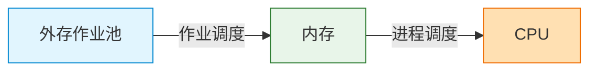
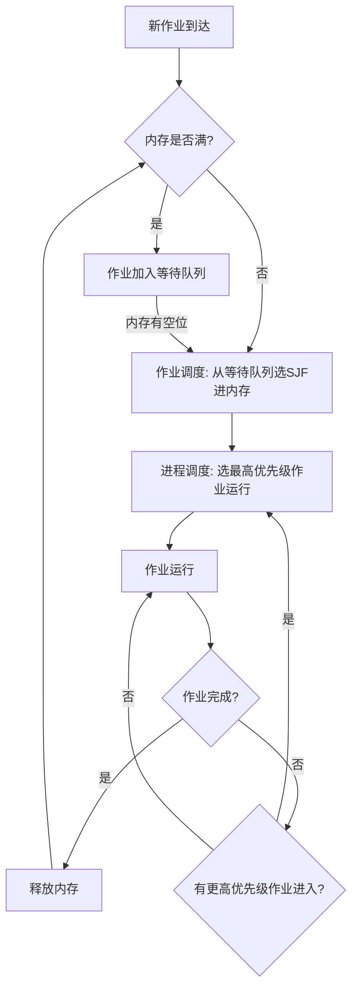
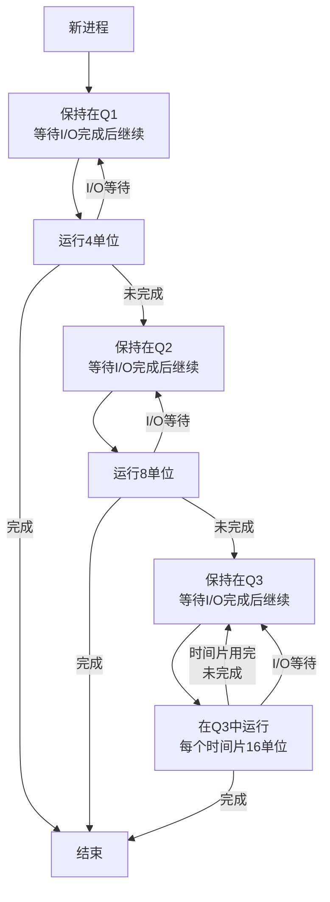

# 操作系统调度的机制

🎬 **一个小故事**

想象你是一家咖啡馆的老板，每天顾客源源不断。有时候一个顾客点的是复杂的定制饮品（长作业），有时候只是要一杯黑咖啡（短作业）。关键问题来了：

- 你是按照先到先服务的顺序？还是先做简单的，后做复杂的？
- 一个 VIP 顾客来了，你是否中断当前的工作去服务他？
- 如果总是有新的急客到来，那些耐心的慢客是否永远得不到服务？

操作系统的调度算法，就是这家咖啡馆的"工作流程"。

> **Tips**：这里假设咖啡馆只有**一位咖啡师**（即单核 CPU）来讨论调度问题。现代多核处理器会并行运行多个进程，但核心的调度思想是相同的——每个核心都需要独立做出"谁先服务"的决策。所以这里的所有讨论都适用于多核系统中的**每一个核心**。

## 📚 本文结构

| 章节 | 内容 |
|------|------|
| [1. 调度的层级结构](#1-调度的层级结构) | 操作系统调度的两个关键层级：作业调度和进程调度 |
| [2. 两级调度：分工明确](#2-两级调度分工明确) | 如何在准入和执行两个层面做出决策 |
|  &nbsp;&nbsp;&nbsp;> [2.1 作业调度](#21-作业调度看时间--短作业优先sjf) | 短作业优先的准入策略 |
| &nbsp;&nbsp;&nbsp;> [2.2 进程调度](#22-进程调度看权重--抢占式优先级调度) | 优先级驱动的执行策略 |
| &nbsp;&nbsp;&nbsp;> [2.3 协同工作流程](#23-协同工作流程) | 两级调度的交互与配合 |
| [3. 抢占式 vs 非抢占式](#3-抢占式-vs-非抢占式直观对比) | 理解两种调度方式的本质差异 |
| [4. 多级反馈队列调度（MLFQ）](#4-多级反馈队列调度mlfq) | 现代系统的自适应调度方案 |
| [5. 三种调度模型综合评估](#5-三种调度模型综合评估) | 对比分析与饥饿问题 |
| [6. 实战应用场景](#6-实战应用场景) | Linux、RTOS、批处理系统的真实选择 |
| [7. 关键要点总结](#7-关键要点总结) | 调度设计的核心哲学 |

---

## 1. 调度的层级结构

操作系统调度分为两个关键层级：



- **作业调度**：决定哪些作业可以进入内存（准入控制）
- **进程调度**：决定内存中的哪个作业使用 CPU（执行控制）

> 💡 **作业管理方式**：
>
> - **单道系统**：内存只能容纳 1 个作业，简单但低效
> - **两道系统**：内存最多容纳 2 个作业，本文以此为例
> - **多道系统**：内存容纳多个作业，现代操作系统的标准配置

---

## 2. 两级调度：分工明确

### 2.1 作业调度：看“时间” —— 短作业优先（SJF）

- **目标**：提高系统整体效率
- **规则**：在等待进入内存的作业中，选择**估计运行时间最短**的
- **特点**：**非抢占式** —— 一旦进入内存，就不会被踢出去

### 2.2 进程调度：看"权重" —— 抢占式优先级调度

- **目标**：保证重要任务优先执行
- **规则**：采用**优先级编号系统**，优先级数值越小优先级越高（如：优先级 1 > 优先级 2 > 优先级 3）
- **特点**：**抢占式** —— 高优先级作业进入内存后，可以立即打断正在运行的低优先级作业

> 💡 **注**：不同系统可能采用不同的优先级定义（有些系统优先级数值越大优先级越高），本文统一采用"数值越小优先级越高"的标准定义

### 2.3 协同工作流程



> 💡 **关键点**：作业调度遵循**短作业优先（SJF）**原则，每次选择等待队列中估计运行时间最短的作业进入内存

---

## 3. 抢占式 vs 非抢占式：直观对比

### 3.1 场景设定

- **进程 A**：低优先级，需要运行 10 个时间单位
- **进程 B**：高优先级，在时间 2 到达，需要运行 5 个时间单位

### 3.2 非抢占式调度

在这种模式下，一旦 A 开始运行，B 必须等待 A 完全结束：

```plaintext
时间轴：0         10        15
        |----------|---------|
        |    A     |    B    |

进程到达：A(t=0)      B到达(t=2)但无法抢占
```

- A 从 0 运行到 10
- B 在 t=2 到达，但由于 A 正在运行且系统不支持抢占，B 必须等待
- B 从 10 开始运行，15 结束
- **B 的等待时间 = 10 - 2 = 8 个时间单位**

### 3.3 抢占式调度

在这种模式下，B 到达后立即获得 CPU，打断 A 的执行：

```plaintext
时间轴：0    2         7        15
        |----|---------|---------|
        | A1 |    B    |   A2    |

             ↑ t=2时刻，B到达，立即抢占

```

- A 从 0 运行到 2（被 B 打断 = **抢占点**）
- B 从 2 运行到 7（立即执行，几乎无等待）
- A 从 7 继续运行到 15（完成剩余 8 个单位）
- **B 的等待时间 ≈ 0**（只需排队极短时间）

**对比效果**：抢占式调度使 B 的响应延迟从 8 个时间单位降低到接近 0

### 3.4 关键差异总结

| 方面 | 非抢占式 | 抢占式 |
|------|----------|--------|
| **响应性** | 差（重要任务需等待） | 好（重要任务立即执行） |
| **实现复杂度** | 简单 | 复杂（需保存/恢复进程状态） |
| **适用场景** | 批处理系统 | 交互式/实时系统 |

---

## 4. 多级反馈队列调度（MLFQ）

### 4.1 为什么需要 MLFQ？

- 现实中很难预知进程运行时间（SJF 的前提）
- 需要自动区分不同类型的进程
- 要同时兼顾短作业的响应性和长作业的完成

### 4.2 三级队列典型配置

| 队列 | 优先级 | 时间片大小 | 适合的进程类型 |
|------|--------|------------|----------------|
| **Q1** | 最高 | 4 | 短作业、交互式进程 |
| **Q2** | 中等 | 8 | 中等长度作业 |
| **Q3** | 最低 | 16 | 长作业、CPU密集型进程 |

### 4.3 调度规则与核心机制

#### 基本规则

1. **新进程**总是从 **Q1** 开始
2. 如果在时间片内**完成**，进程结束
3. 如果时间片用完但**未完成**，降级到下一级队列
4. 如果因为**I/O 等待**而放弃 CPU，保持在当前队列（不降级）
5. CPU 总是优先运行**最高优先级非空队列**中的进程

#### 防止饥饿：老化机制（Aging - 等待时间补偿）✨

标准 MLFQ 必须配备的关键机制，否则会导致严重的进程饥饿：

- **问题**：持续有新的短作业到达时，Q3 中的长作业可能永远得不到执行
- **解决方案**：每隔一段时间（如 100ms），将所有等待时间过长的进程提升到更高优先级队列
- **规则**：
  - 等待 100ms 在 Q2 → 提升到 Q1
  - 等待 100ms 在 Q3 → 提升到 Q2
- **参数范围**：
  - 短期系统（响应式）：50-100ms
  - 一般交互系统：100-200ms
  - 批处理系统：可达 1-5s
- **效果**：保证即使是长作业也最终能获得执行机会
- **原理**：进程"变老"（等待时间增加）后，获得更高的优先级，避免被永久饿死

> 💡 **本文简化**：后续示例采用简化版 MLFQ（不涉及老化机制）演示基本流程，实际系统中必须配备老化机制

### 4.4 调度流程图



> 💡 **Q3 特性**：进程在 Q3 中采用轮转调度，每次运行 16 个时间单位，若未完成则继续排队等待下一个时间片

### 4.5 实际执行示例

#### 示例场景设定

三个进程同时到达（t=0）：

- **P1**（6单位）：Q1 运行 4 单位 → 降级到 Q2 → 再运行 2 单位完成
- **P2**（13单位）：Q1 运行 4 单位 → 降级到 Q2 → 运行 8 单位 → 降级到 Q3 → 运行 1 单位完成
- **P3**（10单位）：Q1 运行 4 单位 → 降级到 Q2 → 在 Q2 中运行 6 单位完成

#### 详细执行时间轴

| 时间 | Q1队列 | Q2队列 | Q3队列 | CPU执行 | 备注 |
|------|--------|--------|--------|---------|------|
| 0-4  | P2,P3等待 | - | - | P1运行 | P1在Q1执行4单位 |
| 4-8  | P3等待 | P1等待 | - | P2运行 | P2在Q1执行4单位 |
| 8-12 | - | P1,P3等待 | - | P3运行 | P3在Q1执行4单位 |
| 12-16 | - | P1,P3运行 | - | P1运行 | P1在Q2执行2单位→**完成** |
| 16-20 | - | P3运行 | - | P3运行 | P3在Q2执行4单位 |
| 20-24 | - | P2等待 | P2,P3等待 | P3运行 | P3在Q2执行2单位→**完成** |
| 24-32 | - | - | P2运行 | P2运行 | P2在Q3执行8单位 |
| 32-33 | - | - | - | P2运行 | P2在Q3执行1单位→**完成** |

#### 性能指标

| 进程 | 开始时间 | 结束时间 | 等待时间 | 周转时间 |
|------|---------|---------|---------|---------|
| P1   | 0       | 12      | 6       | 12      |
| P2   | 0       | 33      | 20      | 33      |
| P3   | 0       | 24      | 14      | 24      |
| **平均** | - | - | **13.3** | **23** |

**计算说明**：

- **等待时间** = 进程首次运行前的等待时间 + 被打断后重新等待的总时间
  - P1：0-0（未等待）+ 8-12（等待2单位） + 12-16（等待2单位） = 6 单位
  - P2：0-2（等待2单位） + 8-24（等待16单位） + 24-32（等待2单位） = 20 单位
  - P3：0-8（等待8单位）+ 12-16（等待4单位） = 14 单位
- **周转时间** = 结束时间 - 开始时间
  - P1：12 - 0 = 12 单位
  - P2：33 - 0 = 33 单位
  - P3：24 - 0 = 24 单位
- **平均值**：(6+20+14)/3 = 13.3；(12+33+24)/3 = 23

> 💡 **观察**：短进程（P1）获得快速完成，长进程（P2）虽然等待长，但不会被无限延迟（在 Q3 最终获得执行）

---

## 5. 三种调度模型综合评估

现在我们已经理解了三种主要的调度算法：

- **两级调度**（作业调度用 SJF，进程调度用优先级）
- **多级反馈队列**（MLFQ）
- **纯 SJF**（纯短作业优先）

以下通过详细的对比，帮助您理解各算法的适用场景和权衡。

### 5.1 三种调度模型对比

| 特性 | 两级调度（SJF+优先级） | 多级反馈队列（MLFQ） | 纯SJF（非抢占） |
|------|------------------------|----------------------|----------------|
| **是否需要预知运行时间** | 是 | 否 | 是 |
| **是否支持抢占** | 进程调度层支持 | 完全支持 | 不支持 |
| **防止饥饿机制** | 依赖作业调度策略 | 需要老化机制 | 无法防止 |
| **内存管理** | 限制并发作业数 | 通常不限制 | 通常不限制 |
| **主要优势** | 简单明确，效率高 | 自适应，兼顾各类进程 | 理论最优平均等待时间 |
| **主要缺点** | 需要预知时间，可能导致进程饥饿 | 实现复杂，参数配置困难 | 需要预知时间，无抢占导致响应慢 |
| **适用场景** | 批处理系统、时间预知清楚 | 通用操作系统、交互式系统 | 学术研究、理论分析 |

**解读**：

- **两级调度**是传统批处理系统的选择，简单高效
- **MLFQ** 是现代通用操作系统（Unix、Linux）的常用方案，平衡了各类进程的需求
- **纯SJF** 主要用于理论计算，实际系统很少采用

---

### 5.2 饥饿问题的深入分析

#### 什么是进程饥饿（Starvation）？

**定义**：一个就绪的进程长时间得不到 CPU 时间，无限期地等待执行的现象。

#### 各调度算法的饥饿风险

##### 两级调度（SJF + 优先级）中的饥饿

**风险场景**：

```text
场景：不断有新的短作业到达系统
- 长作业 L：需要 1 小时运行时间
- 短作业流 S1, S2, S3...：每个 1 分钟

SJF 作业调度的选择过程：
时间 0-1分钟：选 S1 进内存执行
时间 1-2分钟：选 S2 进内存执行
...
问题：长作业 L 可能永远被推后！
```

**防止机制**：

- 设置最大等待时间阈值，超过则强制进入内存
- 采用"年龄"概念：等待时间越长，优先级越高

##### 多级反馈队列（MLFQ）中的饥饿

**风险场景**：

```text
场景：持续有高优先级（交互式）进程到达
- 长作业进程在 Q3，但频繁有新进程进 Q1
- Q1 和 Q2 总是有进程等待执行
- Q3 中的长作业永远得不到 CPU

这就是 MLFQ 必须配备"老化机制"的原因！
```

**防止机制**：

- **老化机制**：每隔一定时间，所有等待过久的进程自动提升到更高优先级队列
- 典型参数：等待 100ms 以上自动提升一级

#### 纯 SJF（非抢占）中的饥饿

**风险等级**：⚠️ **最严重**

```text
场景：有两个进程
- 长进程 L：10 个时间单位（首先到达）
- 短进程 S：1 个时间单位（后到达）

执行顺序：
- L 运行 10 个时间单位
- 最后 S 才能运行

如果源源不断有新短进程到达，L 会被无限延迟！
```

**无法有效防止**的原因：

- 非抢占特性决定了一旦进程开始运行就不会被中断
- 没有优先级机制可以打断长进程

### 总结表

| 算法 | 饥饿风险 | 防止方案 |
|------|--------|---------|
| **两级调度** | 中等 | 最大等待时间、年龄机制 |
| **MLFQ** | 低（配老化机制）| **必需老化机制**否则高风险 |
| **纯SJF** | 很高 | 改用抢占式 SJF 或其他算法 |

---

## 6. 实战应用场景

### 现代操作系统的实际选择

了解了三种算法的特点后，让我们看看真实的操作系统是如何选择的：

#### Linux/Unix 系统：MLFQ 变体（CFS）✨

**采用算法**：完全公平调度器（Completely Fair Scheduler, CFS）

- **基础**：多级队列的思想
- **特色**：使用红黑树代替固定队列，动态调整优先级
- **老化机制**：完整实现，防止任何进程长期饥饿
- **适配性**：自动识别 I/O 密集型 vs CPU 密集型进程

**典型场景**：

```text
- 文本编辑器：高优先级，快速响应用户输入
- 后台下载：低优先级，不影响前台任务
- 数据库：中等优先级，平衡吞吐和响应
```

#### 实时操作系统（RTOS）：两级调度

**采用算法**：优先级 + SJF 变体

- **特点**：预测性强，行为可预测
- **保证**：不同优先级任务的响应时间有上界
- **应用**：航空航天、医疗设备、工业控制

#### 批处理系统（大数据处理）：优化的 SJF

**采用算法**：带老化机制的 SJF

- **目标**：最大化系统吞吐量
- **特点**：长作业最终必定执行
- **应用**：Hadoop、Spark 等分布式计算框架

---

## 7. 关键要点总结

- **两级调度**：准入看效率（运行时间），执行看重要性（优先级）
- **抢占性**：决定了高优先级任务能否"插队"，直接影响系统响应性
- **多级反馈队列**：通过多级试探自动分类进程，是 SJF 思想的实用化实现
- **I/O密集型进程**：在 MLFQ 中天然获得高响应性（频繁阻塞不降级）
- **老化机制**：是现代调度系统防止饥饿的必要机制
- **设计哲学**：调度的本质是在**系统效率**与**用户体验**之间找到最佳平衡点
