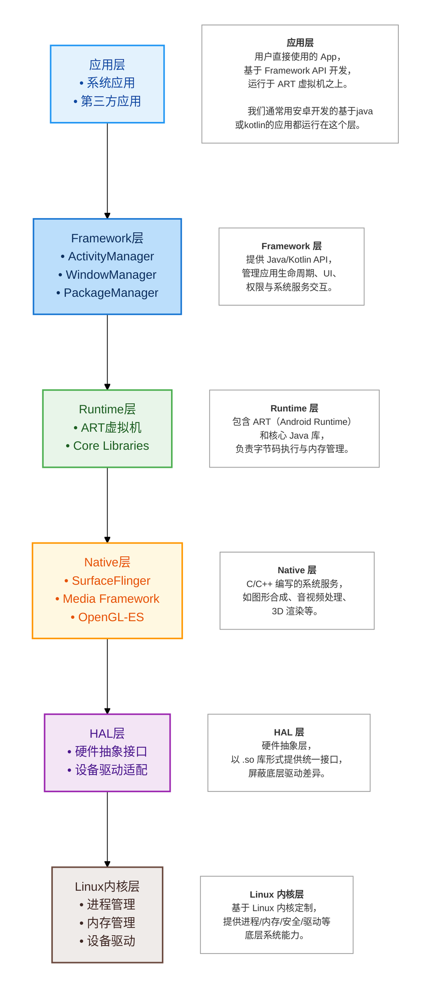
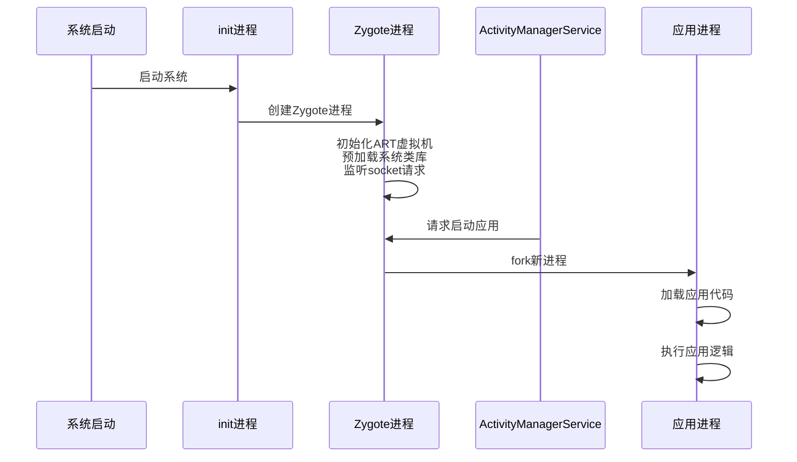
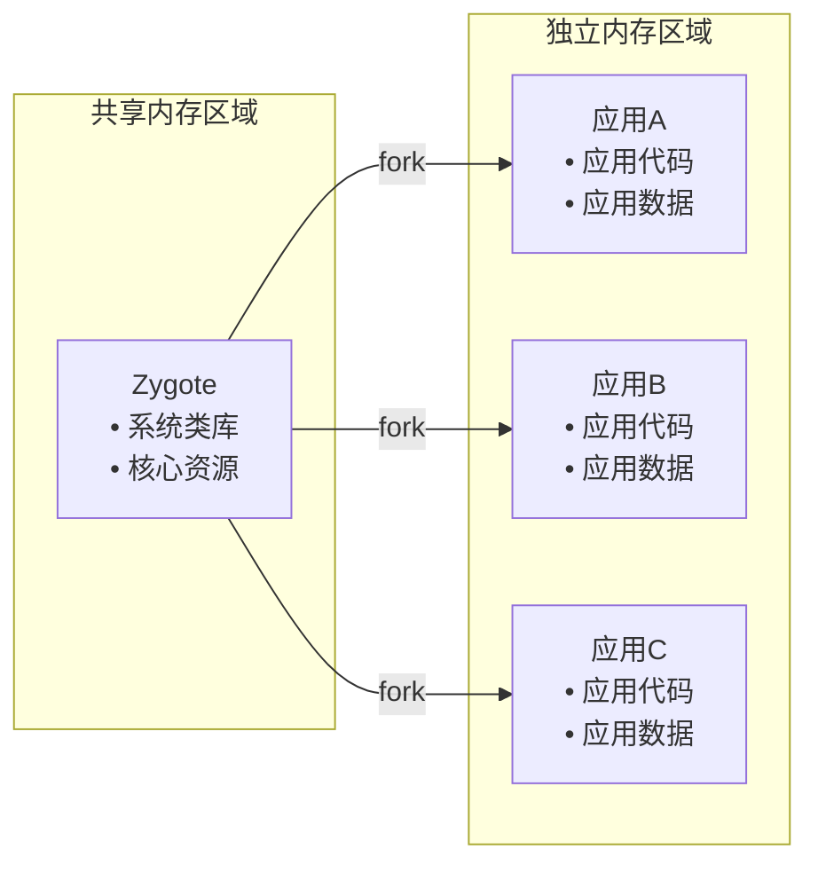
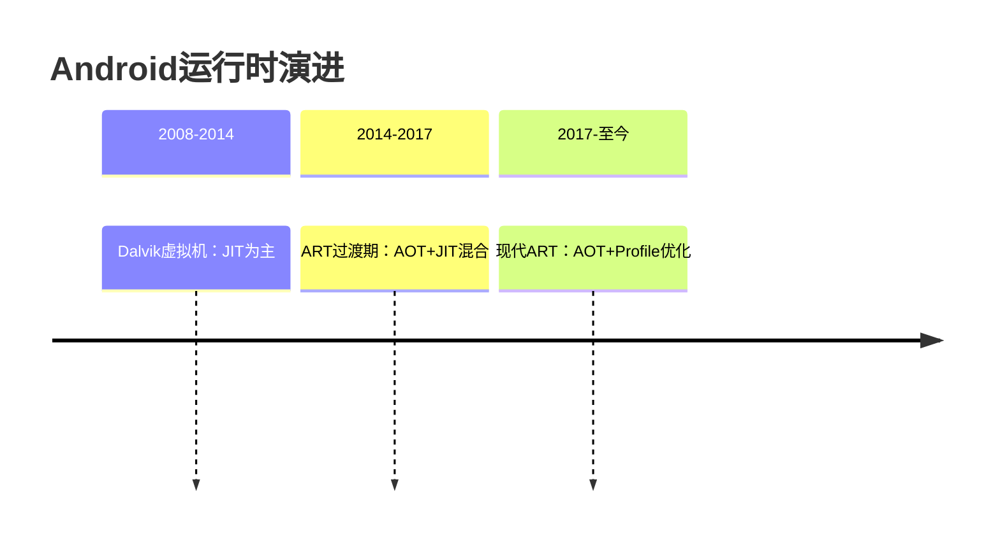
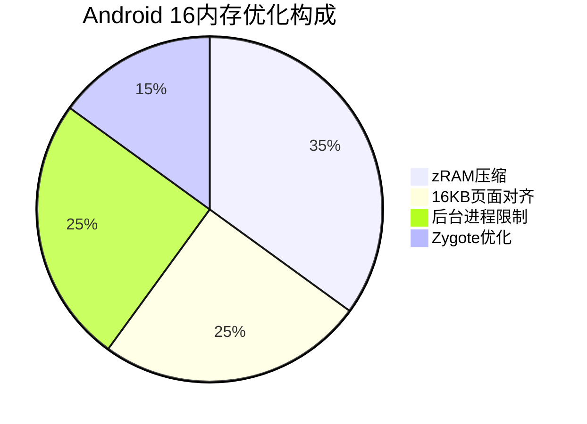
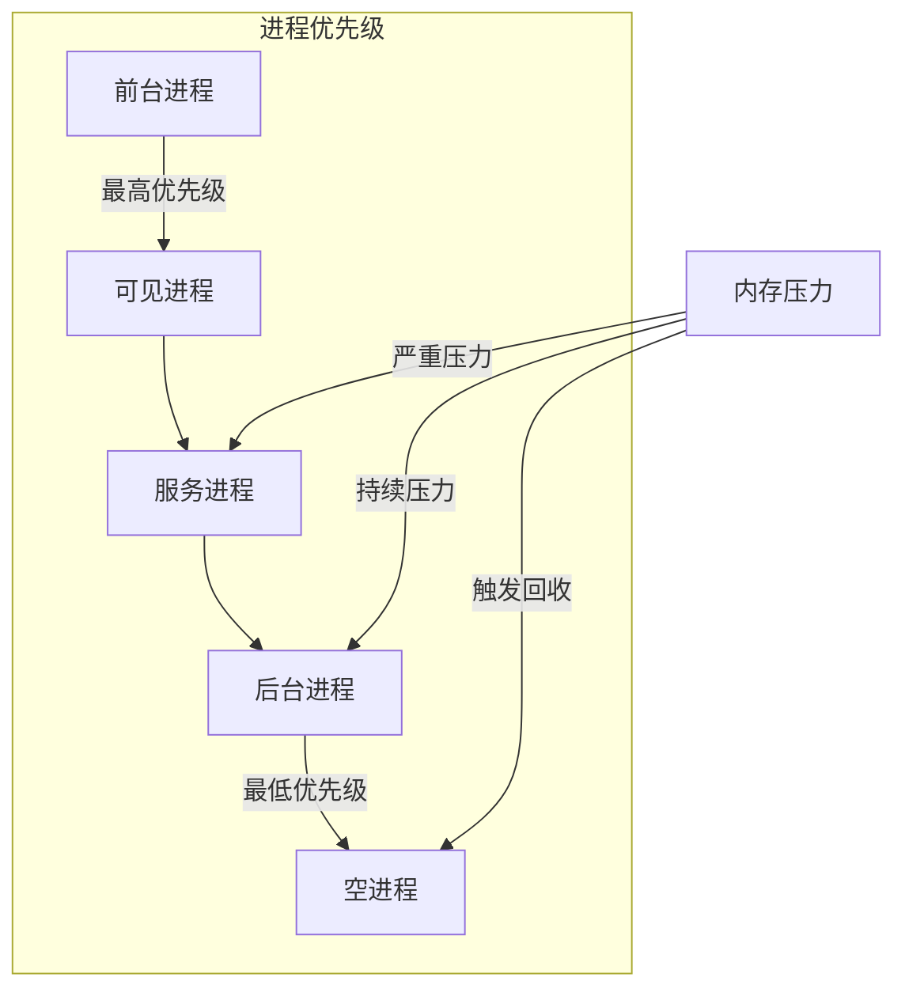
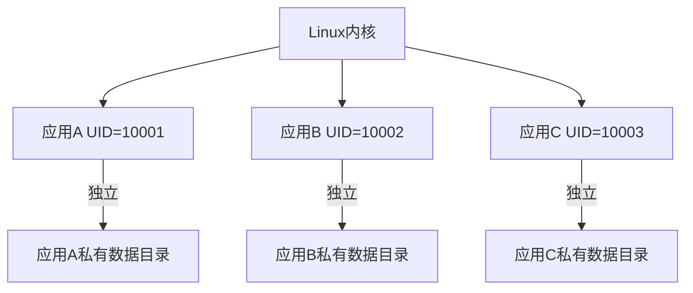
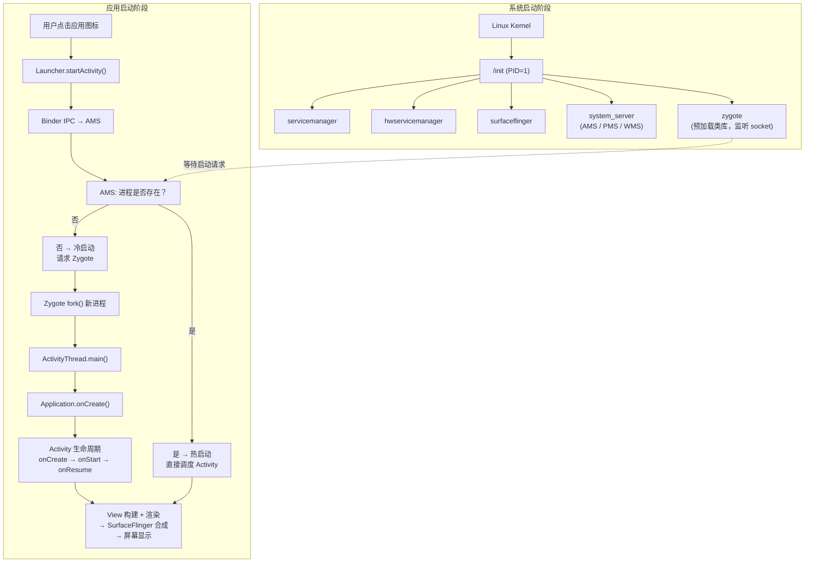

# 1.1 系统底层机制：Android架构根基

Android 作为全球最广泛使用的移动操作系统，其强大之处不仅在于丰富的应用生态和用户友好的界面，更在于其坚实而灵活的系统架构。从底层硬件抽象到上层应用框架，Android 采用分层设计思想，将复杂的软硬件资源整合为一个高度模块化、可扩展且安全可控的整体。理解 Android 的系统架构，是深入掌握其运行机制、性能优化、安全防护以及定制开发的关键起点。

本小结将从安卓的底层开始，介绍其系统架构的基本原理和机制，帮助我们更好地理解安卓系统的运行原理，并为我们后续开发安卓应用提供基础。

当然你也不用对本章的内容感到害怕，因为我们只需要先对整个系统的运行原理有一个整体的了解，更深入的探索大家可以自己去研究。

## 一、Android系统架构全景

Android系统是基于Linux内核，采用分层架构设计，各层职责明确，协同工作。通过下图可以直观理解系统层次结构：



Linux内核由Linus创建并通过git仓库托管，是Android系统的基础。它提供了进程管理、内存管理、设备驱动等核心功能，确保系统的稳定运行。

Android 系统虽然基于 Linux 内核，但它使用了大量定制化的驱动和子系统（如 Binder IPC、Low Memory Killer、Ashmem 等），这些并不在主线内核中。因此，Android 使用的是一个高度修改的 Linux 内核分支。

在linux内核中，一切皆文件，包括进程、线程、设备、文件系统等。这一设计理念使得系统的资源管理变得简单高效。需注意：进程和线程本身并不是"文件"，而是通过虚拟文件系统（如 procfs、sysfs）将它们的状态映射为文件接口，以便用户空间程序读取或控制。这是一种抽象机制，而非说进程"就是"一个文件。

这里我们暂时不再展开介绍 Linux 内核的详细机制，只需要知道：Android 通过在其之上构建多层软件架构，将内核提供的底层能力封装为高层服务，最终支撑起丰富而高效的移动应用生态。

从用户点击一个 App 图标，到屏幕显示界面、播放音视频、访问网络或传感器，背后都依赖于这一分层体系中各模块的紧密协作——上层调用下层接口，下层为上层提供抽象与保障。这种设计不仅提升了系统的可维护性和可移植性，也为开发者屏蔽了硬件和内核的复杂性。

## 二、Zygote进程：应用进程孵化器

### 2.1 Zygote的核心机制

我们每运行一个应用，系统就会创建一个新的应用进程。而Zygote进程则是所有应用进程的起点，它负责创建和管理这些应用进程。

Zygote（受精卵）是 Android 系统中 **第一个运行在 ART（Android Runtime）之上** 的 Java 应用进程。它负责预加载Android框架的核心类库和资源，为后续应用进程的创建提供基础。

**其核心职责是为 ART 环境服务**

- Zygote 启动时会
  1. 初始化 ART虚拟机；
  2. 预加载 Android 框架中的常用 Java 类（如 Activity, View, Context 等）；
  3. 预加载资源（如系统主题、字符串等）,这些预加载的内容都运行在 ART 的运行时环境中。

> ART（Android Runtime）是 Android 的应用运行时环境，类似于 JVM，但针对移动设备进行了深度优化。它负责执行 Android 应用的字节码（DEX 格式）。
> 与传统 JVM 的"运行时即时编译（JIT Just-In-Time）"不同，**ART 主要采用"安装时提前编译（AOT, Ahead-Of-Time）"策略**：
> 在应用安装阶段，将 DEX 字节码"编译为本地机器码，生成 OAT（Optimized ART Executable 优化ART可执行文件）"文件（基于 ELF 格式 Executable and Linkable Format 可执行与链接格式），存储在 `/data/dalvik-cache/` 目录中，从而提升运行时性能。
> 此外，从 Android 7.0（Nougat）开始，ART 引入了 **混合编译模式（AOT + JIT + Profile-Guided Optimization）**：
>
> - 首次安装时仅做轻量级解释或 JIT；
> - 系统在空闲时根据使用情况（profile）对热点代码进行 AOT 编译；
> - 后续启动直接运行优化后的机器码。
>   这种机制在安装速度、存储空间和运行性能之间取得了更好平衡。

- 所有应用进程都 fork 自 Zygote
  当 AMS（ActivityManagerService）需要启动一个新 App 时，它会请求 Zygote fork 出一个子进程；
  这个子进程已经包含初始化好的 ART 实例和预加载的类，无需重复初始化；
  因此，Zygote 是 应用进程的"模板"，而这个模板的本质就是一个 预热的 ART 运行时环境。

> **官方文档与源码归属**
> 在 AOSP（Android Open Source Project）中,Zygote 的主逻辑在 `frameworks/base/core/java/com/android/internal/os/ZygoteInit.java`；
>
> 它由 app_process（一个 native 程序）启动，但主体逻辑是 Java 代码，运行在 ART 上。

#### 其工作流程如下



> **Zygote机制**
> Zygote 是Android系统启动时创建的第一个Java进程。它预加载了Android框架的核心类库和资源，当需要启动新应用时，通过Linux的fork()系统调用快速复制自身，避免重复初始化虚拟机和加载类库，大幅提升应用启动速度。

### 2.2 内存共享原理

Zygote通过Copy-on-Write（写时复制）机制实现内存高效共享：



> **写时复制（Copy-on-Write）**
> Linux内核的内存优化技术。当Zygote fork子进程时，父子进程共享同一物理内存页。只有当某个进程尝试修改共享内存时，内核才会复制该内存页，为修改进程创建独立副本。这样多个应用可以共享系统类库的内存，显著减少内存占用。

如果子进程尝试修改某个共享页（例如：给一个全局变量赋值），典型流程如下：

1. CPU 触发页错误（Page Fault）
2. Linux 内核的 COW 处理程序介入
3. 分配一个新的物理页
4. 将原页内容完整复制到新页
5. 更新子进程的页表，指向新页
6. 将新页设为可写，原页仍为只读（供其他进程共享）

只有这一页被复制，其他成千上万的页（如 `java.lang.String` 类定义、系统图标等,这些往往是读多写少,不会被修改导致复制页）依然共享。

不同类型内存页在 COW 机制下的特性可以简单理解为：

- Android 框架代码（DEX/OAT）：**共享**，只读，几乎从不修改
- 预加载的 Java 类元数据：**共享**，ART 初始化后不再变
- 应用私有堆对象（如 Activity 实例）：**不共享**，运行时创建，属于私有写

虽然每个应用依然会因为activity的创建而占用一定内存,但大多数的api与系统类库都是共享的,这大大减少了内存占用。

## 三、Android运行时演进：从Dalvik到ART

Android 运行时环境（Runtime）的演进，既是性能优化史，也是能耗和安全性的演进史。整体可以分为三个阶段：

- Dalvik 时代：以 JIT 为主，安装快、运行时动态优化。
- 过渡期 ART：引入 AOT + JIT 混合模式，在安装时间和运行性能之间寻找平衡。
- 现代 ART：更多地依赖安装期和后台的 AOT 编译，配合更智能的 GC 和 Profile 机制。



Dalvik 的特点是"安装快、首启慢"：安装阶段基本只是解压与简单优化，真正的机器码生成发生在应用运行过程中（JIT）。这带来的问题是：

- 应用首次启动和冷启动开销较大；
- 运行时频繁进行 JIT 编译，占用 CPU 和电量；
- 某些路径只执行一次，JIT 优化空间有限。

ART 引入 AOT（Ahead-Of-Time）编译后，把"字节码 → 机器码"的工作尽量前移到安装阶段或后台空闲时执行：

- 常用代码在安装或设备空闲充电时预编译为本地机器码，启动和运行时直接执行；
- 对于使用频率不高的代码路径，则保留 JIT，以避免安装时间过长、安装包体积膨胀；
- 结合 Profile（运行时采样的"热点代码画像"）进行有选择的 AOT 编译，实现"把时间花在真正热的路径上"。

在安全性方面，ART 相比 Dalvik 也做了多方面加强：

- 更严格的字节码验证：在安装或加载阶段对 Dex 做更严格校验，降低异常字节码被利用的风险。
- 更完善的垃圾回收（GC）：并发、分代 GC 减少"长时间 Stop-The-World"，降低因卡顿导致的 UI 线程超时等异常，从侧面提升稳定性。
- 更严格的 JNI 检查：对 Native 层调用做更多边界检查，尽量在开发和调试阶段暴露问题，减少线上因非法内存访问导致的崩溃或安全隐患。

## 四、内存管理机制

### 4.1 Android 16 内存优化

为应对日益复杂的应用负载与有限的设备资源，Android 16 在内存管理方面引入了多项协同优化措施。这些改进共同构成了一套更高效、更智能的内存管理体系。下图展示了各项关键技术在整体优化策略中的相对比重：



从图中可以看出，**zRAM 压缩**是本次内存优化的核心手段，占据了最大比重。以下是对各项技术的详细说明：

#### 1. zRAM 压缩（占比 35%）

zRAM 是 Linux 内核提供的内存压缩技术。当系统内存紧张时，Android 16 利用 zRAM 将不活跃的内存页进行压缩，并**继续保留**在物理 RAM 中，而非写入较慢的存储交换分区（swap）。这种方式大幅减少了 I/O 操作，加快了内存回收速度，尤其适用于内存容量有限的移动设备，有效提升系统响应性和流畅度。

#### 2. 16KB 页面对齐（占比 25%）

Android 16 新增对 16KB 内存页面大小的支持（传统为 4KB）。更大的页面粒度可减少页表项数量，降低 TLB（Translation Lookaside Buffer，地址转换后备缓冲器）压力，从而提升内存访问效率——这一改进在大内存或高性能场景下尤为显著。

> TLB 是 CPU 内部的一块高速缓存，用于存放最近用过的"虚拟地址→物理地址"映射；页越大，同样大小的内存只需更少的页表项，TLB 命中率更高，地址转换更快，访存延迟随之降低。

#### 3. 后台进程限制（占比 25%）

在 Android 16 中，系统进一步收紧了对后台应用的资源管控策略：不仅限制非活跃应用可使用的内存上限，还严格控制其后台活动频率（如网络请求、定时任务等），有效防止"隐形"内存消耗和 CPU 唤醒滥用。

这一改进源于早期版本（特别是 API 级别 16 之前）的明显短板——当时系统对后台应用几乎没有内存或行为限制，导致某些应用在退到后台后仍持续占用大量 RAM 或频繁执行任务，严重挤占前台应用和系统关键服务的资源，引发卡顿甚至系统重启。

如今，Android 强烈推荐开发者采用 WorkManager 来处理延迟或周期性后台任务。WorkManager 是 Android Jetpack 的一部分，它能根据设备状态（如电量、网络、Doze 模式）智能调度任务，在保证功能实现的同时，最大限度减少资源争用和电池消耗。这不仅符合系统资源管理的新规范，也为用户提供更流畅、更省电的体验。

> 最佳实践提示：避免使用传统的 AlarmManager 或自启 Service 执行后台工作；迁移到 WorkManager 可确保应用在 Android 16 及更高版本中高效、合规地运行。

#### 4. Zygote 优化（占比 15%）

作为 Android 应用进程的"母体"，Zygote 的启动效率直接影响应用冷启动速度。Android 16 对其共享内存机制和初始化流程进行了精简，减少了重复加载开销，在提升启动性能的同时也降低了整体内存占用。

> **总结**：这四项技术并非孤立存在，而是相互配合——从内核层（zRAM、页面对齐）到系统调度（后台限制），再到应用孵化（Zygote），形成了一条贯穿软硬件的内存优化链路，全面提升设备在高负载下的稳定性与能效表现。

### 4.2 进程优先级管理

我们常说的**杀后台**，本质上是 Android 系统在内存紧张时，根据进程的重要性动态回收低优先级进程的行为。Android 并不会随意终止应用，而是通过一套精细的进程优先级模型（如前台进程、可见进程、服务进程、后台进程、空进程）来决定哪些进程可以被安全释放。

在早期版本（特别是 API 16 之前），系统对后台应用几乎没有内存或行为限制，导致一些应用退到后台后仍长期驻留、占用大量 RAM，严重挤占前台资源。

从 Android 16 开始，这一机制就进行了强化:

- 系统会根据应用的**最近使用时间**、**资源消耗**等因素，动态调整应用的优先级。
- 当系统内存紧张时，会优先回收**低优先级**的应用进程，以释放更多资源给前台应用。
- 开发者可以通过**请求后台权限**来优化应用的资源使用，避免被系统"杀后台"。

下面是 Android 进程优先级的可视化表示：



#### 📌 Android 如何判断进程优先级？

Android 通过分析**进程中运行的组件类型及其当前状态**，为每个进程赋予一个"重要性等级"（oom_adj 或 modern LMKd score）。系统在内存不足时，会从**最低优先级开始回收进程**，以保障用户体验。

##### 1. 优先级判定的核心依据：**活跃组件**

Android 进程本身不直接决定优先级，而是由其**托管的四大组件（Activity、Service、BroadcastReceiver、ContentProvider）的状态**决定。以下是官方定义的优先级层级（从高到低）：

| 优先级等级                            | 判定条件                                                                                                                                                                                                     | 说明                                                                                                                                                            |
| ------------------------------------- | ------------------------------------------------------------------------------------------------------------------------------------------------------------------------------------------------------------ | --------------------------------------------------------------------------------------------------------------------------------------------------------------- |
| **1. 前台进程（Foreground Process）** | 满足任一：<br>• 正在与用户交互的 Activity（`onResume()`）<br>• 绑定到前台 Activity 的 Service<br>• 前台 Service（调用 `startForeground()`）<br>• 正在执行生命周期回调（如 `onCreate()`）的 BroadcastReceiver | 最高优先级，**不会被轻易杀死**。通常同时存在的前台进程不超过 3–5 个。                                                                                           |
| **2. 可见进程（Visible Process）**    | 满足任一：<br>• Activity 对用户可见但不在前台（如被 Dialog 遮挡，处于 `onPause()`）<br>• 绑定到可见 Activity 的 Service                                                                                      | 用户能"看到"但未交互，系统尽量保留，**仅在严重内存压力下回收**。                                                                                                |
| **3. 服务进程（Service Process）**    | 运行着通过 `startService()` 启动的 Service，且无更高优先级组件                                                                                                                                               | 后台服务（如音乐播放、下载），**重要但可牺牲**。Android 16 开始对此类进程施加更严格的内存和 CPU 限制。                                                          |
| **4. 后台进程（Background Process）** | 托管的 Activity 已完全不可见（`onStop()` 被调用），且无活跃 Service                                                                                                                                          | 用户已离开该应用。**系统会根据 LRU（最近最少使用）策略排序**，越久未用越先被杀。Android 16 新增基于**资源消耗历史**的动态评分，高内存占用后台应用会被更快回收。 |
| **5. 空进程（Empty Process）**        | 不包含任何活跃组件，仅用于缓存（加速下次启动）                                                                                                                                                               | **纯缓存用途**，内存紧张时**最先被回收**。                                                                                                                      |

##### 2. Android 16 的动态增强：不只是"是否可见"

早期 Android 主要依赖组件状态判断优先级，而 **Android 16 引入了更智能的动态评分机制**，综合以下因素微调进程"实际回收顺序"：

- **最近使用时间（Recency）**：  
  即使同为"后台进程"，10 分钟前使用的应用比 2 小时前使用的优先级更高。
- **内存占用大小（RSS / PSS）**：  
  占用 500MB RAM 的后台应用比只占 50MB 的更容易被选中回收——**"大内存罪"原则**。

- **CPU/电量消耗历史**：  
  若某后台应用频繁唤醒 CPU 或大量使用网络，系统会降低其隐式优先级。

- **用户偏好信号**：  
  用户频繁手动"强制停止"某应用？系统会学习并更激进地回收它。

> 这些数据由 **LMKd（Low Memory Killer daemon）** 结合 **PSI（Pressure Stall Information）** 实时采集，替代了旧版基于固定 oom_adj 阈值的粗粒度策略。

##### 3. 开发者如何影响优先级？

虽然不能"强行提升"优先级，但可通过合规方式**避免被过早降级**：

- ✅ 使用 **前台 Service**（需显示通知）处理关键任务（如导航、通话）；
- ✅ 通过 **WorkManager** 提交非即时任务，让系统择机执行；
- ✅ 在 `onTrimMemory()` 回调中主动释放缓存，向系统表明"我配合资源回收"；
- ❌ 避免滥用 `startService()` 启动长期后台服务（Android 8+ 已限制）；
- ❌ 不要试图通过常驻通知或循环绑定"伪装"前台进程（会被 Play 政策拒绝）。

> 总结：优先级 = 组件状态 + 行为表现 + 用户意图

Android 的进程优先级判断早已不是简单的"前台/后台"二分，而是一个**融合上下文感知、资源效率与用户体验的动态决策系统**。

**Android 16 的改进方向很明确**：  
在保留 Android 多任务灵活性的同时，通过更精细的评分机制，让"好公民应用"活得更久，让"资源霸占者"更快退出，最终向 iOS 的能效水平靠拢，却不牺牲开放性。

> 与 iOS "墓碑机制"的对比
> Apple 采用了一种截然不同的策略——"墓碑机制"（App Suspension with State Preservation）。当用户切换离开某个 App 时，iOS 会迅速将其挂起（suspend），冻结其 CPU 执行和网络活动，仅保留 UI 状态快照（即"墓碑"）。此时 App 几乎不消耗 CPU 或内存资源，只有在用户返回时才恢复运行。
>
> 相比之下，Android 允许后台应用在一定条件下继续运行（例如播放音乐、接收消息），提供了更高的灵活性，但也带来了更大的资源管理复杂度。因此，Android 更依赖动态优先级调度 + 主动回收，而 iOS 则通过强限制 + 状态快照实现极致的资源控制与续航优化。
>
> 两种设计各有取舍：Android 侧重多任务与开放性，iOS 侧重一致性与能效。而 Android 16 的改进，正是试图在保持灵活性的同时，向 iOS 的资源效率看齐。

与此同时，Google 也推动开发者采用更合规的后台任务方案。WorkManager 作为 Android Jetpack 的核心组件，专为与系统资源管理协同设计：它不会强行启动后台服务，而是将任务交由系统在内存充足、满足约束条件（如网络可用）时统一调度执行。这使得应用既能完成必要工作，又不会因违规后台行为被降级优先级或提前回收，从而有效规避"杀后台"风险。

## 五、应用沙箱与安全机制

### 5.1 沙箱架构与进程隔离

Android 的应用沙箱并不是简单的"虚拟机隔离"，而是建立在 Linux 多用户与进程隔离机制之上，每个应用在系统层面大致具备：

- 独立 UID：安装时为应用分配唯一的 Linux 用户 ID（如 UID=10xxx）。
- 独立进程空间：应用代码默认在自己的进程中运行，不能直接读写其他进程内存。
- 独立数据目录：系统在 /data/user/0/<包名> 下为每个应用创建私有目录，只允许对应 UID 访问。



在内核视角中，不同应用就像运行在同一台设备上的多个"系统用户"，默认互相不可见，只能通过受控的系统接口（Binder、ContentProvider 等）进行有限的数据交互。

### 5.2 权限模型与数据访问控制

在进程和文件系统被沙箱隔离之后，Android 通过权限模型进一步控制"能做什么、能访问哪些敏感资源"：

- 权限声明：应用在 AndroidManifest.xml 中声明需要的功能权限（如摄像头、定位等）。
- 运行时授权：自 Android 6.0 起，对危险权限采用运行时授权，用户在使用过程中弹窗同意，并且可以随时收回。
- 签名级权限：部分高敏感能力只能被使用特定证书签名的应用访问，用于系统组件或同一厂商应用之间的安全协作。
- 跨应用数据访问：通常通过 ContentProvider、系统服务或显式的文件共享接口完成，而不是直接读取其他应用的私有目录。
- 存储访问范围：现代 Android 通过分区存储（Scoped Storage）限制应用访问外部存储，只能操作自己管理的目录，或用户显式选择的文件。

可以简单地把这两层理解为：

- 沙箱负责"边界"——默认把每个应用关在自己的小房间。
- 权限负责"门锁"——即使打开门，也要精细控制能拿什么、能用哪些硬件能力。

### 5.3 SELinux 与内核级防护

在 Linux 传统的自主访问控制（DAC）基础上，Android 进一步启用了 SELinux(SE 即 Security-Enhanced，起源于美国国家安全局（NSA）的开源安全增强项目，强调在 Linux 内核中以策略化方式实施强制访问控制)，引入更严格的强制访问控制（MAC）：

 <blockquote>
在 Android 中，SELinux 主要承担以下角色：

- 为系统服务、守护进程和应用进程划分不同的安全域（domain），限制其可访问的文件、设备节点和系统调用。
- 限制漏洞利用的扩散范围：即使应用进程被恶意代码接管，也难以越权访问其他关键组件或核心系统数据。
- 为设备厂商和系统组件提供统一的安全策略框架，通过更新策略就能增强整体安全性，而无需逐个修改应用。

</blockquote>

综合来看：

- 应用沙箱（UID + 进程 + 私有目录）负责"物理隔离"；
- 权限模型负责"能力授予与回收"；
- SELinux 则在内核层面加上一道"硬限制"。

三者叠加，构成了 Android 从应用层到内核层的多重安全防线。

## 六、应用的启动流程

Android 应用的其背后涉及从 Linux 内核、Native 层、系统服务到 Java 应用层的完整协作。

### 6.1 系统启动阶段

#### 1. **Linux 内核启动（Kernel Initialization）**

- 设备上电后，Bootloader（如 U-Boot、Fastboot）加载 **Linux 内核镜像**（zImage 或 Image.gz）。
- 内核完成：
  - 硬件初始化（CPU、内存、中断控制器等）；
  - 挂载根文件系统（rootfs）；
  - 启动第一个用户空间进程：**`/init`**（PID = 1）。

> 此阶段是纯 Linux 行为，与 Android 无关，但为后续 Android 运行提供基础环境。

#### 2. **Init 进程与 Android 系统初始化（Native 层）**

- `/init` 是 Android 用户空间的“祖先进程”，它：
  - 解析 **`/init.rc`** 及相关 `.rc` 脚本（如 `zygote.rc`）；
  - 启动关键系统服务进程，包括：
    - **`servicemanager`**：Binder 服务注册中心；
    - **`hwservicemanager`**：HIDL 服务管理（Treble 架构）；
    - **`surfaceflinger`**：图形合成服务；
    - **`mediaserver`**：多媒体服务；
    - **`system_server`**：Java 系统服务宿主（含 AMS、PMS、WMS 等）；
    - **`zygote`**：Android 应用进程孵化器。

> .rc 脚本（全称 Android Init Language Script）是 Android 系统中用于描述系统服务启动、设备节点创建、权限设置、触发条件等初始化行为的配置文件。它由 Android 的 init 进程（PID=1）在系统启动早期阶段解析并执行，是连接 Linux 内核与 Android 用户空间服务的关键桥梁。

> 其中，zygote 是由 init 通过 .rc 脚本直接 fork 并 exec 启动的 Native 进程，其可执行文件（app_process）会初始化 ART 虚拟机并进入 Zygote 主循环。Zygote 是系统中第一个 ART 进程，也是后续所有应用进程（包括 system_server 和第三方 App）的父进程。

#### 3. **Zygote 进程预热（Java 层预加载）**

- `zygote` 启动后，执行以下关键操作：
  - 初始化 **ART（Android Runtime）虚拟机**；
  - **预加载系统类和资源**（如 `android.app.Activity`、`android.view.View` 等）；
  - 打开 **LocalSocket**（通常为 `zygote` 或 `zygote64`），监听来自 AMS（Activity Manager Service）的 fork 请求；
  - 进入 **无限循环**，等待 socket 消息。

#### 4. **SystemServer 启动核心系统服务**

- `system_server` 进程由 `zygote` fork 出（早期版本由 init 启动，现统一由 zygote 启动以复用 ART）；
- 在 `SystemServer.main()` 中启动三大核心服务：
  - **ActivityManagerService (AMS)**：负责应用生命周期、任务栈、进程调度；
  - **PackageManagerService (PMS)**：管理已安装应用信息（APK 解析、权限校验等）；
  - **WindowManagerService (WMS)**：管理窗口、输入事件分发；
- AMS 启动后，会向 **Launcher（桌面）** 发送广播，触发 Launcher 初始化。

> 至此，系统已准备好接收用户交互，Launcher 显示桌面图标。

### 6.2 应用启动阶段

#### 1. **用户点击应用图标（Launcher 发起请求）**

- Launcher（本质是一个特殊应用）调用：

  ```java
  startActivity(new Intent(Intent.ACTION_MAIN)
                .setComponent(new ComponentName(pkg, cls))
                .addCategory(Intent.CATEGORY_LAUNCHER));
  ```

- 该调用通过 **Binder IPC** 跨进程传递到 **AMS**。

#### 2. **AMS 处理启动请求**

- AMS 执行以下逻辑：
  - 通过 **PMS** 查询目标组件（Activity）是否存在、权限是否满足；
  - 检查目标应用 **是否已有进程**：
    - **若存在**：直接向该进程发送启动 Activity 的消息（热启动）；
    - **若不存在**：进入 **冷启动流程** —— 向 Zygote 请求创建新进程。

#### 3. **Zygote Fork 应用进程（冷启动核心）**

- AMS 通过 **LocalSocket** 向 Zygote 发送 fork 请求（包含目标类名、uid、gid、ABI 等参数）；
- Zygote 主线程收到请求后：
  - **fork()** 创建子进程（Linux 系统调用）；
  - 子进程：
    - 关闭 Zygote 的监听 socket（避免继承）；
    - 调用 **`RuntimeInit.zygoteInit()`**；
    - 最终执行 **`ActivityThread.main()`**（应用入口点）。

#### 4. **应用进程初始化（ActivityThread）**

- `ActivityThread.main()` 是每个 Android 应用的 **真实入口**（类似 Java 的 `main`）：

  ```java
  public static void main(String[] args) {
      // 1. 创建 Looper（主线程消息循环）
      Looper.prepareMainLooper();

      // 2. 创建 ActivityThread 实例
      ActivityThread thread = new ActivityThread();

      // 3. 向 AMS 注册自身（attachApplication）
      thread.attach(false);

      // 4. 启动消息循环
      Looper.loop();
  }
  ```

- `attach()` 过程中：
  - 通过 Binder 调用 AMS 的 `attachApplication()`；
  - AMS 将待启动的 Activity 信息发送回应用进程；
  - 同时触发 **`Application.onCreate()`**（开发者可在此初始化全局状态）。

#### 5. **Activity 启动与界面渲染**

- 应用进程收到 AMS 的启动指令后：
  - 通过 `Instrumentation` 创建目标 **Activity 实例**；
  - 依次调用生命周期方法：

    ```java
    attach() → onCreate() → onStart() → onResume()
    ```

  - 在 `onCreate()` 中调用 `setContentView()`，触发 **View 树构建**；
  - 通过 **WMS** 申请窗口（Window）；
  - 经 **SurfaceFlinger** 合成，最终将像素显示到屏幕。

### 6.3 全链路流程图



## 七、小结

当我们轻点手机屏幕上的一个应用图标，几毫秒后界面便跃然眼前——这看似简单的交互背后，实则是一场跨越内核、驱动、系统服务与应用框架的精密协奏。Android 的强大，并非仅源于其丰富的应用生态，更根植于其分层而严谨的系统架构：从 Linux 内核提供的进程与内存管理，到 HAL 层对硬件差异的抽象；从 Native 层高效处理图形与音视频，到 ART 虚拟机对 Java 字节码的优化执行；再到 Framework 层封装出开发者熟悉的 Activity、Service 等组件模型——每一层都各司其职，又紧密咬合。

而在这套体系中，Zygote 进程扮演着至关重要的“孵化器”角色。它在系统启动早期便预热 ART 环境，加载共享类库，随后通过 Linux 的 fork 机制，以写时复制（Copy-on-Write）的方式高效衍生出成百上千个应用进程。这不仅大幅缩短了应用冷启动时间，也显著降低了整体内存开销，是 Android 在资源受限设备上实现多任务流畅运行的关键设计。

与此同时，Android 通过应用沙箱、权限模型与 SELinux 构建起纵深防御的安全体系，确保每个应用都被隔离在自己的“安全屋”中，既保护用户数据，也防止恶意行为扩散。而随着版本演进，尤其是 Android 16 引入的 zRAM 压缩、16KB 页面对齐、智能后台限制等机制，系统在内存管理与能效控制上愈发精细，既保留了 Android 开放灵活的基因，又向 iOS 般的资源效率稳步靠拢。

最终，一次完整的应用启动，是从内核初始化 /init 开始，经由 .rc 脚本调度 Zygote 与 system_server，再由 AMS 协调 Launcher、Zygote 与新进程，层层递进，直至 Activity 渲染完成的全链路协作。理解这一过程，不仅让我们知其然，更知其所以然——也为后续的性能调优、问题排查与系统级开发，奠定了坚实的认知基础。

Android 的底层，远不止是代码与协议的堆砌，而是一套深思熟虑、持续演进的工程哲学：在开放与安全、灵活与效率、通用与定制之间，不断寻找最优平衡。
