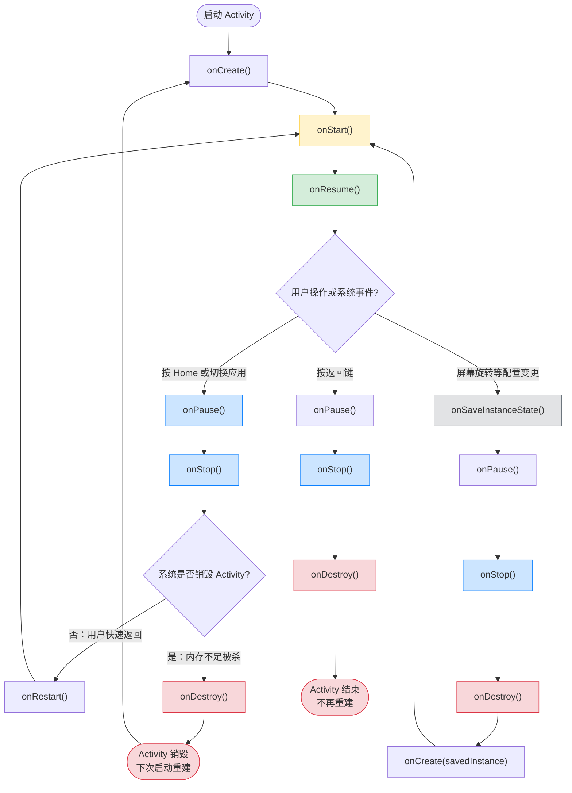

# 1.2 应用生命周期演进 —— 从哪里来，又要到哪里去

在 Android 开发中，很少有概念像“生命周期”这样，既是日常编码的起点，又是复杂问题的根源。我们已经对如何启动程序有了一定的了解，现在让我们来看看，在应用运行过程中，程序又有什么样的行为。

你可能早已熟记 onCreate()、onResume()、onPause() 的调用顺序，但当应用在折叠屏上切换形态、在后台被系统限制、或在返回手势预览时卡住，你会发现：仅靠记忆回调顺序远远不够。

因为我们不仅需要考虑回调的顺序，更要明白各个生命周期的作用是什么，这样才能在复杂场景下，正确处理应用的状态转换与数据的管理。

而到了现代的 Android 系统，应用生命周期的演进已经经历了多次迭代，Jetpack Compose 的推出，为我们带来了新的开发体验。但其运行仍然依托于传统的 Android 组件模型 —— Compose 界面的生命周期由其宿主 Activity 或 Fragment 决定，而系统对应用进程、后台行为、配置变更等的管控，依然通过底层生命周期机制进行。因此，理解传统生命周期，是正确使用 Compose 并处理复杂场景（如资源释放、后台任务、状态保存）的前提。

闲话不在赘述，让我们深入探讨一下安卓的生命周期，从传统生命周期开始，逐步了解其演进过程。

> 本节讲述范畴说明：
> 我们不在此详述每个组件的完整 API，而是聚焦于生命周期模型的本质特征、状态流转规则及其在典型场景下的行为表现，完整 API详见[第 3.1 节 四大组件深度解析](./3.1%20%E7%BB%84%E4%BB%B6%E5%8C%96%E6%9E%B6%E6%9E%84%E6%BC%94%E8%BF%9B.md)。

## 一、传统生命周期：回调然后回调

在 Android 的早期设计中，应用的运行状态完全由系统通过预定义的回调方法进行通知。开发者需在这些回调中手动管理资源的创建与释放、数据的保存与恢复。这套机制以 Activity、Service、BroadcastReceiver 和 ContentProvider 四大组件为核心，构成了 Android 应用生命周期管理的基础模型。

Activity 作为绑定视图，实现核心逻辑的程序入口，一个前台应用的生命周期伴随着 Activity 的创建、运行、暂停、停止、销毁等状态转换。

通常的生命周期回调顺序如下：

1. onCreate()：Activity 被创建时调用，初始化组件、设置布局等。
2. onStart()：Activity 对用户可见时调用，开始执行必要的操作。
3. onResume()：Activity 获得用户焦点时调用，开始与用户交互。
4. onPause()：Activity 失去用户焦点时调用，保存临时数据、释放资源。
5. onStop()：Activity 对用户不可见时调用，释放非必要资源。
6. onDestroy()：Activity 被销毁时调用，释放所有资源。

正常的启动流程就是 onCreate() -> onStart() -> onResume() -> 程序在前台运行，而如果用户切换到其他应用或返回桌面，系统会调用 onPause() -> onStop()。

Talk Is Cheap, Show You The Mermaid:



> ### 配置变更（Configuration Change）对生命周期的影响
>
> 在 Android 中，“配置变更”指的是设备运行时环境发生重大变化，例如：
>
> - 屏幕旋转（横屏 ↔ 竖屏）
> - 语言或区域设置更改
> - 键盘可用性变化（如折叠屏展开/合上）
> - 夜间模式切换
>
> 默认情况下，**一旦发生配置变更，系统会销毁当前 Activity 并立即重新创建它**。这意味着完整的生命周期流程会被执行：  
> `onPause()` → `onStop()` → `onDestroy()` → `onCreate()` → `onStart()` → `onResume()`
>
> 这种设计的初衷是让应用能根据新配置（如横屏布局）加载合适的资源。但副作用也很明显：
>
> - 如果未保存状态，用户输入或临时数据会丢失；
> - 频繁重建可能引发性能问题或闪烁。
>
> 为此，Android 提供了 `onSaveInstanceState(Bundle)` 回调，允许开发者在销毁前将轻量级状态（如文本框内容、滚动位置）存入 `Bundle`。在 `onCreate()` 或 `onRestoreInstanceState()` 中，可通过 `savedInstanceState` 参数恢复这些数据。
>
> **注意**：`onSaveInstanceState()` **不是**用于持久化数据（如数据库写入），它只适用于临时 UI 状态的快速恢复，且不保证一定被调用（如用户强制杀死应用）。

传统的 Android 生命周期完全依赖一套固定的回调方法。开发者必须在这些回调中手动管理资源的创建与释放、数据的保存与恢复，并准确记忆各种场景下的状态转换顺序。这不仅增加了认知负担，也容易因疏漏导致内存泄漏、界面异常或数据丢失等问题。

更复杂的是，随着 Fragment 等组件的引入，不同组件的生命周期并不完全一致——例如 Fragment 的生命周期嵌套在 Activity 之中，却又拥有独立的回调流程。开发者不得不在多个生命周期回调之间协调业务逻辑，使得代码耦合度高、难以维护，显著提升了开发和调试的复杂性。

**正因如此，Android 团队逐步推动生命周期管理从“被动响应回调”向“主动感知状态”演进。**

## 二、现代生命周期管理：从回调到感知

面对传统生命周期模型带来的耦合与复杂性，Android 团队在 Jetpack 架构组件中提出了一种全新的思路：**不再让开发者“被动响应”系统回调，而是让业务逻辑“主动感知”当前的生命周期状态**。

### 核心思想：生命周期感知（Lifecycle-aware）

在传统模式中，你必须在 `onStart()` 里启动某个监听器 `Listener`，在 `onStop()` 里手动停止它——一旦忘记，就可能造成内存泄漏或后台耗电。

而在现代模型中，你可以将这段逻辑封装在一个 **`LifecycleObserver`** 中，并将其注册到一个 **`LifecycleOwner`**（如 Activity 或 Fragment）上。系统会自动在合适的时机通知该观察者：“现在进入 STARTED 状态”或“即将进入 DESTROYED 状态”，由观察者决定如何响应。

> **关键转变**：  
> 传统：_“我在哪个回调里？该做什么？”_  
> 现代：_“我的宿主处于什么状态？我是否应该运行？”_

#### eg.1 传统模式（手动管理，易出错）

```kotlin
class MainActivity : AppCompatActivity() {

    private var locationListener: LocationListener? = null

    override fun onStart() {
        super.onStart()
        locationListener = LocationListener()
        locationListener?.start() // 启动监听
    }

    override fun onStop() {
        super.onStop()
        locationListener?.stop()  // 停止监听
        locationListener = null   // 防止泄漏
    }
}
```

> 风险：若忘记在 `onStop()` 中停止或置空，可能造成内存泄漏或后台持续耗电。

#### eg.2 现代模式（自动绑定生命周期）

```kotlin
class MainActivity : AppCompatActivity() {

    override fun onCreate(savedInstanceState: Bundle?) {
        super.onCreate(savedInstanceState)
        // 将监听器注册为 LifecycleObserver
        lifecycle.addObserver(LocationListener())
    }
}

// 观察者自动响应生命周期
class LocationListener : DefaultLifecycleObserver {

    override fun onStart(owner: LifecycleOwner) {
        Log.d("Location", "开始监听")
        // 启动监听逻辑
    }

    override fun onStop(owner: LifecycleOwner) {
        Log.d("Location", "停止监听")
        // 停止监听逻辑
    }
}
```

> 优势：无需在 Activity 中写启动/停止逻辑，自动随生命周期回调，解耦且安全。

这么看着好像没有什么大的区别，代码量可能还没少多少。但我们仔细观察，可以发现不同:
传统方法，类的生命周期由他的宿主管理。我们需要手动的创建与销毁，防止内存泄漏。而现代方法，将类的生命周期的逻辑迁移到了类的内部，类通过持有 `LifecycleOwner` 来感知宿主的生命周期状态。

### 与传统回调的关系：不是替代，而是封装

需要明确的是，**Jetpack 的生命周期组件并没有绕过系统回调**。它的底层依然依赖于 Activity/Fragment 的 `onCreate()`、`onStart()` 等方法。  
区别在于：**Jetpack 在这些回调内部自动更新了一个 `Lifecycle` 对象的状态，并通知所有注册的观察者**。

例如，当系统调用 `Activity.onStart()` 时，Jetpack 会：

1. 将内部 `Lifecycle` 的状态从 `CREATED` 切换为 `STARTED`；
2. 遍历所有已注册的 `LifecycleObserver`；
3. 调用它们中标记了 `@OnLifecycleEvent(Lifecycle.Event.ON_START)` 的方法（或通过 `DefaultLifecycleObserver` 接口）。

换句话说，**新的生命周期管理是对传统回调的“抽象封装”和“事件分发”**，而非另起炉灶。它把原本分散在各个回调中的逻辑，集中到关注自身状态的组件中，实现了关注点分离。

### 底层实现简析：状态机 + 观察者模式

Jetpack Lifecycle 的核心是一个**有限状态机（Finite State Machine）**：

- 定义了 `INITIALIZED`、`CREATED`、`STARTED`、`RESUMED`、`DESTROYED` 等状态；
- 每个系统回调（如 `onResume()`）会触发状态迁移；
- 所有 `LifecycleObserver` 作为监听者，订阅状态变化。

```kotlin
class MyObserver : DefaultLifecycleObserver {
    override fun onStart(owner: LifecycleOwner) {
        // 自动在宿主 onStart() 后调用
        startLocationUpdates()
    }

    override fun onStop(owner: LifecycleOwner) {
        // 自动在宿主 onStop() 前调用
        stopLocationUpdates()
    }
}

// 使用
lifecycle.addObserver(MyObserver())
```

开发者无需关心 `onStart()` 何时被调用，只需声明“当生命周期进入 STARTED 时，我要做什么”。框架负责确保：

- 不在 `DESTROYED` 状态后调用任何方法；
- 自动处理配置变更、重建等复杂场景；
- 避免因忘记注销导致的内存泄漏。、

### 用法的迁移

哪怕是“最新”、“最潮”的现代式生命周期管理，也并非一蹴而就——它经历了从**反射驱动**到**编译期安全**的演进。

最早的做法是基于注解的方案，通过使用 `@OnLifecycleEvent` 注解，将回调逻辑直接写在类中。

```kotlin
class MyObserver : LifecycleObserver {
    @OnLifecycleEvent(Lifecycle.Event.ON_START)
    fun startLocationUpdates() {
        // 开始监听位置更新
    }

    @OnLifecycleEvent(Lifecycle.Event.ON_STOP)
    fun stopLocationUpdates() {
        // 停止监听位置更新
    }
}
```

这样的做法，存在以下主要问题：

- **反射性能开销大**  
  注解方法在运行时需要通过反射机制解析和调用。每当生命周期事件触发时，系统都要遍历相关方法、校验注解，频繁回调下会带来明显的性能损耗。

- **类型不安全**  
  方法签名（参数、返回值）如果写错，编译期间无法发现，只能等到运行时发生异常，调试和定位难度较高。

- **混淆兼容性差**  
  在使用 ProGuard 或 R8 进行混淆时，如果遗漏了相关 `-keep` 规则，注解方法名可能被混淆，从而导致反射失效，回调会“静默失败”，且不易发现。

- **维护成本高**  
  回调逻辑分散在多个注解方法中，缺乏接口契约的限制，重构和维护时容易遗漏或出错，代码可读性和一致性较差。

为了解决这个问题，Google 引入了 `DefaultLifecycleObserver` 接口。它定义了 `onCreate()`、`onStart()`、`onResume()`、`onPause()`、`onStop()`、`onDestroy()` 等方法，分别对应生命周期的每个状态。

```kotlin
class MyObserver : DefaultLifecycleObserver {
    override fun onStart(owner: LifecycleOwner) {
        // 开始监听位置更新
    }

    override fun onStop(owner: LifecycleOwner) {
        // 停止监听位置更新
    }
}
```

### 小结：从“写在回调里”到“绑定到状态上”

现代生命周期管理的本质，是将**时间驱动的回调逻辑**，转变为**状态驱动的声明式行为**。它没有消除生命周期，而是**让生命周期变得可观察、可组合、可测试**，从而大幅降低开发心智负担。

而这，正是 Jetpack ViewModel、LiveData、Compose 等现代 Android 开发范式得以安全运行的基础。

## 三、Jetpack 生命周期组件实践

- ViewModel：生命周期安全的状态持有（对比传统 onSaveInstanceState）
- LiveData：自动注册/注销的观察者模式
- 与 Activity/Fragment 的集成
- 在 Compose 中的使用（简要呼应前文）

## 四、未来演进：Predictive Back 与跨设备挑战

- Android 15+ Predictive Back 如何改变 onPause/onStop 语义
- 折叠屏、多窗口下的生命周期新行为
- 后台限制持续收紧对资源管理的影响

## 五、总结
