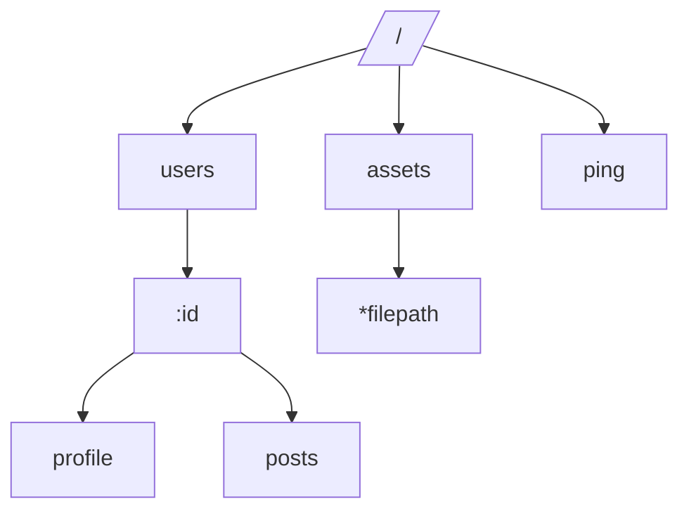

# Gin 框架的使用与实践

开始之前，先推荐一下我学习参考的[官方文档](https://gin-gonic.com/zh-cn/docs/)。这里主要分享我个人的理解，如有不准确的地方，欢迎指正。

## 安装与快速开始

下载 Gin：

```bash
go get -u github.com/gin-gonic/gin
```

使用 Gin 创建一个简单的 HTTP 服务器：

```go
package main

import (
  "github.com/gin-gonic/gin"
  "net/http"
)

func main(){
  r := gin.Default() // 创建一个默认的 Gin 引擎

  // 配置一个简单的 GET 路由
  // 通过 r.GET 方法注册一个 GET 请求的路由，第一个参数是路由路径，第二个参数是处理函数
  // gin.Context 是 Gin 中处理请求和响应的核心对象，封装了 http.Request 和 http.ResponseWriter
  r.GET("/ping", func(c *gin.Context) {
    // 写回 JSON 响应
    // 这里使用了http的状态码常量 http.StatusOK - 200
    // 使用 gin.H 作为快捷方式创建一个 map[string]interface{} 的 JSON 响应体
    // c.JSON 方法会将这个 map 序列化为 JSON 格式，并设置 Content-Type 为 application/json
    // 然后写入 HTTP 响应体中
    c.JSON(http.StatusOK, gin.H{
      "message": "pong",
    })
  })

  r.Run() // 开启服务器，默认监听在 8080 端口,也可指定端口号，例如 r.Run(":8081")
}
```

然后 `go run main.go`，访问 `http://localhost:8080/ping` 就能看到响应了。

## 响应方法

Gin 是类似于 Express.js 的 Web 框架，提供了直接且易于使用的 API 来处理 HTTP 请求和响应。常用的响应方法包括：

- `r.GET("/path", handler)`：注册一个 GET 请求的路由。
- `r.POST("/path", handler)`：注册一个 POST 请求的路由。
- `r.PUT("/path", handler)`：注册一个 PUT 请求的路由。
- `r.DELETE("/path", handler)`：注册一个 DELETE 请求的路由。
- `r.HEAD("/path", handler)`：注册一个 HEAD 请求的路由，通常情况下我们更可能使用上面的四个方法来处理常见的 RESTful API 请求。 `HEAD` 方法主要用于获取资源的元信息，通常不返回响应体。
- `r.PATCH("/path", handler)`：注册一个 PATCH 请求的路由，通常用于部分更新资源。
- `r.OPTIONS("/path", handler)`：注册一个 OPTIONS 请求的路由，通常用于 CORS 预检请求。

特别的：

- `r.Any("/path", handler)`：注册一个路由，匹配所有 HTTP 方法。
- `r.Handle("METHOD", "/path", handler)`：注册一个路由，指定 HTTP 方法。

## 路径匹配

在匹配方法后，Gin 支持两种类型的路径参数，让你可以直接从 URL 中捕获值：

`:name` —— 匹配单个路径段。例如，/user/:name 匹配 /user/john，但不匹配 /user/ 或 /user。
`*action` —— 匹配前缀之后的所有内容，包括斜杠,捕获的值包含前导 /。注意：在这里，它会匹配路径中剩余的部分，包括斜杠，即 `/user/john/send` 中的 `/send`。

路由的作用是将请求的 URL 与对应的处理函数关联起来。当一个请求到达服务器时，Gin 会根据请求的 URL 和 HTTP 方法来查找匹配的路由，并调用对应的处理函数来处理请求。

Gin 框架的路由是基于http-router实现的，http-router是一个高性能的HTTP请求路由器，使用了前缀树（trie）数据结构来存储路由信息。

前缀树是一种树形数据结构，适用于存储字符串集合。在http-router中，每个节点代表一个路径段，边代表路径段之间的关系。通过这种结构，http-router能够快速地匹配请求路径，并且支持动态参数和通配符。

通过压缩相同的前缀，可以进一步优化前缀树的性能，这就是 Radix Tree 的概念。通过合并具有相同前缀的节点来减少树的深度，从而提高查询效率。

一般来说，Gin 的路由匹配会维护一个包含所有方法的切片，每个方法对应一个前缀树。当请求到达时，Gin 会根据请求的方法选择对应的前缀树进行匹配，从而快速找到处理函数。

前缀树结构可以简化的看为：


