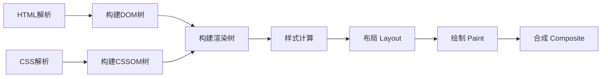

# HTML 深度解析：从语义化到浏览器渲染

## HTML 是 Web 的基石

每个网页都始于一个 HTML 文档。下面是一个符合现代标准的 HTML5 骨架：

```html
<!DOCTYPE html>
<html lang="zh-CN">
  <head>
     
    <meta charset="UTF-8" />
     
    <meta name="viewport" content="width=device-width, initial-scale=1.0" />
     
    <title>页面标题</title>
  </head>
  <body>
     
    <header>
         
      <h1>网站标题</h1>
       
    </header>
     
    <main>
         
      <p>页面主要内容</p>
       
    </main>
     
    <footer>
         
      <p>版权信息</p>
       
    </footer>
  </body>
</html>
```

这个看似简单的结构，承载了 Web 的核心价值：**内容的结构化表达**。HTML（HyperText Markup Language）不是编程语言，而是一种标记语言，

它的核心使命是**定义内容的结构和语义**，而非控制外观或行为。CSS 负责样式，JavaScript 负责交互，而 HTML 是这一切的基础。

当浏览器接收到这个 HTML 文档时，会经历一系列复杂过程：解析、构建 DOM 树、计算样式、布局、绘制，最终呈现为用户可见的页面。理解 HTML 不仅是掌握标签用法，更是理解 Web 的运行机制。

下面就让我们一起来看看这个html文件里面包含了什么内容。

---

## 1. DOCTYPE 与文档模式

### 1.1 DOCTYPE 的本质作用

DOCTYPE 声明位于 HTML 文档的第一行，用于告知浏览器使用哪种文档类型定义（DTD）来解析页面。其核心作用是**触发浏览器的渲染模式**：

- **标准模式（Standards Mode）**：遵循 W3C 规范渲染页面
- **怪异模式（Quirks Mode）**：模拟旧版浏览器（如 IE5）的行为，用于兼容遗留页面

```html
<!DOCTYPE html>
```

### 1.2 文档模式演进

HTML 标准经历了多次演进，DOCTYPE 声明也随之变化：

| 标准版本               | DOCTYPE 声明                                                                                                    | 特点                                        |
| ---------------------- | --------------------------------------------------------------------------------------------------------------- | ------------------------------------------- |
| HTML 4.01 Strict       | `<!DOCTYPE HTML PUBLIC "-//W3C//DTD HTML 4.01//EN" "http://www.w3.org/TR/html4/strict.dtd">`                    | 禁用表现性标签（如 `<font>`），强制使用 CSS |
| HTML 4.01 Transitional | `<!DOCTYPE HTML PUBLIC "-//W3C//DTD HTML 4.01 Transitional//EN" "http://www.w3.org/TR/html4/loose.dtd">`        | 允许旧式标签，用于过渡期                    |
| XHTML 1.0              | `<!DOCTYPE html PUBLIC "-//W3C//DTD XHTML 1.0 Strict//EN" "http://www.w3.org/TR/xhtml1/DTD/xhtml1-strict.dtd">` | 要求严格的 XML 语法（标签闭合、属性引号）   |
| HTML5                  | `<!DOCTYPE html>`                                                                                               | 简化声明，向后兼容，不基于 SGML             |

### 1.3 怪异模式的核心差异

当缺少 DOCTYPE 或使用不完整声明时，浏览器进入怪异模式，主要差异包括：

1. **盒模型计算**：
     - 标准模式：`width = 内容宽度`，总宽度 = width + padding + border + margin
     - 怪异模式：`width = 内容 + padding + border`，总宽度 = width + margin

2. **字体继承**：
     - `<table>` 在怪异模式下不继承父元素字体大小

3. **行内元素尺寸**：
     - 怪异模式下可为 `<span>` 等行内元素设置 width/height

4. **百分比高度**：
     - 怪异模式下子元素 height:100% 可能在父元素无明确高度时生效

**验证方法**：在控制台执行 `document.compatMode`，返回 `"CSS1Compat"` 为标准模式，`"BackCompat"` 为怪异模式。

---

## 2. 语义化标签

### 2.1 语义化的本质价值

语义化标签通过标签名称表达内容的含义，而非仅依赖 CSS 类名。其价值远超 SEO：

1. **无障碍支持（a11y）**：
     - 屏幕阅读器（如 VoiceOver）识别 `<nav>` 为导航区域，`<main>` 为主内容
     - 语义结构帮助视障用户理解页面布局

2. **开发者体验**：
     - 代码自解释，减少注释依赖
     - 团队协作时降低理解成本

3. **工具兼容性**：
     - 浏览器阅读模式（Safari Reader）依赖 `<article>` 提取正文
     - 爬虫更准确识别内容层级

4. **未来兼容性**：
     - 新设备/浏览器可基于语义提供增强体验

### 2.2 核心语义标签解析

#### 2.2.1 结构标签

| 标签        | 语义           | 使用建议                 | 默认样式         |
| ----------- | -------------- | ------------------------ | ---------------- |
| `<header>`  | 页面或区块头部 | 可包含 logo、主导航      | `display: block` |
| `<nav>`     | 导航链接区域   | 仅用于主导航，非次要链接 | `display: block` |
| `<main>`    | 主要内容区域   | 每页唯一，不重复         | `display: block` |
| `<article>` | 独立可分发内容 | 博客文章、新闻、评论     | `display: block` |
| `<section>` | 主题相关区块   | 通常有标题，非样式分组   | `display: block` |
| `<aside>`   | 附属内容       | 侧边栏、广告、相关链接   | `display: block` |
| `<footer>`  | 页面或区块底部 | 版权、联系方式           | `display: block` |

**使用原则**：

- 仅当内容符合语义时使用对应标签
- 不确定时用 `<div>` 作为无语义容器
- 避免过度嵌套：`<article>` 内可包含 `<section>`，但反之不常见

#### 2.2.2 文本标签

| 标签           | 语义       | 替代方案                 | 注意事项                   |
| -------------- | ---------- | ------------------------ | -------------------------- |
| `<h1>`-`<h6>`  | 标题层级   | 避免跳级（h1 后直接 h3） | h1 应唯一，代表页面主题    |
| `<p>`          | 段落       | 长文本必须用，非样式分组 | 上下 margin 由 UA 样式定义 |
| `<strong>`     | 重要内容   | 代替 `<b>`（无语义）     | 默认加粗，传达重要性       |
| `<em>`         | 强调语气   | 代替 `<i>`（无语义）     | 默认斜体，传达强调         |
| `<blockquote>` | 引用区块   | 配合 `<cite>` 标注来源   | 左右缩进，通常有 margin    |
| `<code>`       | 行内代码   | 技术文档必备             | 等宽字体，无换行           |
| `<pre>`        | 预格式文本 | 代码块、诗歌             | 保留空格/换行，等宽字体    |

### 2.3 语义化与样式的关系

**常见误解**：语义化标签自带特殊样式。实际上：

- 大多数结构标签（`<header>`, `<nav>`, `<main>` 等）默认样式仅为 `display: block`
- 样式差异主要来自浏览器默认样式表（User Agent Stylesheet）
- 开发者可通过 CSS 重置样式，但**不应因样式选择标签**

**验证方法**：在 DevTools 中检查元素，查看 "user agent stylesheet" 部分。

---

## 3. 表单系统

### 3.1 表单基础结构

```html
<form action="/submit" method="POST" novalidate>
   <label for="email">邮箱：</label>  <input
    type="email"
    id="email"
    name="email"
    required
  />
     <button type="submit">提交</button>  <button
    type="button"
    onclick="resetForm()"
  >
    取消
  </button>
</form>
```

### 3.2 核心概念解析

#### 3.2.1 `id` vs `name`

| 属性   | 作用域   | 用途                                      | 唯一性要求                         |
| ------ | -------- | ----------------------------------------- | ---------------------------------- |
| `id`   | 全局文档 | JavaScript 操作、CSS 选择、`<label>` 关联 | 必须全局唯一                       |
| `name` | 表单内部 | 表单提交时的字段名（key）                 | 表单内应唯一（非强制，但强烈建议） |

**关键区别**：

- 无 `name` 属性的字段**不会提交**给服务器
- `id` 用于前端交互，`name` 用于后端数据接收
- 示例：`<input id="userEmail" name="email">` 提交后数据为 `{ email: "value" }`

#### 3.2.2 `action` 执行机制

1. **数据收集**：浏览器收集所有带 `name` 属性的表单控件值
2. **数据编码**：
     - GET 方法：拼接到 URL 后（`?email=xxx&pwd=yyy`）
     - POST 方法：放在请求体中（格式由 `enctype` 决定）
3. **发起请求**：向 `action` 指定的 URL 发送 HTTP 请求
4. **页面跳转**：**默认行为是跳转到响应页面**（即使返回 JSON）

**阻止跳转**：通过 JavaScript 拦截提交

```javascript
form.addEventListener("submit", (e) => {
  e.preventDefault(); // 阻止默认跳转
  fetch("/api/submit", { method: "POST", body: new FormData(form) });
});
```

#### 3.2.3 按钮类型

| 类型     | 行为         | 使用场景                    | 默认值                        |
| -------- | ------------ | --------------------------- | ----------------------------- |
| `submit` | 提交表单     | 主要操作按钮                | `<button>` 无 type 时的默认值 |
| `button` | 无默认行为   | 需 JavaScript 绑定的操作    | 需显式声明                    |
| `reset`  | 重置到初始值 | 避免使用（UX 差，易误操作） | 需显式声明                    |

**最佳实践**：表单内所有非提交按钮必须声明 `type="button"`，防止意外提交。

### 3.3 HTML5 表单增强

- **输入类型**：`email`, `url`, `number`, `date`, `color`, `range`
   - 触发移动端专属键盘
   - 提供基础验证（但需后端二次验证）
- **验证属性**：`required`, `pattern`, `min`, `max`, `step`
- **数据列表**：`<datalist>` 提供自动完成建议
- **进度指示**：`<progress>` 和 `<meter>` 显示状态

---

## 4. Meta 标签体系

### 4.1 核心 Meta 标签

| 标签                                                                     | 作用         | 必要性   | 最佳实践                                       |
| ------------------------------------------------------------------------ | ------------ | -------- | ---------------------------------------------- |
| `<meta charset="UTF-8">`                                                 | 声明字符编码 | **必须** | 放在 `<head>` 顶部，防止乱码                   |
| `<meta name="viewport" content="width=device-width, initial-scale=1.0">` | 移动端适配   | **必须** | 禁用缩放（`user-scalable=no`）慎用，影响无障碍 |
| `<meta name="description" content="...">`                                | 页面摘要     | 强烈建议 | ≤160 字符，每页唯一，精准描述内容              |
| `<meta name="theme-color" content="#3b82f6">`                            | 主题色       | 可选     | Android Chrome 地址栏颜色                      |

### 4.2 `rel` 属性深度解析

`rel`（relationship）定义当前文档与链接资源的关系，核心值包括：

| `rel` 值     | 作用       | 资源类型     | 后续使用方式                                        |
| ------------ | ---------- | ------------ | --------------------------------------------------- |
| `stylesheet` | CSS 样式   | CSS 文件     | 自动应用样式                                        |
| `icon`       | 网站图标   | ICO/PNG/SVG  | 显示在标签页/书签                                   |
| `preload`    | 预加载资源 | 任意关键资源 | **需手动使用**（如通过 `<script>` 或 `@font-face`） |
| `preconnect` | 预连接     | 域名         | 优化后续请求（DNS/TLS 连接）                        |
| `canonical`  | 规范 URL   | 本页标准 URL | SEO 用途，不影响渲染                                |
| `manifest`   | PWA 清单   | JSON 文件    | 启用 PWA 功能（安装/离线）                          |

### 4.3 `preload` 机制详解

```html
<link
  rel="preload"
  href="/font.woff2"
  as="font"
  type="font/woff2"
  crossorigin
/>
```

**工作流程**：

1. **提前下载**：在 HTML 解析初期并行下载资源
2. **缓存资源**：存储在内存缓存中
3. **手动使用**：通过其他方式消费资源：
     - CSS：`<link rel="stylesheet" href="/critical.css">`
     - 字体：`@font-face { src: url('/font.woff2') }`
     - JS：`<script src="/main.js"></script>`
     - 图片：``

**关键属性**：

- `as`：指定资源类型，决定请求优先级和处理方式
- `crossorigin`：跨域资源必须添加（即使同源字体也需要）
- `type`：MIME 类型，浏览器可跳过不支持格式

**常见错误**：

- 未使用预加载资源（Lighthouse 警告）
- 缺少 `as` 属性（浏览器无法正确处理）
- 字体未加 `crossorigin`（导致重复下载）

---

## 5. PWA 集成

### 5.1 PWA 核心能力

渐进式 Web 应用（PWA）通过现代 Web 技术提供类原生体验：

- **离线访问**：无网络时仍可使用核心功能
- **桌面安装**：生成主屏幕图标，独立窗口打开
- **全屏体验**：无浏览器 UI 干扰
- **推送通知**：后台消息提醒
- **后台同步**：网络恢复后自动同步数据

### 5.2 HTML 集成方案

#### 5.2.1 Web App Manifest

```json
{
  "name": "我的应用",
  "short_name": "App",
  "start_url": "/",
  "display": "standalone",
  "background_color": "#ffffff",
  "theme_color": "#3b82f6",
  "icons": [
    {
      "src": "/icon-192.png",
      "sizes": "192x192",
      "type": "image/png"
    }
  ]
}
```

HTML 声明：

```html
<link rel="manifest" href="/manifest.json" />
<meta name="theme-color" content="#3b82f6" />
```

#### 5.2.2 Service Worker 注册

```html
<script>
  if ("serviceWorker" in navigator) {
    window.addEventListener("load", () => {
      navigator.serviceWorker
        .register("/service-worker.js")
        .then((registration) => {
          console.log("SW registered:", registration.scope);
        })
        .catch((error) => {
          console.log("SW registration failed:", error);
        });
    });
  }
</script>
```

### 5.3 Service Worker 核心机制

```javascript
// service-worker.js
const CACHE_NAME = "my-pwa-v1";
const urlsToCache = ["/", "/index.html", "/styles.css", "/app.js"];

// 安装阶段：预缓存资源
self.addEventListener("install", (event) => {
  event.waitUntil(
    caches.open(CACHE_NAME).then((cache) => cache.addAll(urlsToCache)),
  );
});

// 拦截请求：优先使用缓存
self.addEventListener("fetch", (event) => {
  event.respondWith(
    caches
      .match(event.request)
      .then((response) => response || fetch(event.request)),
  );
});
```

**生命周期**：

1. **安装（install）**：预缓存关键资源
2. **激活（activate）**：清理旧缓存
3. **获取（fetch）**：拦截网络请求，实现离线策略

---

## 6. HTML 解析算法与容错机制

### 6.1 解析流程

浏览器 HTML 解析器遵循 HTML5 规范，处理过程分为：

1. **字节流解码**：根据 `<meta charset>` 或 HTTP 头确定编码
2. **标记化（Tokenization）**：将字符流转换为标记（tokens）
3. **树构建（Tree Construction）**：根据标记构建 DOM 树

### 6.2 容错机制

HTML 设计为宽容解析，自动修复常见错误：

1. **未闭合标签**：

```html
<p>段落1</p>
<p>段落2</p>
```

浏览器自动修复为：

```html
<p>段落1</p>
<p>段落2</p>
```

2. **错误嵌套**：

```html
<p><div>内容</div></p>
```

浏览器修复为：

```html
<p></p>
<div>内容</div>
<p></p>
```

3. **表格自动补全**：

```html
<table>
  <tr>
    <td>单元格</td>
  </tr>
</table>
```

浏览器自动插入 `<tbody>`：

```html
<table>
  <tbody>
    <tr>
      <td>单元格</td>
    </tr>
  </tbody>
</table>
```

### 6.3 阻塞行为

某些元素会阻塞 HTML 解析：

- **同步脚本**：无 `async`/`defer` 的 `<script>` 暂停解析，直到下载执行完成
- **样式表**：`<link rel="stylesheet">` 不阻塞 DOM 构建，但阻塞渲染（FOUC 防护）

**优化策略**：

- 关键 CSS 内联
- 非关键 JS 添加 `async`/`defer`
- 使用 `preload` 提前加载关键资源

---

## 7. DOM 构建与浏览器渲染

### 7.1 DOM 本质

DOM（Document Object Model）是 HTML 文档的**内存对象表示**，具有：

- **树状结构**：节点分层组织（父/子/兄弟关系）
- **API 接口**：提供操作方法（`getElementById`, `appendChild` 等）
- **与 HTML 独立**：DOM 可由非 HTML 源构建（如 XML）

### 7.2 构建过程

1. **创建根节点**：`document` 对象
2. **逐节点处理**：
     - 元素节点：`<div>` → `HTMLDivElement`
     - 属性节点：`id="main"` → `Attr` 对象
     - 文本节点：`Hello` → `Text` 节点
3. **建立关系**：设置 `parentNode`, `childNodes`, `nextSibling` 等引用

### 7.3 渲染流水线

HTML 解析只是渲染流程的起点：



**关键阶段**：

1. **样式计算**：合并 CSS 规则，计算最终样式
2. **布局（Layout）**：计算元素几何位置（触发回流）
3. **绘制（Paint）**：填充像素（触发重绘）
4. **合成（Composite）**：分层处理，GPU 加速

### 7.4 关键渲染路径优化

1. **最小化关键资源**：

- 内联关键 CSS
- 异步加载非关键 JS

2. **优化资源加载顺序**：

- `<link rel="preload">` 预加载关键资源
- `preconnect` 预连接第三方域名

3. **减少 DOM 复杂度**：

- 避免深层嵌套
- 减少不必要的节点

---

## 8. 总结与最佳实践

### 8.1 HTML 开发原则

1. **语义优先**：选择最能表达内容含义的标签
2. **渐进增强**：核心内容不依赖 JS/CSS
3. **无障碍基础**：`alt` 属性、`label` 关联、ARIA 角色
4. **性能意识**：关键资源预加载，减少阻塞

HTML 作为 Web 的基石，其设计哲学是**内容优先、渐进增强、设备无关**。掌握其深层原理，不仅是为了写出合规代码，更是为了构建可访问、高性能、可持续维护的 Web 应用。
当我们在框架和工具的浪潮中前行时，不要忘记：所有炫酷的交互，都始于一个结构良好的 HTML 文档。
