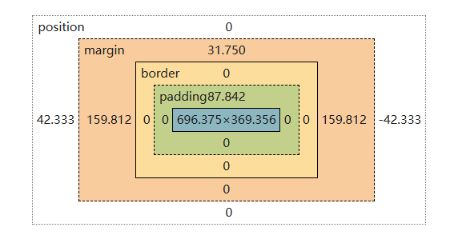

# 📐 CSS 的知识体系：布局革命与性能优化

在我们用html写出一个简单的网页后，往往发现界面的元素往往遵循其默认的样式设置，不仅不好看，而且往往杂乱无章。

CSS (Cascading Style Sheets 层叠样式表) 是用来描述 HTML 文档外观和格式的样式语言。通过 CSS，我们可以控制网页的布局、颜色、字体、间距等视觉效果，从而提升用户体验和界面美感。

下面我们将由浅入深的深入 CSS 的世界。

## **一、基础语法与选择器**

### 1. **CSS 语法结构与引入方式**

CSS 的基本语法由 **选择器（Selector）** 和 **声明块（Declaration Block）** 构成：

```css
selector {
  property: value;
  property: value;
}
```

**引入 CSS 到 HTML 的三种方式：**

- **内联样式**（Inline）：直接写在 HTML 元素的 `style` 属性中（不推荐，维护性差）。

```html
  <p style="color: red;">文本</p>
 ```

- **内部样式表**（Internal）：在 `<head>` 中使用 `<style>` 标签。

```html
  <style>
    p { color: red; }
  </style>
```

- **外部样式表**（External）：通过 `<link>` 引入独立 `.css` 文件（推荐，可复用、易维护）。

```html
  <link rel="stylesheet" href="style.css">
```

---

### 2. **基础选择器**

- **元素选择器**（Type Selector）：选中所有指定 HTML 标签。

```css
  p { /* 所有 <p> 元素 */ }
```

- **类选择器**（Class Selector）：以 `.` 开头，选中具有指定 `class` 的元素（可复用）。

```css
  .highlight { /* 所有 class="highlight" 的元素 */ }
```

- **ID 选择器**：以 `#` 开头，选中 `id` 唯一的元素（页面中应唯一）。

```css
  #header { /* id="header" 的元素 */ }
```

- **通配符选择器**（Universal Selector）：`*` 匹配所有元素（慎用，性能较低）。

```css
  * { margin: 0; padding: 0; }
```

### 3. **复合与伪类/伪元素选择器**

- **复合选择器**：组合多个选择器实现更精确匹配。
  - 后代选择器：`div p`（div 内所有 p）
  - 子选择器：`div > p`（div 的直接子 p）
  - 相邻兄弟：`h1 + p`
  - 通用兄弟：`h1 ~ p`

- **伪类选择器**（Pseudo-classes）：描述元素的**状态**。

  ```css
  a:hover    /* 鼠标悬停 */
  li:nth-child(2) /* 第二个子元素 */
  input:focus /* 获得焦点时 */
  ```

- **伪元素选择器**（Pseudo-elements）：创建**不在文档中的虚拟内容**。

  ```css
  p::before   /* 在 p 内容前插入内容 */
  p::first-line /* 选中第一行 */
  ::selection   /* 选中文本的样式 */
  ```

  > 注意：伪元素使用 **双冒号 `::`**（CSS3 标准），但为兼容旧代码，单冒号 `:` 仍被支持。

---

### 4. **选择器优先级与层叠规则（Cascading）**

当多个规则作用于同一元素时，浏览器通过 **层叠（Cascading）** 决定最终样式，核心依据是 **优先级（Specificity）** 和 **来源顺序**。

#### **优先级计算**

| 类型 | 权重（近似值） |
| ------ | ---------------- |
| `!important` | 最高（应避免滥用） |
| **内联样式** | 1000 |
| **ID 选择器** | 100 |
| **类、属性、伪类** | 10 |
| **元素、伪元素** | 1 |
| **通配符、继承** | 0 |

> 示例：
> `#nav .item:hover` → 100 (ID) + 10 (class) + 10 (pseudo-class) = **120**

#### **层叠规则（Cascading Order）**

若优先级相同，则按以下顺序决定胜出者：

1. **来源顺序**：后出现的样式覆盖先出现的（在相同文件或引入顺序下）。
2. **来源类型**：用户自定义样式 < 作者样式 < 浏览器默认样式（但 `!important` 可打破顺序）。
3. **继承**：部分属性（如 `color`, `font`）会从父元素继承，但优先级极低。

> 💡 **最佳实践**：
>
> - 尽量使用类选择器，避免过度依赖 ID 或 `!important`。
> - 保持选择器简洁（如 `.btn-primary` 而非 `div#sidebar ul li a.button`）。

---

这一部分构成了 CSS 的“语法地基”。掌握它，你就能精准地选中元素并为其赋予样式，为后续布局与交互打下坚实基础。

## **二、盒模型与视觉格式化**

一般来说在html的元素都可以看作一个矩形盒子，CSS 通过**盒模型**定义了元素的尺寸和布局方式。

可以通过浏览器的`F12`开发者工具查看元素的盒模型构成，如下图所示：



### 1. **标准盒模型 vs 怪异盒模型（`box-sizing`）**

每个元素都可以看作一个矩形盒子，默认由四层组成：

- `content`（内容区 - 蓝色）
- `padding`（内边距）
- `border`（边框）
- `margin`（外边距）

`position` 是在元素采用绝对定位时，元素相对于哪个参照物进行定位的属性。

#### **标准盒模型（content-box，默认）**

在标准盒模型里，`width` / `height` 只作用于内容区。

```css
.card {
  width: 300px;
  padding: 20px;
  border: 2px solid #333;
}
```

此时元素实际占据宽度：

$$300 + 20 \times 2 + 2 \times 2 = 344\text{px}$$

我们需要手动计算 `padding` 和 `border` 的尺寸，才能知道元素的总占用空间。

#### **怪异盒模型（border-box）**

在 `border-box` 下，`width` / `height` 包含了 `content + padding + border`，可以理解为边框内部的总宽度，更符合直觉，但也需要注意 `padding` 和 `border` 的尺寸会挤压内容区，对计算带了新的负担。

如果你想使用 `border-box`，可以全局设置：

```css
* {
  box-sizing: border-box;
}
```

> 这也是工程里常见的“全局重置”之一，能显著降低宽度计算心智负担。

特别的，在不使用html5的标签时，浏览器会默认使用怪异盒模型，在较早的浏览器中，如 ie 6 就是默认的怪异盒模型，这也是为什么在早期开发中需要使用 `<!DOCTYPE html>` 来触发标准模式，避免怪异盒模型带来的布局问题。

---

### 2. **外边距合并（Margin Collapsing）**

CSS 中的外边距合并（Margin Collapsing），也叫外边距塌陷，是一个很容易让人困惑的布局特性。

简单来说：当两个垂直方向的外边距相遇时，它们不会累加，而会合并成一个外边距，大小取两者中的较大值。

#### **一、发生合并的三个典型场景**

1. **相邻兄弟元素（Adjacent Siblings）**

当前一个块级元素紧跟着后一个块级元素时，前者的 `margin-bottom` 和后者的 `margin-top` 会合并。

```css
.box-a {
  margin-bottom: 20px;
}

.box-b {
  margin-top: 30px;
}
```

结果：两者之间间距是 30px，而不是 50px。

2. **父子元素（Parent and Child）**

这是最常见的“踩坑点”。当父元素没有 `border-top`、`padding-top`，且父子之间没有行内内容分隔时，第一个子元素的 `margin-top` 可能“穿透”到父元素外部。

同理：父元素没有 `border-bottom`、`padding-bottom` 时，最后一个子元素的 `margin-bottom` 也可能向外合并。

```css
.parent {
  background: #f8fafc;
}

.child {
  margin-top: 20px;
}
```

结果：看起来像是父元素整体被向下推开，而不是子元素在父元素内部下移。

3. **空块级元素（Empty Block）**

如果一个块级元素没有内容、没有边框、没有内边距，那么它的 `margin-top` 和 `margin-bottom` 也可能发生合并。

```css
.empty {
  margin-top: 20px;
  margin-bottom: 30px;
}
```

结果：空盒子的垂直间距表现为 30px，而不是 50px。

#### **二、发生合并的必要条件**

只有同时满足下列条件，外边距合并才会发生：

- 必须是垂直方向：只有 `margin-top` / `margin-bottom` 会合并，`margin-left` / `margin-right` 不会合并。
- 必须是普通流中的块级盒子（Normal Flow）。
- 中间没有阻隔：两个 margin 之间没有 `border`、`padding`、行内内容等分隔。

另外有几个常见“不会合并”的情况：

- 浮动元素（`float`）不会发生外边距合并。
- 绝对定位/固定定位元素（`position: absolute/fixed`）不会发生外边距合并。
- 根元素（`html`）的 margin 不参与这类合并规则。

下面这个示例演示的是相邻兄弟元素合并：

<!-- 例如： -->
<div style="border: 6px solid #fb923c; padding: 16px 150px 16px 16px; margin: 0; background: #fff3bf; position: relative;">
  <h2 style="margin: 0 0 24px; height: 56px; line-height: 56px; padding: 0 12px; background: #bfdbfe;">标题（内容区）</h2>
  <p style="margin: 16px 0 0; height: 40px; line-height: 40px; padding: 0 12px; background: #bbf7d0;">段落内容（内容区）</p>

  <div style="position: absolute; left: 300px; top: 72px; display: inline-flex; align-items: center; gap: 6px;">
    <div style="height: 24px; border-left: 2px dashed #ef4444;"></div>
    <span style="font-size: 12px; color: #ef4444;">24px（实际间距）</span>
  </div>

  <div style="position: absolute; left: 100px; top: 80px; display: inline-flex; align-items: center; gap: 6px;">
    <div style="height: 16px; border-left: 2px dashed #0ea5e9;"></div>
    <span style="font-size: 12px; color: #0ea5e9;">16px（p 的 margin-top，已合并）</span>
  </div>
</div>

<p style="font-size: 14px; color: #475569; margin-top: 8px;">
  蓝/绿色背景 = 元素 content 区域
</p>

```css
h2 {
  margin-bottom: 24px;
}

p {
  margin-top: 16px;
}
```

最终垂直间距不是 40px，而是二者中的较大值 24px。

#### **三、如何阻止外边距合并（解决方案）**

如果你不希望发生外边距合并（尤其是父子合并），可以使用以下方法：

1. **给父元素添加 `padding` 或 `border`**

这是最直接的方法。只要父元素有 `padding-top` / `border-top`（或底部对应属性），子元素 margin 就不会“穿透”。

2. **触发父元素的 BFC（块级格式化上下文）**

常见方式：

- `overflow: hidden;`（或 `auto` / `scroll`）
- `display: flow-root;`（现代推荐）
- `display: inline-block;`
- `display: flex;` 或 `display: grid;`

3. **让元素脱离普通流**

这些场景通常不会发生 margin 合并：

- `float: left/right;`
- `position: absolute/fixed;`

4. **用 `padding` 替代部分 `margin` 需求**

如果你要控制的是“容器内部留白”，优先考虑 `padding`，而不是依赖子元素 `margin`。

5. **在父子间加入分隔节点（旧方案）**

例如插入一个高度为 0 的分隔元素来打断合并。这个方法可用，但不推荐作为现代项目的常规做法。

---

### 3. **可视化格式模型：inline / block / inline-block**

`display` 决定元素参与哪种格式化上下文，也决定尺寸和换行行为。

#### **`block`（块级）**

- 独占一行，默认的块级元素有 `<div>`, `<p>`, `<h1>` 等。
- 默认宽度撑满父容器可用空间。
- 可以设置 `width/height/margin/padding`。

如下：

<div style="display: block; width: 220px; margin: 8px 0; padding: 8px 12px; background: #bfdbfe; border: 1px solid #60a5fa;">
  块级元素 A
</div>
<div style="display: block; width: 220px; margin: 8px 0; padding: 8px 12px; background: #bfdbfe; border: 1px solid #60a5fa;">
  块级元素 B
</div>

效果：两个元素会自动换行，各占一行。

#### **`inline`（行内）**

- 不独占一行，和文本在同一行流动，
- `width/height` 通常不生效。
- 水平方向 `padding/margin` 生效，垂直方向表现受限。

<div style="margin-bottom:10px"><span style="display: inline; width: 120px; height: 40px; padding: 4px 10px; margin: 0 6px; background: #fde68a; border: 1px solid #f59e0b;">
  行内 A
</span>
<span style="display: inline; width: 120px; height: 40px; padding: 4px 10px; margin: 0 6px; background: #fde68a; border: 1px solid #f59e0b;">
  行内 B
</span>
<span style="display: inline; width: 120px; height: 40px; padding: 4px 10px; margin: 0 6px; background: #fde68a; border: 1px solid #f59e0b;">
  行内 C
</span></div>

效果：三个元素在同一行排列，`width/height` 基本不会改变其盒子尺寸。

#### **`inline-block`（行内块）**

- 不独占一行。
- 同时可设置 `width/height`。
- 适合“可并排、可定尺寸”的组件（如标签、按钮组单项）。

<span style="display: inline-block; width: 120px; height: 40px; line-height: 40px; margin-right: 8px; text-align: center; background: #bbf7d0; border: 1px solid #34d399;">
  行内块 A
</span>
<span style="display: inline-block; width: 120px; height: 40px; line-height: 40px; margin-right: 8px; text-align: center; background: #bbf7d0; border: 1px solid #34d399;">
  行内块 B
</span>
<span style="display: inline-block; width: 120px; height: 40px; line-height: 40px; margin-right: 8px; text-align: center; background: #bbf7d0; border: 1px solid #34d399;">
  行内块 C
</span>

效果：元素仍可在同一行排列，但 `width/height` 能稳定生效。

<span style="display: inline-block; padding: 4px 10px; border-radius: 999px; background: #e2e8f0;">
  标签示例
</span>

> 现代开发中，很多并排需求会直接使用 Flex/Grid，但理解这三者仍是基础。

---

### 4. **定位体系：static / relative / absolute / fixed / sticky**

定位决定元素的“坐标参考系”与脱离文档流行为。

#### **`static`（默认）**

- 元素处于普通文档流。
- `top/right/bottom/left` 无效。

#### **`relative`（相对定位）**

- 仍保留原始占位。
- 以自身原位置为参考偏移。
- 常用于给子元素绝对定位提供参考容器。

```css
.parent {
  position: relative;
}
```

#### **`absolute`（绝对定位）**

- 脱离普通文档流，不再占据原位置。
- 相对于最近的“已定位祖先”（非 `static`）定位；若没有则相对于初始包含块（通常是视口）。

```css
.badge {
  position: absolute;
  top: 8px;
  right: 8px;
}
```

#### **`fixed`（固定定位）**

- 脱离文档流。
- 相对视口定位，滚动页面时位置通常不变。
- 常用于悬浮按钮、全局导航。

#### **`sticky`（粘性定位）**

- 在阈值前表现类似 `relative`。
- 触发阈值后表现类似 `fixed`，但受最近滚动容器边界限制。

```css
.toc {
  position: sticky;
  top: 16px;
}
```

> `sticky` 失效常见原因：父容器设置了 `overflow`、或没有明确滚动上下文。

---

### 5. **这一章的实践建议**

- 全局使用 `box-sizing: border-box`。
- 优先用 Flex/Grid + `gap` 处理间距，减少 margin 合并带来的不确定性。
- 需要“角标/遮罩/悬浮层”时，再引入绝对定位；普通布局不要过度依赖定位。
- 使用 DevTools 的 Box Model 面板实时查看尺寸构成，定位问题效率最高。

掌握这一章后，你会更容易理解后续的 BFC、Flex、Grid 与响应式布局机制。

## **三、布局核心机制**

- 浮动（Float）与清除（Clear）
- BFC（块级格式化上下文）原理与应用
- 行内格式化上下文（IFC）简介
- 多列布局（Columns）

## **四、现代布局引擎**

- Flexbox 布局（一维）
- Grid 布局（二维）
- Flex vs Grid 使用场景对比
- 响应式布局策略组合（Flex + Grid + 定位）

## **五、响应式与适配**

- 媒体查询（Media Queries）
- 移动优先 vs 桌面优先
- 视口单位（vw/vh/vmin/vmax）
- 容器查询（Container Queries）
- 响应式图像（`<picture>`, `srcset`）

## **六、视觉样式与图形绘制**

- 背景与边框（渐变、圆角、多重背景）
- **CSS 绘制技巧：三角形、箭头、图标等**
- 阴影（`box-shadow` / `text-shadow`）
- 裁剪与遮罩（`clip-path`, `mask`）
- 滤镜（`filter`）与混合模式（`mix-blend-mode`）

## **七、CSS 动画体系**

- 过渡（`transition`）
- 关键帧动画（`@keyframes` + `animation`）
- 动画性能原理（合成层、`will-change`）
- **高性能动画实践：仅用 `transform` 与 `opacity`**
- 动画控制（暂停、反向、延迟、贝塞尔曲线）

## **八、CSS 变量与模块化**

- 自定义属性（CSS Variables）
- 作用域与继承机制
- 与 JavaScript 交互
- CSS 模块化方案（BEM、CSS Modules、Scoped CSS）

## **九、渲染性能优化**

- 重绘（Repaint） vs 回流（Reflow / Layout）
- 合成（Compositing）与图层提升
- 避免布局抖动（Layout Thrashing）
- 性能分析工具（Chrome DevTools）

## **十、前沿与扩展能力**

- CSS Houdini 概览
  - Properties & Values API
  - Paint API（自定义绘制）
  - Animation Worklet
- CSS 嵌套（Nesting）草案
- 容器样式查询（`@container style()`）
- `:has()` 选择器与父级匹配
