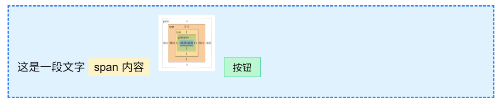
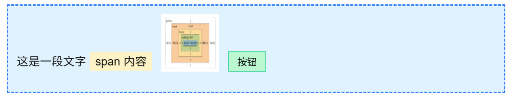
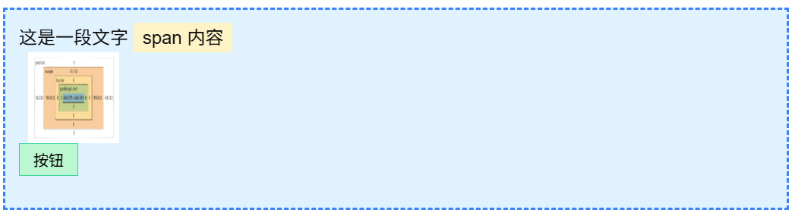

# CSS 的知识体系：从样式规则到现代布局

在我们用 HTML 写出一个简单网页后，页面会先遵循浏览器默认样式：文字、间距、标题、列表都能显示，但通常缺少设计感，也难以形成稳定的布局结构。

CSS（Cascading Style Sheets，层叠样式表）就是用来描述 HTML 文档视觉表现的语言。它不仅能控制颜色、字体、间距和尺寸，也负责布局、定位、层叠、动画、响应式适配，以及一定程度上的渲染性能优化。

浏览器渲染页面时，会根据 HTML 构建 DOM 树，再结合 CSS 规则生成最终的样式结果。CSS 的难点不只是“让文字变红”，而是理解浏览器如何决定样式、如何计算盒子尺寸、如何排列元素、如何处理定位与覆盖关系，以及如何让页面在不同设备上保持良好的表现。

本文按照一条较完整的学习路径整理 CSS：

- 基础语法与选择器
- 层叠、继承与优先级
- 盒模型与尺寸计算
- CSS 单位与数学函数
- display 与格式化上下文
- position 与定位系统
- BFC、IFC 与布局边界
- Stacking Context 与 z-index
- Flex 与 Grid
- 响应式与适配
- 视觉样式、动画与性能优化

## 一、基础语法与引入方式

CSS 的基本结构由 **选择器** 和 **声明块** 组成：

```css
selector {
  property: value;
  property: value;
}
```

选择器决定“选中谁”，声明块决定“给它什么样式”。

例如：

```css
p {
  color: red;
  font-size: 16px;
}
```

这里的 `p` 是选择器，`color` 和 `font-size` 是属性，`red` 和 `16px` 是属性值。

### 1. CSS 的三种引入方式

#### 内联样式

直接写在 HTML 元素的 `style` 属性中：

```html
<p style="color: red;">文本</p>
```

优点是简单直接，缺点是难复用、难维护，也容易破坏结构与样式分离。一般不推荐作为主要写法。

#### 内部样式表

写在 HTML 的 `<style>` 标签中：

```html
<style>
  p {
    color: red;
  }
</style>
```

适合小页面、Demo 或局部测试。

#### 外部样式表

通过 `<link>` 引入独立 CSS 文件：

```html
<link rel="stylesheet" href="style.css" />
```

这是工程中最常见的方式，便于复用、缓存和维护。

::: tip
外部样式表更适合项目开发，因为它可以让 HTML 负责结构，CSS 负责表现，二者职责更清晰。
:::

## 二、选择器体系

选择器用于匹配 HTML 元素。理解选择器，是理解 CSS 生效范围和优先级的基础。

### 1. 基本选择器

#### 元素选择器

选中所有指定标签：

```css
p {
  color: red;
}
```

#### 类选择器

以 `.` 开头，选中指定 class 的元素：

```css
.highlight {
  color: red;
}
```

类选择器可复用，是现代 CSS 开发中最常用的选择器之一。

#### ID 选择器

以 `#` 开头，选中指定 id 的元素：

```css
#header {
  height: 60px;
}
```

id 在页面中应当唯一。由于 ID 选择器优先级较高，工程中一般不推荐大量使用它来写普通样式。

#### 通配符选择器

`*` 匹配所有元素：

```css
* {
  box-sizing: border-box;
}
```

通配符选择器影响范围很大，应谨慎使用。常见用途是做基础重置。

### 2. 组合选择器

| 选择器    | 名称           | 含义                             |
| --------- | -------------- | -------------------------------- |
| `div p`   | 后代选择器     | 选中 `div` 内部所有 `p` 元素     |
| `div > p` | 子选择器       | 只选中 `div` 的直接子元素 `p`    |
| `h1 + p`  | 相邻兄弟选择器 | 选中紧跟在 `h1` 后面的第一个 `p` |
| `h1 ~ p`  | 通用兄弟选择器 | 选中 `h1` 后面所有同级的 `p`     |

示例：

```css
article > p {
  line-height: 1.8;
}
```

### 3. 属性选择器

属性选择器根据元素属性及属性值进行匹配。

```css
input[type="text"] {
  border: 1px solid #ccc;
}

[data-role] {
  color: red;
}

a[href^="https"] {
  color: green;
}

a[href$=".pdf"] {
  color: orange;
}

a[href*="example"] {
  color: blue;
}
```

| 写法          | 含义                            |
| ------------- | ------------------------------- |
| `[attr]`      | 选中拥有 `attr` 属性的元素      |
| `[attr="x"]`  | 选中 `attr` 值等于 `x` 的元素   |
| `[attr^="x"]` | 选中 `attr` 值以 `x` 开头的元素 |
| `[attr$="x"]` | 选中 `attr` 值以 `x` 结尾的元素 |
| `[attr*="x"]` | 选中 `attr` 值包含 `x` 的元素   |

### 4. 伪类选择器

伪类描述元素的状态、位置或关系，不会创建新的 DOM 节点。

```css
a:hover {
  color: red; /* 鼠标悬停在链接上时，文字变红 */
}

input:focus {
  border-color: blue; /* 输入框获得焦点时，边框变蓝 */
}

button:disabled {
  opacity: 0.5; /* 按钮被禁用时，变半透明 */
}

li:first-child {
  font-weight: bold; /* 选中第一个 li */
}

li:last-child {
  margin-bottom: 0; /* 选中最后一个 li */
}

.item:not(.active) {
  opacity: 0.6; /* 选中没有 active 的 item */
}
```

常见伪类包括：

| 伪类                | 含义                         |
| ------------------- | ---------------------------- |
| `:hover`            | 鼠标悬停                     |
| `:active`           | 元素被激活，通常是鼠标按下时 |
| `:focus`            | 元素获得焦点                 |
| `:disabled`         | 表单元素被禁用               |
| `:first-child`      | 父元素中的第一个子元素       |
| `:last-child`       | 父元素中的最后一个子元素     |
| `:not(...)`         | 排除匹配条件的元素           |
| `:nth-child(...)`   | 按所有子元素的位置匹配       |
| `:nth-of-type(...)` | 按同类型兄弟元素的位置匹配   |

#### nth-child 与 nth-of-type

`:nth-child()` 看的是元素在父元素所有子元素中的位置。

```css
li:nth-child(odd) {
  background: #f5f5f5;
}
```

这表示：选中既是 `li`，又在父元素所有子元素中处于奇数位置的元素。

`:nth-of-type()` 看的是元素在同类型兄弟元素中的位置。

```css
li:nth-of-type(odd) {
  background: #f5f5f5;
}
```

这表示：只在所有 `li` 元素内部计算位置，选中其中处于奇数位的 `li`。

::: details 记忆方式
`:nth-child()` 是“先看整体位置，再判断类型”。

`:nth-of-type()` 是“只在同类型元素内部计算位置”。
:::

### 5. 伪元素选择器

伪元素用于选中元素的一部分，或者创建一个不在 DOM 中的虚拟样式对象。伪元素常常配合 `content` 属性生成装饰性内容。

```css
p::before {
  content: "*"; /* 在 p 内容前生成一个星号 */
}

p::after {
  content: "..."; /* 在 p 内容后生成省略号 */
}

p::first-line {
  color: red; /* 选中 p 的第一行 */
}

p::first-letter {
  font-size: 2em; /* 选中 p 的第一个字母 */
}

::selection {
  background: yellow; /* 文本被选中时的背景 */
}

input::placeholder {
  color: #999; /* 输入框占位文本颜色 */
}
```

常见伪元素：

| 伪元素           | 含义                         |
| ---------------- | ---------------------------- |
| `::before`       | 在元素内容前生成虚拟内容     |
| `::after`        | 在元素内容后生成虚拟内容     |
| `::first-letter` | 选中第一字母                 |
| `::first-line`   | 选中第一行文本               |
| `::selection`    | 选中文本的样式               |
| `::placeholder`  | 输入框占位文本               |
| `::backdrop`     | 全屏元素或对话框背后的背景层 |

::: tip 伪类与伪元素的区别
伪类描述已有元素的状态、位置或关系，例如 `:hover`、`:focus`、`:nth-child()`。

伪元素选中元素的一部分，或生成一个虚拟样式对象，例如 `::before`、`::after`、`::first-line`。
:::

## 三、层叠、继承与优先级

CSS 的名字里有 Cascading，也就是“层叠”。当多条规则同时作用于同一个元素时，浏览器需要判断最终采用哪一条样式。

### 1. 继承

部分 CSS 属性会从父元素继承到子元素，常见的是文本相关样式：

| 可继承属性    | 含义     |
| ------------- | -------- |
| `color`       | 文字颜色 |
| `font-size`   | 字体大小 |
| `font-family` | 字体族   |
| `font-weight` | 字重     |
| `line-height` | 行高     |
| `text-align`  | 文本对齐 |
| `visibility`  | 可见性   |

示例：

```css
body {
  color: #333;
  font-family: system-ui, sans-serif;
}
```

子元素通常会继承 `color` 和 `font-family`。

这些属性通常不会默认继承：

| 通常不继承           | 原因                     |
| -------------------- | ------------------------ |
| `width` / `height`   | 尺寸通常由自身和布局决定 |
| `margin` / `padding` | 间距属于盒模型自身       |
| `border`             | 边框属于元素自身视觉     |
| `background`         | 背景属于自身绘制         |
| `position`           | 定位方式不应默认传递     |
| `display`            | 布局角色不应默认传递     |

### 2. 层叠顺序

当多个规则冲突时，浏览器大致按以下因素决定结果：

1. 来源与重要性
2. 选择器优先级
3. 代码出现顺序

普通情况下，可以粗略理解为：浏览器默认样式、用户样式、作者样式共同参与层叠。实际比较中，`!important` 会改变优先级秩序，因此工程中不建议滥用。

### 3. 选择器优先级

| 类型                       | 优先级理解 |
| -------------------------- | ---------- |
| `!important`               | 极高，慎用 |
| 行内样式                   | 很高       |
| ID 选择器                  | 高         |
| 类选择器、属性选择器、伪类 | 中         |
| 元素选择器、伪元素         | 低         |
| 通配符、继承样式           | 很低       |

示例：

```css
#nav .item:hover {
  color: red;
}
```

它包含 ID 选择器、类选择器和伪类选择器，因此比普通的 `.item` 或 `a` 更容易胜出。

::: warning 工程建议
优先使用类选择器组织样式，避免选择器过深，也避免大量使用 ID 和 `!important`。否则后期覆盖样式会很困难。
:::

不推荐：

```css
div#app .sidebar ul li a span {
  color: red;
}
```

更推荐：

```css
.nav-link-text {
  color: red;
}
```

### 4. 现代层叠控制：`:is()`、`:where()` 与 `@layer`

传统层叠主要依赖选择器优先级和代码顺序。现代 CSS 又补充了一些更适合工程化的能力，用来降低选择器复杂度，并控制不同样式层之间的覆盖关系。

#### `:is()`：合并重复选择器

`:is()` 可以把一组选择器合并起来，减少重复书写。

```css
.card :is(h2, h3, p) {
  margin-top: 0;
}
```

上面的写法等价于分别写：

```css
.card h2,
.card h3,
.card p {
  margin-top: 0;
}
```

它适合用于组件内部有多个同类元素需要统一处理的场景。

#### `:where()`：低优先级选择器

`:where()` 和 `:is()` 很像，也可以合并选择器，但它自身的优先级始终是 `0`。

```css
:where(article, section) :where(h1, h2, h3) {
  line-height: 1.25;
}
```

这类写法适合放在 reset、base、默认排版样式中，因为后续业务 class 很容易覆盖它。

::: tip `:is()` 与 `:where()` 的区别

- `:is()` 会采用参数中最高的选择器优先级；
- `:where()` 的优先级始终为 0；
- 想简化选择器但仍保留正常优先级，用 `:is()`；
- 想写“很容易被覆盖”的基础样式，用 `:where()`。
  :::

#### `@layer`：按层管理样式优先级

`@layer` 可以把样式分成不同层。层的顺序会参与层叠比较，后声明的层通常更容易覆盖前面的层。

```css
@layer reset, base, components, utilities;

@layer reset {
  :where(*) {
    box-sizing: border-box;
  }
}

@layer components {
  .button {
    padding: 8px 16px;
    border-radius: 6px;
  }
}

@layer utilities {
  .mt-16 {
    margin-top: 16px;
  }
}
```

它的意义在于：样式覆盖不再只靠“选择器写得更长”或者 `!important`，而是可以通过层级来组织。

常见分层可以这样理解：

| 层级 | 内容 | 目的 |
| --- | --- | --- |
| `reset` | 重置浏览器默认样式 | 消除默认差异 |
| `base` | 基础元素样式 | 定义全局排版 |
| `components` | 组件样式 | 管理组件视觉 |
| `utilities` | 工具类样式 | 提供高优先级的小工具 |

::: warning
`@layer` 解决的是工程层级问题，不是让选择器优先级失效。同一层内部，仍然会继续比较选择器优先级和代码顺序。
:::

## 四、盒模型与尺寸计算

HTML 元素在布局中通常可以看作矩形盒子。CSS 盒模型描述了这个盒子的组成方式。


一个盒子由四部分组成：

| 部分      | 含义                             |
| --------- | -------------------------------- |
| `content` | 内容区                           |
| `padding` | 内边距，内容与边框之间的距离     |
| `border`  | 边框                             |
| `margin`  | 外边距，元素与外部元素之间的距离 |

### 1. 标准盒模型：content-box

默认情况下，`width` 和 `height` 只设置内容区大小。

```css
.card {
  width: 300px;
  padding: 20px;
  border: 2px solid #333;
}
```

此时总宽度为：

| 部分         | 宽度       |
| ------------ | ---------- |
| content      | `300px`    |
| 左右 padding | `20px × 2` |
| 左右 border  | `2px × 2`  |
| 实际占据宽度 | `344px`    |

### 2. 怪异盒模型：border-box

在 `border-box` 下，`width` 和 `height` 包含 `content + padding + border`。

```css
.card {
  box-sizing: border-box;
  width: 300px;
  padding: 20px;
  border: 2px solid #333;
}
```

此时元素的边框盒宽度就是 `300px`，padding 和 border 会挤压内容区。

工程中常见全局写法：

```css
*,
*::before,
*::after {
  box-sizing: border-box;
}
```

::: tip
所谓“怪异模式”不是因为没使用 HTML5 标签，而是因为页面没有正确声明 `DOCTYPE`，或者触发了浏览器的 quirks mode。现代页面一般通过 `<!DOCTYPE html>` 进入标准模式。
:::

### 3. margin、padding、border 的区别

::: tip margin、padding、border 怎么选

- `padding`：控制内容与边框之间的距离，属于盒子内部空间。容器内部留白优先使用它。
- `border`：盒子的边框界线。
- `margin`：控制当前盒子与其他盒子之间的距离，属于盒子外部空间。组件之间的间距可以使用它，也可以使用父容器的 `gap`。
  :::

### 4. 外边距合并：Margin Collapsing

外边距合并发生在普通文档流中的块级盒子之间。核心规则是：垂直方向相邻的 margin 不一定相加，而可能合并成一个较大的 margin。

#### 相邻兄弟合并

```css
.box-a {
  margin-bottom: 16px;
}

.box-b {
  margin-top: 24px;
}
```

两个元素之间的最终距离是 `24px`，不是 `40px`。

<div style="border: 6px solid #fb923c; padding: 16px 150px 16px 16px; margin: 12px 0; background: #fff3bf; position: relative; color: #111;">
  <h3 style="margin: 0 0 24px; height: 56px; line-height: 56px; padding: 0 12px; color: #111; background: #bfdbfe;">标题内容区</h3>
  <p style="margin: 16px 0 0; height: 40px; line-height: 40px; padding: 0 12px; color: #111; background: #bbf7d0;">段落内容区</p>
  <div style="position: absolute; left: 300px; top: 72px; display: inline-flex; align-items: center; gap: 6px;">
    <div style="height: 24px; border-left: 2px dashed #ef4444;"></div>
    <span style="font-size: 12px; color: #ef4444;">实际间距 24px</span>
  </div>
</div>

在这个例子中，`h3` 的 `margin-bottom: 24px` 与 `p` 的 `margin-top: 16px` 合并后，最终间距为 `24px`。

#### 父子合并

当父元素没有 `border-top`、`padding-top`、行内内容等阻隔时，第一个子元素的 `margin-top` 可能穿透到父元素外部。

```css
.parent {
  background: #eee;
}

.child {
  margin-top: 20px;
}
```

视觉上可能表现为父元素整体被向下推开，而不是子元素在父元素内部下移。

#### 空块合并

一个没有内容、没有 padding、没有 border 的空块，它自己的 `margin-top` 和 `margin-bottom` 也可能发生合并。

### 5. 阻止 margin 合并的方法

| 方法                               | 说明                                     |
| ---------------------------------- | ---------------------------------------- |
| 给父元素添加 `padding` 或 `border` | 直接打断父子 margin 接触                 |
| `display: flow-root`               | 创建 BFC，现代推荐                       |
| `overflow: hidden / auto`          | 也能创建 BFC，但可能带来裁剪或滚动副作用 |
| `display: flex / grid`             | 改变子元素布局上下文                     |
| `position: absolute / fixed`       | 脱离普通文档流，不参与普通 margin 合并   |

现代推荐：

```css
.parent {
  display: flow-root;
}
```

## 五、CSS 单位系统

CSS 单位可以分为绝对单位、字体相关单位、百分比单位、视口单位和数学函数。

### 1. px

`px` 是 CSS 像素，是最常用的长度单位。它不一定等于物理屏幕上的一个像素，而是浏览器中的视觉单位。

```css
.box {
  width: 200px;
}
```

### 2. em 与 rem

`rem` 相对于根元素 `html` 的字体大小。

```css
html {
  font-size: 16px;
}

.title {
  font-size: 2rem; /* 32px */
}
```

`em` 的参照对象要分情况：

| 使用位置         | 参照对象               |
| ---------------- | ---------------------- |
| `font-size: 2em` | 父元素的字体大小       |
| `padding: 1em`   | 当前元素自己的字体大小 |
| `margin: 1em`    | 当前元素自己的字体大小 |
| `width: 10em`    | 当前元素自己的字体大小 |

示例：

```css
.parent {
  font-size: 20px;
}

.child {
  font-size: 2em; /* 40px，相对 parent */
  padding: 1em; /* 40px，相对 child 自己的 font-size */
}
```

### 3. 百分比

百分比单位的参照对象要看具体属性，不能简单理解成“相对于当前元素”。

| 属性                         | 常见参照对象                           |
| ---------------------------- | -------------------------------------- |
| `width: 50%`                 | 包含块的宽度                           |
| `height: 50%`                | 包含块的高度，且父级高度通常需要可确定 |
| `padding: 10%`               | 多数情况下相对包含块宽度               |
| `margin: 10%`                | 多数情况下相对包含块宽度               |
| `transform: translateX(50%)` | 元素自身尺寸                           |

### 4. 视口单位

| 单位   | 含义                      |
| ------ | ------------------------- |
| `vw`   | 视口宽度的 1%             |
| `vh`   | 视口高度的 1%             |
| `vmin` | `vw` 和 `vh` 中较小的那个 |
| `vmax` | `vw` 和 `vh` 中较大的那个 |

移动端中传统 `vh` 容易受到浏览器地址栏、工具栏显示隐藏影响，因此出现了新的视口单位。

| 单位  | 含义                    | 适用理解                       |
| ----- | ----------------------- | ------------------------------ |
| `svh` | small viewport height   | 工具栏展开时的较小可视高度     |
| `lvh` | large viewport height   | 工具栏收起时的较大可视高度     |
| `dvh` | dynamic viewport height | 随工具栏显示隐藏动态变化的高度 |

### 5. CSS 数学函数

#### calc

用于混合单位计算：

```css
.main {
  width: calc(100% - 240px);
}
```

#### min 与 max

```css
.box {
  width: min(100%, 600px);
}
```

表示宽度取 `100%` 和 `600px` 中较小的那个。

```css
.box {
  width: max(320px, 50%);
}
```

表示宽度至少不会小于 `320px`。

#### clamp

`clamp(min, preferred, max)` 用于把值限制在一个区间内。

```css
.title {
  font-size: clamp(16px, 2vw, 24px);
}
```

含义是：最小 `16px`，理想值 `2vw`，最大 `24px`。

#### minmax

`minmax()` 主要用于 Grid 布局中定义轨道尺寸范围。

```css
.grid {
  display: grid;
  grid-template-columns: repeat(auto-fit, minmax(240px, 1fr));
}
```

表示每一列最小 `240px`，最大可以扩展到 `1fr`。

### 6. 内容尺寸与比例控制

除了固定长度、百分比和数学函数，CSS 还有一组和内容尺寸相关的值。它们常用于弹性布局、文本容器和响应式卡片中。

| 值或属性 | 含义 | 常见场景 |
| --- | --- | --- |
| `min-content` | 内容能压缩到的最小尺寸 | 长文本、表格列 |
| `max-content` | 内容不换行时的理想尺寸 | 标签、按钮、标题 |
| `fit-content` | 在可用空间内尽量适配内容 | 浮层、弹窗、提示框 |
| `aspect-ratio` | 控制盒子的宽高比 | 图片容器、视频容器、卡片封面 |

#### min-content 与 max-content

```css
.title {
  width: max-content;
}
```

`max-content` 可以理解为“内容不换行时需要多宽”。如果文本很长，元素可能会变得很宽。

```css
.name {
  width: min-content;
}
```

`min-content` 可以理解为“内容尽可能换行后需要的最小宽度”。对于英文长单词、中文文本、表格列宽，它的表现可能不同。

#### fit-content

```css
.tooltip {
  width: fit-content;
  max-width: 320px;
}
```

`fit-content` 适合内容长度不固定，但又不希望盒子无限拉伸的场景。

#### aspect-ratio

```css
.cover {
  aspect-ratio: 16 / 9;
  width: 100%;
  overflow: hidden;
}
```

`aspect-ratio` 可以在不知道具体高度的情况下，让盒子维持固定比例。它常用于卡片封面、视频区域、图片占位，能减少布局抖动。

::: tip
`aspect-ratio` 控制的是盒子的比例；图片或视频内容怎么填充盒子，还需要结合 `object-fit` 或 `background-size`。
:::

## 六、display 与格式化上下文

`display` 决定元素在外部如何参与布局，也决定它的子元素在内部如何布局。

现代 CSS 可以从 two-value display 的角度理解它：

| 层面               | 作用                     | 例子                                |
| ------------------ | ------------------------ | ----------------------------------- |
| outer display type | 元素自己如何参与父级布局 | `block`、`inline`                   |
| inner display type | 子元素如何在内部布局     | `flow`、`flow-root`、`flex`、`grid` |

### 1. 常见 display 值

| 写法                   | 可近似理解为      | 含义                       |
| ---------------------- | ----------------- | -------------------------- |
| `display: block`       | `block flow`      | 外部块级，内部普通流       |
| `display: inline`      | `inline flow`     | 外部行内，内部普通流       |
| `display: flow-root`   | `block flow-root` | 外部块级，内部创建 BFC     |
| `display: flex`        | `block flex`      | 外部块级，内部 Flex 布局   |
| `display: inline-flex` | `inline flex`     | 外部行内级，内部 Flex 布局 |
| `display: grid`        | `block grid`      | 外部块级，内部 Grid 布局   |
| `display: inline-grid` | `inline grid`     | 外部行内级，内部 Grid 布局 |
| `display: none`        | 不生成盒子        | 元素不参与布局与绘制       |

### 2. block

块级元素特点：

- 独占一行
- 默认宽度撑满父容器可用空间
- 可以设置 `width`、`height`、`margin`、`padding`
- 常见标签包括 `div`、`p`、`section`、`h1` 到 `h6`

<div style="display: block; width: 220px; margin: 8px 0; padding: 8px 12px; color: #111; background: #bfdbfe; border: 1px solid #60a5fa;">
  块级元素 A
</div>
<div style="display: block; width: 220px; margin: 8px 0; padding: 8px 12px; color: #111; background: #bfdbfe; border: 1px solid #60a5fa;">
  块级元素 B
</div>

### 3. inline

行内元素特点：

- 不独占一行，会同文本流式排列
- `width` / `height` 通常不生效
- 水平方向的 `margin` / `padding` 生效明显
- 垂直方向的 `padding` / `border` 可能影响视觉绘制，但不一定稳定撑开行盒

<div style="margin: 10px 0; color: #111;">
  <span style="display: inline; padding: 4px 10px; margin: 0 6px; background: #fde68a; border: 1px solid #f59e0b;">行内 A</span>
  <span style="display: inline; padding: 4px 10px; margin: 0 6px; background: #fde68a; border: 1px solid #f59e0b;">行内 B</span>
  <span style="display: inline; padding: 4px 10px; margin: 0 6px; background: #fde68a; border: 1px solid #f59e0b;">行内 C</span>
</div>

### 4. inline-block

`inline-block` 同时具有行内和块级的部分特点：

- 不独占一行
- 像文字一样参与行内排版
- 可以设置 `width` / `height`
- 可以完整设置 `margin` / `padding` / `border`

<div style="margin: 10px 0; color: #111;">
  <span style="display: inline-block; width: 120px; height: 40px; line-height: 40px; margin-right: 8px; text-align: center; background: #bbf7d0; border: 1px solid #34d399;">行内块 A</span>
  <span style="display: inline-block; width: 120px; height: 40px; line-height: 40px; margin-right: 8px; text-align: center; background: #bbf7d0; border: 1px solid #34d399;">行内块 B</span>
  <span style="display: inline-block; width: 120px; height: 40px; line-height: 40px; margin-right: 8px; text-align: center; background: #bbf7d0; border: 1px solid #34d399;">行内块 C</span>
</div>

适合按钮、标签、小卡片等“可并排、可定尺寸”的组件。

### 5. flow、flow-root、flex、grid

| 类型        | 说明                       |
| ----------- | -------------------------- |
| `flow`      | 普通文档流                 |
| `flow-root` | 普通文档流，但创建新的 BFC |
| `flex`      | 子元素进入一维 Flex 布局   |
| `grid`      | 子元素进入二维 Grid 布局   |

可以这样记：

| 写法              | 直观理解                |
| ----------------- | ----------------------- |
| `block flow`      | 普通块级盒子            |
| `block flow-root` | 普通块级盒子 + 创建 BFC |
| `block flex`      | 外部是块级，内部是 Flex |
| `block grid`      | 外部是块级，内部是 Grid |

这里我们先不展开 Flex 和 Grid 的细节，后续会专门讲解它们的布局机制和使用技巧。

## 七、position 与定位系统

`position` 决定元素是否脱离普通文档流，以及 `top`、`right`、`bottom`、`left` 依据哪个包含块生效。

### 1. 普通文档流

普通文档流是浏览器默认的排版方式：块级元素从上到下排列，行内元素从左到右排列。元素默认会占据自己的自然位置，并影响后续元素布局。

上面的我们提到过，`display: block`、`inline`、`inline-block` 等元素都参与普通文档流。

同时，元素设置`display: flow-root`等也会参与普通文档流，但它们内部的子元素会进入新的布局上下文。

如果元素脱离普通文档流，它原来的位置通常不再被保留，后续元素会像它不存在一样重新排列。

### 2. static

`static` 是默认值，文档会根据是行内还是块级元素进行正常排版。内容一般是按照 HTML 结构从上到下、从左到右依次排列。

| 特点           | 说明                         |
| -------------- | ---------------------------- |
| 是否脱离文档流 | 否                           |
| 是否保留占位   | 是                           |
| 坐标属性       | `top/right/bottom/left` 无效 |
| 常见用途       | 默认布局                     |

### 3. relative

相对定位，元素仍然参与普通文档流，但可以通过 `top`、`right`、`bottom`、`left` 相对于自己原本位置进行偏移。
并且对于子元素来说，如果子元素是 `position: absolute`，它的包含块就是这个 relative 元素。`absolute` 定位的元素会以最近的 `position` 不为 `static` 的祖先元素为参考进行定位。

```css
.parent {
  position: relative;
  top: 10px;
}
```

| 特点           | 说明                                     |
| -------------- | ---------------------------------------- |
| 是否脱离文档流 | 否                                       |
| 是否保留占位   | 是                                       |
| 参考系         | 自己原本的位置                           |
| 常见用途       | 微调位置，给 absolute 子元素提供定位参考 |

relative 的偏移会影响它自己的视觉位置，也会带着子元素一起移动，但它在普通文档流中的原始占位仍然保留。

### 4. absolute

绝对定位，元素会向上脱离普通文档流，并相对于最近的 `position` 不为 `static` 的祖先元素进行定位。如果没有这样的祖先，则相对于初始包含块（通常是视口）进行定位。

```css
.card {
  position: relative;
}

.badge {
  position: absolute;
  top: 8px;
  right: 8px;
}
```

| 特点           | 说明                                   |
| -------------- | -------------------------------------- |
| 是否脱离文档流 | 是                                     |
| 是否保留占位   | 否                                     |
| 参考系         | containing block                       |
| 常见参考来源   | 最近的 `position` 不为 `static` 的祖先 |

更准确地说，absolute 的包含块通常来自最近定位祖先的 padding box。如果没有符合条件的祖先，则回退到初始包含块。

<div style="margin-top: 8px; font-size: 14px; background: #227eff; color: white; padding: 8px; height: 48px; position: relative; border-radius: 6px;">
  父元素：position: relative
  <div style="position: absolute; top: 8px; right: 8px; background: #f87171; padding: 4px 8px; border-radius: 4px;">
    absolute 子元素
  </div>
</div>

### 5. fixed

固定定位，元素脱离普通文档流，并相对于视口进行定位。即使页面滚动，fixed 元素也会保持在相同位置。

但这里需要注意，如果 fixed 元素的祖先存在 `transform`、`filter`、`perspective`、`contain: paint` 等属性，它的参考系可能不再是视口，而是这个祖先元素。

因为 fixed 等等定位依赖于包含块的坐标系，如果祖先元素具有上述属性，会创建一个新的包含块，导致 fixed 定位的参考系发生变化。

```css
.sidebar {
  position: fixed;
  top: 0;
  right: 0;
}
```

| 特点           | 说明                         |
| -------------- | ---------------------------- |
| 是否脱离文档流 | 是                           |
| 是否保留占位   | 否                           |
| 通常参考系     | 视口                         |
| 常见用途       | 固定导航栏、悬浮按钮、侧边栏 |

::: warning fixed 的特殊情况
如果 fixed 元素的祖先存在 `transform`、`filter`、`perspective`、`contain: paint` 等属性，它的参考系可能不再是视口，而是这个祖先元素。

```css
.wrapper {
  transform: translateZ(0);
}
```

这也是很多“fixed 失效”或“fixed 定位异常”问题的根源。
:::

### 6. sticky

粘性定位，元素在跨越特定阈值前表现为 relative 定位，跨越后表现为 fixed 定位。它的参考系是最近的滚动容器和父级边界。会在跟随父元素的滚动与固定位置之间切换。

```css
.toc {
  position: sticky;
  top: 16px;
}
```

| 特点     | 说明                                                        |
| -------- | ----------------------------------------------------------- |
| 触发前   | 类似 relative                                               |
| 触发后   | 类似 fixed                                                  |
| 限制     | 受最近滚动容器和父级边界限制                                |
| 必要条件 | 需要设置 `top` / `bottom` / `left` / `right` 中至少一个阈值 |

sticky 常用于目录吸顶、表头固定、分组标题固定等场景。

### 7. overflow 与滚动容器

`overflow` 决定内容超出盒子后如何处理。它不仅影响裁剪和滚动，也会影响 BFC、滚动容器和 `sticky` 的表现。

常见值：

| 值 | 含义 |
| --- | --- |
| `visible` | 默认值，内容可以溢出显示 |
| `hidden` | 超出部分被裁剪，不显示滚动条 |
| `auto` | 内容超出时才出现滚动条 |
| `scroll` | 始终保留滚动条区域 |
| `clip` | 裁剪超出内容，语义上比 `hidden` 更强调不可滚动 |

```css
.panel {
  max-height: 320px;
  overflow: auto;
}
```

#### overflow 对 sticky 的影响

`position: sticky` 依赖最近的滚动容器。如果祖先元素设置了 `overflow: hidden`、`overflow: auto`、`overflow: scroll`，它可能会成为 sticky 的参考容器。

```css
.wrapper {
  overflow: auto;
}

.title {
  position: sticky;
  top: 0;
}
```

这时 `.title` 不一定相对于整个页面吸顶，而是相对于 `.wrapper` 这个滚动容器吸顶。

::: warning sticky 失效常见原因

- 没有设置 `top` / `bottom` / `left` / `right` 阈值；
- 父元素高度不够，sticky 没有足够滚动空间；
- 祖先元素的 `overflow` 改变了滚动容器；
- sticky 元素被父级边界限制住了。
  :::

#### 横向滚动与吸附滚动

横向卡片列表常用 `overflow-x: auto`：

```css
.card-list {
  display: flex;
  gap: 16px;
  overflow-x: auto;
}
```

如果希望滚动时自动吸附到每张卡片，可以配合 `scroll-snap`：

```css
.card-list {
  display: flex;
  gap: 16px;
  overflow-x: auto;
  scroll-snap-type: x mandatory; /* 水平强制吸附 */
}

.card {
  flex: 0 0 240px;
  scroll-snap-align: start;
}
```

`overflow` 可以这样记：

> 它表面上控制“内容超出怎么显示”，实际开发中还会影响滚动区域、BFC、sticky 和裁剪边界。

## 八、BFC、IFC 与布局边界

格式化上下文可以理解为：**浏览器为某一块内容建立的一套排版规则区域**。

不同的格式化上下文，内部排版规则不同：

| 格式化上下文 | 主要处理对象  | 典型问题              |
| ------ | ------- | ----------------- |
| BFC    | 块级盒子    | 块级排列、浮动、margin 合并 |
| IFC    | 行内盒子和文本 | 文本换行、行高、基线对齐      |
| FFC    | Flex 子项 | 一维弹性布局            |
| GFC    | Grid 子项 | 二维网格布局            |

这里重点讲最基础的两个：**BFC** 和 **IFC**。

### 1. BFC：块级格式化上下文

BFC，全称 **Block Formatting Context**，中文叫 **块级格式化上下文**。

可以把它理解成：

> 一个独立的块级布局区域。
> 这个区域内部的块级盒子按照自己的规则排版，并且这个区域会在一定程度上隔离内部和外部的布局影响。

比如：

```css
.container {
  display: flow-root;
}
```

这会让 `.container` 创建一个新的 BFC。

### 2. BFC 内部的布局规则

BFC 内部主要遵循普通块级布局规则：

#### 规则一：块级盒子从上到下排列

在普通文档流中，块级元素会一个接一个垂直排列，也就是一般的文档流布局。

```html
<div class="box">A</div>
<div class="box">B</div>
<div class="box">C</div>
```

```css
.box {
  height: 40px;
  margin-bottom: 12px;
  background: #bfdbfe;
}
```

<div style="margin: 10px 0; color: #111; background: #e0f2fe; padding: 12px;">
  <div class="box">A</div>
  <div class="box">B</div>
  <div class="box">C</div>
</div>
它们会从上到下依次排列。

#### 规则二：同一个 BFC 内，相邻块级元素的垂直 margin 可能合并

例如：

```css
.a {
  margin-bottom: 20px;
}

.b {
  margin-top: 30px;
}
```

最终 `.a` 和 `.b` 之间的距离是 `30px`，不是 `50px`。

这就是之前讲过的 **margin collapsing** 外边距合并，因为外边距只保证有足够的空间，但不会叠加。

::: warning 注意
创建 BFC 不是让“所有 margin 都不合并”。

更准确地说：

- 同一个 BFC 内部，相邻块级兄弟的 margin 仍然可能合并；
- 但是一个创建了 BFC 的容器，它自身与内部子元素之间的 margin 合并会被阻止。
  :::

#### 规则三：BFC 会包含内部浮动元素

这是 BFC 最经典的作用之一。

先看问题：

```html
<div class="parent">
  <div class="float-box">float</div>
</div>
```

```css
.parent {
  border: 2px solid red;
}

.float-box {
  float: left;
  width: 100px;
  height: 100px;
  background: #bfdbfe;
}
```

表现为：
<div style=" padding: 0; margin: 0;height: 120px;">
  <div style="border: 2px solid red;">
      <div style="float: left; width: 100px; height: 100px; background: #bfdbfe;">inner</div>
  </div>
</div>

因为浮动元素会脱离普通文档流，父元素可能无法感知它的高度，于是父元素高度塌陷。

解决方式：

```css
.parent {
  display: flow-root;
  border: 2px solid red;
}
```

<div style=" padding: 0; margin: 0;height: 120px;">
  <div style="border: 2px solid red;  display: flow-root;">
      <div style="float: left; width: 100px; height: 100px; background: #bfdbfe;">inner</div>
  </div>
</div>

创建 BFC 后，父元素就能包裹内部浮动元素。

::: tip
以前常用 clearfix 清除浮动，现在更推荐：

```css
.parent {
  display: flow-root;
}
```

它语义清晰，没有 `overflow: hidden` 可能裁剪内容的副作用。
:::

#### 规则四：BFC 区域不会和外部浮动元素重叠

例如：

```html

<div class="content">
  这里是一段文字内容……
</div>
```

```css
.float-img {
  float: left;
  width: 120px;
  height: 120px;
}

.content {
  background: #e0f2fe;
}
```

<div style="background: #f0f9ff; padding: 12px; border: 1px dashed #3b82f6;height: 140px;">
   
  <span style="background: #fef3c7; padding: 10px;">
    普通块级盒子的背景会延伸到浮动元素下方，文字内容会在图片右侧和底部自动环绕。这种排版往往不符合 UI 设计预期。
  </span>
</div>
<br/>

普通块级盒子的内容可能会受到浮动元素影响，出现环绕。

如果让 `.content` 创建 BFC:

```css
.content {
  display: flow-root;
  background: #e0f2fe;
}
```

<div style="background: #f0f9ff; padding: 12px; border: 1px dashed #3b82f6; height: 170px;">
  
  <span style="background: #fef3c7; padding: 10px; display: flow-root;">
    触发 BFC 后，容器会自动计算可用宽度并紧贴浮动元素右侧。背景色不再穿透到图片下方，文字也不再环绕，形成干净的独立区块。
  </span>
</div>
<br/>

它就会形成一个独立布局区域，不再被浮动元素挤进内容区域。

### 3. BFC 的常见作用

可以总结成下面这张表：

| 作用             | 说明                 | 常见场景      |
| -------------- | ------------------ | --------- |
| 包裹浮动元素         | 让父元素能感知浮动子元素高度     | 清除浮动      |
| 阻止父子 margin 合并 | 避免子元素 margin 穿透父元素 | 卡片、容器内部留白 |
| 避免被浮动元素覆盖或环绕   | 形成独立布局区域           | 图文布局、侧栏布局 |
| 隔离部分布局影响       | 减少内部布局对外部的干扰       | 组件封装      |

### 4. 创建 BFC 的常见方式

| 方法                          | 是否推荐      | 说明              |
| --------------------------- | --------- | --------------- |
| `display: flow-root`        | 推荐        | 现代最清晰的创建 BFC 方式 |
| `overflow: hidden`          | 常用但谨慎     | 可创建 BFC，但可能裁剪内容 |
| `overflow: auto` / `scroll` | 可用        | 可能出现滚动条         |
| `display: inline-block`     | 特定场景可用    | 行内块会创建 BFC      |
| `float: left/right`         | 不推荐作为普通方案 | 浮动元素自身会创建 BFC   |
| `position: absolute/fixed`  | 特定场景可用    | 脱离普通流并创建独立布局区域  |
| `display: table-cell`       | 旧布局中常见    | 表格布局相关          |
| `contain: layout/paint`     | 高级场景      | 与布局和渲染隔离有关      |

现代推荐：

```css
.container {
  display: flow-root;
}
```

::: warning 关于 flex / grid
有些资料会说 `display: flex` / `grid` 会创建 BFC。

更严谨地说：

- `display: flex` 创建的是 **Flex Formatting Context**
- `display: grid` 创建的是 **Grid Formatting Context**

它们不是传统意义上的 BFC，但同样会形成独立布局环境，并且也能阻止父子 margin 合并、包裹内部布局等。
:::

### 5. IFC：行内格式化上下文

IFC，全称 **Inline Formatting Context**，中文叫 **行内格式化上下文**。

它负责文本、行内元素、行内块元素在一行一行中的排列。

比如：

```html
<p>
  这是一段文字
  <span>span 内容</span>
  
  <button>按钮</button>
</p>
```

<div style="border: 2px dashed #3b82f6; padding: 12px; background: #e0f2fe; color: #111;">
   <p>
    这是一段文字
    <span style="background: #fef3c7; padding: 4px 8px;"> span 内容</span>
    
    <button style="padding: 4px 12px; background: #bbf7d0; border: 1px solid #34d399;">按钮</button>
  </p>
</div>

这一段内容内部就涉及 IFC。

### IFC 内部的核心概念

#### 1. inline-level box：行内级盒子

行内格式化上下文中参与排版的盒子叫 **inline-level box**。

常见的行内级盒子包括：

| 类型           | 示例                                      |
| ------------ | --------------------------------------- |
| 行内元素         | `span`、`a`、`strong`、`em`                |
| 文本节点         | 普通文字                                    |
| inline-block | `display: inline-block`                 |
| inline-flex  | `display: inline-flex` 这是 `inline-block` 和 `flex` 的结合 |
| inline-grid  | `display: inline-grid`，同上                  |
| 图片           | `img` 默认是 inline-level replaced element |

注意，`inline-block` 虽然内部像块级盒子一样可以设置宽高，但它在外部是作为一个行内级盒子参与 IFC 的。

#### 2. line box：行盒

浏览器会把一行内容放进一个 **line box** 中。

当内容太长放不下时，会自动换到下一行，并形成新的 line box.

每一行都可以理解为一个 line box。

#### 3. baseline：基线

IFC 中最容易出问题的是 **基线对齐**。

默认情况下，行内元素会按照文字的 baseline 对齐，而不是按照视觉中心对齐。

例如：

```html
<span>文字</span>

```



图片默认会和文字基线对齐，因此图片底部下面经常会出现一点空隙。

解决方式：

```css
img {
  vertical-align: bottom; // 可选 middle 、top
}
```



或者更彻底，脱离内联流：

```css
img {
  display: block;
}
```



::: tip 为什么图片底部有空隙？
因为 `img` 默认是行内级元素，它会像文字一样参与 IFC，并且默认按 baseline 对齐。

文字基线下面还要给 `g`、`p`、`y` 这类字母的下伸部分留空间，所以图片底部看起来会有缝隙。
:::

#### 4. line-height：行高

`line-height` 会影响 line box 的高度。

```css
.text {
  font-size: 16px;
  line-height: 1.5;
}
```

如果 `font-size` 是 `16px`，那么 `line-height: 1.5` 计算后就是 `24px`。

行高不仅影响文字上下间距，也会影响行内元素的对齐表现。

### 5. vertical-align：行内对齐

`vertical-align` 只对行内级盒子、表格单元格等场景生效，不能直接用于普通块级元素居中。

常见值：

| 值             | 含义              |
| ------------- | --------------- |
| `baseline`    | 默认，按基线对齐        |
| `middle`      | 与父元素中线附近对齐      |
| `top`         | 与 line box 顶部对齐 |
| `bottom`      | 与 line box 底部对齐 |
| `text-top`    | 与文本顶部对齐         |
| `text-bottom` | 与文本底部对齐         |

示例：

```css
.icon {
  vertical-align: middle;
}
```

常用于让图标和文字看起来垂直居中。

### 6. inline、inline-block 在 IFC 中的表现

#### inline

```css
span {
  display: inline;
  width: 100px;
  height: 40px;
}
```

对于普通 inline 元素：

- `width` / `height` 通常不生效
- 水平方向 `margin` / `padding` 生效
- 垂直方向 `padding` / `border` 可能会影响视觉绘制，但不稳定撑开行盒

因此它们更适合用来包裹小块文本，或者作为装饰性的标签。

#### inline-block

```css
.tag {
  display: inline-block;
  width: 100px;
  height: 32px;
}
```

`inline-block` 的特点：

- 外部像文字一样参与行内排版
- 内部像块级盒子一样可以设置宽高
- 可以设置完整的 `margin` / `padding` / `border`
- 默认仍然参与 baseline 对齐

所以多个 `inline-block` 放在一起时，可能出现两个经典问题：

##### 问题一：元素之间有空隙

```html
<span class="tag">A</span>
<span class="tag">B</span>
```

因为 HTML 里的换行和空格会被当作文本空白处理，所以两个 inline-block 之间可能出现间隙。

解决方式：

```html
<span class="tag">A</span><span class="tag">B</span>
```

或者更现代地，直接用 Flex：

```css
.list {
  display: flex;
  gap: 8px;
}
```

#### 问题二：底部对齐不符合预期

因为 inline-block 默认按 baseline 对齐。

可以设置：

```css
.tag {
  vertical-align: middle;
}
```

或者如果不需要行内排版，直接使用 Flex / Grid。

### 7. BFC 与 IFC 的区别

| 对比项  | BFC                      | IFC                                            |
| ---- | ------------------------ | ---------------------------------------------- |
| 全称   | Block Formatting Context | Inline Formatting Context                      |
| 处理对象 | 块级盒子                     | 文本和行内级盒子                                       |
| 排列方向 | 从上到下                     | 从左到右，自动换行                                      |
| 核心概念 | 块盒、浮动、margin 合并          | line box、baseline、line-height                  |
| 常见问题 | 父元素高度塌陷、margin 穿透、浮动环绕   | 图片底部空隙、图标文字不对齐、inline-block 间隙                 |
| 常见解决 | `display: flow-root`     | `vertical-align`、`line-height`、`display: flex` |

### 8. 这一节的核心总结

BFC 可以这样记：

> BFC 是块级布局的隔离区域，主要处理浮动、margin 合并和块级布局边界问题。

IFC 可以这样记：

> IFC 是行内内容的排版规则，主要处理文本、行内元素、行盒、基线和行高问题。

## 九、层叠上下文与 z-index

如果说 BFC 主要解决的是“平面布局边界”的问题，那么 **Stacking Context（层叠上下文）** 解决的就是 **Z 轴上的覆盖关系**。

简单来说，它回答的是：

> 页面中有多个元素重叠时，谁显示在上面，谁显示在下面？

例如弹窗、下拉菜单、悬浮按钮、遮罩层、吸顶导航等，都离不开层叠规则。

### 1. z-index 的基本规则

`z-index` 用来控制元素在 Z 轴上的层叠顺序。

```css
.box {
  position: relative;
  z-index: 1;
}
```

但是要注意：

> `z-index` 不是写了就一定生效。

普通的 `static` 元素，即使写了 `z-index`，通常也不会产生预期效果。

```css
.box {
  position: static;
  z-index: 999;
}
```

上面这种写法通常没有意义，因为 `z-index` 主要对以下元素生效：

| 类型      | 示例                                               |
| ------- | ------------------------------------------------ |
| 定位元素    | `position: relative / absolute / fixed / sticky` |
| Flex 子项 | 父元素是 `display: flex`                             |
| Grid 子项 | 父元素是 `display: grid`                             |

要么元素具有定位属性，要么它是 Flex/Grid 布局的直接子项，才能让 `z-index` 发挥作用。

定位元素是很好理解的，我一个元素位移了，肯定要考虑它和其他元素的覆盖关系。

但为什么 Flex/Grid 子项也能直接使用 `z-index` 呢？

这是因为 Flex/Grid 布局会为子项创建一个新的层叠上下文，所以子项之间的 `z-index` 可以直接比较。

我们当然可以让子项互相重叠，grid 只是约束了它们的行列位置，但不限制他们是否超出格子边界。

常见有效写法：

```css
.box {
  position: relative;
  z-index: 10;
}
```

或者：

```css
.flex-item {
  z-index: 10;
}
```

前提是 `.flex-item` 是 Flex 容器的直接子项。


### 2. z-index: auto、0、正数、负数

`z-index` 常见值有几类：

| 值      | 含义                 |
| ------ | ------------------ |
| `auto` | 默认值，不主动建立新的层级数值    |
| `0`    | 层级为 0，通常会创建新的层叠上下文 |
| 正数     | 越大越靠上              |
| 负数     | 可能被压到更下面           |

对于`static`元素，`z-index` 的值通常被视为 `auto`，不会创建新的层叠上下文，也不会参与层级比较，设置为其他的数值也通常没有效果，但涉及到与其他有定位属性的元素比较时，static 元素的 z-index 值会被视为0。

对于有定位属性的元素，跟static元素相比，z-index: auto 会被视为 0，但它们之间的层级关系会根据文档顺序来确定 ———— 后出现的元素会覆盖先出现的元素。


而一旦元素具有定位属性（如 `position: relative`）或者是 Flex/Grid 子项，`z-index` 就会生效，默认值 `auto` 会被视为 `0`，并且会创建一个新的层叠上下文。

z-index 的数值越大，元素通常会显示在更上层的位置；数值越小，元素通常会显示在更下层的位置。


示例：

```css
.a {
  position: relative;
  z-index: 1;
}

.b {
  position: relative;
  z-index: 10;
}
```

如果 `.a` 和 `.b` 发生重叠，并且它们处在同一个层叠上下文里，那么 `.b` 会盖在 `.a` 上面。

::: warning 注意
`z-index` 的比较不是全局比较。

不是说 `z-index: 9999` 一定盖过 `z-index: 1`。
它们必须先处在同一个层叠上下文中，才会直接比较数值大小。
:::

### 3. 什么是层叠上下文

层叠上下文可以理解成一个 **独立的层级比较区域**。

在这个区域内部，子元素按照自己的 `z-index` 比较谁在上、谁在下。
但是这个区域作为一个整体，再参与外部层叠上下文的比较。

可以这样理解：

```text
页面根层叠上下文
├─ A 层叠上下文
│  ├─ A-1
│  └─ A-2
└─ B 层叠上下文
   ├─ B-1
   └─ B-2
```

`A-1` 和 `A-2` 只能先在 A 内部比较。
`B-1` 和 `B-2` 只能先在 B 内部比较。
最后是整个 A 和整个 B 再比较。

所以会出现一种经典情况：

```css
.parent-a {
  position: relative;
  z-index: 1;
}

.child-a {
  position: absolute;
  z-index: 9999;
}

.parent-b {
  position: relative;
  z-index: 2;
}
```

即使 `.child-a` 是 `z-index: 9999`，它也可能盖不过 `.parent-b`。
因为 `.child-a` 被限制在 `.parent-a` 这个层叠上下文内部，而 `.parent-a` 整体的层级只有 `1`，低于 `.parent-b` 的 `2`。

::: tip 一句话理解
子元素的 `z-index` 再大，也很难突破父级层叠上下文的限制。
:::

### 4. 创建层叠上下文的常见条件

不是所有元素都会创建层叠上下文。常见创建条件如下：

| 条件                                | 示例                                |
| --------------------------------- | --------------------------------- |
| 根元素                               | `html` 一个新的文档显然该有一个`z-index`                      |
| 定位元素且 `z-index` 不是 `auto`         | `position: relative; z-index: 1;` |
| `position: fixed`                 | `position: fixed;`                 |
| `position: sticky`                | `position: sticky;`               |
| 透明度小于 1                           | `opacity: 0.9;` 透明会导致子元素的层叠影响表现，比较直观                   |
| 使用 transform                      | `transform: translateZ(0);`       |
| 使用 filter                         | `filter: blur(2px);` 滤镜属性:作用是对整个元素的最终画面再加一层后期处理  |
| 使用 perspective                    | `perspective: 1000px;`   perspective 用于给子元素提供 3D 透视效果。         |
| 使用 isolation                      | `isolation: isolate;` 用于控制元素是否创建一个新的隔离上下文，隔离效果区域            |
| 使用 contain                        | `contain: paint;` 元素内部的布局、绘制、尺寸或样式影响，可以被限制在它自己内部 |
| 使用 will-change                    | `will-change: transform;`标识元素的某个属性马上可能会发生变化，请提前做优化准备        |
| Flex/Grid 子项且 `z-index` 不是 `auto` | `.item { z-index: 1; }`           |

查看上表，可以比较直观的发现，z-index 的创建条件主要分为两类：

1. 定位相关：`position` 相关的属性会直接创建层叠上下文。
2. 视觉变换相关：`opacity`、`transform`、`filter` 等视觉变换属性也会创建层叠上下文。

都是防止元素的视觉变换影响到外部元素，或者被外部元素影响。

### 5. 层叠顺序的简化理解

在同一个层叠上下文中，大致可以这样理解覆盖顺序：

| 层级                    | 越往后越靠上          |
| --------------------- | --------------- |
| 背景和边框                 | 当前层叠上下文自身的背景、边框 |
| 负 `z-index` 子元素       | `z-index < 0`   |
| 普通文档流元素               | 没有特殊定位的块级、行内元素，即`position: static`  |
| 浮动元素                  | `float` 元素      |
| 定位元素且 `z-index: auto` | 定位但没有明确层级       |
| `z-index: 0` 或正数      | 数值越大越靠上         |

实际规范更复杂，但日常开发中可以先记住：

> 在同一个层叠上下文里，`z-index` 数值越大，通常越靠上。
> 不在同一个层叠上下文里，要先比较它们的父级层叠上下文。

### 6. transform 对 fixed 的影响

`transform` 不只是视觉变换，它还可能带来两个副作用：

1. 创建新的层叠上下文
2. 创建新的 containing block

例如：

```css
.wrapper {
  transform: translateZ(0);
}
```

如果 `.wrapper` 内部有一个 `position: fixed` 的元素：

```css
.fixed-box {
  position: fixed;
  top: 20px;
  right: 20px;
}
```

正常情况下，`fixed` 应该相对于视口定位。
但如果它的祖先元素设置了 `transform`，它可能不再相对视口，而是相对这个祖先元素定位。

这就是很多固定定位异常的来源。

::: warning 常见坑
如果你发现 `position: fixed` 没有固定在浏览器窗口上，而是跟着某个容器移动，优先检查它的祖先元素是否设置了：

- `transform`
- `filter`
- `perspective`
- `contain: paint`
- `will-change: transform`
  :::

### 8. 实战建议

写复杂页面时，可以给不同浮层规划一套统一的层级系统。

例如：

```css
:root {
  --z-header: 100;
  --z-dropdown: 200;
  --z-mask: 900;
  --z-modal: 1000;
  --z-toast: 1100;
}
```

使用时：

```css
.header {
  position: sticky;
  top: 0;
  z-index: var(--z-header);
}

.dropdown {
  position: absolute;
  z-index: var(--z-dropdown);
}

.modal {
  position: fixed;
  z-index: var(--z-modal);
}
```

这样比到处乱写 `999`、`9999` 更容易维护。

### 9. 核心总结

层叠上下文可以这样记：

> Stacking Context 是元素在 Z 轴上的独立比较区域。

`z-index` 可以这样记：

> `z-index` 只在合适的元素上生效，而且通常只在同一个层叠上下文内部比较。

最重要的一句话：

> 不要把 `z-index` 当成全局数字。真正决定覆盖关系的，是元素所在的层叠上下文，以及它们父级层叠上下文之间的层级关系。


## 十、Float 与 Clear

Float 最初主要用于图文环绕，后来曾被用于页面布局。但现代布局中，页面结构通常优先使用 Flex 和 Grid。

### 1. float 的特点

```css
.img {
  float: left;
  margin-right: 16px;
}
```

float 的特点：

- 元素会脱离普通文档流的一部分
- 后续文本和行内内容会环绕它
- 父元素可能无法自动包裹浮动子元素高度

### 2. 清除浮动

传统 clearfix：

```css
.clearfix::after {
  content: "";
  display: block;
  clear: both;
}
```

现代更推荐：

```css
.parent {
  display: flow-root;
}
```

## 十一、Flex 与 Grid

现代网页大部分布局任务，通常可以通过 Flex 和 Grid 完成。Flex 适合一维布局，Grid 适合二维布局。

### 1. Flex：一维布局系统

```css
.container {
  display: flex;
  justify-content: center;
  align-items: center;
  gap: 16px;
}
```

设置 `display: flex` 后，容器成为 flex container，直接子元素成为 flex item。

Flex 有两个轴：

| 概念              | 含义                     |
| ----------------- | ------------------------ |
| 主轴 main axis    | 由 `flex-direction` 决定 |
| 交叉轴 cross axis | 与主轴垂直               |

#### Flex 容器常见属性

| 属性 | 作用 | 默认值 | 常见值 | 说明 |
| --- | --- | --- | --- | --- |
| `flex-direction` | 决定主轴方向 | `row` | `row`、`row-reverse`、`column`、`column-reverse` | 主轴决定 Flex 项目沿哪个方向排列。`row` 是横向排列，`column` 是纵向排列。 |
| `justify-content` | 控制主轴方向上的分布 | `flex-start` | `flex-start`、`center`、`flex-end`、`space-between`、`space-around`、`space-evenly` | 处理主轴上的剩余空间如何分配，常用于水平居中、两端对齐、平均分布。 |
| `align-items` | 控制交叉轴方向上的对齐 | `stretch` | `stretch`、`flex-start`、`center`、`flex-end`、`baseline` | 控制每一行内项目在交叉轴上的对齐方式。`stretch` 会让项目在交叉轴方向拉伸填满容器。 |
| `flex-wrap` | 控制项目是否换行 | `nowrap` | `nowrap`、`wrap`、`wrap-reverse` | 默认不换行，空间不足时项目会尝试压缩。设置 `wrap` 后，项目可以换到下一行。 |
| `gap` | 控制项目之间的间距 | `normal`，Flex 中通常表现为 `0` | `8px`、`16px`、`1rem`、`row-gap column-gap` | 用来设置 Flex 项目之间的间隔，比给每个子项写 `margin` 更干净。 |

这里建议对每个属性都做一些实际的练习，看看它们在不同情况下的表现。

<div style="display: flex; background: #f0f9ff; padding: 12px; border: 1px dashed #3b82f6; gap: 8px; flex-wrap: wrap; width: 500px; height: 300px; flex-direction: row; justify-content: space-around; align-items: top;">
<div style="background: #e1d7ff; padding: 10px; width: 50px;">A</div>
<div style="background: #e1d7ff; padding: 10px; width: 70px;">A</div>
<div style="background: #e1d7ff; padding: 10px; width: 90px;">A</div>
<div style="background: #e1d7ff; padding: 10px; width: 100px;">A</div>
<div style="background: #e1d7ff; padding: 10px; width: 120px;">A</div>
<div style="background: #e1d7ff; padding: 10px; width: 140px;">A</div>
<div style="background: #e1d7ff; padding: 10px; width: 160px;">A</div>
</div>
<br/>

::: tip 主轴和交叉轴
Flex 最重要的是先确定主轴：

- `flex-direction: row` 时，主轴是水平方向，交叉轴是垂直方向。
- `flex-direction: column` 时，主轴是垂直方向，交叉轴是水平方向。

因此：

- `justify-content` 永远控制主轴方向；
- `align-items` 永远控制交叉轴方向。
:::

#### Flex 项目常见属性

| 属性 | 作用 | 默认值 | 常见值 | 说明 |
| --- | --- | --- | --- | --- |
| `flex-grow` | 控制有剩余空间时，项目如何放大 | `0` | `0`、`1`、`2` | 非负数。`0` 表示不主动放大；大于 `0` 表示参与剩余空间分配，数值越大，分到的剩余空间比例越多。 |
| `flex-shrink` | 控制空间不足时，项目如何缩小 | `1` | `0`、`1`、`2` | 非负数。`1` 表示默认允许缩小；`0` 表示不缩小；数值越大，在空间不足时收缩得越多。 |
| `flex-basis` | 设置项目在主轴方向上的初始尺寸 | `auto` | `auto`、`0`、`100px`、`30%` | 在分配剩余空间之前，先用它确定项目的基础尺寸。它比 `width` / `height` 更直接参与 Flex 主轴计算。 |
| `flex` | `flex-grow`、`flex-shrink`、`flex-basis` 的简写 | `0 1 auto` | `1`、`none`、`auto`、`0 0 200px` | 最常用的简写属性。`flex: 1` 通常等价于 `flex: 1 1 0%`，表示平分剩余空间。 |
| `align-self` | 单独控制某个 flex item 在交叉轴上的对齐方式 | `auto` | `auto`、`flex-start`、`center`、`flex-end`、`stretch`、`baseline` | 会覆盖容器上的 `align-items`。`auto` 表示继承父容器的 `align-items` 设置。 |

::: tip flex 简写常见值

- `flex: initial`：等价于 `flex: 0 1 auto`，默认行为，可缩小，不主动放大。
- `flex: auto`：等价于 `flex: 1 1 auto`，基于自身尺寸参与放大和缩小。
- `flex: none`：等价于 `flex: 0 0 auto`，不放大也不缩小。
- `flex: 1`：通常等价于 `flex: 1 1 0%`，常用于让多个项目平分剩余空间。
:::

常见写法：

```css
.item {
  flex: 1;
}
```

通常可理解为允许增长、允许收缩，并以较小基础尺寸参与空间分配。

Flex 适用场景：导航栏、按钮组、工具栏、水平垂直居中、一维卡片排列、表单项对齐。

### 2. Grid：二维布局系统

Grid 适合同时控制行和列.

```css
.grid {
  display: grid;
  grid-template-columns: repeat(3, 1fr);
  gap: 16px;
}
```

常见属性：

| 属性                    | 作用                 |
| ----------------------- | -------------------- |
| `grid-template-columns` | 定义列轨道           |
| `grid-template-rows`    | 定义行轨道           |
| `gap`                   | 定义网格间距         |
| `grid-column`           | 控制项目横向占据范围 |
| `grid-row`              | 控制项目纵向占据范围 |
| `grid-template-areas`   | 使用命名区域布局     |

#### 响应式 Grid

```css
.grid {
  display: grid;
  grid-template-columns: repeat(auto-fit, minmax(240px, 1fr));
  gap: 20px;
}
```

这类写法非常适合卡片墙、图片列表、作品集等响应式布局。

### 3. Flex vs Grid

| 场景               | 更适合 |
| ------------------ | ------ |
| 一行或一列布局     | Flex   |
| 同时控制行和列     | Grid   |
| 小组件内部对齐     | Flex   |
| 页面整体结构       | Grid   |
| 内容驱动的自然分布 | Flex   |
| 版式驱动的区域划分 | Grid   |

::: tip 最佳实践
整体框架和大区域划分用 Grid，模块内部的图文排列、按钮组、工具栏用 Flex。
:::

### 4. Flex 与 Grid 的常见细节

Flex 和 Grid 的基础用法不难，真正容易出问题的是一些默认行为。

#### Flex 子项内容过长时无法收缩

Flex item 默认有一个比较容易忽略的限制：它的最小宽度往往不会小于内容本身的最小尺寸。因此，当文本、代码块、图片过长时，子项可能把容器撑开。

```css
.item {
  min-width: 0;
}
```

这句常用于解决 Flex 布局中标题、文本省略、代码块撑破容器的问题。

```css
.layout {
  display: flex;
}

.content {
  flex: 1;
  min-width: 0;
}

.title {
  overflow: hidden;
  white-space: nowrap;
  text-overflow: ellipsis;
}
```

#### `flex: 1` 与 `flex-basis: 0`

`flex: 1` 通常可以理解为：多个项目忽略原始内容宽度，直接平分剩余空间。

```css
.item {
  flex: 1;
}
```

它常见等价理解是：

```css
.item {
  flex-grow: 1;
  flex-shrink: 1;
  flex-basis: 0%; /* 这里是关键，设置为 0% 后，项目会完全忽略内容宽度，直接平分剩余空间 */
}
```

如果希望项目先尊重自身内容尺寸，再分配剩余空间，可以使用：

```css
.item {
  flex: auto;
}
```

#### auto-fit 与 auto-fill

响应式 Grid 中经常会看到：

```css
.grid {
  display: grid;
  grid-template-columns: repeat(auto-fit, minmax(240px, 1fr));
}
```

`auto-fit` 和 `auto-fill` 都会自动生成列，但空列处理不同：

| 写法 | 行为 |
| --- | --- |
| `auto-fit` | 空列会折叠，已有项目更容易撑满空间 |
| `auto-fill` | 空列会保留，更像“预留网格轨道” |

普通卡片列表里，`auto-fit` 更常用；需要稳定网格轨道时，可以考虑 `auto-fill`。

## 十二、响应式与适配

响应式设计的目标，是让页面在不同屏幕尺寸、设备能力和容器环境下都有良好的表现。

### 1. 媒体查询

媒体查询根据视口条件应用样式。

```css
@media (max-width: 768px) {
  .layout {
    grid-template-columns: 1fr;
  }
}
```

常见策略：

| 策略     | 写法思路                                  |
| -------- | ----------------------------------------- |
| 移动优先 | 默认写小屏样式，再用 `min-width` 增强大屏 |
| 桌面优先 | 默认写大屏样式，再用 `max-width` 适配小屏 |

移动优先示例：

```css
.card-list {
  display: grid;
  grid-template-columns: 1fr;
}

@media (min-width: 768px) {
  .card-list {
    grid-template-columns: repeat(2, 1fr);
  }
}

@media (min-width: 1200px) {
  .card-list {
    grid-template-columns: repeat(4, 1fr);
  }
}
```

### 2. 容器查询

媒体查询看的是视口，容器查询看的是容器本身。

```css
.card-wrapper {
  container-type: inline-size;
}

@container (min-width: 500px) {
  .card {
    display: grid;
    grid-template-columns: 160px 1fr;
  }
}
```

容器查询更适合组件化开发，因为同一个组件可能出现在不同宽度的区域中。

### 3. 响应式常用组合

| 目标           | 常用方案                     |
| -------------- | ---------------------------- |
| 页面布局       | Grid / Flex                  |
| 卡片自适应     | `repeat(auto-fit, minmax())` |
| 字号自适应     | `clamp()`                    |
| 间距自适应     | `clamp()`、`vw`、`rem`       |
| 大小屏切换     | `@media`                     |
| 组件内部自适应 | `@container`                 |
| 移动端高度适配 | `svh`、`lvh`、`dvh`          |

### 4. 响应式图片

对于响应式图片，需要清楚三件事：

1. **为什么需要响应式图片**
2. **`srcset + sizes` 是怎么让浏览器自动选图的**
3. **`<picture>` 和 `srcset` 的区别是什么**

响应式图片的目标是：

> 在不同屏幕尺寸、不同设备像素密度、不同网络环境下，让浏览器加载合适大小、合适格式的图片。

如果所有设备都加载同一张大图，会有两个问题：

- 小屏设备加载大图，浪费流量和加载时间；
- 高分屏设备加载低清图，图片会显得模糊。

所以 HTML 提供了 `srcset`、`sizes` 和 `<picture>` 来解决这些问题。

#### 4.1 最基础的图片写法

普通图片写法：

```html

```

这里只有一个图片地址。浏览器没有选择余地，只能加载 `small.jpg`。

响应式图片则给浏览器提供多个候选图片：

```html

```

这段的意思是：

> 浏览器可以在 `small.jpg`、`medium.jpg`、`large.jpg` 中选择最合适的一张加载。

src 是默认图片地址，仍然承担 **默认地址 / 兼容兜底 / 基础语义** 的作用，srcset 提供了多个选项，sizes 告诉浏览器在不同条件下图片大概显示多宽。

#### 4.2 `src` 的作用

```html
src="small.jpg"
```

`src` 是默认图片地址。

它有两个作用：

1. 给不支持 `srcset` 的旧浏览器兜底；
2. 作为默认图片来源。

所以即使写了 `srcset`，也不要省略 `src`。

#### 4.3 `srcset` 的作用

`srcset` 用来告诉浏览器：有哪些可选图片，以及它们各自的资源宽度。

```html
srcset="small.jpg 480w, medium.jpg 800w, large.jpg 1200w"
```

这里的：

```text
small.jpg 480w
medium.jpg 800w
large.jpg 1200w
```

表示：

| 图片                | 含义                |
| ----------------- | ----------------- |
| `small.jpg 480w`  | 这张图片的实际宽度是 480px  |
| `medium.jpg 800w` | 这张图片的实际宽度是 800px  |
| `large.jpg 1200w` | 这张图片的实际宽度是 1200px |

这里的 `w` 不是 CSS 宽度，而是图片文件本身的真实像素宽度。

::: warning 注意
`480w` 表示图片资源宽度是 `480px`，不是“在页面中显示 480px”。

图片最终在页面中显示多大，要看 CSS、布局和 `sizes`。
:::

#### 4.4 `sizes` 的作用

`sizes` 用来告诉浏览器：

> 这张图片在不同视口条件下，大概会以多宽显示。

例如：

```html
sizes="(max-width: 768px) 100vw, 50vw"
```

意思是：

| 条件               | 图片显示宽度                 |
| ---------------- | ---------------------- |
| 当视口宽度 `<= 768px` | 图片显示为 `100vw`，即占满视口宽度  |
| 其他情况             | 图片显示为 `50vw`，即占视口宽度的一半 |

所以这段可以翻译成：

> 小屏幕下图片占满整屏宽度；大屏幕下图片占视口宽度的一半。

#### 4.5 浏览器如何选择图片？

浏览器选择图片时，大致会综合考虑：

1. `srcset` 里有哪些图片资源；
2. `sizes` 推测图片在页面中显示多宽；
3. 当前设备的 DPR，也就是设备像素比；
4. 当前网络情况、缓存情况等。

举个例子：

```html

```

假设当前视口宽度是 `1000px`。

根据：

```html
sizes="(max-width: 768px) 100vw, 50vw"
```

因为 `1000px > 768px`，所以图片显示宽度大约是：

```text
50vw = 500px
```

如果设备 DPR 是 `1`，浏览器可能选择接近 `500px` 的图片，比如 `small.jpg 480w` 或 `medium.jpg 800w`。

如果设备 DPR 是 `2`，浏览器希望图片资源宽度大约是：

```text
500px × 2 = 1000px
```

此时它可能选择 `large.jpg 1200w`。

::: tip DPR 是什么？
DPR，Device Pixel Ratio，设备像素比。

普通屏幕上，1 个 CSS 像素可能对应 1 个物理像素。
高分屏上，1 个 CSS 像素可能对应 2 个甚至 3 个物理像素。

所以同样显示 `500px` 宽的图片，在高分屏上可能需要更高分辨率的图片资源才清晰。
:::

#### 4.6 `srcset` 的另一种写法：像素密度描述符

除了 `480w`、`800w` 这种资源宽度描述，也可以用 `1x`、`2x` 描述不同像素密度版本。

```html

```

含义是：

| 写法                 | 含义     |
| ------------------ | ------ |
| `avatar.png 1x`    | 普通屏幕使用 |
| `avatar@2x.png 2x` | 2 倍屏使用 |
| `avatar@3x.png 3x` | 3 倍屏使用 |

这种写法适合：

- 图标
- 头像
- Logo
- 固定显示尺寸的图片

例如头像固定显示为 `40px × 40px`，可以准备：

```text
40px 图片：1x
80px 图片：2x
120px 图片：3x
```

#### 4.7 `w` 描述符和 `x` 描述符怎么选？

| 写法                    | 适合场景       | 示例              |
| --------------------- | ---------- | --------------- |
| `480w / 800w / 1200w` | 图片会随布局宽度变化 | 横幅图、文章封面、响应式卡片图 |
| `1x / 2x / 3x`        | 图片显示尺寸基本固定 | 头像、Logo、图标      |

如果图片显示尺寸会随着屏幕变化，优先使用：

```html
srcset="small.jpg 480w, medium.jpg 800w, large.jpg 1200w"
sizes="..."
```

如果图片显示尺寸固定，使用：

```html
srcset="icon.png 1x, icon@2x.png 2x"
```

#### 4.8 `<picture>` 的作用

`srcset + sizes` 主要解决的是：

> 同一张图片的不同尺寸版本，浏览器自动选择哪一张。

而 `<picture>` 解决的是：

> 在不同条件下，使用不同的图片内容或图片格式。

例如：

```html
<picture>
  <source media="(min-width: 768px)" srcset="desktop.jpg" />
  
</picture>
```

这段的意思是：

| 条件              | 使用图片             |
| --------------- | ---------------- |
| 视口宽度 `>= 768px` | 使用 `desktop.jpg` |
| 不满足条件           | 使用 `mobile.jpg`  |

这里不是单纯选择不同大小，而是可以选择完全不同的图片，甚至不同格式的图片。

::: details 你可能会问：那srcset和sizes不行吗？为什么还要picture？

1. img srcset：主要是同图不同尺寸

    浏览器选择它们的依据是：
    - 当前视口宽度
    - sizes 推测出来的显示宽度
    - DPR 设备像素比
    - 网络和缓存情况

    它不会关心：

    现在是手机，我应该换成另一种构图吗？
    浏览器支不支持 AVIF？
    桌面端要横图，移动端要竖图吗？

    如果手机是高分屏，浏览器可能觉得需要更大的资源，于是选择 desktop.jpg。结果就是：你本来想手机用 mobile.jpg，但浏览器可能因为清晰度需求选了 desktop.jpg。

2. picture：可以根据条件切换图片内容

    你可以明确告诉浏览器：

    - 大屏用 desktop.jpg，手机用 mobile.jpg
    - 支持 AVIF 就用 image.avif，不支持就回退到 image.jpg

    这样就能实现更精细的控制。
:::

#### 4.9 `<picture>` 的典型用途一：艺术方向控制

有时大屏和小屏不能只是缩放同一张图，而要裁剪成不同构图。

比如大屏使用横版图：

```text
desktop.jpg：横向大图，展示完整背景
```

小屏使用竖版图：

```text
mobile.jpg：裁剪主体人物，更适合手机
```

可以这样写：

```html
<picture>
  <source media="(min-width: 1024px)" srcset="hero-desktop.jpg" />
  <source media="(min-width: 768px)" srcset="hero-tablet.jpg" />
  
</picture>
```

浏览器会从上到下检查 `<source>`：

1. 如果视口大于等于 `1024px`，用 `hero-desktop.jpg`
2. 否则如果视口大于等于 `768px`，用 `hero-tablet.jpg`
3. 否则使用 `` 里的 `hero-mobile.jpg`

::: tip
这种根据不同屏幕使用不同构图图片的方式，叫做 art direction，也就是“艺术方向控制”。
:::

#### 4.10 `<picture>` 的典型用途二：现代图片格式

`<picture>` 还常用于优先加载新格式图片，例如 AVIF、WebP，不支持时回退到 JPG 或 PNG。

```html
<picture>
  <source srcset="image.avif" type="image/avif" />
  <source srcset="image.webp" type="image/webp" />
  
</picture>
```

含义是：

| 浏览器支持情况           | 加载图片         |
| ----------------- | ------------ |
| 支持 AVIF           | `image.avif` |
| 不支持 AVIF，但支持 WebP | `image.webp` |
| 都不支持              | `image.jpg`  |

`` 是兜底，必须保留。

#### 4.11 `<picture>` 和 `srcset` 的区别

| 对比           | `img srcset + sizes`  | `<picture>`           |
| ------------ | --------------------- | --------------------- |
| 主要目的         | 让浏览器在不同尺寸图片中自动选择      | 根据条件切换图片来源            |
| 图片内容         | 通常是同一张图的不同尺寸          | 可以是完全不同构图或不同格式        |
| 常见用途         | 响应式尺寸优化               | 艺术方向控制、格式回退           |
| 是否需要 `` | 需要                    | 也需要，作为最终兜底            |
| 浏览器选择方式      | 根据资源宽度、显示宽度、DPR 等自动选择 | 按 `<source>` 条件从上到下匹配 |

#### 4.12 CSS 尺寸仍然需要设置

响应式图片标签只是告诉浏览器“加载哪张图”，但图片在页面中怎么显示，还需要 CSS 控制。

常见写法：

```css
img {
  max-width: 100%;
  height: auto;
}
```

含义是：

- `max-width: 100%`：图片最大不超过父容器宽度；
- `height: auto`：高度按比例缩放，避免变形。

如果是封面图，经常使用：

```css
.cover {
  width: 100%;
  height: 240px;
  object-fit: cover;
}
```

含义是：

- 图片填满容器；
- 保持比例；
- 超出部分裁剪。

### 5. 用户偏好与设备能力适配

响应式不只和屏幕宽度有关，也和用户系统设置、输入设备能力有关。现代 CSS 可以根据这些偏好做更细的适配。

#### 深色模式

```css
@media (prefers-color-scheme: dark) {
  :root {
    --color-bg: #111827;
    --color-text: #f9fafb;
  }
}
```

它可以根据系统深色模式切换主题变量。

#### 减少动画

有些用户对大幅度动画、视差滚动、闪烁效果比较敏感，可以通过 `prefers-reduced-motion` 降低动画强度。

```css
@media (prefers-reduced-motion: reduce) {
  * {
    animation: none;
    transition: none;
    scroll-behavior: auto;
  }
}
```

#### 鼠标与触摸设备差异

```css
@media (hover: hover) and (pointer: fine) {
  .card:hover {
    transform: translateY(-2px);
  }
}
```

这表示：只有在设备支持精确指针和 hover 的情况下，才启用 hover 效果。它适合避免移动端触摸设备上出现奇怪的悬停状态。

#### focus-visible

```css
.button:focus-visible {
  outline: 2px solid #2563eb;
  outline-offset: 2px;
}
```

`:focus-visible` 通常用于键盘导航场景，让键盘用户能看到当前焦点，同时避免鼠标点击时出现过多焦点样式。

::: tip
响应式可以分成三层：

- 根据视口适配：`@media`、`vw`、`dvh`；
- 根据容器适配：`@container`；
- 根据用户和设备适配：`prefers-*`、`hover`、`pointer`、`:focus-visible`。
  :::

## 十三、视觉样式与图形绘制

CSS 不只是用来做布局，也是一门视觉表现语言。
在完成盒模型、布局、定位和响应式之后，页面还需要通过背景、边框、阴影、裁剪、滤镜、混合模式等能力，形成更丰富的视觉层次。

可以把这一部分理解成：

> 布局决定元素在哪里，视觉样式决定元素看起来是什么样。

常见能力如下：

| 能力 | 主要属性 | 作用 |
| --- | --- | --- |
| 背景 | `background`、`background-image`、`linear-gradient()`、`radial-gradient()` | 控制元素底色、背景图、渐变效果 |
| 边框 | `border`、`border-radius`、`outline` | 控制元素轮廓、圆角、描边 |
| 阴影 | `box-shadow`、`text-shadow` | 增强层次感和浮起感 |
| 裁剪 | `clip-path`、`overflow: hidden` | 控制元素可见区域 |
| 遮罩 | `mask`、`mask-image` | 按形状或透明度控制显示区域 |
| 滤镜 | `filter`、`backdrop-filter` | 对元素或背景做模糊、变亮、灰度等后期处理 |
| 混合模式 | `mix-blend-mode`、`background-blend-mode` | 控制元素与背景之间的颜色混合方式 |

### 1. 背景 background

`background` 用于控制元素的背景。它可以是纯色、图片、渐变，也可以同时叠加多层背景。

#### 纯色背景

```css
.card {
  background-color: #f8fafc;
}
```

也可以使用简写：

```css
.card {
  background: #f8fafc;
}
```

#### 背景图片

```css
.hero {
  background-image: url("./hero.jpg");
  background-size: cover;
  background-position: center;
  background-repeat: no-repeat;
}
```

几个常见属性：

| 属性                      | 作用          |
| ----------------------- | ----------- |
| `background-image`      | 设置背景图片      |
| `background-size`       | 控制背景图尺寸     |
| `background-position`   | 控制背景图位置     |
| `background-repeat`     | 控制背景是否重复    |
| `background-attachment` | 控制背景是否随页面滚动 |

其中：

```css
background-size: cover;
```

表示背景图保持比例，并尽可能覆盖整个容器。超出的部分会被裁剪。

```css
background-size: contain;
```

表示背景图保持比例，并完整显示在容器内。可能会留下空白。

::: details 很直接的问题：background 和 `img` 标签的区别是什么？

最核心的区别是：

> `img` 是内容，`background` 是样式。

也就是说：

- 如果这张图本身是页面内容的一部分，应该用 ``。
- 如果这张图只是装饰、背景、氛围、纹理，应该用 `background`。

### 1. ``：图片是内容

`` 是 HTML 元素，表示这张图片本身属于页面内容。

```html

```

适合场景：

| 场景      | 说明                       |
| ------- | ------------------------ |
| 商品图     | 图片本身就是要展示的内容             |
| 头像      | 用户头像属于内容                 |
| 文章配图    | 图片帮助表达文章信息               |
| 图表 / 截图 | 图片本身承载信息                 |
| Logo    | 多数情况下 Logo 是内容，也可以被搜索和识别 |

`img` 的特点：

- 会出现在 DOM 中；
- 可以设置 `alt`，有利于无障碍和 SEO；
- 图片加载失败时可以显示替代文本；
- 可以被右键保存、复制；
- 可以使用 `srcset`、`sizes` 做响应式图片；
- 默认会占据布局空间。

例如：

```html

```

这里的头像是页面内容，所以应该用 ``。

### 2. `background`：图片是装饰

`background` 是 CSS 样式，不是 HTML 内容。

```css
.card {
  background-image: url("./texture.png");
}
```

适合场景：

| 场景    | 说明        |
| ----- | --------- |
| 页面背景图 | 用来营造视觉氛围  |
| 卡片纹理  | 只是装饰      |
| 渐变背景  | 纯视觉效果     |
| 图标装饰  | 不承载主要信息   |
| 遮罩叠层  | 用于增强文字可读性 |

`background` 的特点：

- 不属于文档内容；
- 没有 `alt`；
- 通常不会被屏幕阅读器读取；
- 不适合承载重要信息；
- 可以轻松控制 `cover`、`contain`、`position`、多层背景；
- 很适合做视觉装饰。

例如：

```css
.hero {
  background:
    linear-gradient(rgba(0, 0, 0, 0.4), rgba(0, 0, 0, 0.4)),
    url("./hero.jpg") center / cover no-repeat;
}
```

这里背景图只是为了营造氛围，并且加了一层暗色遮罩，适合用 `background`。

### 3. 二者对比

| 对比项        | ``                          | `background`                              |
| ---------- | -------------------------------- | ----------------------------------------- |
| 本质         | HTML 内容                          | CSS 样式                                    |
| 是否有语义      | 有                                | 没有                                        |
| 是否支持 `alt` | 支持                               | 不支持                                       |
| 是否利于 SEO   | 是                                | 通常不是                                      |
| 是否被屏幕阅读器理解 | 可以                               | 通常不会                                      |
| 是否占据文档流    | 占据                               | 取决于元素本身                                   |
| 响应式图片能力    | 强，支持 `srcset` / `sizes`          | 主要靠 CSS 媒体查询                              |
| 裁剪控制       | `object-fit` / `object-position` | `background-size` / `background-position` |
| 适合用途       | 内容图片                             | 装饰图片                                      |

### 4. 图片裁剪时的对应关系

`img` 常用：

```css
.cover-img {
  width: 100%;
  height: 240px;
  object-fit: cover;
  object-position: center;
}
```

`background` 常用：

```css
.cover-bg {
  height: 240px;
  background-image: url("./cover.jpg");
  background-size: cover;
  background-position: center;
  background-repeat: no-repeat;
}
```

它们都能实现“图片填满容器并裁剪”的效果。

区别在于：

- `` 的图片本身是内容；
- `background-image` 的图片只是某个盒子的背景。

### 5. 如何选择？

可以用这个判断：

`img` 是内容图片，应该用于有语义、有信息价值的图片；
`background` 是样式图片，应该用于装饰、氛围、纹理、遮罩等视觉效果。

:::

#### 线性渐变 linear-gradient

线性渐变用于生成从一个方向到另一个方向的颜色过渡。

```css
.card {
  background: linear-gradient(135deg, #ffffff, #f1f5f9);
}
```

这里的 `135deg` 表示渐变方向，135是 水平的旋转由x轴正方向顺时针旋转135度，也就是从左上到右下。

也可以写成：

```css
.banner {
  background: linear-gradient(to right, #3b82f6, #8b5cf6);
}
```

表示从左到右，由蓝色渐变到紫色。

#### 径向渐变 radial-gradient

径向渐变从中心向外扩散。

```css
.avatar-bg {
  background: radial-gradient(circle, #ffffff, #e0f2fe);
}
```

适合做光晕、按钮高光、背景装饰等效果。

#### 多层背景

CSS 背景可以叠加多层，前面的背景会显示在上层。

```css
.hero {
  background:
    linear-gradient(rgba(0, 0, 0, 0.4), rgba(0, 0, 0, 0.4)),
    url("./hero.jpg") center / cover no-repeat;
}
```

这个写法很常见：第一层是半透明黑色渐变，第二层是背景图。
这样可以让背景图变暗，方便上面的文字阅读。

像这样`center / cover no-repeat`的写法，是 `background` 的简写，等价于：

```css
background-image: url("./hero.jpg");
background-position: center;
background-size: cover;
background-repeat: no-repeat;
```

语法为 `[background-image] [background-position] / [background-size] [background-repeat]`

### 2. 边框 border、圆角 border-radius 与 outline

边框用于给元素增加轮廓，圆角用于让元素边缘更柔和。

#### 基础边框

```css
.card {
  border: 1px solid #e5e7eb;
}
```

`border` 是简写属性，包含：

```css
.card {
  border-width: 1px;
  border-style: solid;
  border-color: #e5e7eb;
}
```

常见边框样式：

| 值        | 含义  |
| -------- | --- |
| `solid`  | 实线  |
| `dashed` | 虚线  |
| `dotted` | 点线  |
| `none`   | 无边框 |

#### 单独设置某一边

```css
.panel {
  border-left: 4px solid #3b82f6;
}
```

这种写法常用于提示块、引用块、警告块。

#### 圆角 border-radius

```css
.card {
  border-radius: 12px;
}
```

如果想做成胶囊按钮：

```css
.button {
  border-radius: 999px;
}
```

如果想分别控制四个角：

```css
.box {
  border-radius: 12px 12px 0 0;
}
```

顺序是：

```text
左上 右上 右下 左下

即：
1 -> 2
     |
4 <- 3
```

#### outline 与 border 的区别

`outline` 也是轮廓线，但它和 `border` 不一样。

| 对比         | `border` | `outline`   |
| ---------- | -------- | ----------- |
| 是否占据盒模型空间  | 占据       | 不占据         |
| 是否影响布局尺寸   | 会        | 通常不会        |
| 常见用途       | 元素边框     | 聚焦状态、可访问性提示 |
| 是否能单独设置某一边 | 可以       | 通常是整体轮廓     |

例如：

```css
.input:focus {
  outline: 2px solid #3b82f6;
  outline-offset: 2px;
}
```

`outline-offset` 可以控制 outline 与元素边缘的距离。

::: warning
不要随便把输入框、按钮的 `outline` 去掉。
它对键盘用户很重要。如果要去掉默认 outline，也应该提供新的 focus 样式。
:::

### 3. 阴影 box-shadow 与 text-shadow

阴影用于制造层次感。它可以让元素看起来浮在页面之上。

#### box-shadow

```css
.card {
  box-shadow: 0 8px 24px rgba(0, 0, 0, 0.12);
}
```

`box-shadow` 的常见语法：

```css
box-shadow: x偏移 y偏移 模糊半径 扩散半径 颜色;
```

例如：

```css
.card {
  box-shadow: 0 8px 24px 0 rgba(0, 0, 0, 0.12);
}
```

含义：

| 部分                    | 说明     |
| --------------------- | ------ |
| `0`                   | 水平方向偏移 |
| `8px`                 | 垂直方向偏移 |
| `24px`                | 模糊半径   |
| `0`                   | 扩散半径   |
| `rgba(0, 0, 0, 0.12)` | 阴影颜色   |

#### 多层阴影

```css
.card {
  box-shadow:
    0 2px 6px rgba(0, 0, 0, 0.08),
    0 12px 32px rgba(0, 0, 0, 0.12);
}
```

多层阴影可以让视觉更自然。
小阴影负责边缘细节，大阴影负责整体浮起感。
和上面的多层背景类似，**前面的阴影会显示在上层**。

#### 内阴影

```css
.input {
  box-shadow: inset 0 1px 3px rgba(0, 0, 0, 0.12);
}
```

`inset` 表示阴影向元素内部绘制。

#### text-shadow

`text-shadow` 用于文字阴影。

```css
.title {
  text-shadow: 0 2px 6px rgba(0, 0, 0, 0.25);
}
```

常用于：

- 横幅图上的白色文字
- 发光文字
- 强调标题层级

例如：

```css
.hero-title {
  color: white;
  text-shadow: 0 2px 8px rgba(0, 0, 0, 0.45);
}
```

这样可以提升背景图上文字的可读性。

### 4. 裁剪 clip-path 与 overflow

裁剪用于控制元素的可见范围。

#### overflow: hidden

最常见的裁剪方式是：

```css
.avatar {
  width: 80px;
  height: 80px;
  overflow: hidden;
  border-radius: 50%;
}
```

这通常用于头像裁剪。

如果内部图片超出容器：

```css
.avatar img {
  width: 100%;
  height: 100%;
  object-fit: cover;
}
```

`overflow: hidden` 会把超出部分裁掉。

#### clip-path

`clip-path` 可以用更灵活的形状裁剪元素。

```css
.triangle {
  clip-path: polygon(50% 0, 100% 100%, 0 100%);
}
```

<div style="background: #5aa3ec;height: 100px; width: 100px; clip-path:  polygon(50% 0, 100% 100%, 0 100%)">
</div>


这会把元素裁成三角形。

常见写法：

```css
.circle {
  clip-path: circle(50%);
}
```

<div style="background: #5aa3ec; padding: 16px; border-radius: 8px; margin: 16px 0; clip-path: circle(50%); align-items: center; display: flex; flex-direction: column;">
  <strong>circle 的坐标系统</strong>
  <p>circle 中的坐标是相对于元素本身的。</p>
  <p> 圆心是 (50%, 50%)，半径是 50%。</p>
  <p> circle(40px at 30% 30%)表示半径 40px，圆心在元素的 30% 位置。</p>
</div>

```css
.card {
  clip-path: ellipse(50% 50% at 50% 50%);
}
```

<div style="background: #5aa3ec; padding: 16px; border-radius: 8px; margin: 16px 0; clip-path: ellipse(50% 50% at 50% 50%); align-items: center; display: flex; flex-direction: column;">
  <strong>ellipse 的坐标系统</strong>
  <p>ellipse 中的坐标是相对于元素本身的。</p>
  <p> 圆心是 (50%, 50%)，水平半径是元素宽度的 50%，垂直半径是元素高度的 50%。</p>
</div>

```css
.card {
  clip-path: inset(10px round 16px);
  /* 圆角矩形 : 10px - 表示内缩距离，round 16px - 表示圆角半径 */
}
```

<div style="background: #020203;">
  <div style="background: #5aa3ec; padding: 16px; border-radius: 8px; margin: 16px 0;  clip-path: inset(10px round 16px);">
    <strong>polygon 的坐标系统</strong>
    <p>polygon 中的坐标是相对于元素本身的。</p>
    <p> 左上角是 (0, 0)，右下角是 (100%, 100%)。</p>
  </div>
</div>

```css
.badge {
  clip-path: polygon(0 0, 100% 0, 50% 100%, 0 100%);">
  /* 五边形 分别表示四个顶点的坐标 */
}
```

<div style="background: #5aa3ec; padding: 16px; border-radius: 8px; margin: 16px 0; clip-path: polygon(0 0, 100% 0, 50% 100%, 0 100%);">
  <strong>polygon 的坐标系统</strong>
  <p>polygon 中的坐标是相对于元素本身的。</p>
  <p> 左上角是 (0, 0)，右下角是 (100%, 100%)。</p>
</div>

常见函数:

| 函数          | 作用     |
| ----------- | ------ |
| `circle()`  | 圆形裁剪   |
| `ellipse()` | 椭圆裁剪   |
| `inset()`   | 矩形内缩裁剪 |
| `polygon()` | 多边形裁剪  |

::: tip
`overflow: hidden` 更适合普通矩形或圆角裁剪。
`clip-path` 更适合特殊形状，例如三角形、斜切卡片、多边形。
:::

### 5. 遮罩 mask

`mask` 可以理解为“用一张图或一个渐变来决定元素哪些地方可见”。

简单来说：

> 遮罩中的白色区域显示，黑色或透明区域隐藏，灰色区域半透明显示。

#### 渐变遮罩

```css
.fade-text {
  mask-image: linear-gradient(to bottom, black 60%, transparent 100%);
}
```

这个效果常用于文字底部渐隐。

<div style="background: #abd0f4; padding: 16px; border-radius: 8px; margin: 16px 0; mask-image: linear-gradient(to bottom, black 60%, transparent 100%);">
  <strong>渐变遮罩</strong>
  <p>mask-image 可以使用渐变来控制元素的可见度。</p>
  <p>上半部分是黑色，完全显示；下半部分是透明，完全隐藏；中间是灰色，半透明显示。</p>
</div>

#### 图片遮罩

```css
.logo {
  mask-image: url("./mask.svg");
  mask-size: contain;
  mask-repeat: no-repeat;
  mask-position: center;
  background: #3b82f6;
}
```

这可以用 SVG 形状裁出某个图案。

#### mask 与 clip-path 的区别

| 对比   | `clip-path` | `mask`        |
| ---- | ----------- | ------------- |
| 控制方式 | 用几何形状裁剪     | 用图像或渐变控制透明度   |
| 边缘效果 | 通常比较硬       | 可以有柔和渐变       |
| 适合场景 | 多边形、圆形、斜切   | 渐隐、复杂形状、透明度变化 |

### 6. 滤镜 filter 与 backdrop-filter

滤镜用于对元素的最终画面进行后期处理。

#### 1. filter

`filter` 作用于元素本身。

```css
.image {
  filter: grayscale(1);
}
```

<div style="background: #acd2f8; padding: 16px; border-radius: 8px; margin: 16px 0; ">
  <strong>滤镜 filter</strong>
  <p>filter 可以对元素进行模糊、变亮、灰度等后期处理。</p>
  <p>这里的 grayscale(1) 表示完全灰度化，元素会变成黑白图。</p>
</div>
<div style="background: #acd2f8; padding: 16px; border-radius: 8px; margin: 16px 0; filter: grayscale(1);">
  <strong>滤镜 filter</strong>
  <p>filter 可以对元素进行模糊、变亮、灰度等后期处理。</p>
  <p>这里的 grayscale(1) 表示完全灰度化，元素会变成黑白图。</p>
</div>

常见滤镜：

| 函数                 | 作用           |
| ------------------ | ------------ |
| `blur(4px)`        | 模糊           |
| `brightness(1.2)`  | 提高亮度         |
| `contrast(1.4)`    | 提高对比度        |
| `grayscale(1)`     | 灰度           |
| `saturate(1.5)`    | 提高饱和度        |
| `sepia(1)`         | 复古棕褐色        |
| `drop-shadow(...)` | 根据图像透明区域生成投影 |

示例：

```css
.image {
  filter: brightness(1.1) saturate(1.2);
}
```

<div style="background: #acd2f8; padding: 16px; border-radius: 8px; margin: 16px 0;">
  <strong>滤镜 filter</strong>
  <p>这个例子中，元素会变得更亮、更饱和。</p>
</div>

<div style="background: #acd2f8; padding: 16px; border-radius: 8px; margin: 16px 0; filter: brightness(1.1) saturate(1.2);">
  <strong>滤镜 filter</strong>
  <p>这个例子中，元素会变得更亮、更饱和。</p>
</div>

##### drop-shadow 与 box-shadow 的区别

```css
.icon {
  filter: drop-shadow(0 4px 8px rgba(0, 0, 0, 0.25));
}
```

<div style="background: #acd2f8; padding: 16px; border-radius: 8px; margin: 16px 4px; filter: drop-shadow(0 4px 8px rgba(0, 0, 0, 0.25)); clip-path: polygon(0 0, 100% 0, 80% 100%, 0 100%);">
  <strong>drop-shadow</strong>
  <p>drop-shadow 根据元素的透明区域生成阴影。</p>
  <p>阴影会跟随元素的形状，而不是简单的矩形边界。</p>
</div>

`box-shadow` 是根据元素盒子的矩形边界生成阴影。
`drop-shadow` 是根据元素实际透明轮廓生成阴影。

所以对于透明 PNG、SVG 图标，`drop-shadow` 通常比 `box-shadow` 更自然。


#### 2. backdrop-filter

`backdrop-filter` 用于对**元素背后的内容**进行滤镜处理（模糊、亮度、对比度等）。

```css
.glass {
  backdrop-filter: blur(12px);
}
```

##### 核心理解

`filter` 作用在元素本身
`backdrop-filter` 作用在元素背后的画面

###### 示例一：filter vs backdrop-filter

```css
.left {
  filter: blur(4px);
}

.right {
  background: rgba(255,255,255,0.3);
  backdrop-filter: blur(8px);
}
```

<div style="background: url('https://picsum.photos/600/260'); padding: 20px; width: 80%; display: flex; gap: 20px; border-radius: 8px; margin: 16px auto; align-items: center; justify-content: center;">

  <div style="width: 120px; height: 120px; background: white; filter: blur(4px); display: flex; align-items: center; justify-content: center;">
    filter
  </div>

  <div style="width: 120px; height: 120px; background: rgba(255,255,255,0.3); backdrop-filter: blur(8px); display: flex; align-items: center; justify-content: center;">
    backdrop
  </div>

</div>

对比结论：

- 左：元素本身被模糊（内容糊）
- 右：背景被模糊（玻璃效果）

###### 示例二：毛玻璃卡片

```css
.glass-card {
  background: rgba(255,255,255,0.25);       /* 半透明背景 */
  backdrop-filter: blur(12px);                /* 背景模糊 */

  border: 1px solid rgba(255,255,255,0.4);  /* 半透明边框 */
  box-shadow: 0 8px 32px rgba(0,0,0,0.1);   /* 柔和阴影 */
}
```

<div style="background: linear-gradient(135deg, #ff6a6a, #4facfe); padding: 40px; border-radius: 8px; display: flex; justify-content: center;">

  <div style="
    padding: 20px 40px;
    border-radius: 12px;
    background: rgba(255,255,255,0.25);
    backdrop-filter: blur(12px);
    border: 1px solid rgba(255,255,255,0.4);
    box-shadow: 0 8px 32px rgba(0,0,0,0.1);
  ">
    毛玻璃卡片
  </div>

</div>

这是实际 UI 中最常见的效果（类似 iOS / macOS）。

##### 关键条件

###### 1. 需要透明背景

```css
background: rgba(255,255,255,0.3);
```

原因：

`backdrop-filter` 是“透过去看后面”，不透明就遮住了。

###### 2. 背后必须有内容

<div style="display: flex; gap: 20px;">

  <div style="flex:1; background: white; padding: 20px; border-radius: 8px;">
    <div style="background: rgba(255,255,255,0.3); backdrop-filter: blur(10px); padding: 20px;">
      无背景内容（几乎看不出效果）
    </div>
  </div>

  <div style="flex:1; background: linear-gradient(135deg, #ff6a6a, #4facfe); padding: 20px; border-radius: 8px;">
    <div style="background: rgba(255,255,255,0.3); backdrop-filter: blur(10px); padding: 20px;">
      有背景内容（明显模糊）
    </div>
  </div>

</div>

##### 一句话总结

`backdrop-filter` 的本质是：

对“当前元素后方的像素”进行处理，而不是元素本身。

### 7. 混合模式 mix-blend-mode

混合模式用于控制元素颜色如何与后面的内容混合。

```css
.title {
  mix-blend-mode: difference;
}
```

常见值：

| 值             | 效果         |
| ------------- | ---------- |
| `normal`      | 正常显示       |
| `multiply`    | 正片叠底，颜色变暗  |
| `screen`      | 滤色，颜色变亮    |
| `overlay`     | 叠加，增强对比    |
| `difference`  | 差值，常用于反色效果 |
| `color-burn`  | 加深         |
| `color-dodge` | 减淡         |

例如，让文字在不同背景上自动产生反差：

```css
.title {
  color: white;
  mix-blend-mode: difference;
}
```

<div style="background: linear-gradient(135deg, #000000, #ffffff); padding: 20px; border-radius: 8px;">
  <h3 style="color: white; mix-blend-mode: difference; display: flex; align-items: center; justify-content: center;">混合模式</h3>
</div>

这里只设定了 `mix-blend-mode`，没有设置背景颜色，所以文字会根据背景自动变成黑色或白色，保证在任何背景上都有足够的对比度。

#### background-blend-mode

`background-blend-mode` 用于控制多层背景之间的混合。

```css
.hero {
  background:
    linear-gradient(#3b82f6, #8b5cf6),
    url("./hero.jpg") center / cover;
  background-blend-mode: multiply;
}
```

<div style="display: flex; gap: 20px; flex-wrap: nowrap; justify-content: space-between;">
<div style="background: url('https://picsum.photos/600/260'), linear-gradient(135deg, #ff6a6a, #4facfe); background-blend-mode: normal; background-size: cover; background-position: center; padding: 20px; border-radius: 8px;">
  <h3 style="color: white; display: flex; align-items: center; justify-content: center;">正常模式</h3>
</div>

<div style="background: url('https://picsum.photos/600/260'), linear-gradient(135deg, #ff6a6a, #4facfe); background-blend-mode: multiply; background-size: cover; background-position: center; padding: 20px; border-radius: 8px;">
  <h3 style="color: white; display: flex; align-items: center; justify-content: center;">正片叠底模式</h3>
</div>

<div style="background: url('https://picsum.photos/600/260'), linear-gradient(135deg, #ff6a6a, #4facfe); background-blend-mode: screen; background-size: cover; background-position: center; padding: 20px; border-radius: 8px;">
  <h3 style="color: white; display: flex; align-items: center; justify-content: center;">滤色模式</h3>
</div>
<div style="background: url('https://picsum.photos/600/260'), linear-gradient(135deg, #ff6a6a, #4facfe); background-blend-mode: overlay; background-size: cover; background-position: center; padding: 20px; border-radius: 8px;">
  <h3 style="color: white; display: flex; align-items: center; justify-content: center;">叠加模式</h3>
</div>
</div>

它影响的是背景层之间的混合，而不是元素和外部背景之间的混合。

#### mix-blend-mode 与 isolation

如果不希望混合模式影响到外部环境，可以给父元素设置：

```css
.card {
  isolation: isolate;
  /* 可选值为 isolate|auto
  auto表示元素会与父元素混合
  isolate 表示元素会创建一个新的混合上下文，不与父元素混合
  */
}
```

这样可以把混合效果限制在当前组件内部。

### 8. object-fit 与 object-position

虽然 `object-fit` 不是传统意义上的图形绘制属性，但它在图片展示中非常重要。

```css
.cover {
  width: 100%;
  height: 240px;
  object-fit: cover;
  /* 可选值：fill、contain、cover、none、scale-down
    用于控制图片如何适应容器
   */

  object-position: center;
  /* 可选值：top、bottom、left、right、center
    用于控制裁剪时保留哪一部分
    也可写为 top 20% left 30% 这种形式，表示相对于元素的坐标位置
  */
}
```

<div style="width: 320px; height: 240px; border-radius: 12px; overflow: hidden;">
  
</div>

这是一个常见的封面图展示方式，`object-fit: cover` 可以让图片保持比例填满容器，`object-position: center` 可以让图片在裁剪时优先保留中间部分。

常见值：

| 值            | 含义                           |
| ------------ | ---------------------------- |
| `fill`       | 默认值，强行拉伸填满，可能变形              |
| `contain`    | 保持比例完整显示，可能留白                |
| `cover`      | 保持比例填满容器，可能裁剪                |
| `none`       | 保持原始尺寸                       |
| `scale-down` | 在 `none` 和 `contain` 中选择更小效果 |

`object-position` 控制裁剪时保留哪一部分：

```css
.left {
  object-fit: cover;
  object-position: center;
}

.right {
  object-fit: cover;
  object-position: center top;
}
```

<div style="display: flex; gap: 20px;">
  <div style="width: 320px; height: 120px; border-radius: 12px; overflow: hidden;">
    
  </div>
  <div style="width: 320px; height: 120px; border-radius: 12px; overflow: hidden;">
    
  </div>
</div>

左侧是保留中间的效果，右侧则是表示图片填满容器时，优先保留中上区域。

### 9. 表单控件与浏览器默认样式

表单控件虽然看起来是普通元素，但它们受到浏览器和操作系统默认样式影响较大。写组件库或登录页时，经常需要统一这些默认表现。

常见相关选择器和属性：

| 写法 | 作用 |
| --- | --- |
| `:focus` | 元素获得焦点时的状态 |
| `:focus-visible` | 更适合键盘导航的焦点状态 |
| `:disabled` | 禁用状态 |
| `:checked` | 单选框、复选框选中状态 |
| `::placeholder` | 输入框占位文本 |
| `accent-color` | 控制复选框、单选框等强调色 |
| `appearance` | 调整或移除系统默认外观 |

```css
.input {
  width: 100%;
  padding: 8px 12px;
  border: 1px solid #d1d5db;
  border-radius: 6px;
  background: #fff;
}

.input:focus-visible {
  border-color: #2563eb;
  outline: 2px solid rgba(37, 99, 235, 0.2);
  outline-offset: 2px;
}

.input::placeholder {
  color: #9ca3af;
}
```

复选框和单选框可以用 `accent-color` 快速适配主题色：

```css
input[type="checkbox"],
input[type="radio"] {
  accent-color: #2563eb;
}
```

::: warning
不要为了去掉焦点边框直接写 `outline: none`。如果确实要去掉默认 outline，应当提供新的 `:focus-visible` 样式，否则键盘用户很难判断当前焦点在哪里。
:::

### 10. 文本排版与省略

真实页面中，文本经常会遇到换行、溢出、省略的问题。它们通常和盒子宽度、行高、语言内容有关。

| 属性 | 作用 |
| --- | --- |
| `white-space` | 控制空白和换行方式 |
| `word-break` | 控制单词或字符如何断行 |
| `overflow-wrap` | 内容过长时是否允许断开 |
| `text-overflow` | 单行溢出时如何显示 |
| `line-clamp` | 多行文本截断，常见于卡片描述 |

#### 单行省略

```css
.title {
  overflow: hidden;
  white-space: nowrap;
  text-overflow: ellipsis;
}
```

单行省略需要三个条件同时成立：

1. 元素有明确或可计算的宽度；
2. 不允许换行；
3. 超出内容被隐藏。

#### 多行省略

```css
.desc {
  display: -webkit-box;
  -webkit-line-clamp: 2;
  -webkit-box-orient: vertical;
  overflow: hidden;
}
```

多行省略常用于卡片列表、文章摘要、评论内容。需要注意，它更偏向视觉截断，不适合用来隐藏真正重要的信息。

#### 长单词和代码内容换行

```css
.content {
  overflow-wrap: anywhere;
}
```

当内容中出现很长的英文单词、URL、代码片段时，`overflow-wrap` 可以避免文本把容器撑开。

### 11. 一个综合卡片示例

```css
.card {
  width: 320px;
  padding: 20px;
  border: 1px solid rgba(148, 163, 184, 0.3);
  border-radius: 16px;
  background:
    linear-gradient(135deg, rgba(255, 255, 255, 0.92), rgba(248, 250, 252, 0.86)),
    radial-gradient(circle at top left, rgba(59, 130, 246, 0.18), transparent 36%);
  box-shadow:
    0 2px 8px rgba(15, 23, 42, 0.06),
    0 16px 36px rgba(15, 23, 42, 0.12);
  overflow: hidden;
}

.card-cover {
  width: 100%;
  height: 160px;
  border-radius: 12px;
  object-fit: cover;
}

.card-title {
  margin: 16px 0 8px;
  font-size: 20px;
  line-height: 1.4;
}

.card-desc {
  color: #64748b;
  line-height: 1.7;
}
```

效果如下：

<div style="width: 320px; padding: 20px; border: 1px solid rgba(148, 163, 184, 0.3); border-radius: 16px; background: linear-gradient(135deg, rgba(255, 255, 255, 0.92), rgba(248, 250, 252, 0.86)), radial-gradient(circle at top left, rgba(59, 130, 246, 0.18), transparent 36%); box-shadow: 0 2px 8px rgba(15, 23, 42, 0.06), 0 16px 36px rgba(15, 23, 42, 0.12); overflow: hidden;">
    
    <h3 class="card-title">CSS 视觉样式</h3>
    <p class="card-desc">通过背景、边框、阴影、裁剪、滤镜等能力，建立清晰的视觉层次和稳定的界面风格</p>
</div>
<br/>

这个例子里：

| 属性                  | 作用         |
| ------------------- | ---------- |
| `border`            | 提供轻微边界     |
| `border-radius`     | 让卡片更柔和     |
| `background`        | 叠加渐变和光晕    |
| `box-shadow`        | 产生浮起层次     |
| `overflow: hidden`  | 裁掉内部溢出内容   |
| `object-fit: cover` | 让封面图保持比例填充 |
| `line-height`       | 改善文字阅读体验   |

### 12. 视觉样式的使用原则

视觉样式不要只是为了“炫”，而应该服务于层次和可读性。

| 目标    | 推荐方式                     |
| ----- | ------------------------ |
| 提升层次  | 使用柔和阴影、边框、背景色            |
| 强调重点  | 使用对比色、字号、字重              |
| 提升可读性 | 注意文字与背景的对比度              |
| 增加质感  | 使用渐变、半透明、毛玻璃             |
| 做特殊形状 | 使用 `clip-path` 或 `mask`  |
| 做图片效果 | 使用 `object-fit`、`filter` |
| 避免混乱  | 控制颜色、阴影和圆角数量             |

比较推荐的视觉策略是：

```text
少量颜色 + 稳定间距 + 统一圆角 + 克制阴影 + 清晰对比
```

### 13. 核心总结

视觉样式可以分成几类理解：

| 类型    | 解决的问题         |
| ----- | ------------- |
| 背景    | 元素底色、背景图、渐变层次 |
| 边框    | 元素边界、轮廓、形状    |
| 阴影    | 层级、浮起感、空间关系   |
| 裁剪与遮罩 | 控制元素可见区域      |
| 滤镜    | 对元素画面进行后期处理   |
| 混合模式  | 控制颜色与背景的融合方式  |
| 图片适配  | 控制图片如何填充容器    |

最重要的一句话：

> CSS 的视觉样式不是单独堆效果，而是通过背景、边框、阴影、裁剪、滤镜等能力，建立清晰的视觉层次和稳定的界面风格。

## 十四、CSS 动画体系

CSS 动画主要分为过渡动画和关键帧动画。

### 1. transition

`transition` 用于描述元素从一个状态变化到另一个状态时的过渡效果。

它不会主动创建动画，而是在某个 CSS 属性发生变化时，让浏览器在旧值和新值之间自动补间，生成一段平滑的过渡过程。

比如元素从 `A` 位置移动到 `B` 位置，如果直接修改样式，元素会瞬间跳到新位置；如果设置了 `transition`，浏览器就会在 `A` 和 `B` 之间插入若干中间帧，使变化看起来是连续的。

所以，`transition` 主要控制的是：

1. 哪些属性参与过渡
2. 过渡持续多久
3. 过渡的速度曲线
4. 是否延迟开始

```css
.button {
  background: #333;
  transition:
    background 0.2s ease,
    transform 0.2s ease;
}

.button:hover {
  background: #000;
  transform: translateY(-2px);
}
```

这里的含义是：

当 `.button` 的 `background` 或 `transform` 发生变化时，不要立刻切换到新值，而是在 `0.2s` 内按照 `ease` 曲线平滑过渡。

`transition` 适合用于简单的状态切换，例如 `hover`、`focus`、按钮反馈、展开收起、菜单显隐等交互。

注意：`transition` 只能作用于“可插值”的属性，比如颜色、长度、透明度、transform 等；像 `display: none` 到 `display: block` 这种离散变化通常不能直接产生平滑过渡。

#### 基本语法

```css
.card{
  transition:all 0.2s ease 0s; /* property duration timing-function delay */
}
```

这是一个简写属性，等价于：

>transition-property: all;
transition-duration: 0s;
transition-timing-function: ease;
transition-delay: 0s;

#### 各个参数说明

**transition-property**（过渡属性）

指定哪些 CSS 属性需要过渡：

```css
transition-property: background; /* 只对 background 过渡 */
transition-property: transform; /* 只对 transform 过渡,即位移 */
transition-property: all; /* 所有可过渡属性 */
```

**transition-duration**（持续时间）
过渡动画持续多久（必须指定，否则不会生效）：

```css
transition-duration: 0.3s;
```

**transition-timing-function**（速度曲线）

控制动画变化的节奏：

```css
transition-timing-function: ease;       /* 默认, 缓慢开始和结束 */
transition-timing-function: linear;     /* 匀速 */
transition-timing-function: ease-in;    /* 加速 */
transition-timing-function: ease-out;   /* 减速 */
transition-timing-function: ease-in-out; /* 加速再减速 */
```

也可以使用贝塞尔曲线：

```css
transition-timing-function: cubic-bezier(0.4, 0, 0.2, 1);
/* 自定义贝塞尔曲线，控制动画速度
   0.4, 0, 0.2, 1 是四个控制点坐标，范围是 0-1
   可以通过在线工具生成不同的曲线效果 https://cubic-bezier.com/
 */
```

**transition-delay**（延迟时间）

指定动画多久后开始：

```css
transition-delay: 0.1s;
```

**多属性写法**:

可以对不同属性设置不同过渡：

```css
transition:
  background 0.2s ease,
  transform 0.3s ease-out;
```

示例

```css
.button {
  background: #333;
  transition:
    background 0.2s ease,
    transform 0.2s ease;
}

.button:hover {
  background: #000;
  transform: translateY(-2px);
}
```

当 hover 状态触发时，background 和 transform 会在 0.2 秒内平滑变化。

::: tips 注意点
必须有“状态变化”才会触发（如 :hover、class 切换、JS 修改）
不是所有属性都支持过渡（如 display）
常用于交互反馈，而不是复杂动画（复杂动画用 animation）
:::

一句话总结: transition = 属性变化 + 时间 + 曲线 + 延迟

### 2. animation

`animation` 用于定义“关键帧动画”，可以让元素按照一系列中间状态连续变化。

相比 `transition`（只能在两个状态之间过渡），`animation` 可以控制多个阶段、循环、方向等，更适合复杂动画。

#### 基本语法

```css
animation: name duration timing-function delay iteration-count direction fill-mode;
```

等价于：

```css
animation-name: fade-in;          /* 使用哪个关键帧动画 */
animation-duration: 0.3s;         /* 动画持续时间 */
animation-timing-function: ease;  /* 动画速度曲线 */
animation-delay: 0s;              /* 动画延迟时间 */
animation-iteration-count: 1;     /* 播放次数，默认 1，infinite 无限循环 */
animation-direction: normal;      /* 播放方向，normal 正常，reverse 反向，alternate 来回 */
animation-fill-mode: none;        /* 动画结束后的状态，none 不保持，forwards 保持最后一帧，backwards 保持第一帧，both 前后都保持 */
```

#### @keyframes（关键帧）

```css
@keyframes fade-in {
  from {
    opacity: 0;
    transform: translateY(8px);
  }

  to {
    opacity: 1;
    transform: translateY(0);
  }
}
```

也可以写成百分比形式：

```css
@keyframes fade-in {
  0% { opacity: 0; }
  50% { opacity: 0.5; }
  100% { opacity: 1; }
}
```

`@keyframes` 定义了一个名为 `fade-in` 的动画，从完全透明和向下偏移 8px 的状态，过渡到完全不透明和正常位置的状态。

#### 常用参数说明

1. **animation-name**

指定使用哪个关键帧：

```css
animation-name: fade-in;
```

2. **animation-duration**

动画持续时间：

```css
animation-duration: 0.3s;
```

3. **animation-timing-function**

动画速度曲线（同 transition）：

```css
animation-timing-function: ease;
```

4. **animation-iteration-count**

播放次数：

```css
animation-iteration-count: 1;        /* 默认 */
animation-iteration-count: infinite; /* 无限循环 */
```

5. **animation-direction**

播放方向：

```css
animation-direction: normal;
animation-direction: reverse;
animation-direction: alternate; /* 来回 */
```

6. **animation-fill-mode**

控制动画结束后的状态：

```css
animation-fill-mode: none;   /* 默认，不保持 */
animation-fill-mode: forwards; /* 保持最后一帧 */
animation-fill-mode: backwards; /* 保持第一帧 */
animation-fill-mode: both; /* 前后都保持，即 */
```

#### 示例

```css
.card {
  animation: fade-in 0.3s ease both;
}
```

表示：

- 使用 `fade-in` 动画
- 持续 0.3s
- 使用 ease 曲线
- 动画结束后保持最终状态（`both`）

#### transition vs animation

- `transition`：依赖“状态变化触发”
- `animation`：可以自动播放（无需触发）
- `transition`：只有起点和终点
- `animation`：支持多关键帧

::: details 使用多个动画

可以同时定义多个动画：

```css.card {
  animation:
    fade-in 0.3s ease both,
    float 3s ease-in-out infinite;
}
```

对应的 `@keyframes` 也需要定义 `float` 动画：

```css@keyframes float {
  0% { transform: translateY(0); }
  50% { transform: translateY(-4px); }
  100% { transform: translateY(0); }
}
```

对应的效果是：元素会先执行 `fade-in` 动画，完成后会持续执行 `float` 浮动动画，产生轻微上下浮动的效果。
:::

### 3. 高性能动画原则

优先动画这些属性：

- `transform`
- `opacity`

原因是它们通常只会触发 **合成（composite）**，不会影响布局。

尽量避免频繁动画这些属性：

- `width`
- `height`
- `top`
- `left`
- `margin`
- `padding`

原因：

这些属性会触发浏览器的渲染流程：

`layout（布局）` → `paint（重绘）` → `composite（合成）`

而 `transform / opacity` 通常只走 `composite（合成）`

因此性能更高、更流畅。

### 4. will-change

```css
.card {
  will-change: transform;
}
```

`will-change` 用于“提前告诉浏览器：这个属性马上要变”。

浏览器可能会：

- 提前创建合成层（layer）
- 优化渲染路径

#### 使用建议

- 只在“即将发生动画”前使用
- 动画结束后移除（避免长期占用资源）
- 不要滥用（会增加内存和 GPU 负担）

一句话理解`will-change` = 提前预热渲染优化，但有成本

## 十五、CSS 变量与模块化

### 1. CSS 自定义属性

```css
:root {
  --color-primary: #3b82f6;
  --space-md: 16px;
}

.button {
  color: white;
  background: var(--color-primary);
  padding: var(--space-md, 12px); /* 第二个参数是默认值，防止变量未定义时出问题 */
}
```

CSS 变量可以继承，也可以通过作用域覆盖。

```css
.dark {
  --color-primary: #60a5fa;
}
```

### 2. 与 JavaScript 交互

CSS 本身负责描述页面样式，而 JavaScript 可以在运行时修改元素的样式、类名或者 CSS 变量，从而让页面根据用户操作、数据变化或程序状态产生动态效果。

常见交互方式主要有三种：

  1. 直接修改元素的 style
  2. 切换元素的 class
  3. 修改 CSS 自定义属性，也就是 CSS 变量

#### 2.1 直接修改元素的 style

JavaScript 可以通过 DOM 元素的 `style` 属性直接修改内联样式。

```html
<button id="btn">修改样式</button>

<div id="box" style="width: 120px; height: 80px; background: skyblue;">
  box
</div>

<script>
  // 获取元素
  const btn = document.querySelector("#btn");
  const box = document.querySelector("#box");

  // 添加点击事件监听器
  btn.addEventListener("click", () => {
    box.style.backgroundColor = "tomato"; // 通过 style 修改背景色
    box.style.width = "200px";
  });
</script>
```

需要注意，CSS 属性在 JavaScript 中通常要改成小驼峰写法。

```css
background-color
font-size
z-index
```

对应：

```js
backgroundColor
fontSize
zIndex
```

例如：

```js
box.style.backgroundColor = "tomato";
box.style.fontSize = "20px";
box.style.zIndex = "10";
```

这种方式比较直接，适合修改少量动态样式。

例如进度条宽度：

```js
bar.style.width = percent + "%";
```

或者鼠标位置：

```js
dot.style.transform = `translate(${x}px, ${y}px)`;
```

#### 2.2 直接修改 style 的问题

虽然直接修改 `style` 很方便，但如果样式很多，代码会变得混乱。

```js
box.style.backgroundColor = "#2563eb";
box.style.color = "white";
box.style.padding = "16px";
box.style.borderRadius = "8px";
box.style.boxShadow = "0 4px 12px rgba(0, 0, 0, 0.15)";
```

这会让样式逻辑大量堆在 JavaScript 里，不利于维护。

所以一般只在下面这些情况中直接修改 `style`：

1. 样式值需要根据运行时计算得到
2. 只修改一两个简单样式
3. 控制动画中的位置、尺寸、进度等动态值

如果是复杂样式状态，更推荐使用 `class`。

#### 2.3 通过 class 控制样式

更常见的方式是：CSS 写好不同状态的样式，JavaScript 只负责切换类名。

```html
<button id="btn">切换状态</button>

<div id="card" class="card">
  内容区域
</div>

<style>
.card {
  width: 160px;
  padding: 16px;
  background: white;
  color: #333;
  border: 1px solid #ddd;
  border-radius: 8px;
}

.card.active {
  background: #2563eb;
  color: white;
  border-color: #2563eb;
}
</style>

<script>
  const btn = document.querySelector("#btn");
  const card = document.querySelector("#card");

  btn.addEventListener("click", () => {
    // toggle 会在 classList 中切换 active 类名
    card.classList.toggle("active");
  });
</script>
```

这里的分工是：

- CSS：负责描述 active 状态下长什么样
- JS：负责决定什么时候进入 active 状态

> `toggle` 方法是将对应的类名添加或删除，**没有就添加**，**有了就删除**。

也就是说，JS 不直接关心具体颜色、边框、圆角等样式细节，只负责切换状态。

#### 2.4 classList 常用方法

`classList` 是 JavaScript 操作元素类名的常用 API。

```js
element.classList.add("active");
element.classList.remove("active");
element.classList.toggle("active");
element.classList.contains("active");
```

添加类名：

```js
box.classList.add("active");
```

删除类名：

```js
box.classList.remove("active");
```

切换类名：

```js
box.classList.toggle("active");
```

判断是否包含某个类名：

```js
if (box.classList.contains("active")) {
  console.log("当前是激活状态");
}
```

`toggle` 还可以接收第二个参数，用来根据条件决定是否添加类名。

```js
box.classList.toggle("active", isOpen);
```

等价于：

```js
if (isOpen) {
  box.classList.add("active");
} else {
  box.classList.remove("active");
}
```

#### 2.5 通过 CSS 变量进行交互

CSS 自定义属性，也就是 CSS 变量，非常适合和 JavaScript 配合。

```css
:root {
  --color-primary: #2563eb;
}

.button {
  background: var(--color-primary);
}
```

JavaScript 可以修改这个变量：

```js
document.documentElement.style.setProperty("--color-primary", "#dc2626");
```

这样所有使用了 `--color-primary` 的地方都会一起变化。

完整示例：

```html
<button id="red">红色主题</button>
<button id="blue">蓝色主题</button>

<div class="card">主题卡片</div>

<style>
:root {
  --color-primary: #2563eb;
  --text-on-primary: white;
}

.card {
  width: 160px;
  padding: 16px;
  border-radius: 8px;
  background: var(--color-primary);
  color: var(--text-on-primary);
}
</style>

<script>
  const red = document.querySelector("#red");
  const blue = document.querySelector("#blue");

  red.addEventListener("click", () => {
    document.documentElement.style.setProperty("--color-primary", "#dc2626");
  });

  blue.addEventListener("click", () => {
    document.documentElement.style.setProperty("--color-primary", "#2563eb");
  });
</script>
```

`property` CSS 自定义属性和普通 CSS 属性一样，是挂在某个元素的样式规则上的，并且会参与层叠、继承和作用域覆盖。

任意的节点都可以定义 CSS 变量，但通常我们会在 `:root` 上定义全局变量。

这种方式很适合：

1. 主题切换
2. 暗色模式
3. 动态颜色
4. 组件样式配置
5. 可视化编辑器

#### 2.6 CSS 变量相比直接修改 style 的优势

假设不用 CSS 变量，而是直接修改多个元素：

```js
card.style.backgroundColor = "#dc2626";
title.style.color = "#dc2626";
button.style.borderColor = "#dc2626";
```

如果页面中有很多地方都依赖主题色，就需要逐个修改，非常麻烦。

如果使用 CSS 变量：

```css
:root {
  --color-primary: #2563eb;
}

.card {
  background: var(--color-primary);
}

.title {
  color: var(--color-primary);
}

.button {
  border-color: var(--color-primary);
}
```

JavaScript 只需要改一次：

```js
document.documentElement.style.setProperty("--color-primary", "#dc2626");
```

所有依赖这个变量的样式都会自动更新。

所以可以这样理解：

>style 适合改某一个元素的具体样式；
class 适合切换某一种状态；
CSS 变量适合修改一组相关样式的参数。

#### 2.7 获取元素的样式

JavaScript 不仅可以修改样式，也可以读取样式。

如果读取的是内联样式，可以使用：

```js
box.style.width;
```

例如：

```html
<div id="box" style="width: 100px;"></div>
```

```js
const box = document.querySelector("#box");

console.log(box.style.width);
```

结果是：

```txt
100px
```

但是，如果样式写在 CSS 里：

```css
#box {
  width: 100px;
}
```

使用：

```js
console.log(box.style.width);
```

得到的是空字符串。

因为 `element.style` 只能读取元素的内联样式，不能读取最终计算后的样式。

#### 2.8 获取计算后的样式

如果想读取浏览器最终计算出来的样式，需要使用：

```js
getComputedStyle(element)
```

例如：

```html
<div id="box"></div>

<style>
#box {
  width: 100px;
  height: 80px;
  background: red;
}
</style>

<script>
  const box = document.querySelector("#box");
  const style = getComputedStyle(box);

  console.log(style.width);
  console.log(style.height);
  console.log(style.backgroundColor);
</script>
```

输出结果类似：

```txt
100px
80px
rgb(255, 0, 0)
```

`getComputedStyle` 读取的是元素最终生效后的样式，包括：

1. 浏览器默认样式
2. 外部 CSS 文件
3. style 标签中的样式
4. 内联样式
5. 继承和层叠之后的最终结果

#### 2.9 读取 CSS 变量

CSS 变量也可以通过 `getComputedStyle` 读取。

```css
:root {
  --color-primary: #2563eb;
}
```

```js
const rootStyle = getComputedStyle(document.documentElement);

const primary = rootStyle.getPropertyValue("--color-primary").trim();

console.log(primary);
```

结果是：

```txt
#2563eb
```

这里 `.trim()` 是为了去掉可能存在的空格。

#### 2.10 CSS 过渡与 JavaScript 配合

实际开发中，动画通常不建议完全用 JavaScript 控制。

更常见的方式是：

CSS 负责动画效果；
JavaScript 负责切换状态。

例如：

```html
<button id="btn">移动</button>

<div id="box" class="box"></div>

<style>
.box {
  width: 100px;
  height: 100px;
  background: #2563eb;
  transform: translateX(0);
  transition: transform 0.3s ease;
}

.box.move {
  transform: translateX(200px);
}
</style>

<script>
  const btn = document.querySelector("#btn");
  const box = document.querySelector("#box");

  btn.addEventListener("click", () => {
    box.classList.toggle("move");
  });
</script>
```

这里：

```txt
JS 只负责添加或删除 move 类；
CSS 负责从哪里移动到哪里，以及动画持续多久。
```

这种方式比纯 JS 动画更清晰，也更容易维护。

#### 2.11 性能注意点

JavaScript 修改不同 CSS 属性，对浏览器性能的影响不同。

浏览器更新页面大致会经过：

```txt
样式计算 → 布局 → 绘制 → 合成
```

如果修改元素尺寸或位置，可能会触发布局。

例如：

```js
box.style.width = "200px";
box.style.height = "200px";
box.style.marginLeft = "20px";
```

如果修改颜色，通常主要触发绘制。

```js
box.style.backgroundColor = "red";
```

如果修改 `transform` 或 `opacity`，通常更适合做动画。

```js
box.style.transform = "translateX(100px)";
box.style.opacity = "0.5";
```

所以做动画时，一般优先考虑：

```css
transform
opacity
```

尽量避免高频修改：

```css
width
height
top
left
margin
padding
```

#### 2.12 避免强制同步布局

有些代码会让浏览器被迫立刻计算布局。

例如：

```js
box.style.width = "200px";

const width = box.offsetWidth;
```

这段代码先修改了元素宽度，又马上读取 `offsetWidth`。

浏览器为了得到准确的宽度，只能立即完成样式计算和布局计算。

如果频繁这样写，会影响性能。

不推荐：

```js
box.style.width = "200px";
console.log(box.offsetWidth);

box.style.height = "200px";
console.log(box.offsetHeight);
```

更推荐把读取和修改分开：

```js
const width = box.offsetWidth;
const height = box.offsetHeight;

box.style.width = width + 20 + "px";
box.style.height = height + 20 + "px";
```

总结就是：

>先集中读取布局信息；
再集中修改样式。

#### 2.13 在 Vue 中的对应写法

在原生 JavaScript 中，我们可能这样写：

```js
box.classList.toggle("active");
```

在 Vue 中，通常写成：

```vue
<div :class="{ active: isActive }"></div>
```

动态 style：

```vue
<div :style="{ width: percent + '%' }"></div>
```

动态 CSS 变量：

```vue
<div :style="{ '--color-primary': themeColor }"></div>
```

本质上还是一样的：

数据变化 → class / style / CSS 变量变化 → 页面样式更新

框架只是把手动 DOM 操作变成了声明式写法。

#### 2.14 小结

CSS 与 JavaScript 的交互主要有三种方式：

1. 修改 style
2. 切换 class
3. 修改 CSS 变量

使用建议：

动态数值：用 style
状态切换：用 class
主题配置：用 CSS 变量

一句话总结：

> CSS 负责样式规则，JavaScript 负责根据状态改变样式入口；实际开发中，优先让 JS 改状态，让 CSS 决定表现。

### 3. 模块化方案

CSS 模块化要解决的核心问题是：

> 当项目越来越大、组件越来越多时，如何避免样式互相污染，并让样式更容易维护。

传统 CSS 是全局作用域的：

```css
.card {
  padding: 16px;
}
```

只要页面中有元素使用了 `class="card"`，这条样式就可能生效。

这会带来几个问题：

1. 不同页面、不同组件之间 class 名可能冲突
2. 删除组件时，很难判断某段 CSS 还能不能删
3. 样式文件越来越大，维护成本升高
4. 组件和样式之间的对应关系不够明确

所以现代前端通常会使用一些 CSS 组织方案，让样式更可控。

#### 3.1 BEM

BEM 是一种命名规范，不依赖构建工具。

BEM 的意思是：

```txt
Block：块
Element：元素
Modifier：修饰状态
```

常见写法：

```html
<div class="user-card user-card--active">
  
  <div class="user-card__name">Owl</div>
</div>
```

对应 CSS：

```css
.user-card {
  padding: 16px;
  border: 1px solid #ddd;
}

.user-card__avatar {
  width: 64px;
  height: 64px;
  border-radius: 50%;
}

.user-card__name {
  font-size: 18px;
  font-weight: 600;
}

.user-card--active {
  border-color: #2563eb;
}
```

其中：

```txt
user-card           表示一个独立组件块
user-card__avatar   表示 user-card 里的 avatar 元素
user-card--active   表示 user-card 的 active 状态
```

BEM 的优点是清晰、稳定、无工具依赖。

缺点是类名比较长，而且需要团队严格遵守命名规范。

适合：

1. 传统多页面项目
2. 不使用构建工具的项目
3. 需要长期维护的大型 CSS 文件
4. 团队希望通过命名规范管理样式

#### 3.2 CSS Modules

CSS Modules 是一种构建时 CSS 模块化方案。

它的核心思想是：

> 你写的是普通 class，构建工具会自动把 class 名转换成唯一名称。

例如你写：

```css
.card {
  padding: 16px;
  background: white;
}
```

构建后可能变成：

```css
.card_x7a9k {
  padding: 16px;
  background: white;
}
```

这样就算其他文件里也有 `.card`，最终生成的类名也不同，不会冲突。

在 React 中常见写法：

```css
/* Card.module.css */
.card {
  padding: 16px;
  background: white;
}
```

```jsx
import styles from "./Card.module.css";

export default function Card() {
  return <div className={styles.card}>内容</div>;
}
```

这里的：

```js
styles.card
```

可能实际对应：

```txt
Card_card__x7a9k
```

在 Vue 中也可以使用 CSS Modules。

```vue
<template>
  <div :class="$style.card">
    内容
  </div>
</template>

<style module>
.card {
  padding: 16px;
  background: white;
}
</style>
```

CSS Modules 的优点是：

1. class 自动局部化
2. 避免命名冲突
3. 样式和组件关系清晰
4. 仍然保留普通 CSS 写法

缺点是：

1. 依赖构建工具
2. 写法比普通 class 稍微复杂
3. 动态组合 class 时需要额外处理

#### 3.3 Scoped CSS

Scoped CSS 是 Vue 单文件组件中非常常见的写法。

```vue
<template>
  <div class="card">
    内容
  </div>
</template>

<style scoped>
.card {
  padding: 16px;
  background: white;
}
</style>
```

加了 `scoped` 后，这段样式只会作用于当前组件。

它的原理不是 Shadow DOM，而是编译时添加属性选择器。

你写的模板：

```vue
<div class="card">
  内容
</div>
```

编译后类似：

```html
<div class="card" data-v-a1b2c3>
  内容
</div>
```

你写的 CSS：

```css
.card {
  padding: 16px;
}
```

编译后类似：

```css
.card[data-v-a1b2c3] { /*这是属性选择器*/
  padding: 16px;
}
```

所以它本质上是通过一个唯一属性来限制样式范围。

> data-v-xxx 是 Vue 为 scoped CSS 自动生成的自定义属性

它的作用是让 CSS 选择器只匹配当前组件里的元素。

#### 3.4 Scoped CSS 的局部覆盖

比如有两个组件都写了 `.card`。

```vue
<!-- A.vue -->
<template>
  <div class="card">A</div>
</template>

<style scoped>
.card {
  color: red;
}
</style>
```

```vue
<!-- B.vue -->
<template>
  <div class="card">B</div>
</template>

<style scoped>
.card {
  color: blue;
}
</style>
```

它们编译后大概是：

```css
.card[data-v-a111] {
  color: red;
}

.card[data-v-b222] {
  color: blue;
}
```

对应 DOM：

```html
<div class="card" data-v-a111>A</div>
<div class="card" data-v-b222>B</div>
```

所以即使类名都叫 `.card`，也不会互相影响。

这就是 Vue `scoped` 的核心价值。

#### 3.5 Scoped CSS 不是完全隔离

需要注意，Vue 的 `scoped` 不是完全隔离。

它只是让当前组件的普通选择器加上一个属性限制。

所以它和 Shadow DOM 不一样。

Shadow DOM 是真正创建一个独立的 DOM 和样式边界，而 Vue `scoped` 只是编译后的选择器约束。

例如：

```css
.card[data-v-a1b2c3] {
  padding: 16px;
}
```

它仍然是普通 CSS，仍然参与浏览器的层叠、继承、优先级计算。

所以：

- scoped CSS 是“选择器隔离”
- Shadow DOM 是“DOM 与样式边界隔离”

#### 3.6 Scoped CSS 对子组件的影响

一般来说，父组件的 scoped 样式不会直接影响子组件内部元素。

例如父组件：

```vue
<template>
  <Child />
</template>

<style scoped>
.title {
  color: red;
}
</style>
```

子组件：

```vue
<template>
  <div>
    <h2 class="title">子组件标题</h2>
  </div>
</template>
```

父组件里的 `.title` 通常不会影响子组件内部的 `.title`。

但是有一个特殊点：

> 父组件的 scoped 样式可以影响子组件的根元素。

例如：

```vue
<!-- Parent.vue -->
<template>
  <Child class="child-box" />
</template>

<style scoped>
.child-box {
  margin-top: 16px;
}
</style>
```

这个是可以生效的。

因为父组件可以把类名加到子组件的根节点上。

---

#### 3.7 深度选择器 :deep()

如果确实需要在父组件中影响子组件内部样式，可以使用深度选择器。

```vue
<style scoped>
.wrapper :deep(.title) {
  color: red;
}
</style>
```

它表示：

```txt
.wrapper 仍然受当前组件 scoped 限制；
但是 .title 可以深入匹配子组件内部元素。
```

比如：

```vue
<template>
  <div class="wrapper">
    <Child />
  </div>
</template>

<style scoped>
.wrapper :deep(.child-title) {
  color: red;
}
</style>
```

适合用于：

```txt
1. 修改第三方组件库内部样式
2. 父组件需要控制子组件某些展示细节
3. 对插槽内容或深层结构做样式调整
```

但不要滥用 `:deep()`。

如果大量使用 `:deep()`，说明组件边界可能设计得不够清晰。

---

#### 3.8 CSS-in-JS

CSS-in-JS 是把样式写在 JavaScript 或 TypeScript 里的方案。

在 React 生态中比较常见。

示意写法：

```jsx
const buttonStyle = {
  padding: "8px 16px",
  background: "#2563eb",
  color: "white",
  borderRadius: "6px",
};

function Button() {
  return <button style={buttonStyle}>按钮</button>;
}
```

也有更完整的 CSS-in-JS 库，写法可能类似：

```jsx
const Button = styled.button`
  padding: 8px 16px;
  background: #2563eb;
  color: white;
  border-radius: 6px;
`;
```

CSS-in-JS 的特点是样式和组件逻辑绑定得很紧。

优点：

```txt
1. 组件和样式放在一起
2. 可以直接使用 JS 变量
3. 动态样式能力强
4. 不容易出现全局 class 冲突
```

缺点：

```txt
1. 运行时或构建时成本更高
2. 写法和普通 CSS 有差异
3. 对团队习惯有要求
4. 在 Vue 项目中不是最主流方案
```

在 Vue 中，通常更常用：

```txt
1. scoped CSS
2. CSS Modules
3. UnoCSS / Tailwind CSS
4. 普通 CSS + 命名规范
```

CSS-in-JS 在 Vue 里不是不能用，只是没有 React 生态里那么典型。

---

#### 3.9 Utility-first

Utility-first 是工具类优先的 CSS 组织方式。

代表是 Tailwind CSS。

传统写法：

```html
<div class="card">内容</div>
```

```css
.card {
  padding: 16px;
  border-radius: 8px;
  background: white;
  box-shadow: 0 4px 12px rgba(0, 0, 0, 0.08);
}
```

Tailwind 写法：

```html
<div class="p-4 rounded-lg bg-white shadow">
  内容
</div>
```

它不是先给组件起一个语义化类名，然后去 CSS 里写样式。

而是直接在 HTML 或模板里组合工具类。

例如：

```html
<button class="px-4 py-2 rounded bg-blue-600 text-white hover:bg-blue-700">
  提交
</button>
```

这些类大概表示：

```txt
px-4              左右 padding
py-2              上下 padding
rounded           圆角
bg-blue-600       背景色
text-white        文字白色
hover:bg-blue-700 hover 时背景色
```

Utility-first 的优点是：

```txt
1. 不需要频繁起 class 名
2. 样式直接写在结构附近
3. 适合快速搭建界面
4. 样式复用来自设计系统的工具类
5. 可以减少手写 CSS 文件
```

缺点是：

```txt
1. 模板里 class 会比较长
2. 初学时需要记工具类
3. 复杂组件可能显得不够语义化
4. 和传统 CSS 写法思路不同
```

---

#### 3.10 Vue 中的常见写法

Vue 单文件组件最常见的是：

```vue
<template>
  <div class="card">
    <h2 class="title">标题</h2>
    <p class="desc">描述内容</p>
  </div>
</template>

<style scoped>
.card {
  padding: 16px;
  border-radius: 8px;
  background: white;
}

.title {
  font-size: 20px;
  font-weight: 600;
}

.desc {
  margin-top: 8px;
  color: #666;
}
</style>
```

这种写法的特点是：

```txt
1. 模板、逻辑、样式都在一个 .vue 文件中
2. scoped 限制样式影响范围
3. class 名可以写得相对简单
4. 适合组件化开发
```

如果不加 `scoped`：

```vue
<style>
.card {
  padding: 16px;
}
</style>
```

那么 `.card` 就是全局样式，可能影响其他组件里的 `.card`。

如果加了 `scoped`：

```vue
<style scoped>
.card {
  padding: 16px;
}
</style>
```

那么它只作用于当前组件。

---

#### 3.11 Vue 中使用 CSS Modules

Vue 也支持 CSS Modules。

```vue
<template>
  <div :class="$style.card">
    内容
  </div>
</template>

<style module>
.card {
  padding: 16px;
  background: white;
}
</style>
```

如果有多个类，可以这样写：

```vue
<template>
  <div :class="[$style.card, $style.active]">
    内容
  </div>
</template>

<style module>
.card {
  padding: 16px;
}

.active {
  border-color: #2563eb;
}
</style>
```

也可以结合条件：

```vue
<template>
  <div :class="[$style.card, isActive && $style.active]">
    内容
  </div>
</template>
```

CSS Modules 和 scoped 的区别是：

```txt
scoped CSS：保留原 class 名，通过 data-v 属性限制作用域
CSS Modules：直接把 class 名转换成唯一名称
```

例如：

```vue
<style scoped>
.card {
  padding: 16px;
}
</style>
```

大概会变成：

```css
.card[data-v-a1b2c3] {
  padding: 16px;
}
```

而 CSS Modules：

```css
.card {
  padding: 16px;
}
```

大概会变成：

```css
.card_x7a9k {
  padding: 16px;
}
```

---

#### 3.12 不同方案的对比

| 方案            | 核心思想          | 优点        | 缺点                 |
| ------------- | ------------- | --------- | ------------------ |
| BEM           | 通过命名规范避免冲突    | 简单、无工具依赖  | 类名长，依赖规范           |
| CSS Modules   | 构建时生成唯一 class | 隔离强，适合组件化 | 写法稍复杂              |
| Scoped CSS    | 给选择器加作用域属性    | Vue 中简单好用 | 不是真正 Shadow DOM 隔离 |
| CSS-in-JS     | 样式写进 JS/TS    | 动态能力强     | 心智成本和工具成本较高        |
| Utility-first | 用工具类组合样式      | 开发快，风格统一  | 模板 class 较长        |

---

#### 3.13 实际开发怎么选

对于 Vue 项目，比较推荐的选择是：

```txt
1. 普通组件样式：使用 <style scoped>
2. 全局基础样式：放在全局 CSS 中
3. 主题变量：使用 CSS 变量
4. 高复用 UI：可以配合 BEM 或组件命名规范
5. 快速搭页面：可以使用 Tailwind / UnoCSS
6. 对 class 隔离要求很高：可以使用 CSS Modules
```

例如一个比较常见的 Vue 项目结构：

```txt
src/
  styles/
    reset.css
    variables.css
    global.css
  components/
    UserCard.vue
    AppButton.vue
  views/
    HomeView.vue
```

全局变量：

```css
/* styles/variables.css */
:root {
  --color-primary: #2563eb;
  --color-text: #1f2937;
  --radius-md: 8px;
}
```

组件内部：

```vue
<template>
  <div class="user-card">
    
    <div class="user-card__name">Owl</div>
  </div>
</template>

<style scoped>
.user-card {
  padding: 16px;
  border-radius: var(--radius-md);
  color: var(--color-text);
}

.user-card__avatar {
  width: 64px;
  height: 64px;
  border-radius: 50%;
}

.user-card__name {
  margin-top: 8px;
  font-weight: 600;
}
</style>
```

这里可以同时使用：

```txt
CSS 变量：管理主题和设计参数
scoped：限制组件样式作用域
BEM 思想：让组件内部结构更清晰
```

#### 3.14 CSS 工程分层与目录组织

如果项目样式逐渐变多，可以按职责分层，而不是把所有样式都写进一个文件。

一种常见组织方式：

```txt
styles/
  reset.css
  tokens.css
  base.css
  layout.css
  utilities.css
  themes.css
components/
  Button.vue
  Card.vue
```

各层可以这样理解：

| 层级 | 内容 | 说明 |
| --- | --- | --- |
| `reset.css` | 重置浏览器默认样式 | 保证基础表现一致 |
| `tokens.css` | 颜色、字号、间距、圆角、阴影 | 项目的设计变量 |
| `base.css` | `body`、`a`、`button`、`input` 等 | 基础元素样式 |
| `layout.css` | 页面容器、栅格、主布局 | 管理页面结构 |
| `components` | 组件内部样式 | 组件自己维护 |
| `utilities.css` | 工具类 | 少量高复用样式 |
| `themes.css` | 主题覆盖 | 深色模式、多主题 |

如果结合前面的 `@layer`，可以把工程分层和 CSS 层叠顺序对应起来：

```css
@layer reset, base, layout, components, utilities;
```

这样可以减少后期为了覆盖样式不断提高选择器优先级的问题。

#### 3.15 小结

CSS 模块化不是只有一种做法，而是一组解决样式污染和维护问题的方案。

可以这样理解：

```txt
BEM：靠命名规范管理样式
CSS Modules：靠构建工具改 class 名
Scoped CSS：靠属性选择器限制作用域
CSS-in-JS：靠组件逻辑管理样式
Utility-first：靠工具类组合样式
```

在 Vue 项目里，最常见、最自然的组合是：

```txt
全局样式：reset.css / global.css / variables.css
组件样式：<style scoped>
主题系统：CSS 变量
复杂 UI 或快速开发：Tailwind / UnoCSS
需要更强 class 隔离：CSS Modules
```

一句话总结：

> CSS 模块化的目的不是让 CSS 变复杂，而是让样式的影响范围更明确，让组件之间更不容易互相污染。

## 十六、渲染性能优化

浏览器渲染大致经历：

1. Style：样式计算
2. Layout：布局，也叫回流
3. Paint：绘制，也叫重绘
4. Composite：合成

### 1. 回流、重绘与合成

| 阶段            | 触发原因                       | 示例属性                                              |
| --------------- | ------------------------------ | ----------------------------------------------------- |
| Layout / Reflow | 几何信息变化，需要重新计算布局 | `width`、`height`、`margin`、`padding`、`top`、`left` |
| Paint           | 视觉样式变化，但不影响布局     | `color`、`background`、`box-shadow`、`border-color`   |
| Composite       | 图层合成变化                   | `transform`、`opacity`                                |

### 2. 布局抖动

布局抖动通常来自反复读写布局信息。

不推荐：

```js
for (const el of list) {
  const height = el.offsetHeight;
  el.style.height = height + 10 + "px";
}
```

更推荐：

```js
const heights = list.map((el) => el.offsetHeight);

list.forEach((el, index) => {
  el.style.height = heights[index] + 10 + "px";
});
```

核心原则：先批量读取布局，再批量写入样式。

### 3. 性能实践

- 动画优先使用 `transform` 和 `opacity`
- 避免频繁修改影响布局的属性
- 复杂列表使用虚拟滚动
- 减少深层复杂选择器
- 慎用 `will-change`
- 使用 Chrome DevTools 分析 Layout、Paint、Composite

### 4. 常见 CSS 问题调试思路

CSS 调试的关键不是记住每个属性，而是先判断问题属于哪一类系统。

| 问题表现 | 优先排查方向 |
| --- | --- |
| 样式没有生效 | 选择器是否匹配、是否被覆盖、优先级、`@layer` 顺序 |
| 盒子尺寸不对 | `box-sizing`、`width`、`padding`、`border`、包含块 |
| 元素没有居中 | 当前是 Flex、Grid、普通流还是定位布局 |
| 文本把容器撑开 | `min-width: 0`、`overflow-wrap`、省略样式 |
| `z-index` 不生效 | 是否处于同一个层叠上下文，父级是否限制层级 |
| `fixed` 定位异常 | 祖先元素是否有 `transform`、`filter`、`contain` |
| `sticky` 失效 | 是否设置阈值，祖先 `overflow` 是否改变滚动容器 |
| 动画卡顿 | 是否频繁触发 Layout / Paint，能否改用 `transform` / `opacity` |

可以按下面的顺序排查：

1. 先看元素是否真的被选中；
2. 再看样式是否被划掉或被其他规则覆盖；
3. 接着看盒模型和布局上下文；
4. 如果是覆盖关系，检查层叠上下文；
5. 如果是卡顿，检查是否触发回流、重绘或大量合成层。

::: tip
DevTools 中最常用的几个面板是：

- Elements：看样式来源、优先级、盒模型；
- Computed：看最终计算值；
- Layout：看 Flex / Grid 辅助线；
- Performance：看 Layout、Paint、Composite 的耗时。
  :::

## 十七、前沿与扩展能力

现代 CSS 的发展方向，不只是增加新的样式属性，而是逐渐增强三类能力：

- **选择能力**：让 CSS 能根据更复杂的结构和状态应用样式；
- **组件化能力**：让样式更适合组件开发、主题切换和工程维护；
- **扩展能力**：让开发者在一定程度上参与浏览器的样式计算与绘制流程。

这一节不需要展开所有细节，重点理解这些能力分别解决什么问题。

### 1. `:has()` 选择器

`:has()` 可以让父元素根据子元素的存在或状态应用样式，因此常被称为“父选择器能力”。

```css
.card:has(img) {
  display: grid;
  grid-template-columns: 160px 1fr;
}
```

上面的代码表示：如果 `.card` 内部存在 `img`，那么这个卡片就切换成图文布局。

过去这类逻辑可能需要 JavaScript 添加额外 class：

```js
card.classList.add("has-image");
```

现在可以直接交给 CSS 处理。

::: tip
`:has()` 适合处理表单状态、卡片结构、列表选中状态等场景，但不要写过大的全局选择范围，例如频繁使用 `body:has(...)`。
:::

### 2. CSS Nesting

CSS Nesting 是原生 CSS 的嵌套能力，可以让样式结构更接近组件结构。

```css
.card {
  padding: 16px;
  border-radius: 12px;

  & .title {
    font-weight: bold;
  }

  &:hover {
    transform: translateY(-2px);
  }
}
```

其中 `&` 表示当前选择器。

上面的代码等价于：

```css
.card {
  padding: 16px;
  border-radius: 12px;
}

.card .title {
  font-weight: bold;
}

.card:hover {
  transform: translateY(-2px);
}
```

CSS Nesting 的价值是减少重复选择器，让组件样式更集中。

::: warning
嵌套不要太深。
如果 CSS 嵌套层级和 DOM 结构完全绑定，后期结构一变，样式就很容易失效。
:::

不推荐：

```css
.page {
  & .section {
    & .card {
      & .header {
        & .title {
          color: #111827;
        }
      }
    }
  }
}
```

更推荐：

```css
.card-title {
  color: #111827;
}
```

### 3. Container Queries

传统媒体查询主要根据视口宽度响应：

```css
@media (min-width: 768px) {
  .card {
    display: grid;
  }
}
```

但组件化开发中，同一个组件可能出现在主内容区、侧边栏、弹窗中。此时只看视口宽度不够准确。

Container Queries 可以让组件根据父容器的宽度变化：

```css
.card-wrapper {
  container-type: inline-size;
}

@container (min-width: 600px) {
  .card {
    display: grid;
    grid-template-columns: 180px 1fr;
  }
}
```

这表示：当 `.card-wrapper` 这个容器足够宽时，内部 `.card` 才切换为左右布局。

::: tip
媒体查询更适合页面整体适配，Container Queries 更适合组件自身适配。
:::

### 4. CSS-in-JS

CSS-in-JS 不是 CSS 语言本身的新语法，而是一种样式工程化方案。它通过 JavaScript 来组织、生成和管理 CSS，常见于 React 组件体系中。

示例：

```jsx
const Button = styled.button`
  padding: 8px 16px;
  border-radius: 8px;
  background: ${(props) => props.primary ? "#2563eb" : "#e5e7eb"};
  color: ${(props) => props.primary ? "#ffffff" : "#111827"};
`;
```

它的核心思想是：

> 样式可以跟随组件状态、props 和主题一起变化。

例如按钮可能有多种状态：

```text
primary
disabled
loading
small
large
dark theme
light theme
```

CSS-in-JS 可以把这些状态和组件逻辑放在一起管理。

不过它也有代价：

| 优点     | 问题             |
| ------ | -------------- |
| 动态样式方便 | 可能有运行时开销       |
| 组件内聚性强 | 调试 class 不一定直观 |
| 主题系统灵活 | SSR 和样式注入顺序更复杂 |

### 5. CSS Houdini

CSS Houdini 是一组更底层的 CSS 扩展能力，它让开发者可以在一定程度上参与浏览器的样式和绘制流程。

常见能力包括：

| 能力                      | 作用               |
| ----------------------- | ---------------- |
| Properties & Values API | 注册有类型的 CSS 自定义属性 |
| Paint API               | 自定义绘制效果          |
| Animation Worklet       | 更细粒度控制动画         |
| Layout Worklet          | 尝试自定义布局逻辑        |

例如普通 CSS 变量没有类型：

```css
:root {
  --angle: 30deg;
}
```

使用 `@property` 可以声明变量类型：

```css
@property --angle {
  syntax: "<angle>";
  inherits: false;
  initial-value: 0deg;
}

.box {
  transform: rotate(var(--angle));
  transition: --angle 0.3s;
}

.box:hover {
  --angle: 15deg;
}
```

这样浏览器就知道 `--angle` 是一个角度类型，可以更稳定地参与动画。

::: warning
Houdini 更偏底层和实验性，普通业务开发中使用频率不高。了解它的意义，比强行使用它更重要。
:::

### 6. `@supports`：渐进增强

`@supports` 用来判断浏览器是否支持某个 CSS 能力。如果支持，就应用对应样式；如果不支持，就保留原来的兜底方案。

```css
.card-list {
  display: flex;
  flex-wrap: wrap;
}

@supports (display: grid) {
  .card-list {
    display: grid;
    grid-template-columns: repeat(auto-fit, minmax(240px, 1fr));
  }
}
```

这类写法叫渐进增强：基础体验先可用，支持新能力的浏览器再获得更好的布局效果。

也可以用于判断更现代的能力：

```css
@supports (container-type: inline-size) {
  .card-list {
    container-type: inline-size;
  }
}
```

::: tip
使用新特性时，最好同时考虑：

- 是否是核心链路；
- 是否需要 fallback；
- 是否能通过 `@supports` 做渐进增强；
- 是否会增加维护成本。
  :::

### 7. `@scope`：限制样式作用范围

`@scope` 用来把一组样式限制在指定范围内。它的目标和 CSS Modules、Vue scoped 有些相似，都是减少样式影响外部区域的概率。

```css
@scope (.card) {
  .title {
    font-size: 20px;
  }

  .desc {
    color: #666;
  }
}
```

可以理解为：这组 `.title`、`.desc` 样式主要作用在 `.card` 范围内。

它也可以指定结束边界：

```css
@scope (.article) to (.comment-list) {
  p {
    line-height: 1.8;
  }
}
```

这表示样式从 `.article` 范围开始，但不会继续深入到 `.comment-list` 内部。

::: warning
`@scope` 属于比较新的能力，实际项目中需要关注兼容性。对于 Vue 项目，现阶段仍然更常见的是 `<style scoped>`、CSS Modules 或明确的 class 命名。
:::

### 8. 小结

这一节可以这样记：

| 能力                | 解决的问题          |
| ----------------- | -------------- |
| `:has()`          | 根据子元素或状态影响父元素  |
| CSS Nesting       | 更自然地组织组件内部样式   |
| Container Queries | 组件根据容器尺寸自适应    |
| CSS-in-JS         | 样式跟随组件状态和主题变化  |
| Houdini           | 扩展浏览器底层样式和绘制能力 |
| `@supports`       | 根据浏览器支持情况做渐进增强 |
| `@scope`          | 限制样式作用范围，减少外部影响 |

现代 CSS 的趋势可以总结为：

> CSS 正在从“静态样式描述”发展成一套更适合组件化、状态化和工程化的样式系统。

实际项目中不需要追求所有新特性。更重要的是知道：

- 结构状态复杂：考虑 :has()
- 组件样式组织：考虑 Nesting / CSS Modules
- 组件响应式：考虑 Container Queries
- 主题和动态样式复杂：考虑 CSS-in-JS 或 CSS 变量
- 兼容性和渐进增强：考虑 `@supports`
- 样式作用范围控制：了解 `@scope`
- 底层绘制和实验性效果：再考虑 Houdini

## 十八、核心总结

CSS 可以拆成几套系统理解：

| 系统     | 内容                                            |
| -------- | ----------------------------------------------- |
| 选择系统 | 选择器、伪类、伪元素                            |
| 决策系统 | 层叠、继承、优先级、`@layer`                   |
| 盒子系统 | 盒模型、尺寸、margin、padding、border           |
| 单位系统 | px、em、rem、百分比、视口单位、数学函数         |
| 布局系统 | display、BFC、IFC、Flex、Grid                   |
| 定位系统 | position、containing block、fixed、sticky、overflow 滚动容器 |
| 层叠系统 | z-index、stacking context、transform            |
| 适配系统 | media query、container query、clamp、响应式图片 |
| 表现系统 | 背景、边框、阴影、滤镜、动画                    |
| 工程系统 | 变量、模块化、命名规范、调试方法、性能优化      |

CSS 不是零散属性的集合，而是一套围绕“选择、层叠、盒模型、布局、定位、层级与渲染”共同构成的视觉排版系统。
