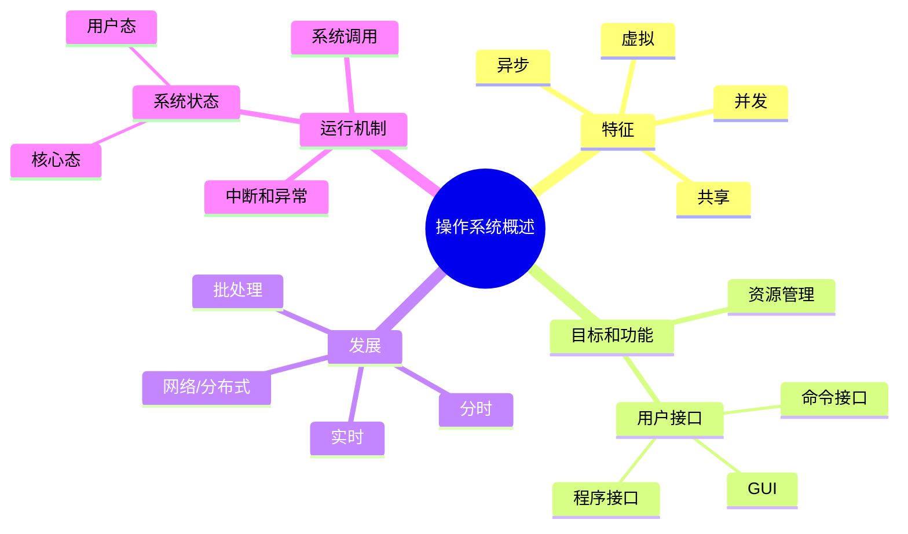
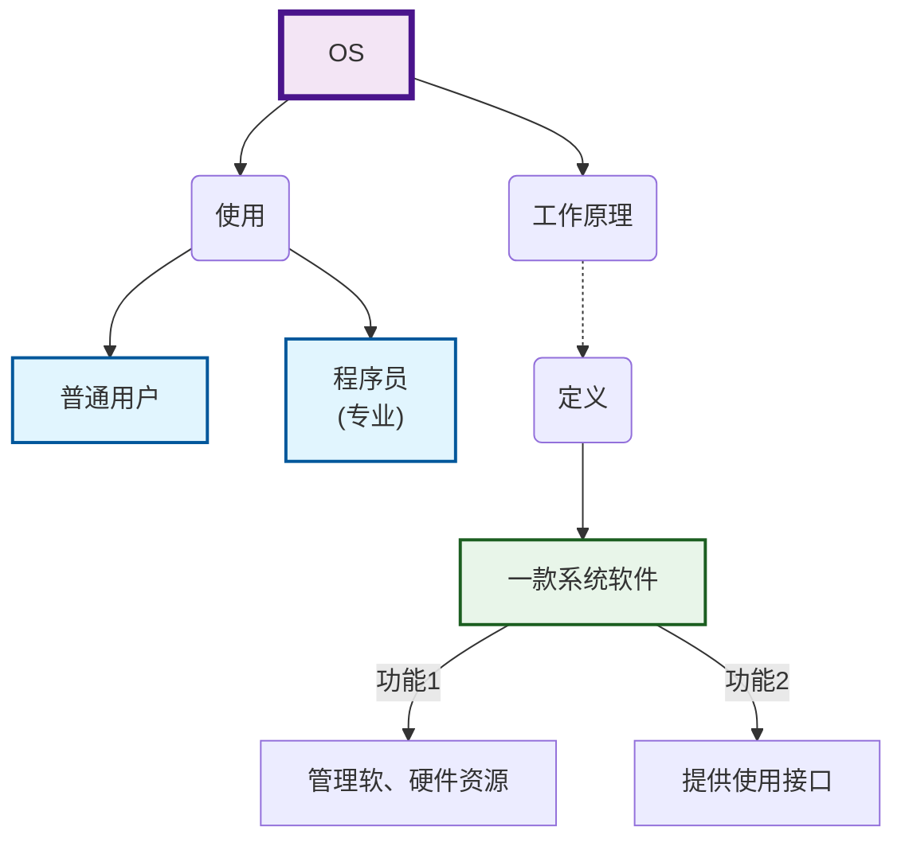
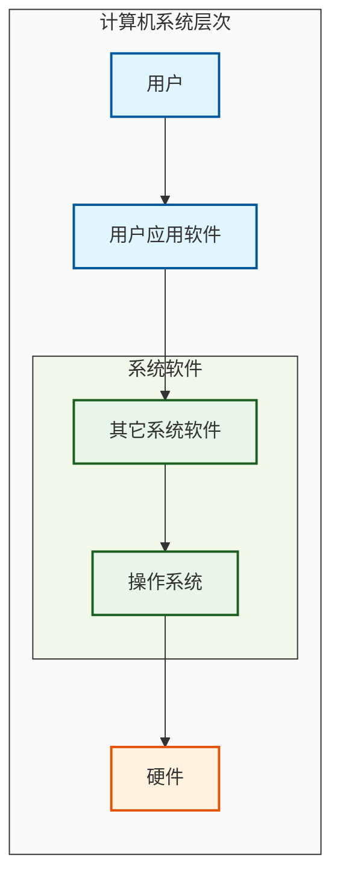
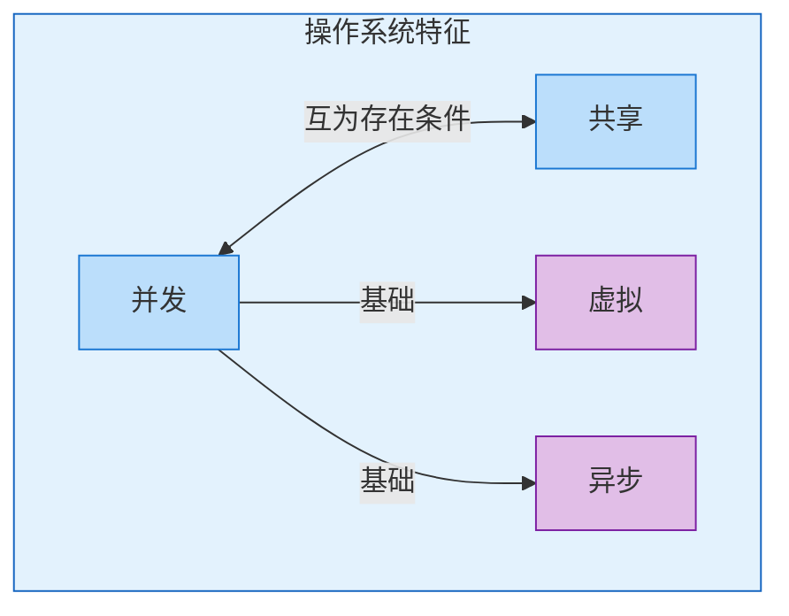
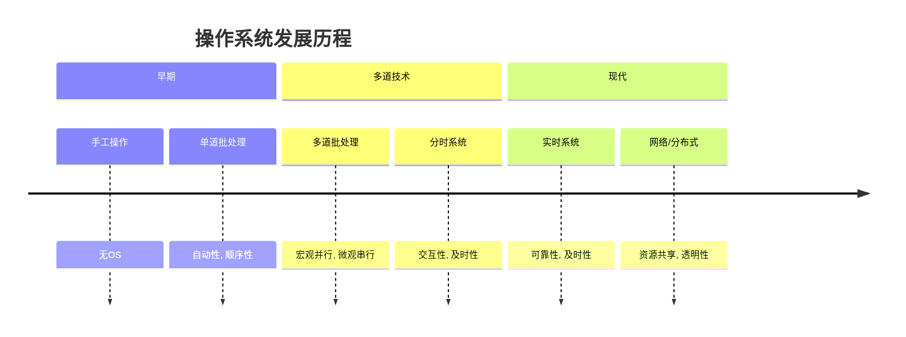
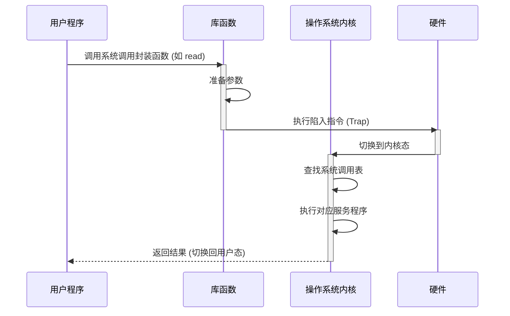
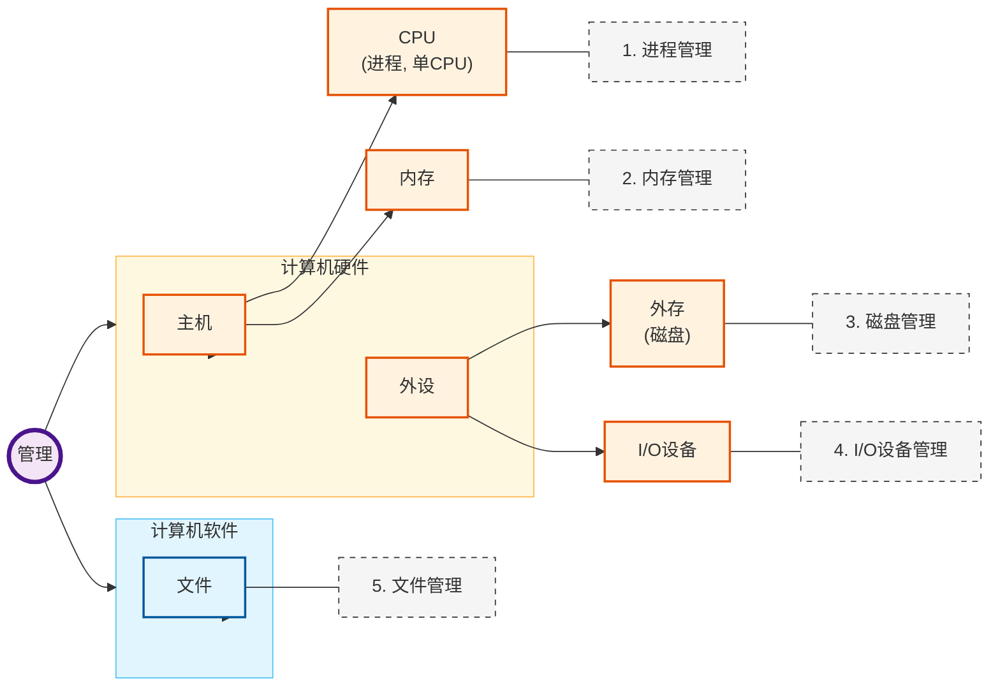

# 01-操作系统概述

## 一、 操作系统的定义与角色

操作系统（Operating System，OS）是配置在计算机硬件上的第一层软件，是对硬件系统的首次扩充。

### 1.1 研究操作系统的三种观点

通常可以从以下三个角度来理解和研究操作系统：

1. **资源管理观点**
    * 操作系统是计算机系统资源的管理者。
    * **管理对象**：处理器（CPU）、存储器、I/O设备、文件（数据）。
    * **目标**：高效、合理地分配资源，提高资源利用率。

2. **用户接口观点**
    * 操作系统是用户与计算机硬件系统之间的接口。
    * 用户通过操作系统提供的接口使用计算机，而无需关心底层硬件细节。
    * **接口类型**：命令接口、程序接口（系统调用）、图形用户接口（GUI）。

3. **进程管理观点**
    * 操作系统主要由若干个进程（Process）组成。
    * 操作系统对进程进行管理，包括进程的创建、撤销、调度、同步与通信等。
    * 从这个角度看，操作系统是进程的管理者。

### 1.2 操作系统的用户界面

操作系统为用户提供了多种使用计算机的界面（接口）：

1. **命令接口 (Command Interface)**
    * **联机命令接口**（交互式）：用户输入一条命令，系统执行一条。适用于分时系统。
        * 例如：Windows 的 CMD/PowerShell，Linux 的 Bash。
    * **脱机命令接口**（批处理）：用户提供作业说明书（脚本），系统按顺序执行。适用于批处理系统。

2. **程序接口 (Program Interface)**
    * 即**系统调用 (System Call)**。
    * 这是操作系统提供给**程序员**（应用程序）使用的接口。
    * 用户通过在程序中调用系统调用来请求操作系统服务。

3. **图形用户接口 (GUI)**
    * 通过图标、窗口、菜单等图形元素与系统交互。
    * 例如：Windows、macOS、Ubuntu Desktop。
    * *注：GUI 最终通常也是通过调用系统调用来实现的。*

## 二、 计算机系统层次结构

计算机系统自下而上可分为：硬件、操作系统、其它系统软件、用户应用软件、用户。

* **硬件 (Hardware)**：系统的物理基础。
* **操作系统 (OS)**：直接运行在硬件之上，管理硬件并为上层软件提供支持。
* **其它系统软件**：如编译程序、数据库管理系统等，通常运行在 OS 之上。
* **应用软件**：解决具体问题的软件。
* **用户**：系统的最终使用者。

## 三、 操作系统的特征

操作系统的四个基本特征：**并发**、**共享**、**虚拟**、**异步**。其中并发和共享是两个最基本的特征，二者互为存在条件。

1. **并发 (Concurrency)**

* 指两个或多个事件在同一时间间隔内发生。
* **区别并行 (Parallel)**：并行指两个或多个事件在同一时刻发生（多核CPU）。
* 在单核 CPU 上，进程是并发执行的（宏观上同时，微观上交替）。

2. **共享 (Sharing)**

* 指系统中的资源可供内存中多个并发执行的进程共同使用。
* **互斥共享**：如打印机，一段时间只允许一个进程访问。
* **同时共享**：如磁盘文件，允许在一个时间段内由多个进程"同时"访问（宏观上）。

3. **虚拟 (Virtualization)**

* 把一个物理上的实体变为若干个逻辑上的对应物。
* **时分复用**：如虚拟处理器技术（多道程序设计）。
* **空分复用**：如虚拟存储器技术。

4. **异步 (Asynchrony)**

* 在多道程序环境下，进程以不可预知的速度向前推进。
* 尽管走走停停，但 OS 需保证运行结果的可再现性。

## 四、 操作系统的基本类型

操作系统的发展经历了从无到有、从简单到复杂的过程，主要类型包括：

1. **批处理操作系统 (Batch Processing OS)**
    * **单道批处理**：内存中仅有一道程序，自动、顺序执行。解决人机矛盾，但 CPU 利用率低。
    * **多道批处理**：内存中同时驻留多道程序，并发执行。
        * **特点**：多道性、无交互性、调度性。
        * **优点**：资源利用率高，系统吞吐量大。
        * **缺点**：无交互能力，用户响应时间长。

2. **分时操作系统 (Time-Sharing OS)**
    * 一台主机连接多个终端，CPU 按时间片轮流为各个终端服务。
    * **特点**：
        * **多路性**：同时服务多个用户。
        * **独立性**：用户之间互不干扰。
        * **及时性**：响应时间短。
        * **交互性**：用户可与系统进行人机对话。
    * 解决了人机交互问题。

3. **实时操作系统 (Real-Time OS, RTOS)**
    * 系统能及时响应外部事件，并在严格的时限内完成处理。
    * **特点**：及时性、可靠性（高可靠性是 RTOS 的关键）。
    * **分类**：
        * **硬实时**：必须在绝对严格的截止时间内完成（如导弹制导、自动驾驶）。
        * **软实时**：偶尔错过截止时间可接受（如视频流媒体）。

4. **网络操作系统 (Network OS)**
    * 基于计算机网络，在各种计算机操作系统之上，提供网络管理、通信、安全、资源共享和各种网络应用。
    * **特点**：网络通信、资源共享、网络管理、互操作性。

5. **分布式操作系统 (Distributed OS)**
    * 若干台计算机通过网络连接，但在系统中**统一管理**，对用户是**透明**的（用户感觉不到多台计算机的存在）。
    * **特点**：统一性（核心特征）、透明性、健壮性。
    * *区别*：网络 OS 侧重资源共享，分布式 OS 侧重任务分布和统一管理。

6. **个人计算机操作系统 (Personal Computer OS)**
    * 目前最广泛使用的 OS，如 Windows, macOS, Linux。

7. **嵌入式操作系统 (Embedded OS)**
    * 运行在嵌入式智能芯片环境中，如 iOS, Android, VxWorks, uC/OS。
    * **特点**：微型化、专用性强、实时性强。

## 五、 操作系统的运行环境

### 5.1 运行机制

* **两种指令**：
  * **特权指令**：不允许用户直接使用，如 I/O 指令、置中断指令。
  * **非特权指令**：普通运算指令。
* **两种状态**：
  * **内核态 (Kernel Mode)**：运行内核程序，可执行特权指令。
  * **用户态 (User Mode)**：运行应用程序，只能执行非特权指令。
* **状态切换**：
  * 用户态 -> 内核态：**中断/异常** (唯一途径)。
  * 内核态 -> 用户态：执行特权指令 (修改 PSW)。

### 5.2 中断与异常

* **中断 (Interruption)**：来自 CPU 执行指令以外的事件 (外中断)。如 I/O 中断、时钟中断。
* **异常 (Exception)**：源自 CPU 执行指令内部的事件 (内中断)。如非法操作码、地址越界、算术溢出、缺页。

### 5.3 系统调用 (System Call)

* **定义**：用户在程序中调用操作系统提供的一些子功能。系统调用是操作系统提供给应用程序（程序员）使用的接口。
* **实现机制**：系统调用必须通过**陷入指令 (Trap)**（也称访管指令）在**内核态**下完成。
* **调用过程**：
    1. 传递系统调用参数。
    2. 执行陷入指令（用户态 -> 内核态）。
    3. 执行相应的内核服务程序（系统调用处理程序）。
    4. 返回用户态。

#### 系统调用的分类

通常系统调用按功能可分为以下几类：

1. **进程控制类**
    * 创建/终止进程 (fork, exit)
    * 获得/设置进程属性 (getpid)
    * 阻塞/唤醒进程 (wait, signal)
2. **文件管理类**
    * 创建/删除文件 (create, delete)
    * 打开/关闭文件 (open, close)
    * 读/写文件 (read, write)
3. **设备管理类**
    * 申请/释放设备
    * 设备 I/O 重定向
4. **通信类**
    * 建立/断开连接
    * 发送/接收消息
5. **信息维护类**
    * 获取当前时间 (time)
    * 获取系统版本信息

## 六、 资源管理功能详解

操作系统的核心功能是对计算机系统的四大类资源进行管理：**处理器 (CPU)**、**存储器 (Memory)**、**I/O 设备** 和 **文件 (信息)**。

### 6.1 处理器管理 (进程管理)

核心是对 **CPU** 的分配与调度，基本单位是 **进程**。

* **1.1 进程的概念**
  * **程序**：指令的有序集合，静态概念。
  * **进程**：程序的一次执行过程，是资源分配的基本单位。
  * **区别**：进程是动态的，程序是静态的；进程包含 PCB (进程控制块)。
* **1.2 进程的状态及转换**
  * 三态模型：就绪、运行、阻塞。
  * 五态模型：增加创建、终止。
* **1.3 进程的控制与调度**
  * **控制**：使用原语（创建、撤销、阻塞、唤醒）控制进程状态转换。
  * **调度**：决定哪个进程获得 CPU。
    * **方式**：剥夺式（抢占）、非剥夺式（非抢占）。
    * **算法**：
      1. **FCFS** (先来先服务)：公平，但对短作业不利。
      2. **优先级调度**：静态优先级 / 动态优先级。
      3. **时间片轮转 (RR)**：保证响应时间，适用于分时系统。
      4. **多级反馈队列**：综合了前几种算法的优点。
* **1.4 进程间的关系**：同步（协作）与互斥（竞争）。
* **1.5 进程通信**：共享存储、消息传递、管道通信。
* **1.6 死锁**：多个进程因竞争资源而造成的僵局。

### 6.2 存储器管理 (内存管理)

核心是为多道程序提供良好的内存环境，提高内存利用率。

* **2.1 内存分配与回收**：分区管理（固定/动态）。
* **2.2 内存扩充**：虚拟内存技术（覆盖、交换）。
* **2.3 地址映射**：逻辑地址到物理地址的转换。
* **2.4 存储保护**：保证进程间互不干扰。
* **主要方式**：
  * **分页管理**：解决碎片问题。
  * **分段管理**：符合逻辑结构。
  * **段页式管理**：集两者之长。

### 6.3 设备管理 (I/O 管理)

核心是完成用户的 I/O 请求，提高 CPU 与 I/O 设备的并行度。

* **3.1 磁盘管理** (外存)
  * 物理结构、读写过程。
  * **磁盘调度算法**：先来先服务、SSTF (最短寻道时间优先)、SCAN (电梯算法) 等。
* **3.2 I/O 控制方式**
  * 程序轮询、中断驱动、DMA (直接存储器访问)、通道控制。
* **3.3 缓冲技术**：引入缓冲区，缓和 CPU 与设备速度不匹配矛盾。
* **3.4 设备分配与驱动**：设备独立性软件、设备驱动程序。

### 6.4 文件管理

核心是解决软件资源的存储、共享和保护。

* **4.1 文件系统**：定义与分类。
* **4.2 逻辑结构**：流式文件、记录式文件。
* **4.3 物理结构**：连续分配、链接分配、索引分配。
* **4.4 目录管理**：文件控制块 (FCB)、目录树。
* **4.5 文件共享与保护**：存取控制。
