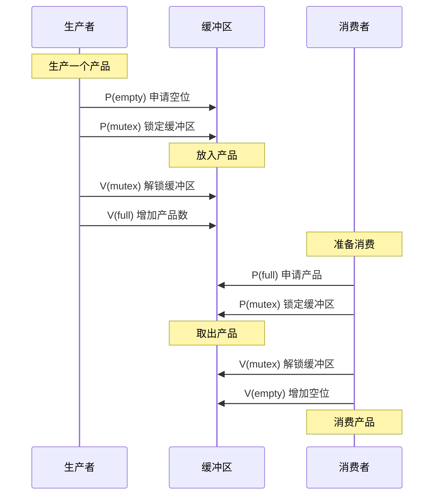
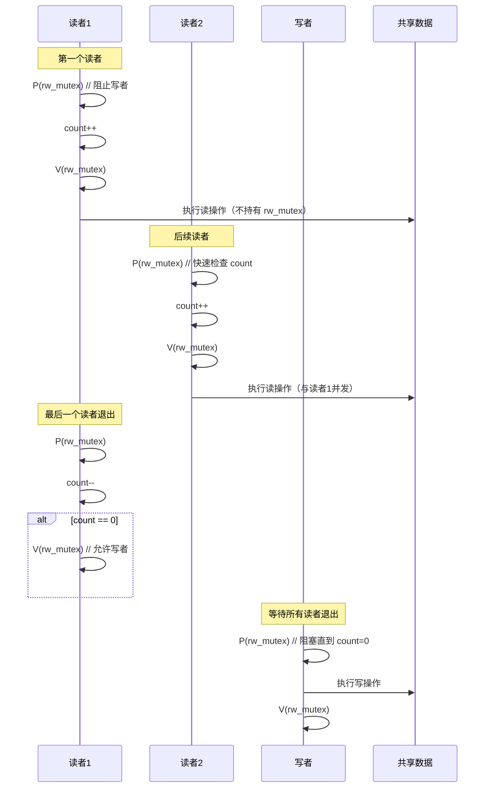

# 进程的互斥与同步

## 1. 基本概念

### 临界资源 (Critical Resource)

一次仅允许一个进程使用的资源。

* **物理临界资源**：如打印机、磁带机等。
* **逻辑临界资源**：如共享变量、共享缓冲区等。

### 临界区 (Critical Section)

进程中访问临界资源的那段代码。
为了保证临界资源的正确使用，将访问临界资源的过程分为四个部分：

1. **进入区**：检查是否可进入，若可进入则设置正在访问标志（上锁）。
2. **临界区**：访问临界资源的代码。
3. **退出区**：清除正在访问标志（解锁）。
4. **剩余区**：代码中的其余部分。

### 同步与互斥

* **互斥 (Mutual Exclusion)**：间接制约关系。指当一个进程进入临界区使用临界资源时，另一个进程必须等待。
* **同步 (Synchronization)**：直接制约关系。指为完成某种任务而建立的两个或多个进程，因为需要在某些位置上协调工作次序而产生的制约关系（如：A必须在B之前执行）。

## 2. 临界区互斥的实现原则

1. **空闲让进**：临界区空闲时，允许一个请求进入的进程立即进入。
2. **忙则等待**：当已有进程进入临界区时，其他试图进入的进程必须等待。
3. **有限等待**：对请求进入的进程，应保证能在有限时间内进入（防止“饥饿”）。
4. **让权等待**：当进程不能进入临界区时，应立即释放处理机，防止进程处于“忙等”状态。

## 3. 信号量机制 (Semaphore)

信号量机制是 Dijkstra 提出的一种卓有成效的进程同步工具。

### 3.1 整型信号量

用一个整数型变量 `S` 表示资源数目。

* **P操作 (wait)**：`while(S <= 0); S--;` (存在“忙等”问题，未遵循让权等待)
* **V操作 (signal)**：`S++;`

### 3.2 记录型信号量

为了解决“忙等”现象，引入记录型信号量。它包含两个数据项：

1. `value`：资源剩余数量。
2. `L`：等待队列 (Linked List)。

```c
typedef struct {
    int value;
    struct process *L;
} semaphore;
```

#### P操作 (wait)

申请资源：

1. `S.value--`
2. 若 `S.value < 0`，表示资源已分配完毕，进程调用 `block` 原语自我阻塞，放弃 CPU，并插入等待队列 `S.L`。

#### V操作 (signal)

释放资源：

1. `S.value++`
2. 若 `S.value <= 0`，表示等待队列中仍有进程在等待，调用 `wakeup` 原语唤醒 `S.L` 中的第一个进程。

## 4. 经典同步问题

### 4.1 生产者-消费者问题 (Producer-Consumer)

**问题描述**：

* 一组生产者进程和一组消费者进程共享一个初始为空、大小为 `n` 的缓冲区。
* 只有缓冲区没满时，生产者才能把产品放入缓冲区，否则必须等待。
* 只有缓冲区不空时，消费者才能从中取出产品，否则必须等待。
* 缓冲区是临界资源，各进程必须互斥访问。

---

#### 经典模型（单互斥锁）

##### 信号量设置

* `mutex = 1`：互斥信号量，实现对**整个缓冲区**的互斥访问（生产者与消费者互斥）。
* `empty = n`：同步信号量，表示空闲缓冲区的数量。
* `full = 0`：同步信号量，表示非空缓冲区（产品）的数量。

> **适用场景**：缓冲区为**单一共享数组**（如 `buffer[0..n-1]`），所有读写操作必须串行化。



:::info 注意

* 在 `P(empty)` 和 `P(mutex)` 的顺序上，必须先申请 `empty`，再申请 `mutex`。
* 否则可能导致死锁：例如生产者持有 `mutex` 但 `empty=0`，而消费者需要 `mutex` 才能执行 `V(empty)` 释放空位。
:::

---

#### 变种模型（双互斥锁）——适用于“多独立缓冲区”场景

> **适用前提**：
> 缓冲区由 **`m` 个独立的有界缓冲区**（如内存块、slot）组成，
> **生产者和消费者可同时操作不同的缓冲区**（但不能操作同一个）。

###### 信号量设置

* `mutex1 = 1`：互斥信号量，**仅用于生产者之间互斥**（保护“选择空缓冲区 + 写入”的原子性）。
* `mutex2 = 1`：互斥信号量，**仅用于消费者之间互斥**（保护“选择满缓冲区 + 读取”的原子性）。
* `empty = m`：同步信号量，表示**空闲缓冲区数量**。
* `full = 0`：同步信号量，表示**已填充的缓冲区数量**。
  → 满足：`empty + full = m`（总缓冲区数）

> **优势**：
>
> * 允许多个生产者**并行写入不同空缓冲区**
> * 允许多个消费者**并行读取不同满缓冲区**
> * 提高并发性（相比经典模型）

##### 执行流程

**对于生产者**:

```text
P(empty);          // 申请一个空缓冲区
P(mutex1);         // 锁定自身操作（防止多个生产者选到同一空区）
放入产品到某空缓冲区
V(mutex1);         // 释放生产者互斥锁
V(full);           // 通知消费者：有一个新数据
```

**对于消费者**:

```text
P(full);           // 申请一个满缓冲区
P(mutex2);         // 锁定自身操作（防止多个消费者选到同一满区）
从某满缓冲区取出产品
V(mutex2);         // 释放消费者互斥锁
V(empty);          // 通知生产者：释放一个空位
```

> **重要限制**：
> 此模型**要求缓冲区是独立的**（如通过指针、ID 或索引隔离），
> **不能用于单一共享数组**（否则仍需全局 `mutex` 防止数据竞争）。

---

#### 模型对比总结

| 特性 | 经典模型（单 `mutex`） | 变种模型（双 `mutex1/mutex2`） |
|------|----------------------|------------------------------|
| **缓冲区结构** | 单一共享数组 | 多个独立缓冲区（slot/pool） |
| **互斥范围** | 生产者 ⇄ 消费者 互斥 | 生产者 ⇄ 生产者、消费者 ⇄ 消费者 互斥 |
| **并发能力** | 低（串行访问缓冲区） | 高（生产/消费可并行） |
| **适用场景** | 通用、教学、简单系统 | 高性能系统（如网络包处理、DMA 缓冲池） |
| **安全性** | 安全（强互斥） | 安全（**仅当缓冲区独立时**） |

---

#### 关键理解

* **是否需要全局互斥**，取决于**缓冲区是否共享同一块内存**。
* 经典模型是**最安全、最通用**的实现；
* 变种模型是**在特定前提下的优化**，**不能随意替换**。

> **原则**：
> 如果你不确定缓冲区是否“真正独立”，**请使用经典模型**（单 `mutex`）。

### 4.2 读者-写者问题 (Readers-Writers)

**问题描述**：

* 允许多个读者同时对文件执行读操作。
* 只允许一个写者往文件中写信息。
* 任一写者在完成写操作之前不允许其他读者或写者工作。
* 写者执行写操作前，应让已有的读者和写者全部退出。

**核心思想**：

* 写者与写者互斥。
* 写者与读者互斥。
* 读者与读者不互斥（可同时读）。
* 引入计数器 `count` 记录当前读者数量。第一个读者负责加锁，最后一个读者负责解锁。

**信号量设置**：

`rw_mutex = 1`：互斥信号量，保护写操作和读者计数器 count 的更新。

\\-> 本质是写者锁，也用于保护 count 的原子性。

`count = 0`：读者计数器（需与 rw_mutex 配合使用，确保原子增减）。



**信号语义**：

```text
wrt = 1      // 写者锁（也用于第一个读者阻塞写者）
mutex = 1    // 保护 count 的互斥锁
count = 0    // 当前读者数
```

**读者读操作**：

```text
P(mutex);          // 进入临界区：保护 count
count = count + 1;
if (count == 1) {
    P(wrt);        // 第一个读者：阻塞写者，后续读者可完全不管 wrt
}
V(mutex);          // 释放 count 保护锁

read();            // 并发读（不持有任何锁）

P(mutex);          // 再次进入临界区
count = count - 1;
if (count == 0) {
    V(wrt);        // 最后一个读者：释放写者
}
V(mutex);          // 释放 count 保护锁
```

**读者写操作**：

```text
P(wrt);            // 请求写权限（会被读者阻塞）
write();           // 独占写
V(wrt);            // 释放写权限
```

### 4.3 哲学家进餐问题 (Dining Philosophers)

**问题描述**：
5个哲学家围坐一桌，每人之间有一根筷子（共5根）。哲学家只有同时拿到左右两根筷子才能进餐。

* 每位哲学家循环执行：**思考 → 饥饿 → 进餐 → 思考**
* 筷子是**临界资源**，一次只能被一个哲学家用。

**死锁风险**：
若所有哲学家**同时拿起左边的筷子**，则每人持有一根，都在等待右边的筷子 → **循环等待 → 死锁**。
（满足死锁四条件：互斥、占有并等待、不可剥夺、循环等待）

#### 解决方案

##### 1. **限制就餐人数**（最多4人同时进餐）

> **思想**：打破“循环等待”条件 —— 确保至少有一人能拿到两根筷子。

**信号量设置**：

```text
chopstick[5] = {1,1,1,1,1}  // 每根筷子一个信号量
max_diners = 4              // 限制同时就餐人数，设置为4
```

**哲学家 i 的行为**：

```text
P(max_diners);               // 申请就餐资格
P(chopstick[i]);             // 拿左边筷子
P(chopstick[(i+1)%5]);       // 拿右边筷子
eat();
V(chopstick[(i+1)%5]);       // 放右边
V(chopstick[i]);             // 放左边
V(max_diners);               // 释放就餐资格
```

**优点**：简单、有效、无死锁
**缺点**：可能**降低并发度**（最多4人，而非5人）

在这种模型下，最多允许4位哲学家同时进餐，从而确保至少有一位哲学家能够顺利拿到两根筷子，避免了死锁的发生。

---

##### 2. **奇偶策略**（破坏环路）

> **思想**：让部分哲学家**先拿左**，部分**先拿右**，打破对称性，避免循环等待。

**哲学家 i 的行为**：

```text
if (i % 2 == 0) {            // 偶数号：先右后左
    P(chopstick[(i+1)%5]);
    P(chopstick[i]);
} else {                     // 奇数号：先左后右
    P(chopstick[i]);
    P(chopstick[(i+1)%5]);
}
eat();
V(chopstick[i]);             // 放左
V(chopstick[(i+1)%5]);       // 放右
```

**优点**：无需额外信号量，**并发度高**（可5人同时吃）
**缺点**：**仅适用于固定编号场景**；若哲学家数为偶数，可能仍出现死锁

> **关键**：因5是奇数，无法形成“先拿左→等待右”的闭环。

---

##### 3. **原子取放**（AND 型信号量）

> **思想**：只有**左右筷子同时可用**，才允许拿起；否则**全部不拿**。

**实现方式**（使用记录型信号量 + 条件检查）：

```text
// 伪代码（需原子性）
if (chopstick[i].available && chopstick[(i+1)%5].available) {
    take both;
    eat();
    release both;
} else {
    wait();  // 或放弃
}
```

**实际可用替代方案**（用一个全局互斥锁）：

```text
P(mutex);                    // 全局锁
if (left_free && right_free) {
    take both;
    V(mutex);
    eat();
    P(mutex);
    release both;
    V(mutex);
} else {
    V(mutex);
    think(); // 或等待
}
```

**优点**：逻辑清晰，**无死锁**
**缺点**：**严重降低并发性**（全局锁），违背哲学家问题初衷

---

##### 4. **超时放弃策略**

> **思想**：若拿不到第二根筷子，**主动释放已持有的筷子**，稍后再试。

**哲学家 i 的行为**：

```text
while (true) {
    P(chopstick[i]);                // 拿左
    if (try_P(chopstick[(i+1)%5])) { // 尝试拿右（非阻塞）
        eat();
        V(chopstick[(i+1)%5]);
        V(chopstick[i]);
        break;
    } else {
        V(chopstick[i]);            // 放左，避免死锁
        think_a_while();            // 稍后再试
    }
}
```

**优点**：无死锁，**高并发**
**缺点**：需支持**非阻塞信号量操作**（如 `try_P`），标准信号量需用**超时机制**模拟

---

#### 方案对比总结

| 方案 | 死锁风险 | 并发度 | 实现复杂度 |
|------|--------|--------|----------|
| 限制人数 |  无 | 中（≤4人） | 低 |
| 奇偶策略 |  无 | 高（5人） | 低 |
| 原子取放 |  无 | 低（串行） | 中 |
| 超时放弃 |  无 | 高 | 高 |

---

#### 关键理解

* 哲学家问题本质是**资源分配 + 死锁避免**的模型。
* 所有方案都**破坏死锁四条件之一**（通常是“循环等待”或“占有并等待”）。
* **没有完美方案**：需在**安全性、并发性、复杂度**之间权衡。

## 5. 管程 (Monitor)

### 概念

管程是一种高级同步机制，由一组数据及定义在这组数据之上的操作（过程）组成。

* **特点**：管程内的代码只能被一个进程互斥地执行（由编译器实现互斥，程序员无需关心）。

### 组成

1. **局部数据结构**：只能被管程内部的过程访问。
2. **过程 (函数)**：对局部数据进行操作。
3. **初始化代码**。

### 条件变量 (Condition Variable)

为了解决同步问题，管程引入了条件变量。

* `wait` 操作：当条件不满足时，进程阻塞，并释放管程锁。
* `signal` 操作：唤醒一个因该条件而阻塞的进程。
