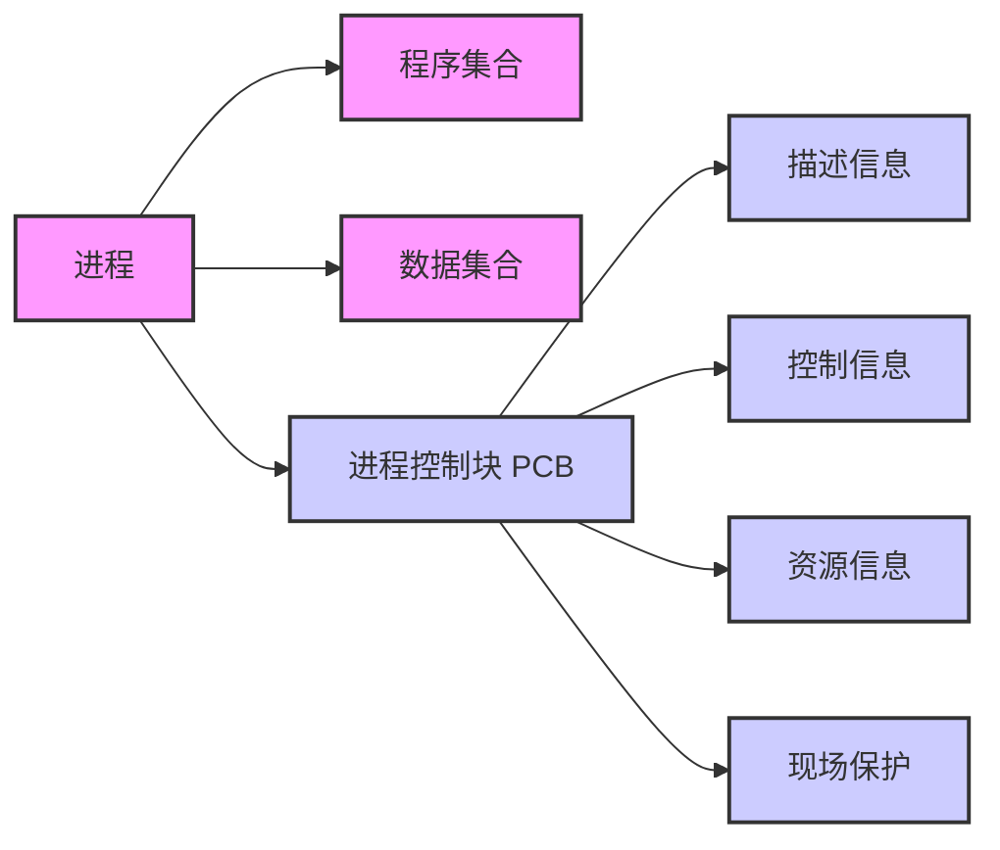
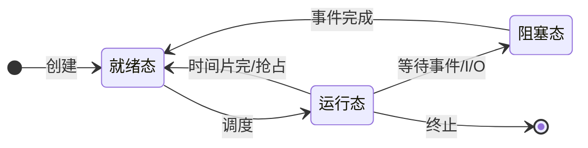
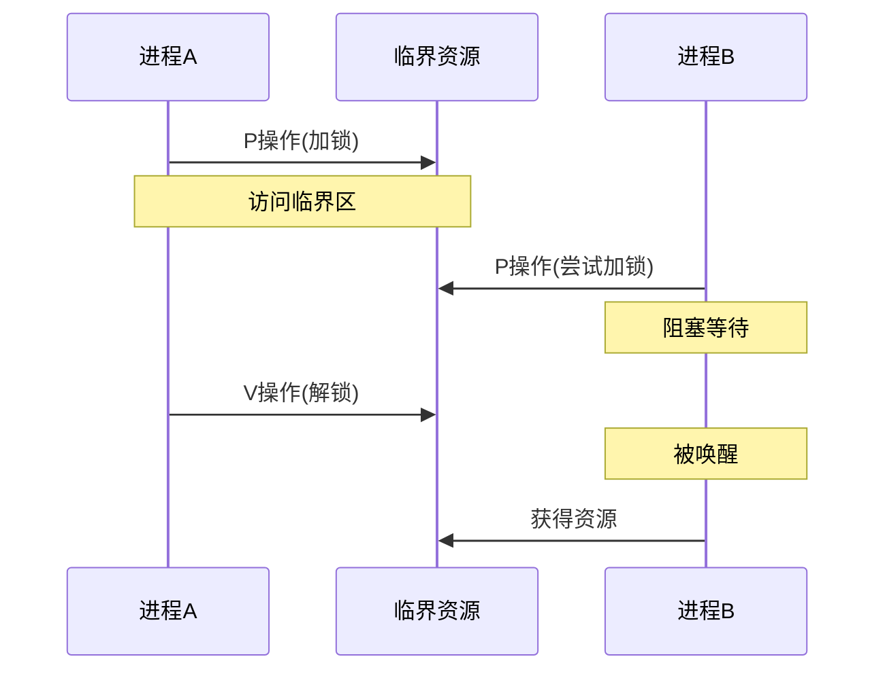
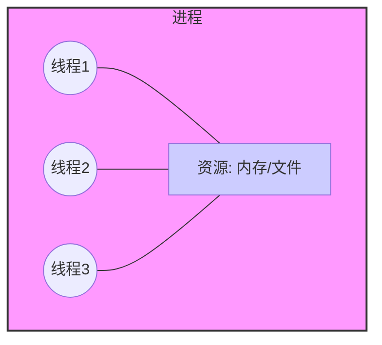

# 进程

## 1. 进程的概念和描述

### 概念

进程是程序的一次执行过程，是系统进行资源分配和调度的一个独立单位。

### 进程与程序的区别

- **程序**：具有**顺序性**、**封闭性**、**可再现性**。
- **进程**：具有**独立性**（独立地址空间）、**随机性**，并可参与**资源共享**。
- **动态性**：进程是动态的，程序是静态的。
- **并发性**：进程可以并发执行，程序不能。

### 进程的组织

进程主要由**程序集合**、**数据集合**和**进程控制块 (PCB)** 三部分组成。

### 进程控制块 PCB (Process Control Block)

PCB 是进程存在的唯一标志。主要包含：

1. **描述信息**：进程号 (PID)、用户标识符 (UID) 等。
2. **控制信息**：进程状态、优先级、程序入口地址等。
3. **资源信息**：内存、文件、设备等资源清单。
4. **现场保护**：CPU 现场信息（各种寄存器值）、上下文结构。

## 2. 进程状态及转换

### 三种基本状态

1. **运行态 (Running)**：进程正在处理机上运行。
2. **就绪态 (Ready)**：进程已获得除处理机以外的一切所需资源，一旦得到处理机即可运行。
3. **阻塞态 (Blocked/Waiting)**：进程正在等待某一事件而暂停运行（如等待I/O完成）。

### 状态转换

- **就绪 -> 运行**：调度程序选择一个新的进程运行。
- **运行 -> 就绪**：时间片用完，或被更高优先级的进程抢占。
- **运行 -> 阻塞**：进程请求I/O，或申请资源失败，或等待某个事件。
- **阻塞 -> 就绪**：I/O完成，或申请的资源得到满足，或等待的事件发生。

### 注意：不能进行的转换

- **阻塞 -> 运行**：阻塞进程必须先进入就绪队列，等待调度。

- **就绪 -> 阻塞**：进程只有在运行时才能发出I/O请求或等待事件，因此不能直接从就绪变为阻塞。

## 3. 进程控制（四种原语）

进程控制通过**原语**实现，原语的主要特点是**原子性**（执行期间不允许中断）。

1. **创建原语 (Create)**：
    - 申请空白PCB。
    - 为新进程分配资源。
    - 初始化PCB。
    - 将新进程插入就绪队列。
2. **终止原语 (Destroy)**：
    - 从PCB集合中找到终止进程的PCB。
    - 若进程正在运行，立即剥夺CPU。
    - 回收进程拥有的所有资源。
    - 撤销PCB。
3. **阻塞原语 (Block)**：
    - 找到要阻塞进程的PCB。
    - 保护现场，将状态改为阻塞态。
    - 将PCB插入相应的等待队列。
4. **唤醒原语 (Wakeup)**：
    - 在等待队列中找到进程PCB。
    - 将其从等待队列移出，状态改为就绪态。
    - 插入就绪队列。

## 4. 进程的通信

1. **共享内存 (Shared Memory)**：
    - 在内存中开辟一个共享存储区，各进程通过对该存储区的读写来实现通信。
    - 速度最快，需要同步机制配合。
2. **消息传递 (Message Passing)**：
    - **直接通信**：发送进程直接把消息发送给接收进程。
    - **间接通信 (信箱)**：发送进程把消息发送到中间实体（信箱），接收进程从信箱中取得消息。
3. **管道 (Pipe)**：
    - 利用一种特殊的 pipe 文件连接两个进程。
    - 数据单向流动（半双工）。
    - **匿名管道**通常用于父子进程通信；**命名管道 (FIFO)** 可用于无关进程。

## 5. 进程同步与互斥

### 两种制约关系

1. **同步（直接制约关系）**：
    - **定义**：为完成某种任务而建立的两个或多个进程，因为需要在某些位置上协调工作次序而产生的制约关系。
    - **例子**：生产-消费问题（先生产，后消费）。
2. **互斥（间接制约关系）**：
    - **定义**：当一个进程进入临界区使用临界资源时，另一个进程必须等待。
    - **例子**：打印机资源共享。

### 互斥的执行过程

### 信号量机制 (PV操作)

用于解决同步与互斥问题的有效工具。

- **P操作 (wait)**：申请资源。`S = S - 1`，若 `S < 0`，进程进入阻塞队列。
- **V操作 (signal)**：释放资源。`S = S + 1`，若 `S <= 0`，唤醒一个阻塞进程。
- **注意**：互斥信号量初值通常为 1；同步信号量初值由资源数量决定。

## 6. 死锁问题

### 概念

多个进程因竞争资源而造成的一种僵局（互相等待），若无外力作用，这些进程都将无法向前推进。

### 死锁产生的四个必要条件

1. **互斥条件**：资源是独占的。
2. **不剥夺条件**：进程获得的资源在未使用完之前，不能被其他进程强行夺走。
3. **请求和保持条件**：进程已经保持了至少一个资源，但又提出了新的资源请求。
4. **循环等待条件**：存在一种进程资源的循环等待链。

### 死锁预防

破坏四个必要条件中的一个或多个：

- 破坏互斥条件（一般不现实）。
- 破坏不剥夺条件（实现复杂，代价大）。
- 破坏请求和保持条件（一次性申请所有资源）。
- 破坏循环等待条件（资源有序分配法）。

### 死锁避免 - 银行家算法

- **核心思想**：在资源分配前，先计算此次分配是否会导致系统进入**不安全状态**。如果会，则不分配；否则分配。
- **安全序列**：指如果系统按照这种序列分配资源，则每个进程都能顺利完成。只要能找出一个安全序列，系统就是安全的。

## 7. 线程

### 概念

线程是程序执行流的最小单元。

### 进程与线程的关系

### 引入线程后的变化

1. **资源分配**：**进程**依然是资源分配的基本单位。
2. **调度**：**线程**成为CPU调度和分派的基本单位。
3. **并发性**：不仅进程之间可以并发，同一个进程中的多个线程也可以并发执行。
4. **系统开销**：线程创建、切换的开销远小于进程。
