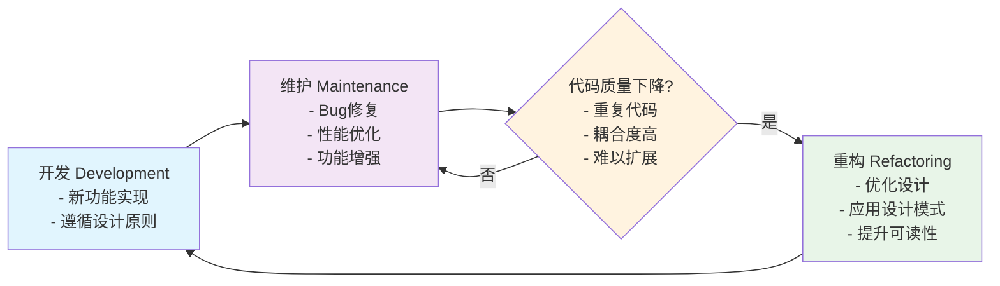

# 第一章 软件设计基础

> **软件设计不是让代码跑起来，而是让它能活下来。**

良好的软件设计是长期项目成功的基石。它决定了系统能否适应变化、团队能否高效协作、成本能否持续可控。

## 1 什么是良好的软件设计？

一个优秀的软件设计应具备以下五个核心特征：

| 特征 | 说明 |
|------|------|
| **可维护性** | 代码结构清晰，逻辑易懂，新人能快速上手，Bug 定位迅速。 |
| **可扩展性** | 新功能可独立添加，不影响现有模块，避免“牵一发而动全身”。 |
| **可复用性** | 模块或组件可在不同上下文中复用，减少重复造轮子。 |
| **可测试性** | 代码解耦良好，易于编写单元测试与集成测试，保障质量。 |
| **性能** | 在资源约束下满足响应时间、吞吐量等非功能性需求。 |

::: tip 为什么重要？
良好的设计不是“锦上添花”，而是**生存必需品**。

- **可维护性** → 减少修复 Bug 的时间成本
- **可扩展性** → 让产品能跟上市场变化
- **可复用性** → 提升团队整体开发效率
- **可测试性** → 构建对变更的“信心”
- **性能** → 直接影响用户留存与体验

> 💡 一个设计良好的系统，即使最初功能简单，也能优雅地演化为复杂系统。
:::

::: danger 不良设计的代价

- 单一巨型文件，职责混乱
- 模块间强耦合，修改一处崩溃一片
- 无接口抽象，替换实现成本极高
- 缺乏测试，上线即“开盲盒”

这类系统最终会演变为“技术债务黑洞”，团队在恐惧中维护，效率持续下滑。
:::

作为开发者，我们应始终保持对软件设计的好奇心，并努力提高设计质量。而遵从良好设计，我们才能更好的实现我们希望的软件目标。

## 2 设计原则与设计模式的关系

为了创建一个好的软件系统，设计原则和设计模式是两个重要的概念。

> **原则是“道”，模式是“术”。**

设计原则包含5 大维度：

1. **单一职责原则**：一个类或模块只负责一个功能。
2. **开放封闭原则**：一个软件实体（类、模块、函数）应该对扩展开放，对修改关闭。
3. **里氏替换原则**：子类必须能够替换掉父类。
4. **依赖倒置原则**：抽象公共行为，将细节封装在子类中。
5. **单一接口原则**：一个接口只负责一个功能。

设计模式分为三大类：

- **创建型模式**：关注如何创建对象实例。
- **结构型模式**：关注如何组织对象之间的关系。
- **行为型模式**：关注如何协调对象之间的交互。

::: details 代码示例

```java
import java.util.*;

// 行为型模式：策略模式 //[!code focus:1]
interface SortStrategy {
    void sort(List<Integer> list);
}
class BubbleSortStrategy implements SortStrategy { //[!code focus:2]
    // 这里继承父类，实现子类接口
    public void sort(List<Integer> list) {
        Collections.sort(list);
    }
}

// 结构型模式：外观模式 //[!code focus:1]
class SubSystemA { void operationA() { System.out.println("子系统A"); } }
class SubSystemB { void operationB() { System.out.println("子系统B"); } }
class Facade {
    // 组合对象, 组合对象的关系,这里通过组合，将多个对象组合在一起，从而实现具体的功能 //[!code focus:1]
    private SubSystemA a = new SubSystemA();
    private SubSystemB b = new SubSystemB();
    public void operation() { //[!code focus:1]
        a.operationA();//[!code focus:1]
        b.operationB();//[!code focus:1]
    }//[!code focus:1]
}

public class DesignPattern {
    public static void main(String[] args) {
        // 创建型模式：创建对象  //[!code focus:2]
        List<Integer> list = new ArrayList<>(Arrays.asList(3, 1, 2));
        System.out.println("创建的列表: " + list);

        // 结构型模式：组织对象
        Facade facade = new Facade();
        facade.operation();

        // 行为型模式：对象交互
        SortStrategy strategy = new BubbleSortStrategy();
        strategy.sort(list);
        System.out.println("排序后的列表: " + list);
    }
}
```

:::

> 本系列将只会介绍其中的 12 种经典设计模式,如果你还分不清这三类模式也不用担心，后续章节会结合实例详细讲解每种设计模式及其对应的设计原则。

将设计原则与设计模式联系起来，可以理解为：

| 维度 | 设计原则 | 设计模式 |
|------|----------|----------|
| **层级** | 抽象、高层指导 | 具体、可复用的解决方案 |
| **目的** | 定义“什么是对的” | 解决“如何做” |
| **灵活性** | 普适，不依赖语言 | 依赖语言特性与上下文 |

设计原则是思想，设计模式是满足设计原则的具体解决方案 —— **原则指导模式**

例如：SOLID 原则催生了工厂、策略、观察者等模式

#### 实例：单一职责原则（SRP） × 策略模式

```java
// 违反 SRP：一个类处理多种支付逻辑
class PaymentService {
    public void pay(String method, double amount) {
        if (method.equals("alipay")) { ... }
        else if (method.equals("wechat")) { ... }
        else if (...) { ... }
    }
    // 可以发现这里存在多个 if-else 分支，对未来扩展造成了困难
    // 如果我们要添加新的支付方式，那么就要回到这里，既不利于扩展，也容易影响之前的逻辑
}

// 遵循 SRP + 策略模式
interface PaymentStrategy {
    void pay(double amount);
}

class AlipayStrategy implements PaymentStrategy { ... }
class WechatStrategy implements PaymentStrategy { ... }

class PaymentService {
    private PaymentStrategy strategy;
    public void setStrategy(PaymentStrategy s) { this.strategy = s; }
    public void pay(double amount) { strategy.pay(amount); }
}
```

> **策略模式不是为了“多态”而存在，而是为了满足 SRP 和开闭原则。**
>
> 我们的目的不是增大类与类之间的复杂度，而通过将不同的支付方式封装成策略，根据使用的策略，选择执行对应的支付方式。这样新增支付方式时，只需添加新策略类，无需修改原有代码。

---

## 3 面向对象设计的核心思想

上面的无论是设计原则还是设计模式，最终都离不开**面向对象设计**这一核心思想。
面向对象（OOP）不是“类和对象”的语法糖，而是一种**组织复杂性的思维范式**。

### 核心四要素

| 概念 | 作用 | 价值 |
|------|------|------|
| **抽象** | 提取共性，隐藏细节 | 降低认知负荷，聚焦核心逻辑 |
| **封装** | 隐藏内部状态，暴露受控接口 | 保护数据完整性，减少副作用 |
| **继承** | 共享公共行为 | 实现代码复用 |
| **多态** | 同一接口，不同行为 | 提升扩展性，支持运行时动态替换 |

### 示例：动物系统

```java
// 抽象：定义公共契约
abstract class Animal {
    abstract void makeSound();
    void eat() { System.out.println("Eating..."); } // 共享实现
}

// 封装：私有数据 + 公共接口
class Dog extends Animal {
    private String name;
    public Dog(String name) { this.name = name; }
    @Override void makeSound() { System.out.println(name + " says: Woof!"); }
}

// 多态：同一接口，不同表现
Animal a1 = new Dog("Buddy");
Animal a2 = new Cat("Whiskers");

a1.makeSound(); // Woof!
a2.makeSound(); // Meow!
```

### OOP 的真正收益

- **模块化开发**：团队可并行开发不同的模块，并独立测试
- **高内聚低耦合**：修改一个类，影响最小 ———— 在你写完一个功能后，就测试这个功能，并确保所有测试通过，这样才算一个功能完成。后面继续开发，就避免修改已经通过测试的功能。
- **可插拔架构**：轻松替换实现（如换支付方式、换数据库）

---

## 4 软件演化与可维护性的重要性

> **90% 的软件生命周期成本发生在维护阶段。**

软件不是一次性的作品，而是一个**持续进化的有机体**。需求会变、用户会变、技术会变，而且在日新月异的网络环境下，新的漏洞会不断被发现，软件必须不断适应这些变化才能生存下去。

### 为什么可维护性是核心？

| 项目阶段 | 成本占比 | 目标 |
|----------|----------|----------------|
| 开发 | 10–20% | 满足开发目标，实现用户需求 |
| **维护** | **60–80%** | **持续扩展和修改，满足新需求，同时保持原有功能的持续可用** |
| 重构 | 10–15% | 对旧代码进行重构，提高可读性，提高可测试性以及可拓展性 |

>[!tip] 要习惯于重构
> 多数情况下，重构需要的精力是远大于普通开发。因为你要确保重构后的代码功能不变，且能更好的进行后续的扩展。但长期来看，重构能显著提升代码质量，降低未来维护成本。这需要我们有良好的设计，才能在重构时避免引入新的问题。

### 良好设计如何支持演化？

| 场景 | 不良设计 | 良好设计 |
|------|----------|----------|
| 添加新支付方式 | 修改 `PaymentService` 中的 if-else，风险高 | 实现新 `PaymentStrategy`，注入即可，零改动旧代码 |
| 修复一个 Bug | 影响 5 个模块，需回归测试 30 个用例 | 仅影响 1 个模块，单元测试覆盖，1 分钟验证 |
| 新人入职 | 花 2 周读懂代码 | 1 天看懂架构图 + 模块职责 |



软件开发往往是在 **开发 → 维护 → 重构** 的循环中不断演进，满足不断变化的需求。设计良好的系统才能可持续发展

### 小结

良好设计不是“更复杂”，而是“更可演化”。
它让变化 局部化、可预测、低成本，从而在需求不断变化的现实中，保持系统长期可维护性和团队高效交付能力。
