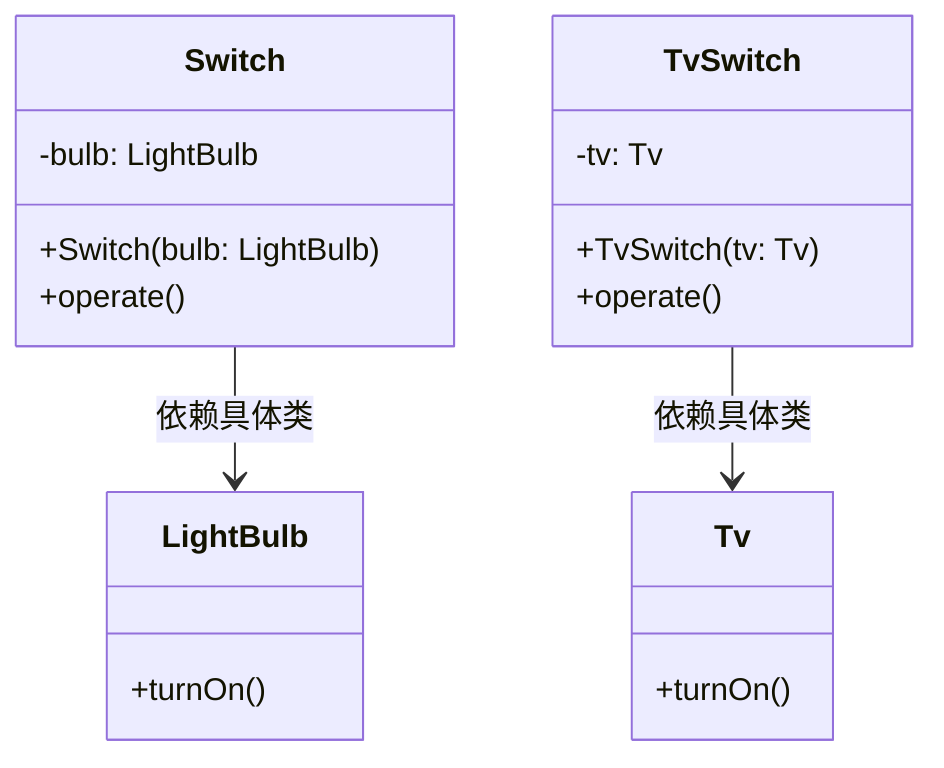
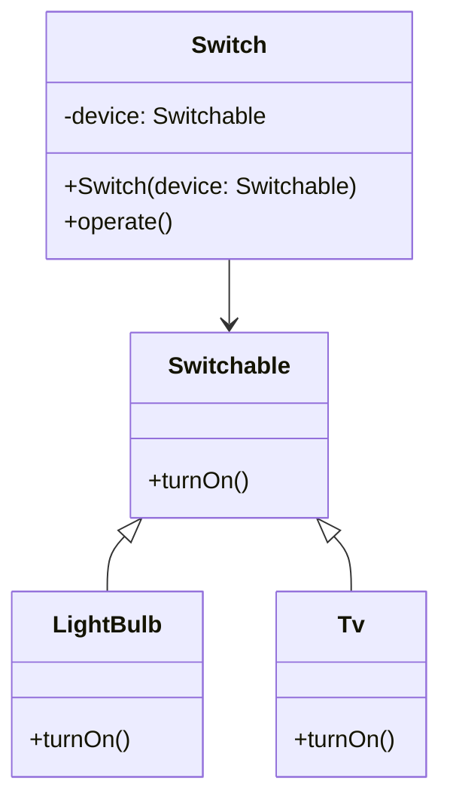
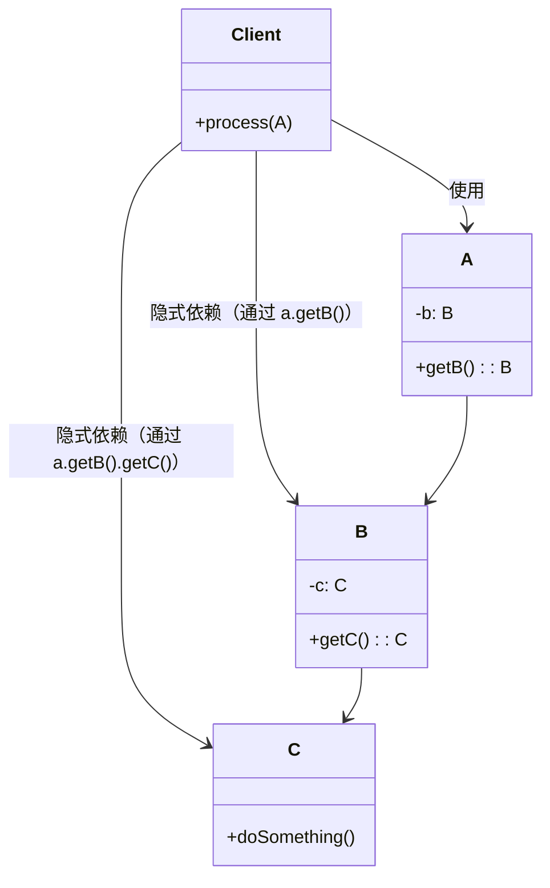
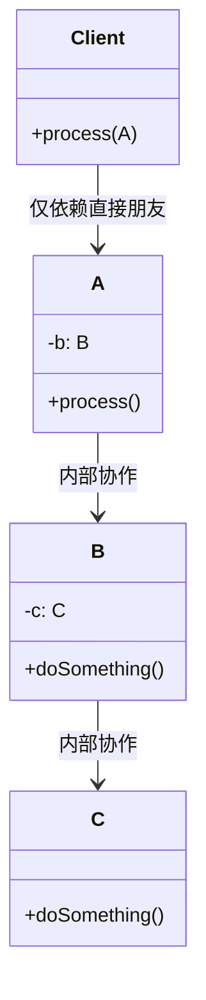

# 第二章 软件设计原则

设计原则是创建高质量软件的基础。遵循这些原则，能让代码更易维护、扩展和测试。本章重点介绍SOLID原则及其他核心原则。

## 1 SOLID原则概述

solid 中文意思是固体，SOLID是面向对象设计的五个核心原则的缩写：

| 原则 | 英文缩写 | 核心思想 |
|------|----------|----------|
| **单一职责原则** | SRP | 一个类只负责一个功能 |
| **开闭原则** | OCP | 对扩展开放，对修改关闭 |
| **里氏替换原则** | LSP | 子类可替换父类而不破坏程序 |
| **接口隔离原则** | ISP | 客户端不应依赖不需要的接口 |
| **依赖倒置原则** | DIP | 依赖抽象，而非具体实现 |

---

### 单一职责原则（SRP）

单一职责原则（**single** responsibility principle, SRP）核心为：

**一个类应该只有一个改变的理由。**

```java
// 违反 SRP：一个类处理多种职责
class UserManager {
    public void createUser(User user) { /* 创建用户 */ }
    public void sendEmail(User user) { /* 发送邮件 */ }
    public void logActivity(String activity) { /* 记录日志 */ }
}

// 遵循 SRP：职责分离
class UserService {
    public void createUser(User user) { /* 创建用户 */ }
}

class EmailService {
    public void sendEmail(User user) { /* 发送邮件 */ }
}

class Logger {
    public void logActivity(String activity) { /* 记录日志 */ }
}
```

:::tip 小结

- 单一职责原则：一个类只负责一个功能，避免类过度复杂

单一职责原则直观地体现就是将实现特定功能的类只负责这一功能，而不负责其他功能。

实际上，这不仅是为了方便理解与管理，更是方便了代码的复用。

比如将自定义实现的 base62方法封装成一个 base62类，程序全局使用同一个 base62 算法，既能保证全局统一，又方便了复用。

:::

---

### 开闭原则（OCP）

开闭原则（**open** **closed** principle, OCP）核心为：

**软件实体对扩展开放，对修改关闭。**

```java
// 违反 OCP：添加新形状需修改代码
class ShapeDrawer {
    public void drawShape(String shapeType) {
        if (shapeType.equals("circle")) { /* 绘制圆 */ }
        else if (shapeType.equals("square")) { /* 绘制方 */ }
    }
}

// 遵循 OCP：通过接口扩展
interface Shape {
    void draw();
}

class Circle implements Shape {
    public void draw() { /* 绘制圆 */ }
}

class Square implements Shape {
    public void draw() { /* 绘制方 */ }
}

class ShapeDrawer {
    public void drawShape(Shape shape) {
        shape.draw();
    }
}
```

:::tip 小结

- 开闭原则：通过扩展，而不是修改代码

开闭原则是指软件实体（类、模块、函数等）对扩展开放，对修改关闭。

实际开发中，我们不仅要写新的功能，还需对以写功能进行测试。满足开闭原则，在添加新的代码时，只需要验证新的代码是否正确，而不需要验证原有的代码。

>[!WARNING]注意：
>
>- "对修改关闭"不是绝对禁止修改，而是指核心逻辑不应因功能扩展而频繁变更。
>- 良好的抽象是前提。若一开始没设计好接口，后期仍可能被迫重构。
:::

---

### 里氏替换原则（LSP）

里氏替换原则（Liskov Substitution Principle, LSP）由 Barbara Liskov 在 1987 年提出。其核心为：

**子类对象能够替换其父类对象，而不破坏程序的正确性。**

#### 举个例子：插座与插头

想象你家里有个插板，都是使用 **标准两脚插头（父类）**，墙上的插座也只接受这种插头。

如果你买了一个使用 **三脚插头（子类）** 的新电器并强行插入两脚插座，可能会：

- 插不进去
- 弄坏插座
- 甚至短路起火

尽管“三脚插头 是 插头”，但它**不能无缝替换两脚插头**——这就是违反 LSP 的直观例子。

#### 回到编程：为什么这很重要

假设存在一个使用者函数：

```java
// 使用者：依赖 Rectangle 的行为约定
public double calculateArea(Rectangle r) {
    r.setWidth(10);
    r.setHeight(5);
    return r.getArea(); // 期望返回 50
}
```

如果传入了 `Square`：

```java
calculateArea(new Square()); // 可能返回 25 而不是 50
```

问题不在 `Square` 是否“错”，而在于 **`Square` 不应当继承自 `Rectangle`（在此行为契约下）**。在“宽与高可独立设置”的契约下，正方形并不总是矩形的子类型。

> 继承不是概念上的包含，而是行为兼容的契约。

#### 违反 LSP 会带的后果

- 调用方基于父类契约编写代码，如果子类改变行为，调用方无法预期
- 被迫增加类型检查（`instanceof`）或特殊分支，破坏多态
- 代码变脆弱、难以维护

这类似插错电压的 USB‑C 充电器，看起来接口一致，但行为不同，会造成严重后果。

#### 正确的继承应满足的契约

子类必须遵守父类的行为约定，主要包括：

| 方面 | 父类约定 | 子类必须做到 |
|------|----------|--------------|
| 前置条件（输入） | 接受任意正整数 | 不能变为只接受偶数 |
| 后置条件（输出） | 返回非负数 | 不能返回负数 |
| 异常 | 不抛异常 | 不能随意抛 RuntimeException |
| 不变性 | 宽×高 = 面积 | 必须保持该不变性 |

子类可以扩展行为（新增方法），但不得破坏已有契约。

#### 继承的契约：子类如何正确替代父类

无论是`List<Integer> list = new LinkedList<>();` 还是 `Deque<Integer> deque = new LinkedList<>();`都满足 **里氏替换原则**：

> **`LinkedList` 作为 `List` 的实现类，能完全替代 `List`；作为 `Deque` 的实现类，也能完全替代 `Deque`。使用者只依赖接口，不关心具体实现。**

核心区别：**接口不同 → 契约不同 → 可用行为不同**

---

##### 1. `List<Integer> list = new LinkedList<>();`

- **接口契约**：`List` 接口定义了“**有序、可重复、按索引访问**”的集合行为。
- **你能调用的方法**（仅限 `List` 声明的方法）：

  ```java
  list.add(1);           // 末尾添加（List 约定）
  list.get(0);           // 按索引获取（O(n) 对 LinkedList 不高效，但语义合法）
  list.set(0, 2);        // 按索引修改
  list.remove(0);        // 按索引删除
  ```

- **关键点**：
  - 你**不能**调用 `offerFirst()`、`pollLast()` 等双端队列方法（编译报错）。
  - 即使底层是 `LinkedList`，你也**只能用 `List` 的视角看待它**。
  - `LinkedList` 保证：所有 `List` 方法的行为符合 `List` 的规范（比如 `add()` 加到末尾，`get(i)` 返回第 i 个元素）

##### 2. `Deque<Integer> deque = new LinkedList<>();`

- **接口契约**：`Deque`（Double-ended Queue）接口定义了“**两端都能插入/删除**”的队列行为。
- **你能调用的方法**（仅限 `Deque` 声明的方法）：

  ```java
  deque.addFirst(1);     // 从头部插入
  deque.addLast(2);      // 从尾部插入（等价于 add()）
  deque.pollFirst();     // 从头部移除并返回
  deque.pollLast();      // 从尾部移除并返回
  deque.peekFirst();     // 查看头部元素
  ```

- **关键点**：
  - 你**不能**调用 `get(0)`、`set(1, x)` 等基于索引的方法（`Deque` 接口没定义这些！）。
  - 即使底层是 `LinkedList`，你也**只能用 `Deque` 的视角看待它**。
  - `LinkedList` 保证：所有 `Deque` 方法的行为符合 `Deque` 的规范（比如 `addFirst()` 确实加到头部）。

> 这里，`LinkedList` 也是 `Deque` 的“行为子类型”——它完全遵守 `Deque` 的契约。

:::tip 为什么同一个 `LinkedList` 能同时满足两个不同的契约？

因为 **`LinkedList` 类在设计时，同时实现了 `List` 和 `Deque` 接口**：

```java
public class LinkedList<E>
    extends AbstractSequentialList<E>
    implements List<E>, Deque<E>, Cloneable, java.io.Serializable
```

- 它为 `List` 接口提供了一套符合“有序列表”语义的实现；
- 它为 `Deque` 接口提供了一套符合“双端队列”语义的实现；

对应的要写出两套方法实现，分别遵守各自的契约，但 **两套实现互不干扰，各自遵守各自的契约**。
:::

#### 一句话总结

> 里氏替换原则的本质是：继承必须保证行为可预测性。若替换导致错误，说明设计（继承关系）有问题。

---

### 接口隔离原则（ISP）

**接口隔离原则** 由 Robert C. Martin（Bob大叔）提出。 核心思想：**“客户端不应该被迫依赖于它不使用的方法。”**

换句话说：**一个类不应该被强迫去实现它根本不会用到的接口方法**。如果一个接口太“胖”（即包含太多方法），而某些实现类并不需要其中的某些方法，那么这个接口就应该被拆分成更小、更具体的接口。

---

#### 示例分析

- 违反 ISP 的情况

```java
interface Worker {
    void work();
    void eat();
}

class Robot implements Worker {
    public void work() { /* 工作 */ }
    public void eat() { /* 机器人不需要吃 */ }
}
```

**问题在哪？**

- `Robot` 是一个机器人，它只会“工作”，**不会“吃东西”**。
- 但因为 `Worker` 接口同时定义了 `work()` 和 `eat()`，所以 `Robot` **被迫实现 `eat()` 方法**。
- 即使你在 `eat()` 里写个空方法（或抛出异常），这仍然是 **不合理的耦合**，违反了 ISP。
- 未来如果接口再增加 `sleep()`、`breathe()` 等方法，所有实现类都得跟着改，哪怕它们不需要。

这导致：

- 代码冗余
- 可维护性差
- 接口职责不单一

---

- 遵循 ISP 的做法

```java
interface Workable {
    void work();
}

interface Eatable {
    void eat();
}

class Human implements Workable, Eatable {
    public void work() { /* 工作 */ }
    public void eat() { /* 吃饭 */ }
}

class Robot implements Workable {
    public void work() { /* 工作 */ }
}
```

**优点：**

- 接口被拆分为 **高内聚、职责单一** 的小接口：`Workable` 只管“工作”，`Eatable` 只管“吃”。
- `Human` 需要工作和吃饭，就同时实现两个接口。
- `Robot` 只需要工作，就只实现 `Workable`，**完全不用关心“吃”**。
- **客户端（如 Robot）只依赖它真正需要的接口**，没有多余负担。

这符合 ISP 的精神：**按需依赖，精准实现**。

---

#### 类比理解

想象一个多功能遥控器（接口）控制电视、空调、灯泡：

- 如果这个遥控器有 50 个按钮（方法），但你家只有灯泡，那你每次还得面对一大堆没用的按钮。
- 遵循 ISP 就像给灯泡配一个只有“开/关”的小遥控器，干净、简单、不混乱。

**最佳实践建议**：

- 设计接口时，从 **客户端需求出发**，而不是“我觉得以后可能用得上”。
- 宁可多几个小接口，也不要一个“万能大接口”。
- 接口是契约，契约越精准，系统越健壮。

---

### 依赖倒置原则（DIP）

DIP 是 SOLID 五大设计原则 中的最后一条，由 Robert C. Martin 提出。它的核心思想是：

1. **高层模块不应依赖于低层模块，二者都应依赖于抽象。**
2. **抽象不应依赖于细节，细节应依赖于抽象。**

#### 违反 DIP：高层直接依赖低层

```java
class LightBulb {
    public void turnOn() { /* 开灯 */ }
}

class Switch {
    private LightBulb bulb;
    public Switch(LightBulb bulb) {
        this.bulb = bulb;
    }
    public void operate() {
        bulb.turnOn();
    }
}
```

在这个例子中，`Switch` 类（高层模块）直接依赖于 `LightBulb` 类（低层模块）。



`Switch` 类直接依赖于具体的 `LightBulb` 类，通过构造函数注入 `LightBulb` 实例，并在其 `operate` 方法中调用 `turnOn()`。

同样，为了支持另一种设备（如电视），需要创建一个全新的 `TvSwitch` 类，它直接依赖于 `Tv` 类。

这种设计导致：

- 高层模块（如 Switch、TvSwitch）紧耦合于低层模块（如 LightBulb、Tv）；
- 每增加一种可开关设备，就必须新增一个对应的开关类；
- 高层模块不具备通用性，难以复用，违反了开闭原则和依赖倒置原则。

#### 遵循 DIP：依赖抽象接口

所以我们进行改进：
 **定义一个抽象接口**，让 `Switch` 类依赖这个接口，而不是具体的实现类。
 `LightBulb` 类实现这个接口。

 **后续扩展时**，只需要创建新的实现类，并实现这个接口，不需要修改 `Switch` 类。

```java
interface Switchable {
    void turnOn();
}

class LightBulb implements Switchable {
    public void turnOn() { /* 开灯 */ }
}

class Switch {
    private Switchable device;
    public Switch(Switchable device) {
        this.device = device;
    }
    public void operate() {
        device.turnOn();
    }
}
```

在这个改进后的设计中：

- `Switch` 类（高层模块）依赖抽象接口 `Switchable`（抽象类），而不是具体的实现类 `LightBulb`。
- `LightBulb` 类（低层模块）实现了 `Switchable` 接口。



我们通过这样定义了一个抽象接口 `Switchable`，实现顶层模块不依赖于底层的具体实现，而是依赖于抽象接口，这就是依赖倒置原则的核心思想。

## 2 其他重要设计原则

### 一、迪米特法则

#### 核心思想

> **一个对象应当只与其“直接朋友”通信，不要与“陌生人”说话。**

所谓“直接朋友”通常包括：

- 该对象自身（`this`）
- 方法的参数
- 该对象直接持有的成员变量
- 方法内部创建的对象

**禁止行为**：通过一个对象调用其返回的另一个对象的方法，形成“调用链”（例如 `a.getB().getC().doSomething()`）。这种做法会让调用者间接依赖多个非直接关联的类，违反封装。

---

#### 违反迪米特法则的示例

```java
class C {
    public void doSomething() {
        System.out.println("C is doing something.");
    }
}

class B {
    private C c = new C();
    public C getC() {
        return c;
    }
}

class A {
    private B b = new B();
    public B getB() {
        return b;
    }
}

class Client {
    public void process(A a) {
        // 违反迪米特法则：调用链过长，Client 依赖了 B 和 C
        a.getB().getC().doSomething();
    }
}
```

在此设计中，`Client` 虽然只直接持有 `A`，却通过 `A` → `B` → `C` 的调用链操作了 `C`。这导致：

- `Client` 隐式依赖 `B` 和 `C`；
- 如果 `B` 不再持有 `C`，或 `getC()` 被移除，`Client` 将编译失败；
- `A` 的内部结构被暴露，破坏封装。

**对应的类图（违反迪米特法则）：**



> 从图中可见，`Client` 与 `B`、`C` 产生了非直接但实际的依赖关系，耦合度高。

---

#### 遵循迪米特法则的改进方式

将操作封装在拥有数据的对象内部，**“告诉它做什么”，而不是“问它要数据再自己做”**。

```java
class C {
    public void doSomething() {
        System.out.println("C is doing something.");
    }
}

class B {
    private C c = new C();
    public void doSomething() {
        c.doSomething(); // B 负责协调 C
    }
}

class A {
    private B b = new B();
    public void process() {
        b.doSomething(); // A 封装内部协作
    }
}

class Client {
    public void process(A a) {
        // Client 只与 A 交互，不关心 B 或 C
        a.process();
    }
}
```

现在：

- `Client` 仅依赖 `A`，符合“只与直接朋友通信”；
- `A` 负责协调其内部组件（`B` 和 `C`）；
- 即使 `B` 的实现改为直接操作 `D`，`Client` 也无需修改。

**对应的类图（遵循迪米特法则）：**



> 此图中，`Client` 与 `B`、`C` 无任何依赖关系，所有内部交互被封装在 `A` 及其子组件中，耦合度显著降低。

---

#### 关键总结

- **迪米特法则的本质是封装与职责分配**：每个对象应对外提供高层行为接口，隐藏内部结构。
- **“Tell, Don’t Ask”**：不要通过 getter 获取内部对象再操作，而是直接调用目标对象的业务方法。
- **收益**：代码更健壮、更易测试、更易演进——尤其在大型系统或插件化架构中，能有效防止“蝴蝶效应”式的级联修改。

:::tip
>不是不能有调用链，而是**调用链不应跨越模块边界暴露内部结构**。在模块内部，适当链式调用是可以接受的；但对外接口应扁平、稳定。
:::

### 二、高内聚低耦合

这是软件设计的两个经典目标，常与 SOLID、迪米特等原则协同使用。

#### 高内聚（High Cohesion）

- 一个类/模块内部的职责高度相关。
- 例如：`OrderService` 只处理订单逻辑，不掺杂用户管理或日志写入。
- **好处**：易于理解、测试、复用。

#### 低耦合（Low Coupling）

- 类与类之间的依赖尽可能少、尽可能通过抽象（如接口）连接。
- 例如：`PaymentProcessor` 依赖 `PaymentGateway` 接口，而非具体的 `AlipayGateway`。
- **好处**：修改一个模块不影响其他模块，系统更稳定。

> 迪米特法则和依赖倒置原则都是实现“低耦合”的具体手段；单一职责原则则有助于实现“高内聚”。

---

### 三、组合优于继承（Composition over Inheritance）

#### 问题：继承的局限性

- **紧耦合**：子类与父类强绑定，父类修改可能破坏子类。
- **脆弱的基类问题**（Fragile Base Class）：父类的微小改动可能导致所有子类异常。
- **缺乏灵活性**：Java 不支持多继承，无法组合多个行为。

#### 组合的优势

- **运行时灵活装配**：可通过构造函数或 setter 注入不同实现。
- **符合开闭原则**：新增行为只需实现新组件，无需修改已有类。
- **更符合现实建模**：“汽车有引擎” 比 “汽车是一种引擎” 更合理。

#### 示例对比

```java
// 继承：行为固定，难以扩展
class ElectricCar extends Car { ... }
class GasCar extends Car { ... }

// 组合：灵活切换
class Car {
    private Engine engine; // 可以是 ElectricEngine 或 GasEngine
    public void start() {
        engine.ignite();
    }
}
```

> **经验法则**：
>
> - 如果想复用“实现”，优先考虑组合；
> - 如果要建立“is-a”关系且行为稳定，才考虑继承。

---

## 总结

软件设计原则是构建高质量、可维护、可扩展系统的核心指导思想。本章粗略的记录了一下 **SOLID 五大原则** 及其他关键设计准则，它们共同构成了现代面向对象设计的基石。

- **单一职责原则**（SRP）强调“一个类，一个职责”，通过职责分离提升代码的清晰度与复用性。
- **开闭原则**（OCP）主张“对扩展开放，对修改关闭”，通过抽象与多态实现灵活演进，降低变更风险。
- **里氏替换原则**（LSP）要求子类必须能无缝替换父类而不破坏程序行为，强调继承应基于行为契约，而非概念相似。
- **接口隔离原则**（ISP）倡导“小而专”的接口设计，避免客户端被迫依赖无用方法，提升系统灵活性。
- **依赖倒置原则**（DIP）指出高层与低层模块都应依赖抽象，通过解耦提升模块的独立性与可测试性。

此外，**迪米特法则**（LoD）通过限制对象间的通信范围，强化封装、降低耦合；**高内聚低耦合** 是衡量模块质量的核心标准；**组合优于继承** 则提供了更灵活、更安全的代码复用方式。

需要强调的是：
> **这些原则是手段，而非教条。**
在实际开发中，应结合项目规模、演化预期与团队能力，合理权衡设计复杂度与收益。过度设计与盲目遵循同样有害。真正的目标始终是：**构建清晰、稳定、易于演进的软件系统**。

希望这篇笔记能对大家有所帮助。
