# 第三章 UML 基础与建模实践

## 3.1 UML 简介与应用场景

UML（Unified Modeling Language，统一建模语言）是一种标准化的可视化建模语言，由OMG（Object Management Group）维护。它提供了一套图形化的符号系统，用于描述、设计和文档化软件系统。

### **UML 图分为两大类**

#### **1. 结构图（Structural Diagrams）**

用于描述系统的静态结构，即组成系统的元素及其关系。

- **类图（Class Diagram）**：展示类、接口、抽象类及其之间的关系（如继承、实现、关联、聚合、组合等）。
- **对象图（Object Diagram）**：展示某一时刻系统中对象实例及其之间的链接关系，可看作类图的运行时快照。
- **组件图（Component Diagram）**：展示系统中可替换的物理或逻辑组件及其接口和依赖关系。
- **部署图（Deployment Diagram）**：描述系统的物理部署结构，包括硬件节点和软件制品（artifacts）的部署关系。
- **包图（Package Diagram）**：展示系统中包（namespace）之间的依赖关系，用于组织和管理模型元素。
- **组合结构图（Composite Structure Diagram）**：展示类内部的结构，包括其组成部分（part）及端口（port）等，用于描述协作内部结构。

---

#### **2. 行为图（Behavioral Diagrams）**

用于描述系统的动态行为，即系统如何随时间变化或响应事件。

- **用例图（Use Case Diagram）**：展示系统功能（用例）与外部参与者（Actor）之间的关系。
- **活动图（Activity Diagram）**：描述业务流程或操作的工作流，类似流程图，但支持并发等高级语义。
- **状态机图（State Machine Diagram，简称状态图）**：展示一个对象在其生命周期内所经历的状态及状态之间的转换。
- **时序图（Sequence Diagram）**：强调对象之间消息传递的**时间顺序**，是最常用的交互图。
- **通信图（Communication Diagram，旧称协作图）**：强调对象之间的**结构关系**，同时展示消息交互（与时序图互补）。
- **交互概览图（Interaction Overview Diagram）**：结合活动图和顺序图，用活动节点表示交互流程。

> **时序图、通信图、交互概览图、时序图**等都属于 **交互图（Interaction Diagrams）** 的子类，但“交互图”本身是行为图下的一个**子类别**，**不是独立的一种图**。

::: tip

 **交互图（Interaction Diagrams）** 是 UML 中对**强调对象间消息传递**的一类图的统称，包括时序图、通信图等，**不是与用例图并列的独立图类型**。

:::

---

当然可以，以下是对你提供的 UML 核心特点与应用场景内容的扩展，尤其在**代码生成**方面做了更详细的补充，并保持整体风格一致：

---

### 核心特点

- **标准化**：UML 定义了一套统一的图形符号和语义规范，确保不同背景的团队成员（如架构师、开发、测试、产品经理）对系统模型有一致的理解，减少沟通歧义。
- **可视化**：通过类图、时序图、状态图等图形化手段，将抽象的软件结构和行为具象化，使复杂逻辑和交互流程一目了然，尤其适用于大型或分布式系统。
- **多视图**：UML 支持从多个维度刻画系统：
  - **结构视图**（如类图、对象图、组件图）描述系统的静态组成；
  - **行为视图**（如用例图、活动图、状态机图）刻画系统动态行为；
  - **交互视图**（如时序图、通信图）聚焦对象间的消息传递；
  - **部署视图**（如部署图）展示软硬件的物理部署结构。
- **工具支持**：主流建模工具（如 StarUML、PlantUML、Lucidchart、mermaid）均支持 UML 标准，提供图形编辑、版本管理、协作评审甚至与 IDE 集成的能力。

---

### 应用场景

- **系统设计与分析**：在编码前通过 UML 进行领域建模和架构设计，提前发现设计缺陷，明确模块职责与关系，为后续开发奠定清晰基础。
- **团队沟通**：作为跨职能团队的“通用语言”，UML 图能有效弥合业务需求与技术实现之间的鸿沟，提升协作效率。
- **文档记录**：UML 模型可自动导出为设计文档，便于知识沉淀、新人上手和后期维护，避免“代码即文档”带来的理解成本。
- **代码生成**：
  有 UML 工具支持**正向工程（Forward Engineering）**，即根据类图、状态图等自动生成对应编程语言的代码框架（如 Java、C#、Python）。例如：
  - 从类图生成包含属性、方法签名和关联关系的类骨架；
  - 从状态图生成状态机模板代码；
  - 支持自定义模板（如 Velocity、Freemarker）以适配特定项目规范。
  此外，部分工具还支持**逆向工程（Reverse Engineering）**，可从现有代码反向生成 UML 图，便于理解遗留系统或进行重构分析。

---

## 3.2 类图（Class Diagram）：结构建模核心

类图是UML中最常用的图，用于展示系统的静态结构，包括类、接口、属性、方法以及它们之间的关系。

### 类的基本表示

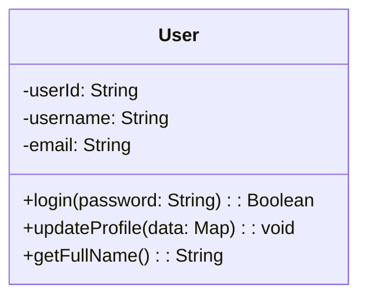

```plaintext
classDiagram
    class User {
        -userId: String             // 私有属性
        -username: String
        -email: String
        +login(password: String): Boolean  // 公有方法
        +updateProfile(data: Map): void
        +getFullName(): String
    }
```

在这个图中，User类有4个属性（userId、username、email），3个方法（login、updateProfile、getFullName），以及一个构造函数。

图框分为三个部分：

- 类名
- 属性列表
- 方法列表

其中，属性列表与方法列表中的每一行表示一个属性或方法，前面的符号表示可见性：

- `+`：公有（public）
- `-`：私有（private）
- `#`：受保护的（protected）

`updateProfile(data: Map): void` 中`data: Map`参数是一个Map类型，表示更新用户的数据。`void`表示该方法的返回值类型。

---

### UML 图的关系详解

在面向对象设计中，类与类、类与接口之间通过特定的语义关系相互协作。这些关系不仅定义了代码的静态结构，也深刻影响系统的可维护性、可扩展性与复用能力。

根据 UML（统一建模语言）规范，常见的结构化与行为依赖关系可归纳为以下 **六种**，按其语义和建模目的分类如下：

#### 结构关系分类

##### 1. 类与类之间的关系（5 种）

- **继承（Generalization / Inheritance）**
  表示 “is-a” 关系，子类泛化父类的行为与属性。
- **关联（Association）**
  表示两个类之间存在长期的结构化引用（如成员变量），通常为双向或单向持有。
  - **普通关联**：基础引用关系，无生命周期绑定。
  - **聚合（Aggregation）**：弱“拥有”关系（“has-a”），部分可独立于整体存在。
  - **组合（Composition）**：强“拥有”关系（“owns-a”），部分生命周期完全依赖整体。
- **依赖（Dependency）**
  表示一个类在局部（如方法参数、临时变量或静态调用）使用另一个类，耦合最弱。

> [!TIP]
>聚合与组合是**关联的两种特殊形式**，用于表达“整体-部分”关系的强弱，而非独立于关联之外的关系。

##### 2. 类与接口之间的关系（1 种）

- **实现（Realization）**
  表示类履行接口所定义的契约（如 Java 中的 `implements`），是多态与解耦的关键机制。

此外，**接口与接口之间**也存在**继承（Generalization）**（如 `interface B extends A`），但该关系不属于“类与类”或“类与接口”的范畴，此处不计入六种核心关系。

---

#### 1. 继承关系（Inheritance / Generalization）

表示 “is-a” 关系，子类继承父类的属性和行为，卡车是一个载具。

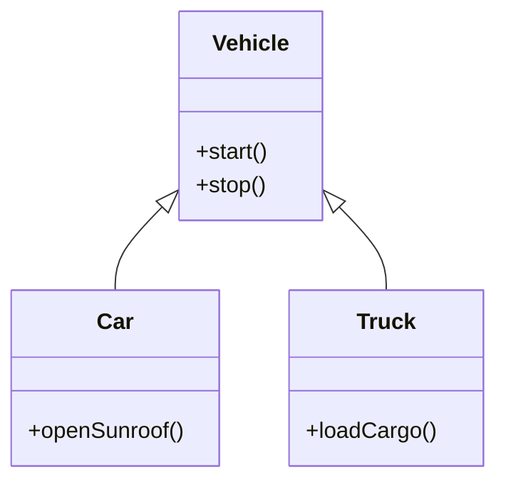

- **UML 语义**：泛化（Generalization）
- **Java 示例**：`class Car extends Vehicle`
- **关系箭头**：`<|--`  空心三角箭头 + 实线，指向父类

---

#### 2. 实现关系（Realization）

表示类实现接口定义的契约，即 “implements”。

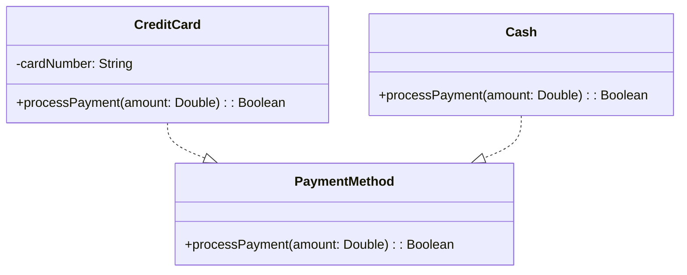

 **关系箭头**：箭头方向为 **类 → 接口**，使用 `..|>` 表示虚线+空心三角（实现）。

---

#### 3. 关联关系（Association）

关联关系表示两个类之间存在**结构化引用**（如成员变量），通常为长期关系。它是类与类之间最常见的关系之一。

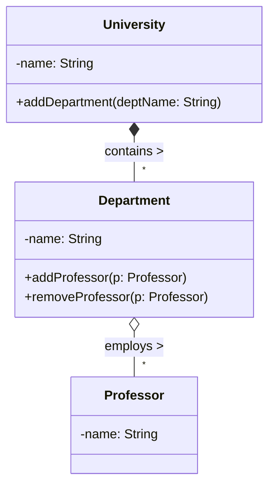

##### 聚合与组合

聚合与组合是**关联的两种特殊形式**（下文有更详细的讲解），用于表达“整体-部分”关系的强弱：

- **聚合（Aggregation）**：弱“拥有”关系，部分可以独立于整体存在。
- **组合（Composition）**：强“拥有”关系，部分的生命周期由整体控制。

##### UML 表达

- **普通关联**：用实线表示，带箭头 `-->` 表示单向关联，不带箭头 `--` 表示双向关联。
- **聚合**：用空心菱形 `o--` 表示。
- **组合**：用实心菱形 `*--` 表示。

##### Java 示例

```java
// 教授类：独立存在
class Professor {
    private String name;
    public Professor(String name) {
        this.name = name;
    }
    // 教授可被多个院系引用，也可不隶属于任何院系
}

// 院系类
class Department {
    private String name;
    // 聚合关系：持有 Professor 引用，但不控制其生命周期
    private List<Professor> professors = new ArrayList<>();

    public Department(String name) {
        this.name = name;
    }

    public void addProfessor(Professor p) {
        professors.add(p);
    }

    // 注意：移除教授时，不销毁 Professor 对象
    public void removeProfessor(Professor p) {
        professors.remove(p);
    }
}

// 大学类
class University {
    private String name;
    // 组合关系：University 完全拥有 Department
    private List<Department> departments = new ArrayList<>();

    public University(String name) {
        this.name = name;
    }

    public void addDepartment(String deptName) {
        // University 内部创建 Department（体现“拥有”）
        departments.add(new Department(deptName));
    }
}
```

##### 示例补充

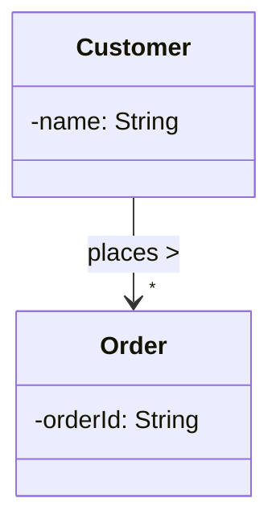

在上述示例中：

- `Customer` 和 `Order` 之间是普通关联关系，表示一个客户可以下多个订单。
- 用 `-->` 表示单向关联，箭头指向被引用的类。
- `"*"` 表示多对一关系，即一个客户可以下多个订单。

---

#### 4. 聚合关系（Aggregation）

一种**弱“拥有”关系**，整体与部分可独立存在（“has-a”）。

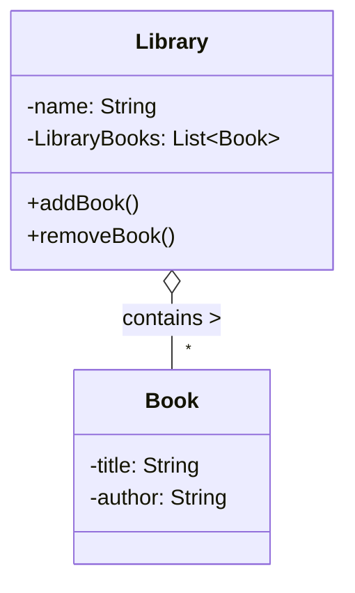

- 空心菱形 `o--` 表示聚合
- `Book` 可脱离 `Library` 存在（例如被借出或转移到其他图书馆）

---

#### 5. 组合关系（Composition）

一种**强“拥有”关系**，部分生命周期由整体控制（“owns-a”）。

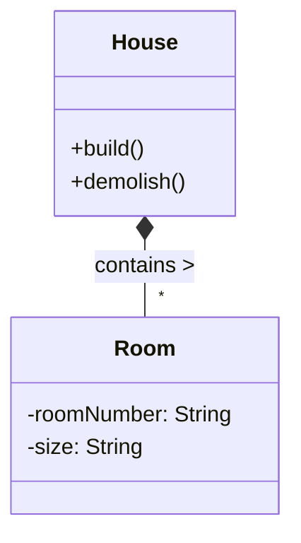

- 实心菱形 + 实线 `*--` 表示组合
- `Room` 不能脱离 `House` 存在（房子被拆除，房间也随之消失）

---

#### 6. 依赖关系（Dependency）

表示一个类**临时使用**另一个类（如方法参数、局部变量、静态工具调用），耦合最弱。

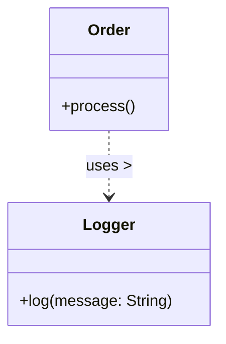

- 虚线+ 普通箭头  `..>` 表示依赖
- 通常出现在方法内部，不保留长期引用

---

#### 关系总结表

| 关系类型   | Mermaid 符号 | 语义       | 生命周期依赖 | 典型场景                     |
|------------|--------------|------------|---------------|------------------------------|
| 继承       | `<|--`       | is-a       | 否            |
| 实现       | `..|>`       | implements | 否            |
| 关联       | `-->`        | uses/has   | 否            | `Customer` 持有 `Order` 列表 |
| 聚合       | `o--`        | has-a      | **否**        | `Library` 包含 `Book`        |
| 组合       | `*--`        | owns-a     | **是**        | `House` 由 `Room` 构成       |
| 依赖       | `..>`        | uses-a     | 否（临时）    | 调用 `Logger.log()`          |

---

## 3.3 时序图（Sequence Diagram）：行为交互分析

## 3.4 活动图（Activity Diagram）：业务流程建模

活动图是 UML 中用于描述系统动态行为的重要图表，主要用于展现**工作流（Workflow）**、**业务流程**或**代码执行流程**。它类似于传统的流程图，但增加了对**并发（Concurrency）**的支持。

### 1. 核心元素

| 元素 | 图形符号 | 说明 |
| :--- | :--- | :--- |
| **初始节点 (Initial Node)** | 实心圆 ● | 流程的开始。 |
| **活动/动作 (Action)** | 圆角矩形 | 具体的执行步骤或操作。 |
| **控制流 (Control Flow)** | 带箭头的实线 → | 执行顺序。 |
| **决策节点 (Decision)** | 菱形 ◇ | 条件判断，产生分支。 |
| **合并节点 (Merge)** | 菱形 ◇ | 多个分支路径汇合（不等待，谁到谁走）。 |
| **分叉节点 (Fork)** | 粗黑线/粗条 ▬ | 将一个流分为多个并发流。 |
| **汇合节点 (Join)** | 粗黑线/粗条 ▬ | 等待所有并发流到达后，才继续执行。 |
| **结束节点 (Final Node)** | 同心圆 ◉ | 流程的结束。 |

### 2. 简单活动图示例

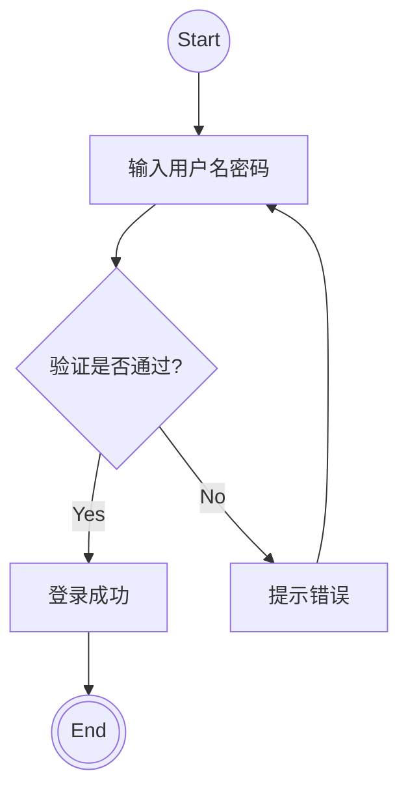

### 3. 泳道图（Swimlanes）

**泳道图**不是一种独立的图，而是活动图的一种**分区（Partition）**表现形式。

- **定义**：通过垂直或水平的线条将活动图划分为若干区域（泳道）。
- **作用**：明确每个活动是由**谁**（哪个角色、部门、系统或类）负责执行的。
- **结构**：每个泳道代表一个责任主体。

#### 泳道图示例：请假审批流程

以下示例展示了通过互联网访问摄像机监视设备并显示摄像机视图功能的泳道图：

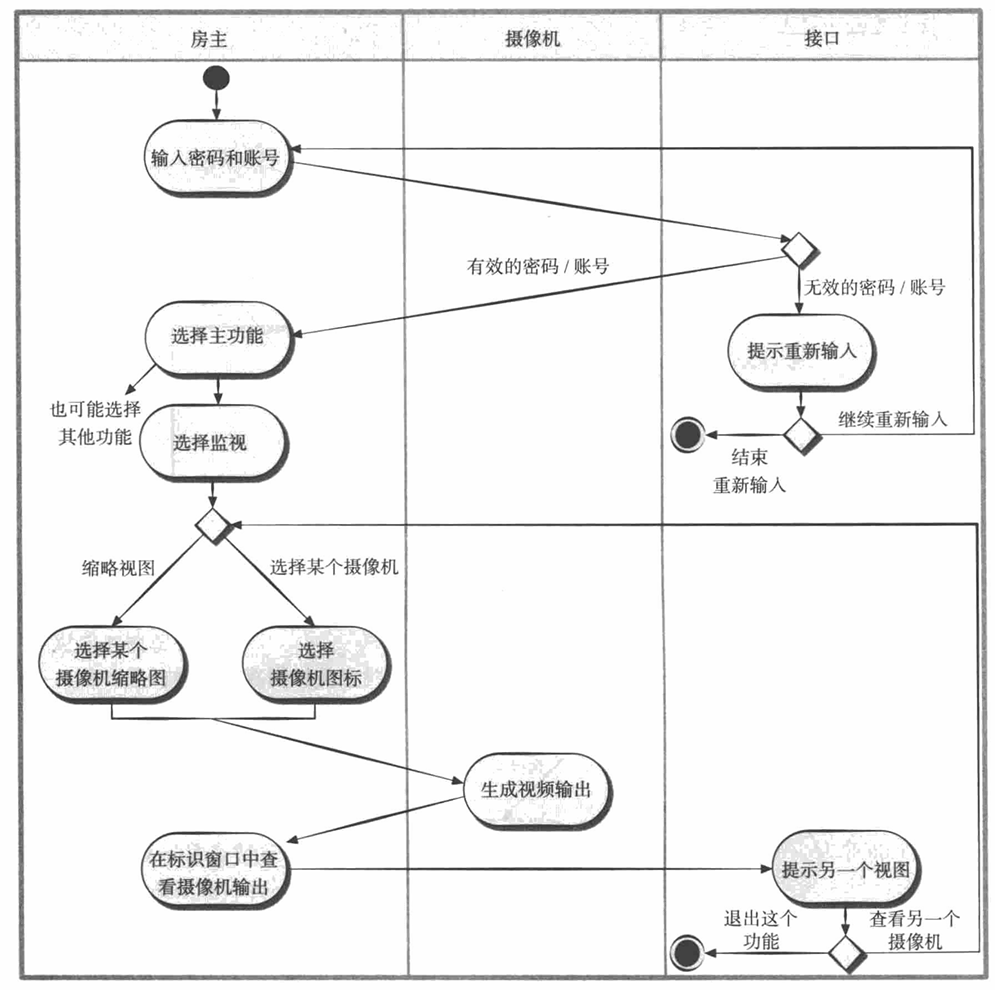

### 4. 应用场景

- **业务建模**：梳理跨部门的业务流程（如订单处理、采购流程），泳道图在此场景下非常有用。
- **逻辑设计**：描述复杂算法或方法的内部执行逻辑。
- **并发分析**：识别哪些任务可以并行处理，优化系统性能。

## 3.5 用例图（Use Case Diagram）：需求建模

用例图主要用于描述系统的**功能需求**，展示外部参与者（Actor）与系统提供的功能（Use Case）之间的交互关系。它是从用户的角度来描述系统“做什么”，而不关心“怎么做”。

### 1. 核心元素

| 元素 | 图形符号 | 说明 |
| :--- | :--- | :--- |
| **参与者 (Actor)** | 小人图标 👤 | 与系统交互的外部实体（人、外部系统、设备）。 |
| **用例 (Use Case)** | 椭圆 ⬭ | 系统提供的某个具体功能或服务。 |
| **系统边界 (System Boundary)** | 矩形框 □ | 界定系统的范围，用例在框内，参与者在框外。 |
| **关联 (Association)** | 实线 — | 连接参与者与用例，表示两者有交互。 |

### 2. 用例之间的关系

- **包含 (Include)**：`<<include>>`，表示一个用例**必须**包含另一个用例的行为（强制依赖）。
- **扩展 (Extend)**：`<<extend>>`，表示一个用例在**特定条件**下可能会扩展另一个用例的行为（可选增强）。
- **泛化 (Generalization)**：空心三角箭头，表示一般与特殊的关系（如“支付”泛化为“微信支付”和“支付宝支付”）。

### 3. 简单用例图示例

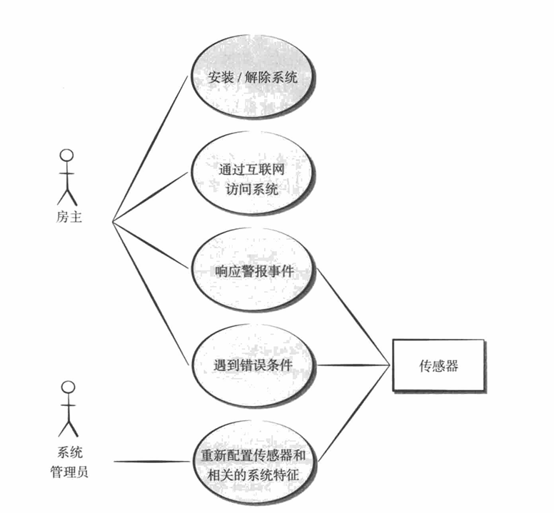

### 4. 应用场景

- **需求分析**：帮助与客户沟通，明确系统需要提供哪些功能。
- **系统边界定义**：明确哪些功能属于系统内部，哪些属于外部交互。
- **测试用例设计**：作为编写功能测试用例的基础。
