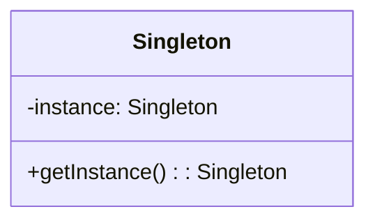
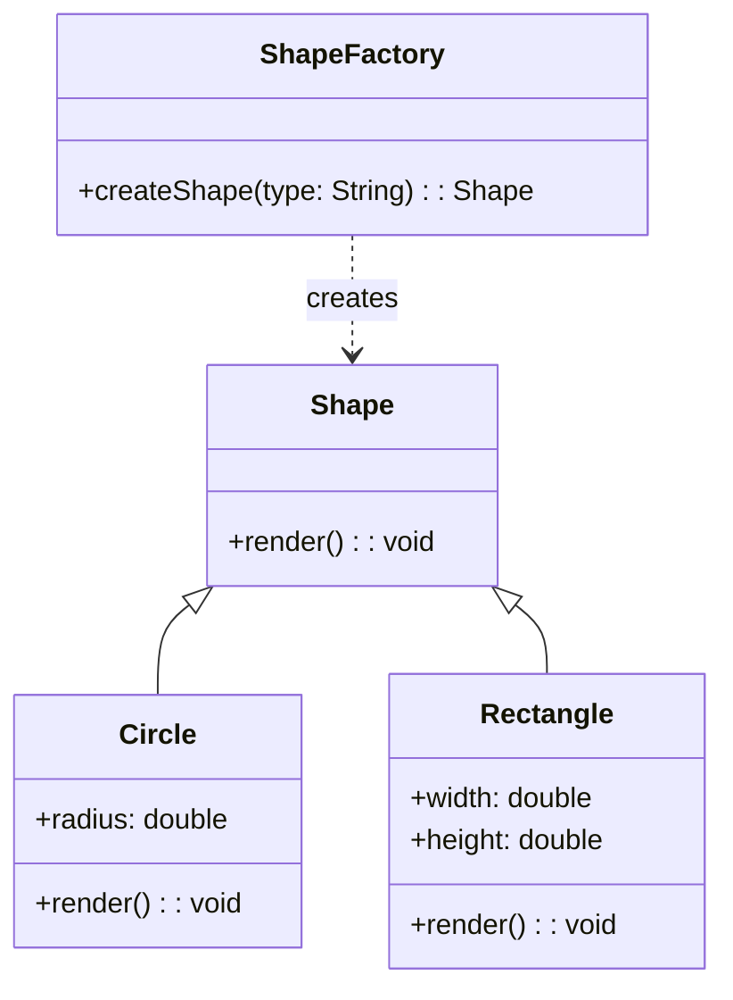
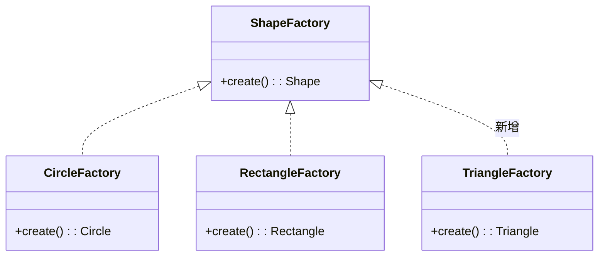
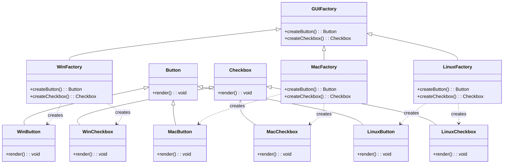
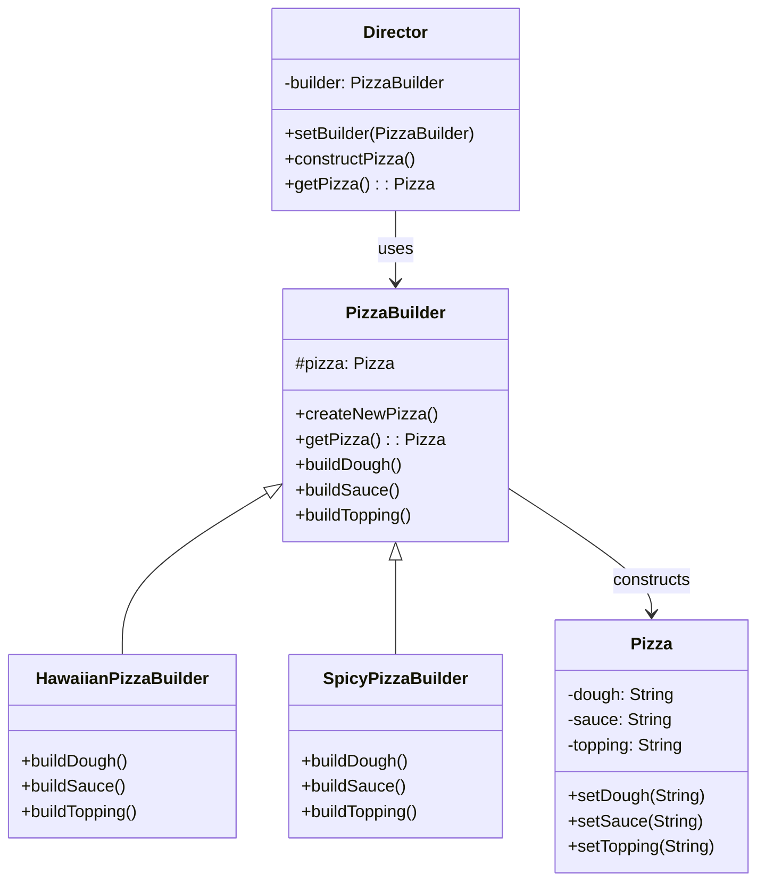
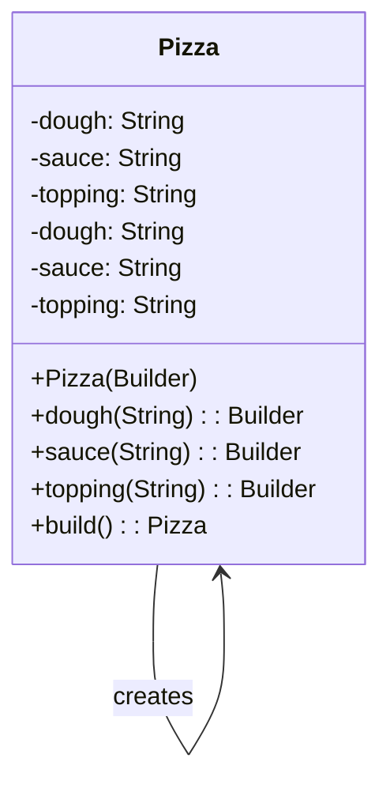

# 第四章 创建型设计模式

创建型设计模式的核心思想是**将对象的创建与使用分离**，从而提高系统的灵活性、可维护性和可扩展性。GoF（Gang of Four）定义了以下五种创建型模式：

- 单例模式（Singleton）
- 工厂方法模式（Factory Method）
- 抽象工厂模式（Abstract Factory）
- 建造者模式（Builder）
- 原型模式（Prototype）

---

## 4.1 单例模式（Singleton）

### 定义

确保一个类**只有一个实例**，并提供一个**全局访问点**。

### 关键点

- 私有构造函数（防止外部 `new`）
- 静态私有实例
- 公共静态获取方法（`getInstance()`）

---

### 两种经典实现方式：懒汉式 vs 饿汉式

| 特性         | 饿汉式（Eager）          | 懒汉式（Lazy）                |
|--------------|--------------------------|-------------------------------|
| 初始化时机   | 类加载时立即创建实例     | 第一次调用 `getInstance()` 时创建 |
| 线程安全     | 天然线程安全             | 需额外同步机制                |
| 资源占用     | 启动即占用内存（可能浪费）| 按需创建，节省资源            |
| 适用场景     | 实例创建开销小、一定会用到| 实例创建开销大、可能不用      |

#### 1. 饿汉式（Eager Initialization）

```java
public class Logger {
    // 类加载时就创建实例
    private static final Logger instance = new Logger();

    private Logger() {}

    public static Logger getInstance() {
        return instance;
    }
}
```

> ✅ 优点：实现简单，天然线程安全
>
> ❌ 缺点：无法延迟加载，可能造成资源浪费

#### 2. 懒汉式（Lazy Initialization，线程安全版）

```java
public class Logger {
    private static volatile Logger instance;

    private Logger() {}

    public static Logger getInstance() {
        if (instance == null) {  // 第一次判断 —— 快速，无锁
            synchronized (Logger.class) {
                if (instance == null) { // 第二次判断 —— 保证唯一
                    instance = new Logger();
                }
            }
        }
        return instance;
    }
}
```

> [!TIP] 为什么需要 volatile？
>
> - 防止 JVM 指令重排序导致其他线程获取到**未完全初始化的对象**。
> - 保证多线程间对 `instance` 的**写入可见性**。

#### 更优替代方案：静态内部类

```java
public class Logger {
    private Logger() {}

    private static class Holder {
        static final Logger INSTANCE = new Logger();
    }

    public static Logger getInstance() {
        return Holder.INSTANCE;
    }
}
```

> 利用 JVM 类加载机制保证线程安全，且只有首次调用时才初始化 —— **懒加载 + 线程安全 + 无锁**。

### 适用场景

- 日志记录器
- 配置管理器
- 线程池、缓存、注册表等全局资源

### 注意事项

> 单例是**全局状态**，会降低代码可测试性，建议在现代框架中通过**依赖注入（DI）**管理。
>
> 警惕**反射**和**反序列化**对单例的破坏：
>
> - 反射可通过 `setAccessible(true)` 调用私有构造函数 → 可在构造函数中抛异常防御。
> - 反序列化可通过实现 `readResolve()` 方法返回唯一实例：

```java
private Object readResolve() {
    return getInstance();
}
```

### 单例模式的 UML 表示



---

## 4.2 工厂模式（Factory Pattern）

### 目标

将对象的创建逻辑封装起来，客户端无需关心具体类，仅依赖抽象接口。

### 三种变体

#### 1. 简单工厂（Simple Factory）

- **非 GoF 模式**，但实用
- 由一个工厂类根据参数决定创建哪个产品
- **违反开闭原则**（新增产品需修改工厂）

```java
public class ShapeFactory {
    public static Shape createShape(String type) {
        if (type == null || type.trim().isEmpty()) {
            throw new IllegalArgumentException("Shape type cannot be null or empty");
        }
        switch (type.trim().toLowerCase()) {
            case "circle":
                return new Circle();
            case "rect":
            case "rectangle":
                return new Rectangle();
            default:
                throw new IllegalArgumentException("Unknown shape type: " + type);
        }
    }
}
```

##### UML 表示



`ShapeFactory` 的返回类型为 `Shape`，类间关系为**依赖**。

`Circle` 和 `Rectangle` 继承自 `Shape`，类间关系为**继承**。
> 🧩 **设计思想**：
>
> - 客户端只依赖 `Shape` 接口，符合**依赖倒置原则（DIP）**。
> - 但新增形状需修改 `ShapeFactory`，**不满足开闭原则（OCP）**。

#### 2. 工厂方法模式（Factory Method）

- 定义一个**创建对象的接口**，由子类决定实例化哪个类
- **符合开闭原则**：新增产品只需新增具体工厂和产品类

```java
interface ShapeFactory {
    Shape create();
}

class CircleFactory implements ShapeFactory {
    public Shape create() { return new Circle(); }
}

class RectangleFactory implements ShapeFactory {
    public Shape create() { return new Rectangle(); }
}

// 扩展：新增一个 Triangle 工厂
class TriangleFactory implements ShapeFactory {
    public Shape create() { return new Triangle(); }
}
```

##### UML 表示



> 🧩 **设计思想**：
>
> - 工厂方法模式通过引入工厂接口，避免了简单工厂的单一职责问题。
> - 每个具体工厂类只负责创建一种产品，符合**单一职责原则（SRP）**。
> - 新增产品时，只需新增具体工厂类和产品类，符合**开闭原则（OCP）**。

但我们也可以发现，在方法工厂中，**每个工厂方法返回的都是同一个产品类型**，但每当我需要扩展新的产品时，都需要新增一个对应的工厂类，导致工厂类数量激增，增加了系统复杂度。

#### 3. 抽象工厂模式（Abstract Factory）

> [!TIP] 思考一下
> 然而，当我们面对的不是单一产品，而是一组相互关联或依赖的产品（例如：按钮 + 复选框 + 文本框共同构成一套 UI 风格），工厂方法就显得力不从心——我们需要为每种产品分别创建 WinButtonFactory、WinCheckboxFactory、MacButtonFactory、MacCheckboxFactory……这不仅冗余，还难以保证这些组件属于同一风格族。
>
>为了解决“产品族”的创建问题，我们进一步将多个相关产品的工厂方法聚合到同一个工厂接口中，形成一个能创建一整套协同对象的工厂 —— 这就是 抽象工厂模式（Abstract Factory）。

- 创建**一组相关或依赖对象**的家族，而无需指定具体类
- 适用于**产品族**（如 Windows 风格 vs macOS 风格 UI）

```java
interface GUIFactory {
    Button createButton();
    Checkbox createCheckbox();
}

class WinFactory implements GUIFactory {
    public Button createButton() { return new WinButton(); }
    public Checkbox createCheckbox() { return new WinCheckbox(); }
}

class MacFactory implements GUIFactory {
    public Button createButton() { return new MacButton(); }
    public Checkbox createCheckbox() { return new MacCheckbox(); }
}

// 扩展：新增一个 Linux 风格的工厂
class LinuxFactory implements GUIFactory {
    public Button createButton() { return new LinuxButton(); }
    public Checkbox createCheckbox() { return new LinuxCheckbox(); }
}
```

##### UML 表示



> 🧩 **设计思想**：
>
> - 抽象工厂模式通过将多个相关产品的创建逻辑聚合到一个工厂接口中，解决了工厂方法模式中工厂类数量激增的问题。
> - 每个具体工厂类负责创建一整套协同工作的产品，确保产品之间的一致性。
> - 新增产品族时，只需新增具体工厂类，符合**开闭原则（OCP）**。

##### 优缺点

| 优点                                   | 缺点                                   |
|----------------------------------------|----------------------------------------|
| 确保产品族的一致性                    | 难以支持新增产品（需修改所有工厂类）   |
| 符合开闭原则，新增产品族无需修改代码  | 增加了系统复杂性                      |
| 客户端代码与具体工厂解耦              |                                      |

> ⚠️ **注意**：
>
> - 抽象工厂模式适用于产品族稳定、变化较少的场景。
> - 如果产品种类频繁变化，可能需要结合其他模式（如建造者模式）优化设计。

### 对比总结

| 模式         | 灵活性 | 扩展性 | 适用场景               |
|--------------|--------|--------|------------------------|
| 简单工厂     | 低     | 差     | 产品种类固定、简单场景 |
| 工厂方法     | 中     | 好     | 单一产品线、插件系统   |
| 抽象工厂     | 高     | 好     | 多产品组合（产品族）   |

---

## 4.3 建造者模式（Builder）

### 定义

将一个**复杂对象的构建与其表示分离**，使得同样的构建过程可以创建不同表示。

### 适用场景

- 对象有大量可选参数（如 HTTP 请求、SQL 查询）
- 构造过程需分步骤、可定制（如游戏角色、文档生成）
- 需要创建**不可变对象**

### 经典结构（GoF 风格）

```java
// 产品
class Pizza {
    private String dough, sauce, topping;
    // setters...
}

// 抽象建造者
abstract class PizzaBuilder {
    protected Pizza pizza;
    public Pizza getPizza() { return pizza; }
    public void createNewPizza() { pizza = new Pizza(); }
    public abstract void buildDough();
    public abstract void buildSauce();
    public abstract void buildTopping();
}

// 具体建造者
class HawaiianPizzaBuilder extends PizzaBuilder {
    public void buildDough() { pizza.setDough("cross"); }
    public void buildSauce() { pizza.setSauce("mild"); }
    public void buildTopping() { pizza.setTopping("ham+pineapple"); }
}

// 指挥者（Director）
class Waiter {
    private PizzaBuilder builder;
    public void setBuilder(PizzaBuilder b) { builder = b; }
    public Pizza getPizza() { return builder.getPizza(); }
    public void constructPizza() {
        builder.createNewPizza();
        builder.buildDough();
        builder.buildSauce();
        builder.buildTopping();
    }
}
```

> ⚠️ GoF 版本适用于**构建过程固定但表示可变**的场景。
> 引入 `Director`，客户端可以复用统一的构建流程，而只需更换不同的 `Builder` 实现来获得不同表示的产品。`Director` 本身不决定使用哪个 `Builder`，而是由客户端注入。”

#### GoF 建造者模式结构图



---

### 现代 Java 实践：流式 Builder（推荐）

```java
public class Pizza {
    private final String dough;
    private final String sauce;
    private final String topping;

    private Pizza(Builder builder) {
        this.dough = builder.dough;
        this.sauce = builder.sauce;
        this.topping = builder.topping;
    }

    public static class Builder {
        private String dough = "regular";
        private String sauce = "tomato";
        private String topping = "cheese";

        public Builder dough(String dough) {
            this.dough = dough;
            return this;
        }

        public Builder sauce(String sauce) {
            this.sauce = sauce;
            return this;
        }

        public Builder topping(String topping) {
            this.topping = topping;
            return this;
        }

        public Pizza build() {
            return new Pizza(this);
        }
    }
}

// 使用
Pizza pizza = new Pizza.Builder()
    .dough("thin")
    .sauce("spicy")
    .topping("pepperoni")
    .build();
```

而现代化的创建方式，通过在每次构建时设置属性，并返回 `Builder` 对象，最后调用 `build()` 方法创建 `Pizza` 对象。

#### 现代流式 Builder 结构图



> 💡 **对比说明**：
>
> - **GoF 建造者**强调“构建流程与产品解耦”，适合构建步骤复杂且流程固定的系统（如文档生成器）。
> - **流式 Builder**更轻量，聚焦于“避免重叠构造函数”，广泛用于现代 Java（如 `StringBuilder`、OkHttp、Retrofit 等），尤其适合不可变对象。

---

### 优点

- 构造过程清晰可控
- 避免“重叠构造函数”反模式（telescoping constructor）
- 支持不可变对象构建
- 链式调用提升可读性

---

## 4.4 原型模式（Prototype）

### 定义

通过**复制现有对象**来创建新对象，而不是通过 `new`。

### 适用场景

- 对象创建成本高（如从数据库加载）
- 需要动态配置对象模板（如游戏中的敌人、技能配置）
- 避免复杂的初始化逻辑

### Java 实现：实现 `Cloneable` 接口

```java
public class Prototype implements Cloneable {
    private String name;
    private List<String> tags = new ArrayList<>();

    public Prototype(String name) {
        this.name = name;
    }

    @Override
    public Prototype clone() {
        try {
            Prototype cloned = (Prototype) super.clone();
            // 深拷贝：避免共享 mutable 对象
            cloned.tags = new ArrayList<>(this.tags);
            return cloned;
        } catch (CloneNotSupportedException e) {
            throw new RuntimeException("Clone not supported", e);
        }
    }

    // getters/setters...
}
```

> ⚠️ **注意**：`Object.clone()` 默认是**浅拷贝**，对于包含引用类型字段的对象，需手动实现**深拷贝**。

---

## 小结对比表

| 模式         | 核心思想                     | 典型用途                             |
|--------------|------------------------------|--------------------------------------|
| 单例         | 全局唯一实例                 | 日志、配置、线程池                   |
| 工厂方法     | 子类决定创建什么             | 插件系统、多态对象创建               |
| 抽象工厂     | 创建产品族                   | 跨平台 UI 组件、主题系统             |
| 建造者       | 分步构建复杂对象             | HTTP 请求、SQL、不可变对象构造       |
| 原型         | 克隆已有对象                 | 游戏对象复制、高成本对象复用、模板   |

---

> **设计哲学**：创建型模式的本质不是“怎么 new 对象”，而是“**如何解耦创建逻辑与使用逻辑**”，让系统更灵活、更易扩展。
