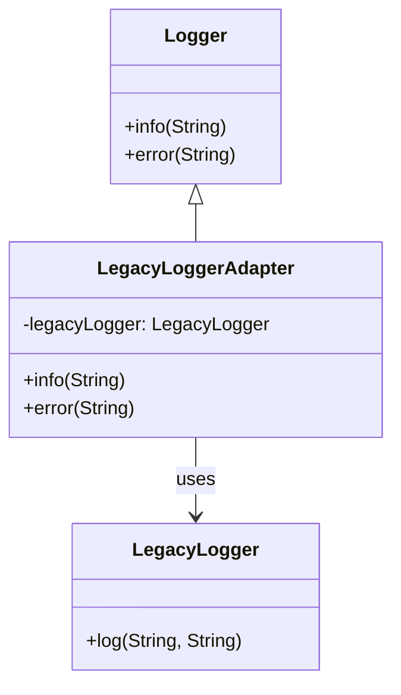
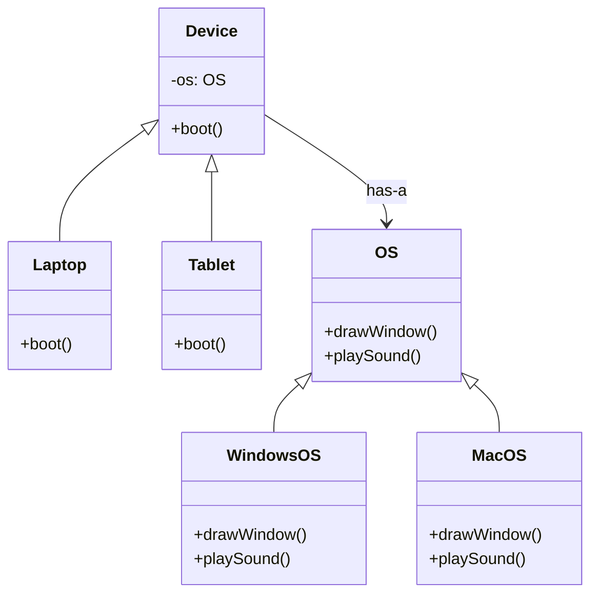
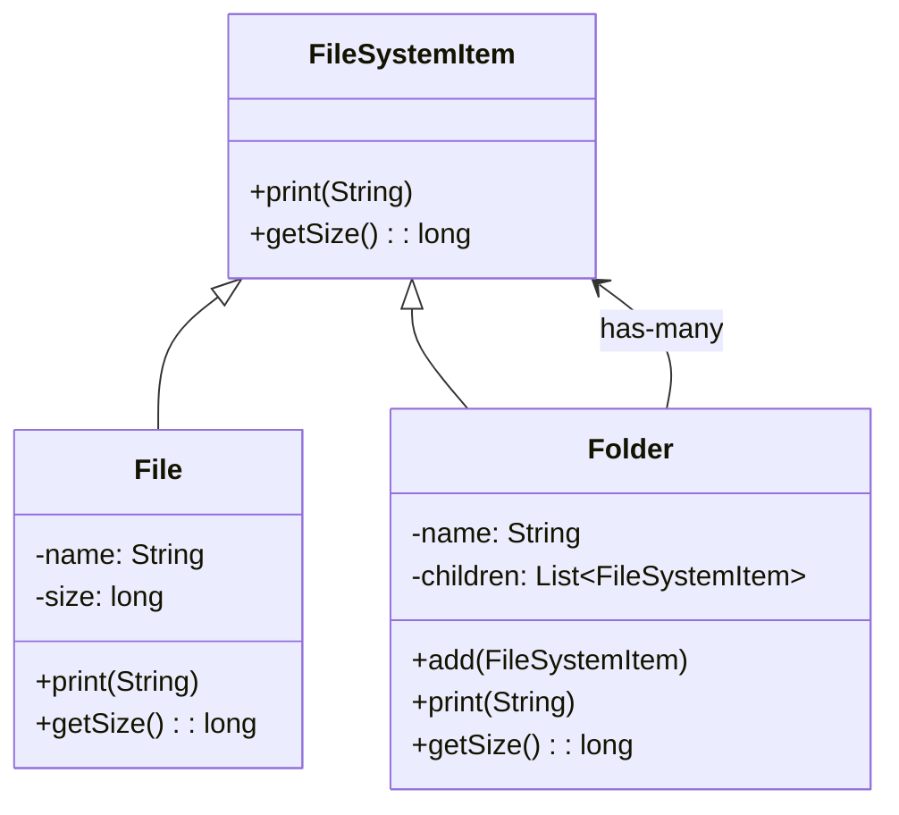
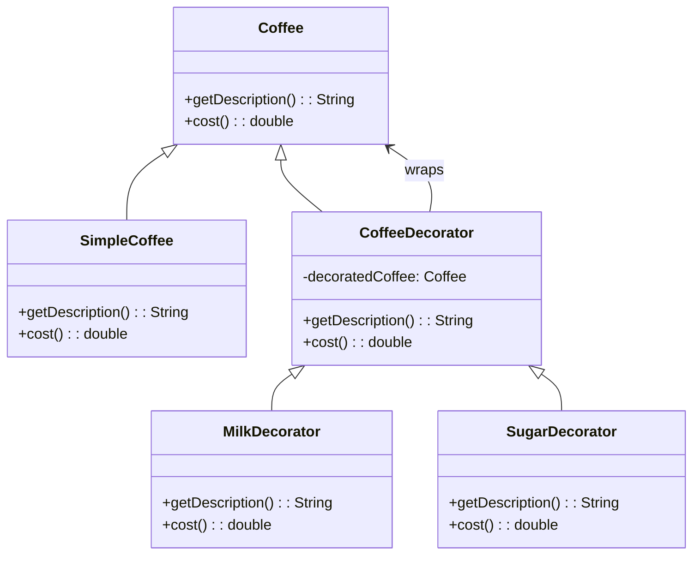

# 第五章 结构型设计模式

结构型设计模式关注**如何组合类和对象**，以形成更大的结构，同时保持结构的灵活性和高效性。它们通过继承或组合的方式，解决接口适配、职责扩展、层次构建等问题。

本章涵盖以下四种核心结构型模式（GoF）：

- 适配器模式（Adapter）
- 桥接模式（Bridge）
- 组合模式（Composite）
- 装饰模式（Decorator）

## 5.1 适配器模式（Adapter）

### 定义

将一个类的接口转换成客户端所期望的另一个接口，使得原本**不兼容的类可以协同工作**。

### 核心思想

> “包装一个类，使其看起来像另一个类。”

### 两种实现方式

| 类型 | 描述 | 适用场景 |
|------|------|--------|
| **类适配器** | 通过多重继承（Java 不支持）实现 | 一般不用于 Java |
| **对象适配器** | **通过组合**（持有被适配对象） | Java 中的标准实现方式 |

### Java 示例：对象适配器

假设有一个第三方日志库只提供 `LegacyLogger.log(String)`，但我们的系统期望使用 `Logger.info(String)` 接口：

```java
// 目标接口（我们期望的）
interface Logger {
    void info(String message);
    void error(String message);
}

// 第三方类（无法修改）
class LegacyLogger {
    public void log(String level, String message) {
        System.out.println("[" + level + "] " + message);
    }
}

// 适配器
class LegacyLoggerAdapter implements Logger {
    private final LegacyLogger legacyLogger;

    public LegacyLoggerAdapter(LegacyLogger logger) {
        this.legacyLogger = logger;
    }

    @Override
    public void info(String message) {
        legacyLogger.log("INFO", message);
    }

    @Override
    public void error(String message) {
        legacyLogger.log("ERROR", message);
    }
}
```

适配器模式的核心是**适配器类**，它将第三方类适配为符合目标接口的类。通过组合现有的类，实现对应的要求的接口。

### UML 类图



### 适用场景

- 集成第三方库或遗留系统
- 统一多个不兼容接口
- 为测试提供 Mock 适配器（如将 `FileReader` 适配为 `InputStream`）

### 注意事项

- 适配器不应改变被适配对象的行为，仅做接口转换。
- 避免过度使用适配器导致系统复杂化。

---

## 5.2 桥接模式（Bridge）

### 定义

将**抽象（Abstraction）与实现（Implementation）分离**，使它们可以独立变化。

### 为什么需要桥接？

当一个类有多个维度的变化（如“设备类型” × “操作系统”），使用继承会导致类爆炸（`WindowsLaptop`, `MacLaptop`, `WindowsTablet`, `MacTablet`...）。

桥接模式通过**组合代替继承**，解耦这两个维度。

### Java 示例

```java
// 实现维度：操作系统
interface OS {
    void drawWindow();
    void playSound();
}

class WindowsOS implements OS {
    public void drawWindow() { System.out.println("Windows style window"); }
    public void playSound() { System.out.println("Windows sound"); }
}

class MacOS implements OS {
    public void drawWindow() { System.out.println("Mac style window"); }
    public void playSound() { System.out.println("Mac sound"); }
}

// 抽象维度：设备
abstract class Device {
    protected OS os;

    public Device(OS os) {
        this.os = os;
    }

    public abstract void boot();
}

class Laptop extends Device {
    public Laptop(OS os) { super(os); }

    public void boot() {
        System.out.println("Booting laptop...");
        os.drawWindow();
        os.playSound();
    }
}

class Tablet extends Device {
    public Tablet(OS os) { super(os); }

    public void boot() {
        System.out.println("Booting tablet...");
        os.drawWindow();
    }
}
```

桥接模式的核心在于将`Abstraction`（抽象） 与 `Implementor`（实现者） 分离。

在本例中，`Device` 及其子类构成 抽象层，负责高层逻辑（如 boot()）；
`OS` 及其子类构成 实现层，负责底层平台相关操作。

抽象层通过组合持有实现层的引用，从而解耦两者的演化。

### UML 类图



### 优点

- 避免类爆炸（组合比继承更灵活）
- 抽象与实现可独立扩展
- 运行时可动态切换实现（如 `device.setOS(new MacOS())`）

### 与适配器模式的区别

| 模式 | 目的 | 时机 |
|------|------|------|
| **适配器** | **修复不兼容接口** | 事后补救（已有类无法修改） |
| **桥接** | **预先解耦多维变化** | 设计阶段主动分离关注点 |

---

## 5.3 组合模式（Composite）

### 定义

将对象组合成**树形结构**以表示“部分-整体”的层次关系，使得客户端对单个对象和组合对象的使用具有一致性。

### 核心思想

> “让树的叶子和分支看起来一样。”

### Java 示例：文件系统

```java
// 组件接口
interface FileSystemItem {
    void print(String indent);
    long getSize();
}

// 叶子节点：文件
class File implements FileSystemItem {
    private String name;
    private long size;

    public File(String name, long size) {
        this.name = name;
        this.size = size;
    }

    @Override
    public void print(String indent) {
        System.out.println(indent + "📄 " + name + " (" + size + "KB)");
    }

    @Override
    public long getSize() {
        return size;
    }
}

// 容器节点：文件夹
class Folder implements FileSystemItem {
    private String name;
    private List<FileSystemItem> children = new ArrayList<>();

    public Folder(String name) {
        this.name = name;
    }

    public void add(FileSystemItem item) {
        children.add(item);
    }

    @Override
    public void print(String indent) {
        System.out.println(indent + "📁 " + name);
        for (FileSystemItem child : children) {
            child.print(indent + "  ");
        }
    }

    @Override
    public long getSize() {
        return children.stream().mapToLong(FileSystemItem::getSize).sum();
    }
}
```

### 使用

```java
Folder root = new Folder("root");
root.add(new File("a.txt", 10));
Folder docs = new Folder("docs");
docs.add(new File("note.md", 5));
root.add(docs);
root.print("");
```

在组合模式中，**叶子节点**（如 `File`）和**容器节点**（如 `Folder`）都实现了相同的接口 `FileSystemItem`，使得客户端可以透明地处理单个对象和组合对象。

### UML 类图



### 适用场景

- 树形菜单、组织架构
- XML/HTML DOM 结构
- 图形界面组件（如 Swing 中的 `Container`）

### 注意事项

- 所有组件应有统一接口，但叶子节点的某些操作（如 `add()`）可能无意义 → 可抛 `UnsupportedOperationException`。
- 避免在叶子类中实现容器方法。

---

## 5.4 装饰模式（Decorator）

### 定义

**动态地**给对象添加新的职责（功能），而不改变其原有代码。

### 核心思想

> “用包装代替继承。”

### 与继承对比

- 继承：**静态**，编译期决定功能
- 装饰：**动态**，运行时组合功能

### Java 示例：咖啡加料

```java
// 基础组件
interface Coffee {
    String getDescription();
    double cost();
}

// 具体组件
class SimpleCoffee implements Coffee {
    public String getDescription() { return "Simple Coffee"; }
    public double cost() { return 2.0; }
}

// 装饰器基类
abstract class CoffeeDecorator implements Coffee {
    protected Coffee decoratedCoffee;

    public CoffeeDecorator(Coffee coffee) {
        this.decoratedCoffee = coffee;
    }

    public String getDescription() {
        return decoratedCoffee.getDescription();
    }

    public double cost() {
        return decoratedCoffee.cost();
    }
}

// 具体装饰器
class MilkDecorator extends CoffeeDecorator {
    public MilkDecorator(Coffee coffee) {
        super(coffee);
    }

    @Override
    public String getDescription() {
        return decoratedCoffee.getDescription() + ", Milk";
    }

    @Override
    public double cost() {
        return decoratedCoffee.cost() + 0.5;
    }
}

class SugarDecorator extends CoffeeDecorator {
    public SugarDecorator(Coffee coffee) {
        super(coffee);
    }

    @Override
    public String getDescription() {
        return decoratedCoffee.getDescription() + ", Sugar";
    }

    @Override
    public double cost() {
        return decoratedCoffee.cost() + 0.2;
    }
}
```

### 使用

```java
Coffee coffee = new SimpleCoffee();
coffee = new MilkDecorator(coffee);
coffee = new SugarDecorator(coffee);
System.out.println(coffee.getDescription() + " $" + coffee.cost());
// 输出: Simple Coffee, Milk, Sugar $2.7
```

### UML 类图



### 优点

- 功能可动态组合（如 `new CompressedInputStream(new BufferedInputStream(file))`）
- 避免大量子类（如 `MilkSugarCoffee`, `MilkWhippedCreamCoffee`...）
- 符合开闭原则

### 运行时组合功能的调用栈

```plaintext
coffee.cost()
 └─ SugarDecorator.cost()
     └─ MilkDecorator.cost()
         └─ SimpleCoffee.cost() → returns 2.0
     → returns 2.0 + 0.5 = 2.5
 → returns 2.5 + 0.2 = 2.7
```

每一层的包装层会调用下一层的 `cost()` 方法，并返回结果。

### 典型应用

- Java I/O 流（`BufferedInputStream`, `DataInputStream` 等）
- Web 框架中的中间件（如 Express.js、Koa）
- 权限、日志、缓存等横切关注点

---

## 小结对比表

| 模式 | 核心目的 | 关键技巧 | 典型场景 |
|------|--------|--------|--------|
| 适配器 | **接口转换** | 包装不兼容类 | 集成第三方库 |
| 桥接 | **解耦多维变化** | 抽象 + 实现分离 | 跨平台设备、图形库 |
| 组合 | **统一部分与整体** | 树形结构 + 统一接口 | 文件系统、菜单 |
| 装饰 | **动态添加职责** | 包装 + 委托 | I/O 流、功能增强 |

> **设计哲学**：结构型模式的核心是“**用组合代替继承，用接口统一差异**”，在保持灵活性的同时构建清晰的系统结构。
