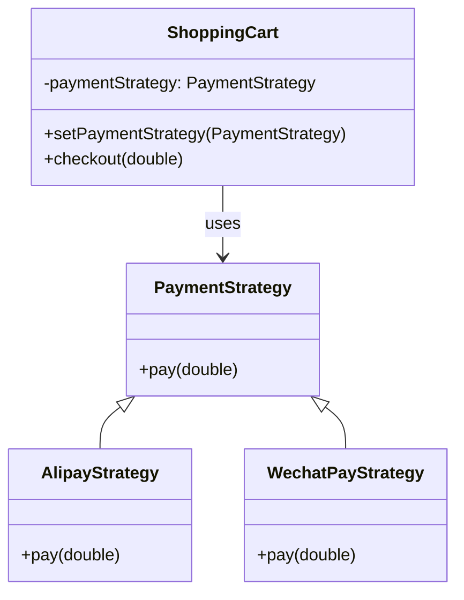
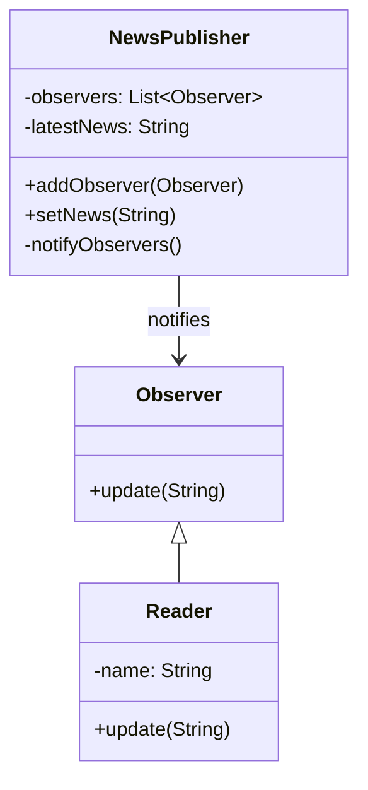
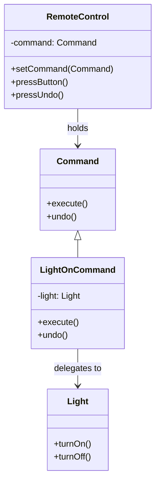
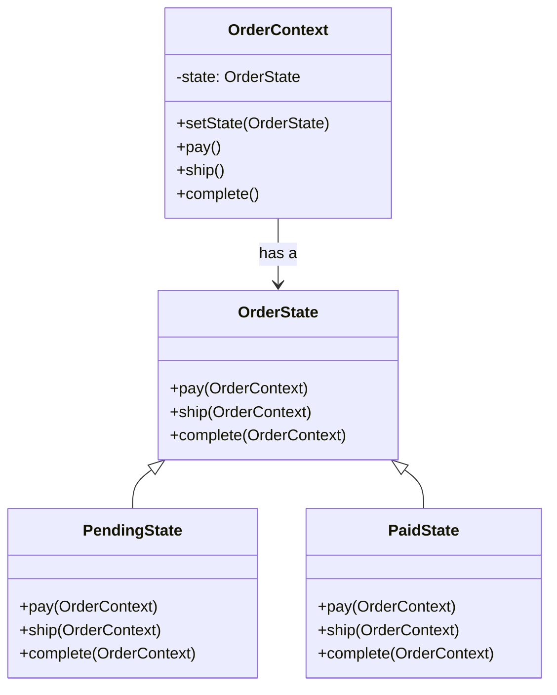
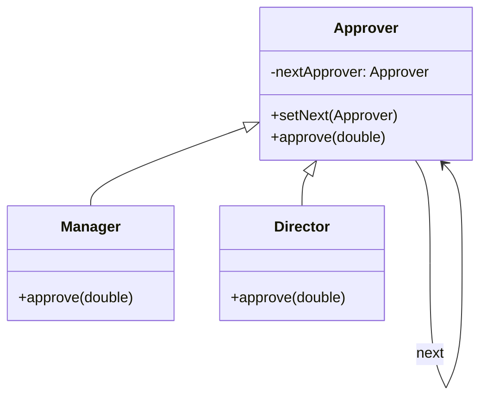

# 第六章 行为型设计模式

行为型设计模式关注**对象之间的职责分配与通信方式**，旨在提高系统的灵活性、可扩展性和可维护性。它们通过定义清晰的交互协议，解耦对象间的调用关系。

本章涵盖以下六种核心行为型模式（GoF）：

- 策略模式（Strategy）
- 观察者模式（Observer）
- 命令模式（Command）
- 状态模式（State）
- 职责链模式（Chain of Responsibility）
- 备忘录模式（Memento）

---

## 6.1 策略模式（Strategy）

### 定义

定义一系列算法，将每个算法封装起来，并使它们可以**相互替换**。策略模式让算法的变化独立于使用它的客户端。

### 策略模式要解决什么问题？

假设你正在开发一个电商系统，需要支持**多种支付方式**：

- 支付宝（Alipay）
- 微信支付（WeChat Pay）
- 银联（UnionPay）

最直接的做法是用 `if-else` 判断：

```java
public class OrderService {
    public void pay(String paymentType, double amount) {
        if ("alipay".equals(paymentType)) {
            System.out.println("Paid via Alipay: $" + amount);
        } else if ("wechat".equals(paymentType)) {
            System.out.println("Paid via WeChat: $" + amount);
        } else if ("unionpay".equals(paymentType)) {
            System.out.println("Paid via UnionPay: $" + amount);
        } else {
            throw new IllegalArgumentException("Unsupported payment");
        }
    }
}
```

这种写法的问题：

1. **违反开闭原则**：每新增一种支付方式，都要修改 `OrderService` 类。
2. **职责不单一**：`OrderService` 既管订单逻辑，又管支付细节。
3. **难以测试**：支付逻辑和业务逻辑耦合，无法单独 mock 支付行为。
4. **代码膨胀**：随着支付方式增多，`if-else` 越来越长。

策略模式的核心思想是：

> **将“变化的算法”抽象为接口，把每个具体算法封装成独立类，让客户端通过“组合”而非“硬编码”来使用算法。**

### 改造步骤

```java
// Step 1：定义策略接口（抽象算法）
interface PaymentStrategy {
    void pay(double amount);
}

// Step 2：实现具体策略（封装算法）
class AlipayStrategy implements PaymentStrategy {
    public void pay(double amount) {
        System.out.println("Paid $" + amount + " via Alipay");
    }
}

class WechatPayStrategy implements PaymentStrategy {
    public void pay(double amount) {
        System.out.println("Paid $" + amount + " via WeChat Pay");
    }
}

// Step 3：上下文类持有策略（组合）
class ShoppingCart {
    private PaymentStrategy paymentStrategy;

    // 注入策略（依赖注入）
    public void setPaymentStrategy(PaymentStrategy strategy) {
        this.paymentStrategy = strategy;
    }

    public void checkout(double amount) {
        paymentStrategy.pay(amount); // 委托给策略执行
    }
}

// Step 4：客户端动态选择策略
class Client {
  public static void main(String[] args) {
    ShoppingCart cart = new ShoppingCart();

    // 选择支付宝
    cart.setPaymentStrategy(new AlipayStrategy());
    cart.checkout(100.0);

    // 后续可切换为微信
    cart.setPaymentStrategy(new WechatPayStrategy());
    cart.checkout(200.0);
  }
}

```

### UML 类图



### 策略模式 vs 简单工厂

你可能会问：**“这和简单工厂有什么区别？”**

- **简单工厂**：关注“**创建哪个对象**”，返回一个具体产品。
- **策略模式**：关注“**使用哪个算法**”，算法是行为，不是产品。

但两者**经常结合使用**：

```java
// 工厂根据类型返回策略
PaymentStrategy strategy = PaymentStrategyFactory.create("alipay");
cart.setPaymentStrategy(strategy);
```

### 适用场景

- 多种排序/压缩/校验算法切换
- 支付、物流、优惠策略
- Spring 中的 `ResourceLoader`、`ViewResolver` 等

### 注意事项

- 策略对象通常是**无状态**的，可复用。
- 避免策略类过多 → 可结合工厂模式管理。

---

## 6.2 观察者模式（Observer）

### 定义

定义对象间**一对多的依赖关系**，当一个对象状态改变时，所有依赖者都会收到通知并自动更新。

### 核心思想

> “发布-订阅：被观察者（Subject）维护观察者列表，状态变化时广播通知。”

### Java 示例：新闻订阅

```java
import java.util.*;

// 观察者接口
interface Observer {
    void update(String news);
}

// 具体观察者
class Reader implements Observer {
    private String name;
    public Reader(String name) { this.name = name; }
    public void update(String news) {
        System.out.println(name + " received: " + news);
    }
}

// 被观察者
class NewsPublisher {
    private List<Observer> observers = new ArrayList<>();
    private String latestNews;

    public void addObserver(Observer o) {
        observers.add(o);
    }

    public void setNews(String news) {
        this.latestNews = news;
        notifyObservers();
    }

    private void notifyObservers() {
       // 这是观察者模式核心逻辑，通过持有观察者列表，遍历通知所有观察者
        for (Observer o : observers) {
            o.update(latestNews);
        }
    }
}
```

观察者的核心在于维护一个观察者列表，并在状态变化时通知所有观察者。

### 使用

```java
NewsPublisher publisher = new NewsPublisher();
publisher.addObserver(new Reader("Alice"));
publisher.addObserver(new Reader("Bob"));
publisher.setNews("Java 25 released!");
// Alice received: Java 25 released!
// Bob received: Java 25 released!
```

### UML 类图



### 应用

- GUI 事件监听（如 JButton.addActionListener）
- 消息队列（Kafka、RabbitMQ 的消费者模型）
- Spring 事件机制（`ApplicationEvent`）

### 注意事项

- 避免观察者与被观察者**循环依赖**。
- 注意内存泄漏：观察者需手动注销（或使用弱引用）。

---

## 6.3 命令模式（Command）

### 定义

将**请求封装为对象**，从而可以用不同的请求对客户进行参数化；支持请求的排队、记录日志、撤销等操作.

### 核心思想

> “请求即对象：调用者不直接调用接收者，而是通过命令对象中转。”

### Java 示例：遥控器

```java
// 命令接口
interface Command {
    void execute();
    void undo(); // 支持撤销
}

// 接收者
class Light {
    public void turnOn() { System.out.println("Light is ON"); }
    public void turnOff() { System.out.println("Light is OFF"); }
}

// 具体命令
class LightOnCommand implements Command {
    // 核心在这里：将请求的目标封装在命令对象中
    private Light light;
    public LightOnCommand(Light light) { this.light = light; }
    public void execute() { light.turnOn(); }
    public void undo() { light.turnOff(); }
}

// 调用者
class RemoteControl {
    private Command command;
    public void setCommand(Command c) { this.command = c; }
    public void pressButton() { command.execute(); }
    public void pressUndo() { command.undo(); }
}
```

### UML 类图



### 优点

- 解耦调用者与接收者 —— 命令的接受者已经被封装在命令对象中
- 支持命令队列、宏命令、撤销/重做
- 易于扩展新命令

### 典型应用

- GUI 菜单操作（如“复制”、“粘贴”）
- 游戏指令系统
- 事务日志（Command Log）

---

## 6.4 状态模式（State）

### 定义

允许一个对象在其**内部状态改变时改变其行为**，对象看起来似乎修改了它的类.

### 核心思想

> “状态即对象：每个状态封装自己的行为，状态切换由上下文委托给状态对象。”

### Java 示例：订单状态

```java
// 状态接口
interface OrderState {
    void pay(OrderContext context);
    void ship(OrderContext context);
    void complete(OrderContext context);
}

// 具体状态
class PendingState implements OrderState {
  // 未支付状态 -> 已支付状态
    public void pay(OrderContext context) {
        System.out.println("Order paid, changing to PaidState");
        context.setState(new PaidState());
    }
    public void ship(OrderContext context) {
        System.out.println("Cannot ship: order not paid");
    }
    public void complete(OrderContext context) {
        System.out.println("Cannot complete: order not shipped");
    }
}

class PaidState implements OrderState {
    public void pay(OrderContext context) {
        System.out.println("Already paid");
    }
    // 已支付状态 -> 已发货状态
    public void ship(OrderContext context) {
        System.out.println("Order shipped, changing to ShippedState");
        context.setState(new ShippedState());
    }
    public void complete(OrderContext context) {
        System.out.println("Cannot complete: not shipped");
    }
}

// 上下文
class OrderContext {
    private OrderState state;

    public OrderContext() {
        this.state = new PendingState();
    }

    public void setState(OrderState state) {
        this.state = state;
    }

    public void pay() { state.pay(this); } // 委托给状态对象
    public void ship() { state.ship(this); }
    public void complete() { state.complete(this); }
}
```

`OrderContext`类持有状态对象，并通过状态对象来调用状态方法。状态对象通过`OrderContext`的`setState`方法来改变状态。

### 客户端的使用

```java
public class Client {
    public static void main(String[] args) {
        // 1. 创建订单上下文（初始状态为 Pending）
        OrderContext order = new OrderContext();

        // 2. 调用行为方法，状态自动流转
        order.pay();      // ✅ 触发支付 → 状态变为 Paid
        order.ship();     // ✅ 触发发货 → 状态变为 Shipped
        order.complete(); // ✅ 触发完成 → （假设 ShippedState 实现了 complete）

        System.out.println("--- 尝试无效操作 ---");
        order.pay();      // ℹ️ 已完成，无法再次支付
        order.ship();     // ℹ️ 已完成，无法再次发货
    }
}
```

状态的流转为: 未支付 → 支付 → 发货 → 完成。

### UML 类图



### 与策略模式的区别

| 模式 | 目的 | 状态切换 |
|------|------|--------|
| **策略** | **算法替换** | 由**客户端**主动切换 |
| **状态** | **行为随状态变化** | 由**状态对象内部**自动切换 |

### 应用

- 工作流引擎（审批流）
- 游戏角色状态（Idle/Run/Attack）
- TCP 连接状态（CLOSED/LISTEN/ESTABLISHED）

---

## 6.5 职责链模式（Chain of Responsibility）

### 定义

将请求的发送者和接收者解耦，使**多个对象都有机会处理请求**，这些对象连成一条链，请求沿链传递，直到被处理.

### Java 示例：审批流程

```java
// 处理者抽象类
abstract class Approver {
    protected Approver nextApprover;

    public void setNext(Approver approver) {
        this.nextApprover = approver;
    }

    public abstract void approve(double amount);
}

// 具体处理者
class Manager extends Approver {
    public void approve(double amount) {
        if (amount <= 1000) {
            System.out.println("Manager approved $" + amount);
        } else if (nextApprover != null) {
            nextApprover.approve(amount);
        }
    }
}

class Director extends Approver {
    public void approve(double amount) {
        if (amount <= 5000) {
            System.out.println("Director approved $" + amount);
        } else if (nextApprover != null) {
            nextApprover.approve(amount);
        }
    }
}
```

`Director` 类与 `Manager` 类都继承自处理者抽象类。`Manager` 类处理金额小于 1000 的申请，`Director` 类处理金额小于 5000 的申请。

如果当前能力不足，则将请求传递给下一个处理者。

### 使用

```java
Approver manager = new Manager();
Approver director = new Director();
manager.setNext(director); // 这里设置了链

manager.approve(800);  // Manager approved $800
manager.approve(3000); // Director approved $3000
```

### UML 类图



### 适用场景

- 日志级别处理（DEBUG/INFO/ERROR）
- 权限校验链
- Servlet Filter Chain

---

## 6.6 备忘录模式（Memento）

### 定义

在不破坏封装性的前提下，**捕获并外部化一个对象的内部状态**，以便以后可将该对象恢复到原先保存的状态.

### 核心角色

- **Originator**：创建和恢复备忘录的对象
- **Memento**：存储 Originator 的内部状态（通常为私有）
- **Caretaker**：负责保存和提供备忘录（但不能修改）

### Java 示例：文本编辑器撤销

```java
// 发起人（Originator）
class TextEditor {
    private String content = "";

    public void type(String text) {
        content += text;
    }

    // 创建备忘录（返回 Memento 接口，隐藏具体实现）
    public Memento save() {
        return new TextMemento(content);
    }

    // 从备忘录恢复（只有 Originator 能访问 Memento 内部）
    public void restore(Memento memento) {
        if (memento instanceof TextMemento) {
            this.content = ((TextMemento) memento).getContent();
        }
    }

    public String getContent() {
        return content;
    }

    // 备忘录接口（窄接口，Caretaker 只能持有，不能读取）
    public interface Memento {
        // 空接口，仅用于类型安全
    }

    // 真正的备忘录实现（私有，外部不可见）
    private static class TextMemento implements Memento {
        private final String content;

        public TextMemento(String content) {
            this.content = content;
        }

        // 只有 TextEditor 能调用此方法（同包 + 私有类）
        private String getContent() {
            return content;
        }
    }
}

// 管理者（Caretaker）
class History {
    private Stack<TextEditor.Memento> states = new Stack<>();

    public void push(TextEditor.Memento memento) {
        states.push(memento);
    }

    public TextEditor.Memento pop() {
        return states.pop();
    }
}
```

### 使用

```java
TextEditor editor = new TextEditor();
History history = new History(); // 保存历史

editor.type("Hello");
history.push(editor.save());

editor.type(" World");
System.out.println(editor.getContent()); // Hello World

editor.restore(history.pop());
System.out.println(editor.getContent()); // Hello
```

### 应用

- 撤销/重做（Undo/Redo）
- 游戏存档
- 数据库事务回滚（概念类似）

> ⚠️ **注意**：备忘录可能占用大量内存，可结合**原型模式**或**增量快照**优化。

---

## 小结对比表

| 模式 | 核心目的 | 关键机制 | 典型场景 |
|------|--------|--------|--------|
| 策略 | **算法切换** | 注入不同策略对象 | 支付、排序 |
| 观察者 | **状态广播** | 被观察者维护观察者列表 | 事件系统、消息推送 |
| 命令 | **请求封装** | 命令对象 + 调用者/接收者 | 撤销、宏命令 |
| 状态 | **状态驱动行为** | 状态对象封装行为 | 工作流、游戏状态 |
| 职责链 | **请求传递** | 链式处理 | 审批流、日志处理 |
| 备忘录 | **状态快照** | 外部保存内部状态 | 撤销、存档 |

> **设计哲学**：行为型模式的核心是“**将行为抽象化、对象化、解耦化**”，让系统在运行时具备更强的动态性和适应性。
