# 软件工程复习笔记

## 软件的定义

软件包含三个方面：

1. **指令的集合**（计算机程序）：通过执行这些指令可以满足预期的特性、功能和性能需求
2. **数据结构**：使得程序可以合理利用信息
3. **软件描述信息**：以硬拷贝和虚拟形式存在，用来描述程序的操作和使用

## 遗留软件中的问题

遗留软件通常具有以下特点（质量差）：

- 数不清的问题
- 系统设计难以扩展
- 代码令人费解
- 文档混乱甚至根本没有
- 测试用例和结果并未归档
- 变更的历史管理混乱

## 软件工程的定义

将系统化的、规范的、可量化的方法应用于软件的开发、运行和维护，即将工程化方法应用于软件。

## 软件工程层次图

- 工具
- 方法
- 过程
- 质量关注点

## 软件过程

是工作产品构建时所执行的一系列活动、动作和任务的集合。

## 软件工程过程框架

通常包含以下 5 个活动：

1. 沟通
2. 策划
3. 建模
4. 构建
5. 部署

## 典型的普适性活动

- 软件项目跟踪和控制
- 风险管理
- 软件质量保证
- 技术评审
- 测量
- 软件配置管理
- 可复用性管理
- 工作产品的准备和生产

## 过程流

过程流描述了在执行顺序和执行时间上如何组织框架中的活动、动作和任务。

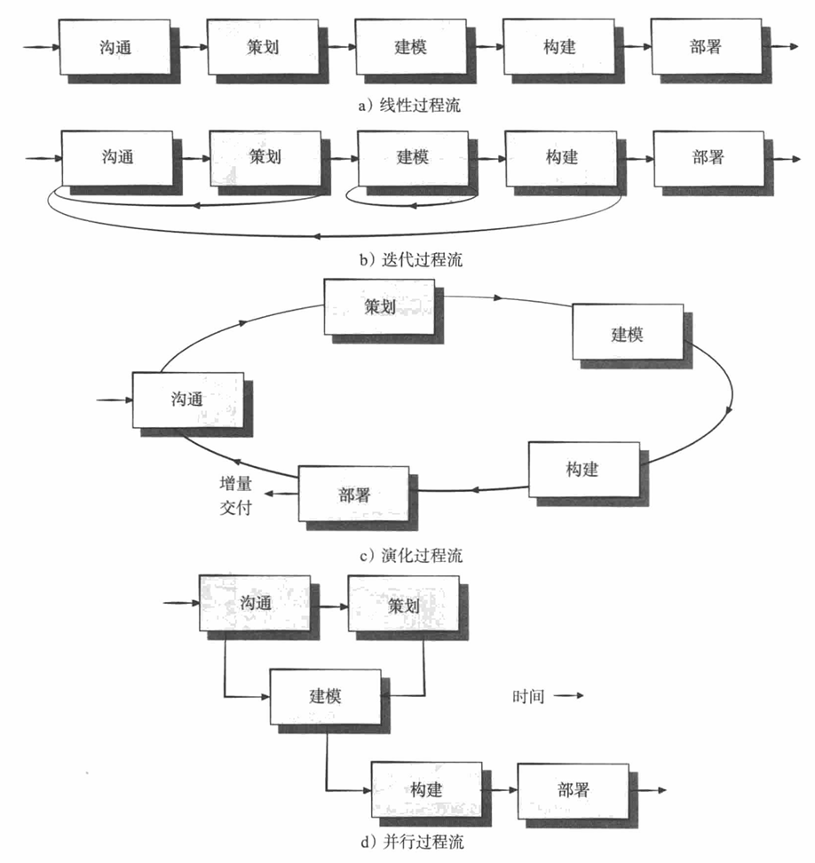

## 惯用过程模型

惯用过程模型定义一组预定义的过程元素和一个可预测的过程工作流。惯用过程模型力求达到软件开发的结构和秩序，其活动和任务都是按照过程的特定指引顺序进行的。

### 瀑布流模型

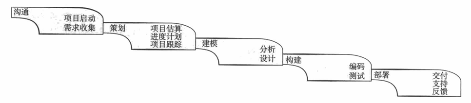

### 原型开发范型

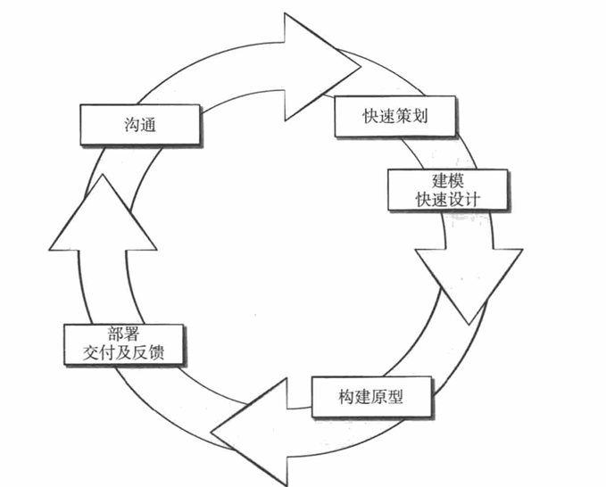

### 螺旋模型

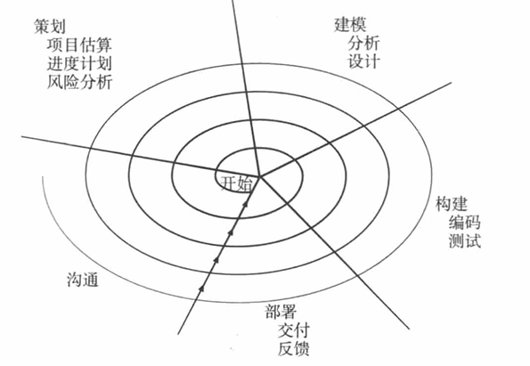

### 统一过程 (Unified Process, UP)

统一过程尝试着从传统的软件过程中挖掘最好的特征和性质，但是以敏捷软件开发中许多最好的原则来实现。

**UML (Unified Modeling Language)**：统一建模语言，包含了大批用于面向对象系统建模和开发的符号。

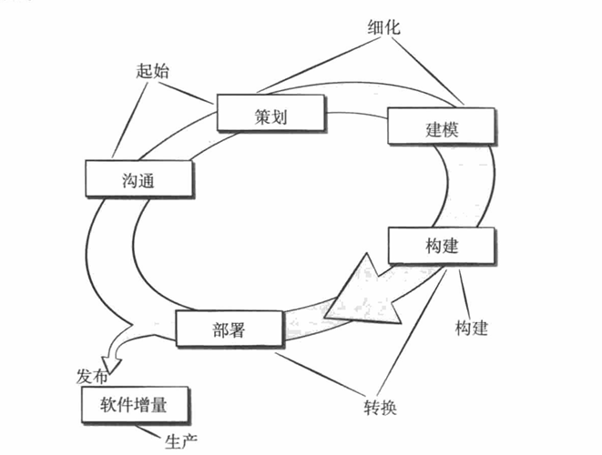

## 敏捷软件开发

### 敏捷宣言

他们主张：

- **个人和他们之间的交流** 胜过 开发过程和工具
- **可运行的软件** 胜过 宽泛的文档
- **客户合作** 胜过 合同谈判
- **对变更的良好响应** 胜过 按部就班地遵循计划

### 极限编程 (XP)

极限编程包括策划、设计、编码和测试四个框架活动的规则和实践。

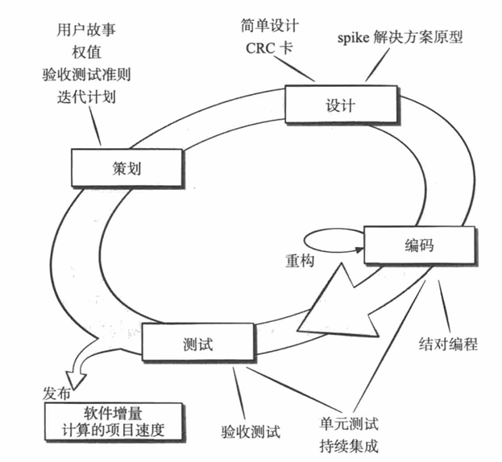

### 敏捷过程模型 vs 螺旋模型

| 特性 | 敏捷过程模型 | 螺旋模型 |
| :--- | :--- | :--- |
| **适用性** | 不适合大型高风险或任务关键型项目 | 不适用于小型、低风险的项目 |
| **文档与规则** | 最少化规则、最少化文档 | 需要多个步骤，以及前期完成的文档 |
| **测试人员** | 测试人员需要持续参与 | 测试人员的早期参与（可由外部团队完成） |
| **变更适应** | 易于适应产品变更 | 在原型完成前难以进行产品更改 |
| **利益相关者** | 非常依赖利益相关者的交互 | 需要利益相关者持续参与计划和风险评估 |
| **管理** | 易于管理 | 需要正式的项目管理和协调 |
| **交付** | 尽早交付部分解决方案 | 难以判断项目结束时间 |
| **风险管理** | 非正式的风险管理 | 良好的风险管理 |
| **过程改进** | 内建的持续过程改进 | 项目结束时进行过程改进 |

## 团队管理

### 高效的团队

高效的团队必须建立：

- **目标意识**
- **参与意识**：让每个成员都能感受到自己的技能得到了发挥，所做出的贡献是有价值的。
- **信任意识**：团队中的软件工程师应该相信同伴和其管理者的技术与能力。
- **进步意识**：定期审视软件工程方法并寻求改善途径。

### 有害团队环境的因素

1. 混乱的工作氛围
2. 会造成团队成员分裂的挫败
3. “支离破碎或协调不当”的软件过程
4. 对软件团队中角色的模糊定义
5. “持续且重复性的失败”

## 需求工程

需求工程包括七项任务：

1. 起始
2. 获取
3. 细化
4. 协商
5. 规格说明
6. 确认
7. 管理

### 规格说明

规格说明可以是一份写好的文档、一套图形化的模型、一个形式化的数学模型、一组使用场景、一个原型或上述各项的任意组合。

### 分析模型的元素

- 基于场景的元素
- 基于类的元素
- 基于流的元素
- 基于行为的元素

### 需求模型的目标

1. 描述客户需要什么
2. 为软件设计奠定基础
3. 定义在软件完成后可以被确认的一组需求

### CRC 建模

类－职责－协作者 (Class-Responsibility-Collaborator, CRC) 建模提供了一个简单方法，可以识别和组织与系统或产品需求相关的类。

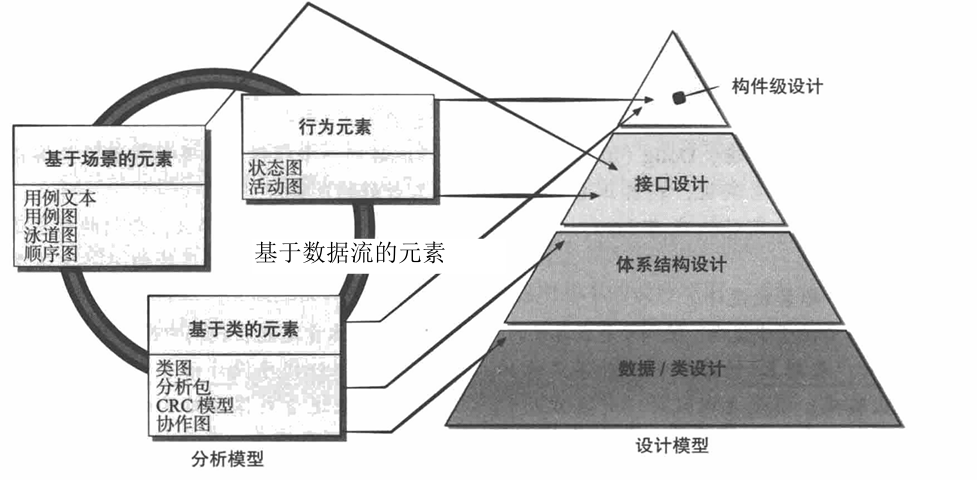

## 设计概念

**信息隐蔽**：通过定义一系列独立的模块得到有效的模块化，独立模块之间只交流实现软件功能所必需的信息。

### 组织良好的设计类的特征

- **完整性与充分性**
- **原始性**
- **高内聚性**
- **低耦合性**

## 体系结构设计

**定义**：软件体系结构定义了一个系统的“结构元素和其相应的接口”以及系统中各个构件和子系统的“行为”。体系结构设计的目的是创建系统和软件的“内聚的，规划良好的表示”。

### 体系结构模型的来源

1. 关于将要构建的软件的应用域信息
2. 特定的需求模型元素（如用例或分析类、现有问题中它们的关系和协作）
3. 可获得的体系结构风格和模式

### 接口设计的三个重要元素

1. **用户界面 (UI)**
2. **外部接口**：和其他系统、设备、网络、信息生成者或使用者的接口
3. **内部接口**：各种设计构件之间的接口

### 体系结构风格

- 以数据为中心的体系结构
- 数据流体系结构
- 调用和返回体系结构
- 面向对象体系结构
- 层次体系结构

## 构件级设计

**工作产品**：每个构件的设计都以图形、表格或基于文本的表示法表示。

### 构件的观点

- **面向对象的观点**：一个构件包括一个协作类集合。构件中的每个类都得到详细阐述，以包括所有属性和与其实现相关的操作。
- **传统的观点**：一个构件就是程序的一个功能要素，程序由处理逻辑、实现处理逻辑所需的内部数据结构以及能够保证构件被调用和实现数据传递的接口构成。

### 构件级设计原则

1. **开闭原则 (OCP)**
2. **里氏替换原则 (LSP)**
3. **依赖倒置原则 (DIP)**
4. **接口隔离原则 (ISP)**

### 打包原则

- 发布／复用等价性原则
- 共同封装原则
- 共同复用原则

### 内聚与耦合

- **内聚性**：功能内聚、分层内聚、通信内聚等。
- **耦合性**：类之间彼此联系程度的一种定性度量。

## 用户界面设计

### 黄金规则

1. 把控制权交给用户
2. 减轻用户的记忆负担
3. 保持界面一致

### 界面分析与设计的四种模型

1. **用户模型**：由工程师建立
2. **设计模型**：由软件工程师创建
3. **用户的心理模型（系统感觉）**：最终用户在脑海里对界面的印象
4. **实现模型**：由系统实现者创建

### 用户交互过程设计

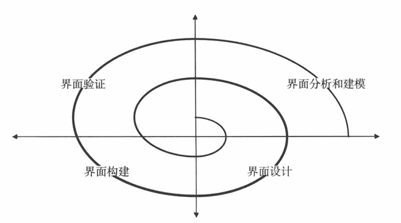

## 软件质量

**定义**：在一定程度上应用有效的软件过程，创造有用的产品，为生产者和使用者提供明显的价值。

### McCall 的软件质量因素

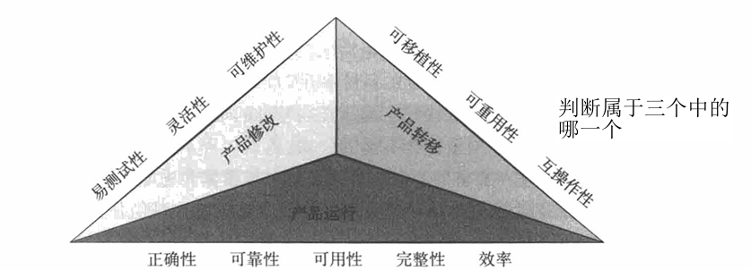

### 质量困境

如果生产了一个存在严重质量问题的软件系统，将受到损失。另一方面，如果花费无限的时间和成本开发绝对完美的软件，可能会错失市场机会或耗尽资源。企业界努力达到中间状态：产品足够好不会被抛弃，又不需要花费太长时间和太多成本。

### 质量成本

- **预防成本**
- **评估成本**
- **失效成本**

## 软件评审

- **非正式评审**：与同事进行的简单桌面检查、临时会议或结对编程评审。
- **正式技术评审 (FTR)**：包括走查 (walkthrough) 和审查 (inspection)。

## 软件测试

**目的**：发现软件设计和实现过程中因疏忽所造成的错误。

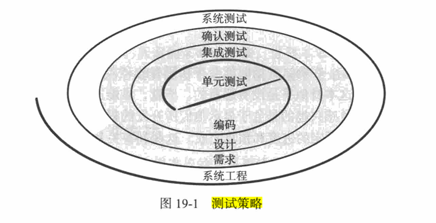
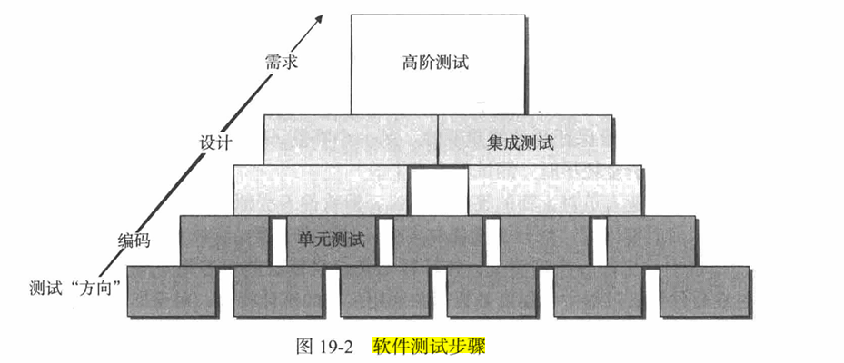

### 白盒测试

也称为玻璃盒测试或结构化测试。利用控制结构来生成测试用例。

**目标**：

1. 保证一个模块中的所有独立路径至少被执行一次
2. 对所有的逻辑判定均需测试取真和取假两个方面
3. 在上下边界及可操作的范围内执行所有循环
4. 检验内部数据结构以确保其有效性

**基本路径测试**：由 Tom McCabe 提出。计算过程设计的逻辑复杂性，定义执行路径的基本集，保证程序中的每一条语句至少执行一次。

### 黑盒测试

也称行为测试或功能测试，侧重于软件的功能需求。不是白盒测试的替代品，而是辅助方法。

**等价类划分**：将程序的输入划分为若干个数据类，从中生成测试用例。

### 集成测试

- **增量集成**：与“一步到位”的集成方法相反。
- **面向对象系统的集成策略**：基于线程的测试、基于使用的测试。

## 项目管理

**范围 (4P)**：

- **人员 (People)**
- **产品 (Product)**
- **过程 (Process)**
- **项目 (Project)**
